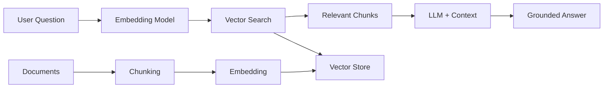

# How to Use Amazon Bedrock Knowledge Bases for RAG

Author: [nawazdhandala](https://github.com/nawazdhandala)

Tags: AWS, Amazon Bedrock, RAG, Knowledge Base, Generative AI

Description: Build retrieval-augmented generation applications with Amazon Bedrock Knowledge Bases to ground LLM responses in your organization's data and documents.

---

Large language models are impressive, but they have a fundamental limitation: they only know what they were trained on. Ask about your company's internal policies, recent product changes, or proprietary documentation and you'll get generic responses or outright hallucinations. Retrieval-Augmented Generation (RAG) fixes this by fetching relevant information from your own data before generating a response.

Amazon Bedrock Knowledge Bases makes RAG straightforward. You point it at your data sources, it handles the indexing and retrieval, and you get grounded answers that cite their sources.

## How RAG Works

The RAG pattern has three steps:

1. **Index** - Your documents are chunked, embedded, and stored in a vector database
2. **Retrieve** - When a user asks a question, relevant chunks are fetched from the vector database
3. **Generate** - The retrieved chunks are passed to an LLM along with the question, and the LLM generates an answer grounded in the retrieved context



Bedrock Knowledge Bases handles all of this behind a managed API.

## Setting Up a Knowledge Base

Creating a knowledge base involves three pieces: a data source (your documents in S3), a vector store (where embeddings are indexed), and an embedding model (to convert text to vectors).

```python
import boto3
import json
import time

bedrock_agent = boto3.client('bedrock-agent', region_name='us-east-1')

# Step 1: Create the knowledge base
response = bedrock_agent.create_knowledge_base(
    name='company-docs-kb',
    description='Knowledge base for internal company documentation',
    roleArn='arn:aws:iam::123456789012:role/BedrockKnowledgeBaseRole',
    knowledgeBaseConfiguration={
        'type': 'VECTOR',
        'vectorKnowledgeBaseConfiguration': {
            'embeddingModelArn': 'arn:aws:bedrock:us-east-1::foundation-model/amazon.titan-embed-text-v2:0'
        }
    },
    storageConfiguration={
        'type': 'OPENSEARCH_SERVERLESS',
        'opensearchServerlessConfiguration': {
            'collectionArn': 'arn:aws:aoss:us-east-1:123456789012:collection/my-vector-collection',
            'vectorIndexName': 'company-docs-index',
            'fieldMapping': {
                'vectorField': 'embedding',
                'textField': 'text',
                'metadataField': 'metadata'
            }
        }
    }
)

knowledge_base_id = response['knowledgeBase']['knowledgeBaseId']
print(f"Knowledge base created: {knowledge_base_id}")
```

Now add a data source pointing to your documents in S3.

```python
# Step 2: Add a data source
response = bedrock_agent.create_data_source(
    knowledgeBaseId=knowledge_base_id,
    name='s3-docs-source',
    description='Company documentation from S3',
    dataSourceConfiguration={
        'type': 'S3',
        's3Configuration': {
            'bucketArn': 'arn:aws:s3:::my-company-docs',
            'inclusionPrefixes': ['docs/', 'guides/', 'policies/']
        }
    },
    vectorIngestionConfiguration={
        'chunkingConfiguration': {
            'chunkingStrategy': 'FIXED_SIZE',
            'fixedSizeChunkingConfiguration': {
                'maxTokens': 512,       # Each chunk is up to 512 tokens
                'overlapPercentage': 20  # 20% overlap between chunks
            }
        }
    }
)

data_source_id = response['dataSource']['dataSourceId']
print(f"Data source created: {data_source_id}")
```

## Syncing Your Data

After creating the data source, trigger an ingestion job to process your documents.

```python
# Step 3: Start the ingestion job
response = bedrock_agent.start_ingestion_job(
    knowledgeBaseId=knowledge_base_id,
    dataSourceId=data_source_id
)

ingestion_job_id = response['ingestionJob']['ingestionJobId']
print(f"Ingestion job started: {ingestion_job_id}")

# Wait for ingestion to complete
while True:
    status = bedrock_agent.get_ingestion_job(
        knowledgeBaseId=knowledge_base_id,
        dataSourceId=data_source_id,
        ingestionJobId=ingestion_job_id
    )

    job_status = status['ingestionJob']['status']
    print(f"Status: {job_status}")

    if job_status in ['COMPLETE', 'FAILED']:
        break
    time.sleep(10)

if job_status == 'COMPLETE':
    stats = status['ingestionJob']['statistics']
    print(f"Documents processed: {stats.get('numberOfDocumentsScanned', 0)}")
    print(f"Documents indexed: {stats.get('numberOfNewDocumentsIndexed', 0)}")
    print(f"Documents failed: {stats.get('numberOfDocumentsFailed', 0)}")
```

## Querying the Knowledge Base

Now you can ask questions and get answers grounded in your documents.

```python
bedrock_agent_runtime = boto3.client('bedrock-agent-runtime', region_name='us-east-1')

# Query the knowledge base with RAG
response = bedrock_agent_runtime.retrieve_and_generate(
    input={
        'text': 'What is our company policy on remote work?'
    },
    retrieveAndGenerateConfiguration={
        'type': 'KNOWLEDGE_BASE',
        'knowledgeBaseConfiguration': {
            'knowledgeBaseId': knowledge_base_id,
            'modelArn': 'arn:aws:bedrock:us-east-1::foundation-model/anthropic.claude-3-sonnet-20240229-v1:0',
            'retrievalConfiguration': {
                'vectorSearchConfiguration': {
                    'numberOfResults': 5  # Retrieve top 5 relevant chunks
                }
            }
        }
    }
)

# Print the generated answer
answer = response['output']['text']
print(f"Answer: {answer}")

# Print the source citations
if 'citations' in response:
    print("\nSources:")
    for citation in response['citations']:
        for ref in citation.get('retrievedReferences', []):
            location = ref.get('location', {})
            s3_uri = location.get('s3Location', {}).get('uri', 'Unknown')
            print(f"  - {s3_uri}")
```

## Retrieve-Only Mode

Sometimes you want to retrieve relevant documents without generating an answer. This is useful when you want to handle the generation step yourself with a different prompt or model.

```python
# Retrieve relevant chunks without generation
response = bedrock_agent_runtime.retrieve(
    knowledgeBaseId=knowledge_base_id,
    retrievalQuery={
        'text': 'employee onboarding process'
    },
    retrievalConfiguration={
        'vectorSearchConfiguration': {
            'numberOfResults': 10
        }
    }
)

# Process the retrieved chunks
print("Retrieved chunks:")
for i, result in enumerate(response['retrievalResults']):
    content = result['content']['text']
    score = result.get('score', 0)
    location = result.get('location', {}).get('s3Location', {}).get('uri', 'Unknown')

    print(f"\n--- Chunk {i+1} (score: {score:.4f}) ---")
    print(f"Source: {location}")
    print(f"Content: {content[:200]}...")
```

Then use the retrieved chunks with your own prompt.

```python
# Build a custom prompt with retrieved context
bedrock_runtime = boto3.client('bedrock-runtime', region_name='us-east-1')

chunks = [r['content']['text'] for r in response['retrievalResults'][:5]]
context = '\n\n'.join(chunks)

custom_prompt = f"""Based on the following company documentation, answer the user's question.
If the information is not in the documentation, say so clearly.

Documentation:
{context}

Question: What are the steps for onboarding a new employee?

Answer:"""

response = bedrock_runtime.converse(
    modelId='anthropic.claude-3-sonnet-20240229-v1:0',
    messages=[{
        'role': 'user',
        'content': [{'text': custom_prompt}]
    }],
    inferenceConfig={
        'maxTokens': 500,
        'temperature': 0.3  # Low temperature for factual answers
    }
)

print(response['output']['message']['content'][0]['text'])
```

## Chunking Strategies

How you chunk your documents significantly affects retrieval quality. Bedrock supports several strategies.

```python
# Fixed-size chunking - Simple and predictable
fixed_config = {
    'chunkingStrategy': 'FIXED_SIZE',
    'fixedSizeChunkingConfiguration': {
        'maxTokens': 512,
        'overlapPercentage': 20
    }
}

# Hierarchical chunking - Creates parent and child chunks
hierarchical_config = {
    'chunkingStrategy': 'HIERARCHICAL',
    'hierarchicalChunkingConfiguration': {
        'levelConfigurations': [
            {'maxTokens': 1500},  # Parent chunk size
            {'maxTokens': 300}    # Child chunk size
        ],
        'overlapTokens': 60
    }
}

# Semantic chunking - Splits based on meaning (beta)
semantic_config = {
    'chunkingStrategy': 'SEMANTIC',
    'semanticChunkingConfiguration': {
        'maxTokens': 512,
        'bufferSize': 0,
        'breakpointPercentileThreshold': 95
    }
}

# No chunking - Use when documents are already properly sized
no_chunk_config = {
    'chunkingStrategy': 'NONE'
}
```

The right strategy depends on your documents:
- **Fixed-size** works well for most cases
- **Hierarchical** is better for long documents with clear structure
- **Semantic** tries to keep meaningful sections together

## Adding Metadata Filters

You can filter retrieval results based on document metadata. This is useful when you have documents from different departments, time periods, or categories.

```python
# Create a metadata file for each document
# Place it alongside the document in S3 with a .metadata.json extension

metadata = {
    'metadataAttributes': {
        'department': {
            'value': 'engineering',
            'type': 'STRING'
        },
        'document_type': {
            'value': 'policy',
            'type': 'STRING'
        },
        'year': {
            'value': 2026,
            'type': 'NUMBER'
        }
    }
}

# Upload metadata alongside your document
s3 = boto3.client('s3')
s3.put_object(
    Bucket='my-company-docs',
    Key='docs/remote-work-policy.pdf.metadata.json',
    Body=json.dumps(metadata)
)

# Query with metadata filters
response = bedrock_agent_runtime.retrieve(
    knowledgeBaseId=knowledge_base_id,
    retrievalQuery={
        'text': 'remote work policy'
    },
    retrievalConfiguration={
        'vectorSearchConfiguration': {
            'numberOfResults': 5,
            'filter': {
                'andAll': [
                    {
                        'equals': {
                            'key': 'department',
                            'value': 'engineering'
                        }
                    },
                    {
                        'equals': {
                            'key': 'document_type',
                            'value': 'policy'
                        }
                    }
                ]
            }
        }
    }
)

for result in response['retrievalResults']:
    print(f"Score: {result.get('score', 0):.4f}")
    print(f"Content: {result['content']['text'][:100]}...")
    print()
```

## Keeping Your Knowledge Base Updated

Documents change. Set up regular syncing to keep your knowledge base current.

```python
# Manual sync
def sync_knowledge_base(kb_id, ds_id):
    response = bedrock_agent.start_ingestion_job(
        knowledgeBaseId=kb_id,
        dataSourceId=ds_id
    )
    return response['ingestionJob']['ingestionJobId']

# Schedule automatic syncing with EventBridge
import boto3
events_client = boto3.client('events')

# Create a rule to sync daily
events_client.put_rule(
    Name='daily-kb-sync',
    ScheduleExpression='rate(1 day)',
    State='ENABLED',
    Description='Sync Bedrock knowledge base daily'
)

# Lambda function to trigger the sync
# The Lambda would call start_ingestion_job
```

## Building a Chat Interface with RAG

Here's how to build a conversational interface that uses the knowledge base.

```python
class RAGChatbot:
    """A chatbot that answers questions using a Bedrock Knowledge Base."""

    def __init__(self, knowledge_base_id, model_id='anthropic.claude-3-sonnet-20240229-v1:0'):
        self.kb_id = knowledge_base_id
        self.model_id = model_id
        self.agent_runtime = boto3.client('bedrock-agent-runtime')
        self.conversation_history = []
        self.session_id = None

    def ask(self, question):
        """Ask a question with RAG context."""
        config = {
            'type': 'KNOWLEDGE_BASE',
            'knowledgeBaseConfiguration': {
                'knowledgeBaseId': self.kb_id,
                'modelArn': f'arn:aws:bedrock:us-east-1::foundation-model/{self.model_id}',
                'retrievalConfiguration': {
                    'vectorSearchConfiguration': {
                        'numberOfResults': 5
                    }
                }
            }
        }

        kwargs = {
            'input': {'text': question},
            'retrieveAndGenerateConfiguration': config
        }

        # Use session ID for multi-turn conversations
        if self.session_id:
            kwargs['sessionId'] = self.session_id

        response = self.agent_runtime.retrieve_and_generate(**kwargs)

        # Store session ID for follow-up questions
        self.session_id = response.get('sessionId')

        answer = response['output']['text']
        sources = []

        for citation in response.get('citations', []):
            for ref in citation.get('retrievedReferences', []):
                uri = ref.get('location', {}).get('s3Location', {}).get('uri', '')
                if uri and uri not in sources:
                    sources.append(uri)

        return {
            'answer': answer,
            'sources': sources
        }

# Usage
chatbot = RAGChatbot(knowledge_base_id=knowledge_base_id)

# First question
result = chatbot.ask("What benefits does the company offer?")
print(f"Answer: {result['answer']}")
print(f"Sources: {result['sources']}")

# Follow-up question (maintains context)
result = chatbot.ask("How do I enroll in the health insurance plan?")
print(f"\nAnswer: {result['answer']}")
```

## Monitoring RAG Performance

Track your knowledge base usage and quality through CloudWatch, and set up monitoring with [OneUptime](https://oneuptime.com/blog/post/2026-02-13-aws-cloudwatch-alerting-best-practices/view) for comprehensive observability across your AI infrastructure.

```python
cloudwatch = boto3.client('cloudwatch')

# Monitor retrieval latency
response = cloudwatch.get_metric_statistics(
    Namespace='AWS/Bedrock',
    MetricName='Retrieve.Latency',
    Dimensions=[
        {'Name': 'KnowledgeBaseId', 'Value': knowledge_base_id}
    ],
    StartTime='2026-02-11T00:00:00Z',
    EndTime='2026-02-12T00:00:00Z',
    Period=3600,
    Statistics=['Average', 'p99']
)

for dp in sorted(response['Datapoints'], key=lambda x: x['Timestamp']):
    print(f"{dp['Timestamp'].strftime('%H:%M')}: avg={dp['Average']:.0f}ms")
```

## Wrapping Up

Bedrock Knowledge Bases makes RAG accessible without having to build and maintain your own vector store pipeline. The managed service handles document processing, embedding, indexing, and retrieval, letting you focus on building the application layer. Start with a small set of documents, test the retrieval quality, and expand from there. For the best results, experiment with different chunking strategies and consider adding metadata filters to improve relevance. Combined with the right [foundation model](https://oneuptime.com/blog/post/2026-02-12-amazon-bedrock-foundation-models-claude-titan-llama/view), you can build powerful AI applications grounded in your organization's knowledge.
