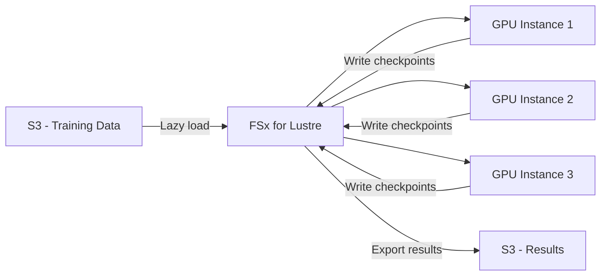

# How to Set Up Amazon FSx for Lustre

Author: [nawazdhandala](https://github.com/nawazdhandala)

Tags: AWS, FSx, Lustre, High Performance Computing, Storage

Description: Learn how to create and configure Amazon FSx for Lustre file systems for high-performance computing, machine learning training, and data-intensive workloads.

---

When EFS isn't fast enough and you need hundreds of gigabytes per second of throughput with sub-millisecond latencies, FSx for Lustre is where you turn. Lustre is an open-source parallel file system used in the world's fastest supercomputers, and Amazon FSx makes it available as a fully managed service. It's built for workloads that need extreme throughput - machine learning training, high-performance computing, video processing, and financial modeling.

Let's set up an FSx for Lustre file system and understand when and how to use it effectively.

## When to Use FSx for Lustre

FSx for Lustre shines in specific scenarios:

- **Machine learning training**: Reading large datasets at hundreds of GB/s across many GPU instances
- **High-performance computing**: Scientific simulations, weather modeling, genome sequencing
- **Media processing**: Video transcoding, rendering farms
- **Financial analytics**: Risk modeling, backtesting
- **Big data processing**: When HDFS performance isn't enough

You probably don't need Lustre for web applications, content management, or general-purpose file sharing - that's what EFS is for.

## Deployment Types

FSx for Lustre offers two deployment types:

**Scratch**: Temporary storage for short-term processing. No data replication. If a server fails, you lose data. But it's cheaper and faster. Use it for workloads where the data is reproducible (e.g., it lives in S3 and you can reload it).

**Persistent**: Data is replicated within the AZ. Supports automatic failover. Use it for longer-running workloads or when you need the data to survive hardware failures.

| Feature | Scratch | Persistent |
|---------|---------|------------|
| Data durability | No replication | Replicated within AZ |
| Use case | Short-term processing | Long-running workloads |
| Cost | Lower | Higher |
| S3 integration | Yes | Yes |

## Creating a Scratch File System

Here's the simplest setup - a scratch file system with S3 integration:

```bash
# Create a scratch FSx for Lustre file system
aws fsx create-file-system \
  --file-system-type LUSTRE \
  --storage-capacity 1200 \
  --storage-type SSD \
  --subnet-ids "subnet-0aaa111" \
  --security-group-ids "sg-0lustre123" \
  --lustre-configuration '{
    "DeploymentType": "SCRATCH_2",
    "ImportPath": "s3://my-data-bucket",
    "ExportPath": "s3://my-data-bucket/output",
    "ImportedFileChunkSize": 1024
  }' \
  --tags '[{"Key": "Name", "Value": "ml-training-lustre"}]'
```

Key parameters explained:

- **storage-capacity**: Minimum 1200 GB for SCRATCH_2. Must be in increments of 2400 GB.
- **storage-type**: SSD for highest performance, HDD for cost-optimized throughput.
- **ImportPath**: S3 bucket to lazy-load data from. Files appear in the file system but aren't downloaded until accessed.
- **ExportPath**: Where to write results back to S3.

## Creating a Persistent File System

For workloads that need durability:

```bash
# Create a persistent FSx for Lustre file system
aws fsx create-file-system \
  --file-system-type LUSTRE \
  --storage-capacity 1200 \
  --storage-type SSD \
  --subnet-ids "subnet-0aaa111" \
  --security-group-ids "sg-0lustre123" \
  --lustre-configuration '{
    "DeploymentType": "PERSISTENT_2",
    "PerUnitStorageThroughput": 250,
    "DataCompressionType": "LZ4"
  }' \
  --tags '[{"Key": "Name", "Value": "persistent-lustre"}]'
```

The **PerUnitStorageThroughput** option sets the baseline throughput per TiB of storage. Options are 125, 250, 500, or 1000 MB/s/TiB. A 1.2 TiB file system at 250 MB/s/TiB gives you 300 MB/s baseline.

## Security Group Setup

Lustre uses specific ports for communication:

```bash
# Create security group for FSx for Lustre
LUSTRE_SG=$(aws ec2 create-security-group \
  --group-name "fsx-lustre-sg" \
  --description "Security group for FSx for Lustre" \
  --vpc-id "vpc-0abc123" \
  --query "GroupId" \
  --output text)

# Allow Lustre traffic from client instances
aws ec2 authorize-security-group-ingress \
  --group-id "$LUSTRE_SG" \
  --protocol tcp \
  --port 988 \
  --source-group "sg-0client-instances"

# Allow Lustre traffic between file system nodes
aws ec2 authorize-security-group-ingress \
  --group-id "$LUSTRE_SG" \
  --protocol tcp \
  --port 1018-1023 \
  --source-group "$LUSTRE_SG"
```

## Mounting the File System

On your EC2 instances, install the Lustre client and mount:

For Amazon Linux 2:

```bash
# Install the Lustre client
sudo amazon-linux-extras install -y lustre

# Create mount point
sudo mkdir -p /mnt/fsx

# Get the mount name from the file system details
# It looks like: fs-0abc123.fsx.us-east-1.amazonaws.com@tcp:/abcdef

# Mount the file system
sudo mount -t lustre -o noatime,flock \
  fs-0abc123def456.fsx.us-east-1.amazonaws.com@tcp:/abcdefgh \
  /mnt/fsx
```

For Ubuntu:

```bash
# Install the Lustre client
wget -O - https://fsx-lustre-client-repo-public-keys.s3.amazonaws.com/fsx-ubuntu-public-key.asc | gpg --dearmor | sudo tee /usr/share/keyrings/fsx-ubuntu-public-key.gpg > /dev/null
echo "deb [signed-by=/usr/share/keyrings/fsx-ubuntu-public-key.gpg] https://fsx-lustre-client-repo.s3.amazonaws.com/ubuntu focal main" | sudo tee /etc/apt/sources.list.d/fsxlustreclientrepo.list
sudo apt-get update
sudo apt-get install -y lustre-client-modules-$(uname -r)

# Mount
sudo mount -t lustre -o noatime,flock \
  fs-0abc123def456.fsx.us-east-1.amazonaws.com@tcp:/abcdefgh \
  /mnt/fsx
```

## S3 Data Repository Integration

One of the best features of FSx for Lustre is its S3 integration. You can link an S3 bucket so that:

1. Files appear in the Lustre file system as metadata (lazy loading)
2. When a file is first accessed, it's pulled from S3 transparently
3. You can write results back to S3

Create a data repository association after the file system is created:

```bash
# Create a data repository association
aws fsx create-data-repository-association \
  --file-system-id "fs-0abc123def456789" \
  --file-system-path "/data" \
  --data-repository-path "s3://my-training-data" \
  --s3 '{
    "AutoImportPolicy": {"Events": ["NEW", "CHANGED", "DELETED"]},
    "AutoExportPolicy": {"Events": ["NEW", "CHANGED", "DELETED"]}
  }' \
  --batch-import-meta-data-on-create
```

The `batch-import-meta-data-on-create` option imports file metadata from S3 during creation so all files are immediately visible (though not yet downloaded).

To manually export data back to S3:

```bash
# Create an export task
aws fsx create-data-repository-task \
  --file-system-id "fs-0abc123def456789" \
  --type EXPORT_TO_REPOSITORY \
  --paths "/output/" \
  --report '{
    "Enabled": true,
    "Path": "s3://my-data-bucket/reports/",
    "Format": "REPORT_CSV_20191124",
    "Scope": "FAILED_FILES_ONLY"
  }'
```

## Performance Characteristics

FSx for Lustre provides incredible throughput:

- **SCRATCH_2**: 200 MB/s/TiB baseline throughput, burst to 1,300 MB/s/TiB
- **PERSISTENT_2 (125)**: 125 MB/s/TiB sustained
- **PERSISTENT_2 (250)**: 250 MB/s/TiB sustained
- **PERSISTENT_2 (500)**: 500 MB/s/TiB sustained
- **PERSISTENT_2 (1000)**: 1000 MB/s/TiB sustained

For a 10 TiB file system with PERSISTENT_2 at 1000 MB/s/TiB, that's 10 GB/s of throughput. That's the kind of performance that makes ML training feasible with large datasets.

## Terraform Configuration

```hcl
resource "aws_fsx_lustre_file_system" "ml_training" {
  storage_capacity            = 1200
  subnet_ids                  = [var.subnet_id]
  security_group_ids          = [aws_security_group.lustre.id]
  deployment_type             = "SCRATCH_2"
  storage_type                = "SSD"
  import_path                 = "s3://${var.data_bucket}"
  export_path                 = "s3://${var.data_bucket}/output"
  imported_file_chunk_size    = 1024
  auto_import_policy          = "NEW_CHANGED_DELETED"

  tags = {
    Name        = "ml-training-lustre"
    Environment = var.environment
  }
}

resource "aws_security_group" "lustre" {
  name_prefix = "fsx-lustre-"
  vpc_id      = var.vpc_id

  ingress {
    from_port       = 988
    to_port         = 988
    protocol        = "tcp"
    security_groups = [var.client_security_group_id]
  }

  ingress {
    from_port = 1018
    to_port   = 1023
    protocol  = "tcp"
    self      = true
  }

  egress {
    from_port   = 0
    to_port     = 0
    protocol    = "-1"
    cidr_blocks = ["0.0.0.0/0"]
  }
}

output "lustre_dns_name" {
  value = aws_fsx_lustre_file_system.ml_training.dns_name
}

output "lustre_mount_name" {
  value = aws_fsx_lustre_file_system.ml_training.mount_name
}
```

## ML Training Workflow

Here's a typical ML training workflow with FSx for Lustre:



1. Data lives in S3 (cheap, durable)
2. FSx for Lustre provides high-throughput access during training
3. Multiple GPU instances read the same data simultaneously
4. Checkpoints and results are written to Lustre, then exported back to S3
5. After training, the Lustre file system can be deleted (for scratch)

## Monitoring

Monitor FSx for Lustre through CloudWatch:

```bash
# Check throughput utilization
aws cloudwatch get-metric-statistics \
  --namespace "AWS/FSx" \
  --metric-name "DataReadBytes" \
  --dimensions "Name=FileSystemId,Value=fs-0abc123" \
  --start-time "$(date -u -d '1 hour ago' +%Y-%m-%dT%H:%M:%SZ)" \
  --end-time "$(date -u +%Y-%m-%dT%H:%M:%SZ)" \
  --period 60 \
  --statistics Sum
```

## Best Practices

1. **Use scratch for batch workloads** where data is in S3 - it's cheaper and faster.
2. **Right-size your throughput** based on actual needs. Over-provisioning wastes money.
3. **Enable data compression** (LZ4) for persistent file systems - it often improves throughput for compressible data.
4. **Use the S3 integration** instead of copying data manually. Lazy loading is efficient.
5. **Monitor free storage space** - Lustre doesn't grow automatically like EFS.
6. **Delete scratch file systems** when processing is complete to stop incurring costs.

## Wrapping Up

FSx for Lustre is a specialized tool for a specific problem: getting massive amounts of data to many compute nodes as fast as possible. If you're running ML training, HPC workloads, or media processing that's bottlenecked by storage throughput, Lustre delivers performance that's orders of magnitude better than general-purpose file systems. The S3 integration makes it practical - store your data cheaply in S3, spin up Lustre when you need to process it, and tear it down when you're done.
