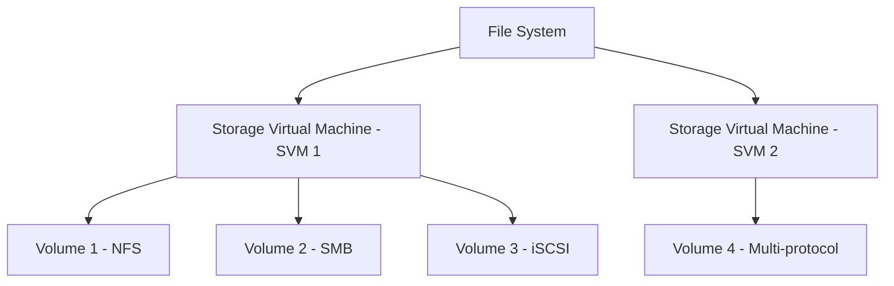

# How to Set Up Amazon FSx for NetApp ONTAP

Author: [nawazdhandala](https://github.com/nawazdhandala)

Tags: AWS, FSx, NetApp ONTAP, Storage, NAS

Description: Learn how to set up Amazon FSx for NetApp ONTAP, a fully managed multi-protocol file system supporting NFS, SMB, and iSCSI with enterprise storage features.

---

If you're coming from an on-premises environment where NetApp filers are the backbone of your storage infrastructure, moving to AWS can feel like giving up a lot of features. SnapMirror, FlexClone, deduplication, compression, thin provisioning, multi-protocol access - these are things your storage team relies on daily. FSx for NetApp ONTAP brings all of that to AWS as a fully managed service.

It's the most feature-rich FSx option, supporting NFS, SMB, and iSCSI simultaneously on the same data. That means Linux, Windows, and even SAN workloads can all share a single storage system. Let's set it up.

## Why FSx for NetApp ONTAP

Here's what makes ONTAP different from the other FSx options:

- **Multi-protocol**: NFS, SMB, and iSCSI on the same data - no duplication needed
- **Thin provisioning**: Create volumes larger than your physical storage and grow on demand
- **Instant clones**: FlexClone creates writable copies of volumes in seconds, regardless of size
- **Snapshots**: Space-efficient snapshots with configurable schedules
- **Data tiering**: Automatically move cold data to a capacity pool tier (similar to EFS IA)
- **Compression and deduplication**: Reduce storage costs by 60-80% for typical datasets
- **SnapMirror**: Replicate data to on-premises ONTAP or other FSx ONTAP systems

## Architecture Concepts

FSx for NetApp ONTAP has a hierarchy you need to understand:



- **File System**: The top-level resource. Contains the ONTAP cluster.
- **Storage Virtual Machine (SVM)**: A logical partition within the file system. Each SVM has its own DNS name, Active Directory configuration, and volumes. Think of it as a virtual filer.
- **Volume**: Where data actually lives. Each volume has its own junction path, security style (UNIX, NTFS, or mixed), and tiering policy.

## Creating the File System

First, create the file system:

```bash
# Create FSx for NetApp ONTAP file system
aws fsx create-file-system \
  --file-system-type ONTAP \
  --storage-capacity 1024 \
  --storage-type SSD \
  --subnet-ids "subnet-0aaa111" "subnet-0bbb222" \
  --security-group-ids "sg-0ontap123" \
  --ontap-configuration '{
    "DeploymentType": "MULTI_AZ_1",
    "AutomaticBackupRetentionDays": 30,
    "DailyAutomaticBackupStartTime": "02:00",
    "WeeklyMaintenanceStartTime": "1:06:00",
    "ThroughputCapacity": 256,
    "PreferredSubnetId": "subnet-0aaa111",
    "FsxAdminPassword": "YourSecurePassword123!",
    "DiskIopsConfiguration": {
      "Mode": "AUTOMATIC"
    }
  }' \
  --tags '[{"Key": "Name", "Value": "ontap-storage"}]'
```

Key parameters:

- **ThroughputCapacity**: 128, 256, 512, 1024, 2048, or 4096 MB/s
- **DeploymentType**: `MULTI_AZ_1` for HA across AZs, `SINGLE_AZ_1` for cost-optimized
- **FsxAdminPassword**: Password for the ONTAP admin user (used for CLI access)
- **DiskIopsConfiguration**: `AUTOMATIC` scales IOPS with storage, `USER_PROVISIONED` lets you specify

Wait for the file system to become available:

```bash
# Check file system status
aws fsx describe-file-systems \
  --file-system-ids "fs-0abc123" \
  --query "FileSystems[0].{Id:FileSystemId,Status:Lifecycle,DNS:DNSName}" \
  --output table
```

## Creating a Storage Virtual Machine

An SVM is automatically created during file system creation, but you can create additional ones:

```bash
# Create an SVM for your application
aws fsx create-storage-virtual-machine \
  --file-system-id "fs-0abc123" \
  --name "app-svm" \
  --root-volume-security-style "UNIX" \
  --active-directory-configuration '{
    "NetBiosName": "APPSVM",
    "SelfManagedActiveDirectoryConfiguration": {
      "DomainName": "corp.example.com",
      "UserName": "admin",
      "Password": "ADPassword123!",
      "DnsIps": ["10.0.1.10", "10.0.2.10"],
      "OrganizationalUnitDistinguishedName": "OU=Computers,DC=corp,DC=example,DC=com"
    }
  }' \
  --tags '[{"Key": "Name", "Value": "app-svm"}]'
```

The `root-volume-security-style` determines the default permission model:
- **UNIX**: For NFS-primary workloads
- **NTFS**: For SMB-primary workloads
- **MIXED**: For multi-protocol access (use cautiously)

## Creating Volumes

Create volumes for your data:

NFS volume:

```bash
# Create an NFS volume
aws fsx create-volume \
  --volume-type ONTAP \
  --name "app-data" \
  --ontap-configuration '{
    "JunctionPath": "/app-data",
    "StorageVirtualMachineId": "svm-0abc123",
    "SizeInMegabytes": 102400,
    "StorageEfficiencyEnabled": true,
    "SecurityStyle": "UNIX",
    "TieringPolicy": {
      "Name": "AUTO",
      "CoolingPeriod": 31
    },
    "SnapshotPolicy": "default"
  }' \
  --tags '[{"Key": "Name", "Value": "app-data"}]'
```

SMB volume for Windows:

```bash
# Create an SMB volume
aws fsx create-volume \
  --volume-type ONTAP \
  --name "windows-share" \
  --ontap-configuration '{
    "JunctionPath": "/windows-share",
    "StorageVirtualMachineId": "svm-0abc123",
    "SizeInMegabytes": 51200,
    "StorageEfficiencyEnabled": true,
    "SecurityStyle": "NTFS",
    "TieringPolicy": {
      "Name": "AUTO",
      "CoolingPeriod": 31
    }
  }' \
  --tags '[{"Key": "Name", "Value": "windows-share"}]'
```

Key volume options:

- **JunctionPath**: The mount path within the SVM's namespace
- **StorageEfficiencyEnabled**: Enables deduplication and compression
- **TieringPolicy**: `AUTO` moves cold data to capacity pool, `SNAPSHOT_ONLY` tiers only snapshot data, `ALL` tiers everything, `NONE` keeps everything on SSD

## Mounting via NFS

On Linux instances, mount the NFS volume:

```bash
# Install NFS client
sudo yum install -y nfs-utils

# Create mount point
sudo mkdir -p /mnt/ontap

# Get the SVM's NFS endpoint
# It looks like: svm-0abc123.fs-0abc123.fsx.us-east-1.amazonaws.com

# Mount the volume
sudo mount -t nfs \
  -o nfsvers=4.1,rsize=1048576,wsize=1048576,hard,timeo=600,retrans=2 \
  svm-0abc123.fs-0abc123.fsx.us-east-1.amazonaws.com:/app-data \
  /mnt/ontap

# Verify the mount
df -h /mnt/ontap
```

Add to fstab for persistence:

```bash
echo "svm-0abc123.fs-0abc123.fsx.us-east-1.amazonaws.com:/app-data /mnt/ontap nfs4 nfsvers=4.1,rsize=1048576,wsize=1048576,hard,timeo=600,retrans=2,_netdev 0 0" | sudo tee -a /etc/fstab
```

## Mounting via SMB

On Windows instances that are domain-joined:

```powershell
# Map the SMB share
net use Z: \\svm-0abc123.fs-0abc123.fsx.us-east-1.amazonaws.com\windows-share

# Or with PowerShell
New-PSDrive -Name "Z" -PSProvider FileSystem `
  -Root "\\svm-0abc123.fs-0abc123.fsx.us-east-1.amazonaws.com\windows-share" `
  -Persist
```

## Working with Snapshots

Create and manage snapshots through the ONTAP CLI or API:

```bash
# Create a snapshot
aws fsx create-snapshot \
  --name "before-migration" \
  --volume-id "fsvol-0abc123" \
  --tags '[{"Key": "Purpose", "Value": "pre-migration"}]'

# List snapshots
aws fsx describe-snapshots \
  --filters "Name=volume-id,Values=fsvol-0abc123" \
  --query "Snapshots[].{Name:Name,Created:CreationTime,Id:SnapshotId}" \
  --output table

# Restore from a snapshot (creates a new volume)
aws fsx create-volume \
  --volume-type ONTAP \
  --name "restored-data" \
  --ontap-configuration '{
    "JunctionPath": "/restored-data",
    "StorageVirtualMachineId": "svm-0abc123",
    "SizeInMegabytes": 102400,
    "CopyTagsToBackups": true,
    "SnapshotPolicy": "default",
    "SecurityStyle": "UNIX"
  }' \
  --origin-snapshot '{
    "SnapshotARN": "arn:aws:fsx:us-east-1:123456789012:snapshot/fss-0abc123",
    "CopyStrategy": "CLONE"
  }'
```

## FlexClone - Instant Writable Copies

One of ONTAP's killer features is FlexClone. You can create a writable copy of a volume almost instantly, regardless of size. The clone shares data blocks with the parent and only stores the differences.

This is incredible for:
- Development environments (clone production data in seconds)
- Testing (create a fresh clone for each test run)
- Data science (each analyst gets their own writable copy of the dataset)

```bash
# Create a FlexClone from a snapshot
aws fsx create-volume \
  --volume-type ONTAP \
  --name "dev-clone" \
  --ontap-configuration '{
    "JunctionPath": "/dev-clone",
    "StorageVirtualMachineId": "svm-0abc123",
    "SizeInMegabytes": 102400,
    "SecurityStyle": "UNIX"
  }' \
  --origin-snapshot '{
    "SnapshotARN": "arn:aws:fsx:us-east-1:123456789012:snapshot/fss-0abc123",
    "CopyStrategy": "CLONE"
  }'
```

The clone is created almost instantly and uses virtually no additional storage until data is modified.

## Terraform Configuration

```hcl
resource "aws_fsx_ontap_file_system" "main" {
  storage_capacity    = 1024
  subnet_ids          = [var.subnet_a_id, var.subnet_b_id]
  deployment_type     = "MULTI_AZ_1"
  throughput_capacity = 256
  preferred_subnet_id = var.subnet_a_id
  security_group_ids  = [aws_security_group.ontap.id]
  fsx_admin_password  = var.ontap_admin_password

  automatic_backup_retention_days   = 30
  daily_automatic_backup_start_time = "02:00"

  tags = {
    Name        = "ontap-storage"
    Environment = var.environment
  }
}

resource "aws_fsx_ontap_storage_virtual_machine" "app" {
  file_system_id = aws_fsx_ontap_file_system.main.id
  name           = "app-svm"

  root_volume_security_style = "UNIX"

  tags = {
    Name = "app-svm"
  }
}

resource "aws_fsx_ontap_volume" "data" {
  name                       = "app_data"
  junction_path              = "/app-data"
  size_in_megabytes          = 102400
  storage_efficiency_enabled = true
  storage_virtual_machine_id = aws_fsx_ontap_storage_virtual_machine.app.id
  security_style             = "UNIX"

  tiering_policy {
    name           = "AUTO"
    cooling_period = 31
  }

  tags = {
    Name = "app-data"
  }
}

resource "aws_security_group" "ontap" {
  name_prefix = "fsx-ontap-"
  vpc_id      = var.vpc_id

  # NFS
  ingress {
    from_port       = 2049
    to_port         = 2049
    protocol        = "tcp"
    security_groups = [var.client_security_group_id]
  }

  # SMB
  ingress {
    from_port       = 445
    to_port         = 445
    protocol        = "tcp"
    security_groups = [var.client_security_group_id]
  }

  # iSCSI
  ingress {
    from_port       = 3260
    to_port         = 3260
    protocol        = "tcp"
    security_groups = [var.client_security_group_id]
  }

  # ONTAP management
  ingress {
    from_port       = 443
    to_port         = 443
    protocol        = "tcp"
    security_groups = [var.admin_security_group_id]
  }

  egress {
    from_port   = 0
    to_port     = 0
    protocol    = "-1"
    cidr_blocks = ["0.0.0.0/0"]
  }
}
```

## Data Tiering

ONTAP's data tiering automatically moves cold data from SSD (performance tier) to a lower-cost capacity pool tier. This is similar to EFS lifecycle management but more granular.

Tiering policies:

- **AUTO**: Cold data moves to capacity pool after the cooling period. Hot data moves back automatically.
- **SNAPSHOT_ONLY**: Only data in snapshots is tiered.
- **ALL**: Everything goes to capacity pool (cheapest, but performance-sensitive reads are slower).
- **NONE**: Everything stays on SSD (highest performance, highest cost).

## Monitoring

```bash
# Key CloudWatch metrics for ONTAP
aws cloudwatch get-metric-statistics \
  --namespace "AWS/FSx" \
  --metric-name "StorageCapacityUtilization" \
  --dimensions "Name=FileSystemId,Value=fs-0abc123" \
  --start-time "$(date -u -d '24 hours ago' +%Y-%m-%dT%H:%M:%SZ)" \
  --end-time "$(date -u +%Y-%m-%dT%H:%M:%SZ)" \
  --period 3600 \
  --statistics Average
```

## Best Practices

1. **Enable storage efficiency** on all volumes - deduplication and compression are nearly free in terms of performance.
2. **Use AUTO tiering** for most workloads to automatically optimize costs.
3. **Use FlexClone for dev/test** instead of copying data - it's faster and cheaper.
4. **Set appropriate snapshot schedules** for each volume's RPO requirements.
5. **Size SSD capacity for your hot dataset** - cold data will tier to capacity pool automatically.
6. **Use Multi-AZ for production** workloads.

## Wrapping Up

FSx for NetApp ONTAP is the Swiss Army knife of AWS storage. It handles NFS, SMB, and iSCSI workloads on the same platform with enterprise features like instant clones, efficient snapshots, and automatic data tiering. If you're migrating from on-premises NetApp, it's the closest thing to a lift-and-shift for your storage layer. And even if you're not a NetApp shop, the multi-protocol support and advanced features make it worth considering for complex storage requirements.
