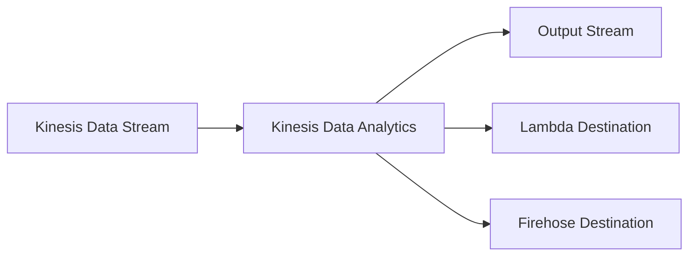

# How to Use Amazon Kinesis Data Analytics with SQL

Author: [nawazdhandala](https://github.com/nawazdhandala)

Tags: AWS, Kinesis, Data Analytics, SQL, Streaming

Description: Learn how to write SQL queries against real-time streaming data using Amazon Kinesis Data Analytics for anomaly detection, aggregation, and real-time dashboards.

---

What if you could run SQL queries on data that's still streaming? That's exactly what Kinesis Data Analytics lets you do. Instead of waiting for data to land in a database, you write SQL against a continuous stream and get results in real time. It's perfect for dashboards, alerts, anomaly detection, and any scenario where waiting for batch processing isn't an option.

Let's build some practical streaming analytics applications using SQL.

## How Kinesis Data Analytics Works

The architecture is straightforward. You connect a Kinesis Data Stream or Firehose as an input source, write SQL queries that process the data continuously, and send the results to an output destination.



Your SQL runs continuously. As new records arrive on the input stream, the queries process them and emit results to the output. There's no batch, no schedule - it just runs.

## Creating an Application

First, create the analytics application and connect it to your input stream.

This creates a Kinesis Data Analytics application with a Kinesis stream as input.

```bash
aws kinesisanalytics create-application \
  --application-name real-time-metrics \
  --application-description "Real-time event metrics" \
  --inputs '[
    {
      "NamePrefix": "SOURCE_SQL_STREAM",
      "KinesisStreamsInput": {
        "ResourceARN": "arn:aws:kinesis:us-east-1:123456789:stream/user-events",
        "RoleARN": "arn:aws:iam::123456789:role/KinesisAnalyticsRole"
      },
      "InputSchema": {
        "RecordFormat": {
          "RecordFormatType": "JSON",
          "MappingParameters": {
            "JSONMappingParameters": {
              "RecordRowPath": "$"
            }
          }
        },
        "RecordColumns": [
          {"Name": "userId", "SqlType": "VARCHAR(64)", "Mapping": "$.userId"},
          {"Name": "eventType", "SqlType": "VARCHAR(32)", "Mapping": "$.eventType"},
          {"Name": "page", "SqlType": "VARCHAR(256)", "Mapping": "$.page"},
          {"Name": "eventTimestamp", "SqlType": "BIGINT", "Mapping": "$.timestamp"},
          {"Name": "amount", "SqlType": "DOUBLE", "Mapping": "$.amount"}
        ]
      }
    }
  ]'
```

## Discovering the Schema

If you're not sure what your data looks like, let Kinesis Data Analytics discover the schema automatically.

```bash
aws kinesisanalytics discover-input-schema \
  --resource-arn arn:aws:kinesis:us-east-1:123456789:stream/user-events \
  --role-arn arn:aws:iam::123456789:role/KinesisAnalyticsRole \
  --input-starting-position-configuration '{
    "InputStartingPosition": "NOW"
  }'
```

This samples a few records from the stream and infers the schema. It's a great starting point, though you'll usually want to refine the column types manually.

## Writing Streaming SQL

Now the fun part. Here are several practical SQL patterns for streaming analytics.

### Real-Time Aggregation (Tumbling Window)

This query computes event counts and unique users per minute.

```sql
-- Create an output stream for the results
CREATE OR REPLACE STREAM "METRICS_STREAM" (
    "event_type" VARCHAR(32),
    "window_start" TIMESTAMP,
    "event_count" BIGINT,
    "unique_users" BIGINT
);

-- Pump data from the input to the output using a 1-minute tumbling window
CREATE OR REPLACE PUMP "METRICS_PUMP" AS
INSERT INTO "METRICS_STREAM"
SELECT STREAM
    "eventType" AS "event_type",
    STEP("SOURCE_SQL_STREAM_001".ROWTIME BY INTERVAL '1' MINUTE) AS "window_start",
    COUNT(*) AS "event_count",
    COUNT(DISTINCT "userId") AS "unique_users"
FROM "SOURCE_SQL_STREAM_001"
GROUP BY
    "eventType",
    STEP("SOURCE_SQL_STREAM_001".ROWTIME BY INTERVAL '1' MINUTE);
```

The `STEP` function creates tumbling windows - fixed time intervals that don't overlap. Every minute, you get a new row per event type with the aggregated counts.

### Sliding Window for Moving Averages

This computes a 5-minute moving average of transaction amounts, updated every 30 seconds.

```sql
CREATE OR REPLACE STREAM "MOVING_AVG_STREAM" (
    "window_end" TIMESTAMP,
    "avg_amount" DOUBLE,
    "max_amount" DOUBLE,
    "transaction_count" BIGINT
);

CREATE OR REPLACE PUMP "MOVING_AVG_PUMP" AS
INSERT INTO "MOVING_AVG_STREAM"
SELECT STREAM
    ROWTIME AS "window_end",
    AVG("amount") AS "avg_amount",
    MAX("amount") AS "max_amount",
    COUNT(*) AS "transaction_count"
FROM "SOURCE_SQL_STREAM_001"
WHERE "eventType" = 'purchase'
WINDOWED BY STAGGER (
    PARTITION BY "eventType"
    RANGE INTERVAL '5' MINUTE
);
```

### Anomaly Detection

Kinesis Data Analytics has a built-in `RANDOM_CUT_FOREST` function for anomaly detection. It learns the normal pattern of your data and flags outliers.

This detects anomalies in transaction amounts using the Random Cut Forest algorithm.

```sql
-- Create a stream for anomaly scores
CREATE OR REPLACE STREAM "ANOMALY_STREAM" (
    "userId" VARCHAR(64),
    "eventType" VARCHAR(32),
    "amount" DOUBLE,
    "anomaly_score" DOUBLE,
    "event_time" TIMESTAMP
);

CREATE OR REPLACE PUMP "ANOMALY_PUMP" AS
INSERT INTO "ANOMALY_STREAM"
SELECT STREAM
    "userId",
    "eventType",
    "amount",
    "ANOMALY_SCORE",
    "SOURCE_SQL_STREAM_001".ROWTIME AS "event_time"
FROM TABLE(
    RANDOM_CUT_FOREST(
        CURSOR(
            SELECT STREAM "userId", "eventType", "amount"
            FROM "SOURCE_SQL_STREAM_001"
            WHERE "eventType" = 'purchase'
        ),
        100,    -- Number of trees
        256,    -- Samples per tree
        100000, -- Time decay
        1       -- Number of features to analyze
    )
);
```

An anomaly score above 2.0 typically indicates something unusual. You can filter for high scores and send them to an alert destination.

### Top-N Queries

Find the most popular pages in the last 5 minutes.

```sql
CREATE OR REPLACE STREAM "TOP_PAGES_STREAM" (
    "page" VARCHAR(256),
    "view_count" BIGINT,
    "ranking" INTEGER,
    "window_end" TIMESTAMP
);

CREATE OR REPLACE PUMP "TOP_PAGES_PUMP" AS
INSERT INTO "TOP_PAGES_STREAM"
SELECT STREAM
    "page",
    "view_count",
    "ranking",
    "window_end"
FROM (
    SELECT STREAM
        "page",
        COUNT(*) OVER w AS "view_count",
        ROW_NUMBER() OVER (ORDER BY COUNT(*) OVER w DESC) AS "ranking",
        STEP(ROWTIME BY INTERVAL '5' MINUTE) AS "window_end"
    FROM "SOURCE_SQL_STREAM_001"
    WHERE "eventType" = 'page_view'
    WINDOW w AS (
        PARTITION BY "page"
        RANGE INTERVAL '5' MINUTE PRECEDING
    )
)
WHERE "ranking" <= 10;
```

## Adding Output Destinations

Send your analytics results to another Kinesis stream or a Lambda function.

This adds an output destination that sends results to a Kinesis Data Stream.

```bash
aws kinesisanalytics add-application-output \
  --application-name real-time-metrics \
  --current-application-version-id 1 \
  --output '{
    "Name": "METRICS_STREAM",
    "KinesisStreamsOutput": {
      "ResourceARN": "arn:aws:kinesis:us-east-1:123456789:stream/metrics-output",
      "RoleARN": "arn:aws:iam::123456789:role/KinesisAnalyticsRole"
    },
    "DestinationSchema": {
      "RecordFormatType": "JSON"
    }
  }'
```

For sending anomaly alerts to a Lambda function:

```bash
aws kinesisanalytics add-application-output \
  --application-name real-time-metrics \
  --current-application-version-id 2 \
  --output '{
    "Name": "ANOMALY_STREAM",
    "LambdaOutput": {
      "ResourceARN": "arn:aws:lambda:us-east-1:123456789:function:anomaly-alerter",
      "RoleARN": "arn:aws:iam::123456789:role/KinesisAnalyticsRole"
    },
    "DestinationSchema": {
      "RecordFormatType": "JSON"
    }
  }'
```

## Starting the Application

Once everything is configured, start the application.

```bash
aws kinesisanalytics start-application \
  --application-name real-time-metrics \
  --input-configurations '[
    {
      "Id": "1.1",
      "InputStartingPositionConfiguration": {
        "InputStartingPosition": "NOW"
      }
    }
  ]'
```

Use `NOW` to start processing from the current point in the stream, or `TRIM_HORIZON` to process all available data.

## Reference Data for Enrichment

You can join streaming data with reference data stored in S3. This is great for enriching events with relatively static data like product catalogs or user segments.

```bash
aws kinesisanalytics add-application-reference-data-source \
  --application-name real-time-metrics \
  --current-application-version-id 3 \
  --reference-data-source '{
    "TableName": "PRODUCT_CATALOG",
    "S3ReferenceDataSource": {
      "BucketARN": "arn:aws:s3:::my-reference-data",
      "FileKey": "catalogs/products.json",
      "ReferenceRoleARN": "arn:aws:iam::123456789:role/KinesisAnalyticsRole"
    },
    "ReferenceSchema": {
      "RecordFormat": {
        "RecordFormatType": "JSON"
      },
      "RecordColumns": [
        {"Name": "productId", "SqlType": "VARCHAR(64)", "Mapping": "$.productId"},
        {"Name": "category", "SqlType": "VARCHAR(64)", "Mapping": "$.category"},
        {"Name": "price", "SqlType": "DOUBLE", "Mapping": "$.price"}
      ]
    }
  }'
```

Then join in your SQL.

```sql
SELECT STREAM
    s."userId",
    s."page",
    p."category",
    p."price"
FROM "SOURCE_SQL_STREAM_001" s
LEFT JOIN "PRODUCT_CATALOG" p
ON s."productId" = p."productId";
```

## Monitoring

Watch these CloudWatch metrics:
- **InputBytes** - Data flowing into the application
- **MillisBehindLatest** - How far behind the application is
- **OutputBytes** - Data flowing to destinations

If MillisBehindLatest is growing, your SQL queries can't keep up with the input volume. Simplify your queries or increase the Kinesis Processing Units (KPUs). For a more code-native approach to streaming analytics, check out our guide on [Kinesis Data Analytics with Apache Flink](https://oneuptime.com/blog/post/amazon-kinesis-data-analytics-with-apache-flink/view).

Streaming SQL is one of the fastest ways to get real-time insights from your data. You don't need to learn a new framework or programming language - if you know SQL, you can build streaming analytics applications in minutes.
