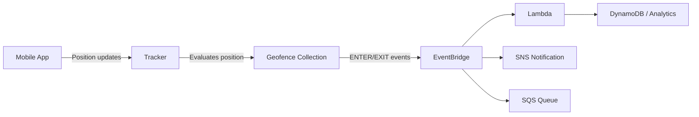

# How to Use Amazon Location Service for Maps and Geolocation

Author: [nawazdhandala](https://github.com/nawazdhandala)

Tags: AWS, Amazon Location Service, Geolocation, Maps, Cloud

Description: A practical guide to using Amazon Location Service for adding maps, geocoding, routing, and geofencing to your applications without third-party dependencies.

---

Building location-aware apps usually means reaching for Google Maps or Mapbox, tacking on API keys, and hoping your usage doesn't blow up your bill at the end of the month. Amazon Location Service offers an alternative that lives right inside your AWS ecosystem. It handles maps, place search, routing, geofencing, and device tracking - all with predictable pricing and tight integration with other AWS services.

Let's dig into how to actually use it, from rendering a map on a web page to setting up geofences that trigger alerts when devices enter or leave a specific area.

## What Amazon Location Service Offers

The service breaks down into five main features:

- **Maps** - Render interactive maps using data from Esri or HERE
- **Places** - Search for locations, geocode addresses, reverse geocode coordinates
- **Routes** - Calculate driving, walking, or trucking routes between points
- **Geofencing** - Define virtual boundaries and detect when devices cross them
- **Trackers** - Track device positions over time

You pick a data provider (Esri or HERE) when you create each resource. The underlying data comes from those providers, but you interact with everything through the AWS API.

## Setting Up Your First Map

Start by creating a map resource. You can do this in the console or via CLI.

```bash
# Create a map resource using Esri as the data provider
aws location create-map \
  --map-name "my-app-map" \
  --configuration Style=VectorEsriNavigation \
  --description "Main application map"
```

Available styles include VectorEsriNavigation, VectorEsriStreets, VectorHereExplore, and several others. Pick whatever fits your use case.

Next, you'll want to display this map in a web app. Amazon Location Service works with MapLibre GL JS, which is an open-source mapping library.

Here's a basic HTML page that renders your map.

```html
<!DOCTYPE html>
<html>
<head>
  <meta charset="utf-8">
  <title>My AWS Map</title>
  <link href="https://unpkg.com/maplibre-gl@3.x/dist/maplibre-gl.css" rel="stylesheet" />
  <script src="https://unpkg.com/maplibre-gl@3.x/dist/maplibre-gl.js"></script>
  <!-- AWS SDK and auth helper -->
  <script src="https://unpkg.com/@aws/amazon-location-utilities-auth-helper@1.x/dist/amazonLocationAuthHelper.js"></script>
  <style>
    body { margin: 0; }
    #map { height: 100vh; width: 100vw; }
  </style>
</head>
<body>
  <div id="map"></div>
  <script>
    const mapName = "my-app-map";
    const region = "us-east-1";
    const identityPoolId = "us-east-1:your-identity-pool-id";

    async function initMap() {
      // Use Cognito for unauthenticated access
      const authHelper = await amazonLocationAuthHelper.withIdentityPoolId(identityPoolId);

      const map = new maplibregl.Map({
        container: "map",
        center: [-122.4194, 37.7749], // San Francisco
        zoom: 12,
        style: `https://maps.geo.${region}.amazonaws.com/maps/v0/maps/${mapName}/style-descriptor`,
        transformRequest: authHelper.getMapAuthenticationOptions().transformRequest,
      });

      // Add navigation controls
      map.addControl(new maplibregl.NavigationControl(), "top-left");
    }

    initMap();
  </script>
</body>
</html>
```

You'll need an Amazon Cognito identity pool to authenticate unauthenticated users (public map access). Create one with this command.

```bash
# Create a Cognito identity pool for unauthenticated map access
aws cognito-identity create-identity-pool \
  --identity-pool-name "map-users" \
  --allow-unauthenticated-identities
```

Then attach a role to the identity pool that grants `geo:GetMap*` permissions.

## Geocoding and Place Search

Geocoding converts an address into coordinates. Reverse geocoding does the opposite. Both are straightforward with the Places API.

First, create a place index.

```bash
# Create a place index for geocoding
aws location create-place-index \
  --index-name "my-place-index" \
  --data-source "Esri" \
  --description "Geocoding and place search"
```

Now you can search for places.

```python
import boto3

# Initialize the Location Service client
client = boto3.client('location')

# Forward geocoding - address to coordinates
response = client.search_place_index_for_text(
    IndexName='my-place-index',
    Text='350 Fifth Avenue, New York, NY',
    MaxResults=5
)

for result in response['Results']:
    place = result['Place']
    point = place['Geometry']['Point']
    print(f"Found: {place['Label']}")
    print(f"  Coordinates: {point[1]}, {point[0]}")  # lat, lng

# Reverse geocoding - coordinates to address
response = client.search_place_index_for_position(
    IndexName='my-place-index',
    Position=[-73.9857, 40.7484],  # lng, lat (note the order)
    MaxResults=1
)

for result in response['Results']:
    print(f"Address: {result['Place']['Label']}")
```

Watch out for the coordinate order. Amazon Location Service uses `[longitude, latitude]`, which trips people up constantly since most of us think in `lat, lng`.

## Calculating Routes

Create a route calculator, then request directions between two points.

```bash
# Create a route calculator
aws location create-route-calculator \
  --calculator-name "my-route-calc" \
  --data-source "Esri" \
  --description "Driving directions"
```

Here's how to calculate a route in Python.

```python
import boto3

client = boto3.client('location')

# Calculate a driving route from San Francisco to Los Angeles
response = client.calculate_route(
    CalculatorName='my-route-calc',
    DeparturePosition=[-122.4194, 37.7749],  # SF
    DestinationPosition=[-118.2437, 34.0522],  # LA
    TravelMode='Car',
    IncludeLegGeometry=True,
    DepartNow=True
)

summary = response['Summary']
print(f"Distance: {summary['Distance']:.1f} km")
print(f"Duration: {summary['DurationSeconds'] / 60:.0f} minutes")

# Each leg contains step-by-step geometry
for i, leg in enumerate(response['Legs']):
    print(f"\nLeg {i + 1}: {leg['Distance']:.1f} km")
    for step in leg['Steps']:
        print(f"  - {step['Distance']:.1f} km, {step['DurationSeconds']:.0f}s")
```

## Setting Up Geofences

Geofences are virtual boundaries. You define a polygon or circle, and the service detects when tracked devices enter or exit. This is incredibly useful for delivery apps, fleet management, or any location-triggered workflow.

Create a geofence collection and add a geofence.

```python
import boto3

client = boto3.client('location')

# Create a geofence collection
client.create_geofence_collection(
    CollectionName='delivery-zones',
    Description='Delivery zone boundaries'
)

# Add a circular geofence around a warehouse
client.put_geofence(
    CollectionName='delivery-zones',
    GeofenceId='warehouse-sf',
    Geometry={
        'Circle': {
            'Center': [-122.4194, 37.7749],
            'Radius': 500  # meters
        }
    }
)

# Or define a polygon geofence for a custom shape
client.put_geofence(
    CollectionName='delivery-zones',
    GeofenceId='downtown-zone',
    Geometry={
        'Polygon': [[
            [-122.425, 37.780],
            [-122.415, 37.780],
            [-122.415, 37.770],
            [-122.425, 37.770],
            [-122.425, 37.780]  # must close the polygon
        ]]
    }
)
```

## Device Tracking with Geofence Events

Create a tracker and link it to your geofence collection. When tracked devices cross a geofence boundary, events fire to EventBridge.

```python
import boto3

client = boto3.client('location')

# Create a tracker
client.create_tracker(
    TrackerName='delivery-tracker',
    Description='Track delivery vehicles'
)

# Associate the tracker with the geofence collection
client.associate_tracker_consumer(
    TrackerName='delivery-tracker',
    ConsumerArn='arn:aws:geo:us-east-1:123456789:geofence-collection/delivery-zones'
)

# Update a device position (call this from your mobile app or IoT device)
client.batch_update_device_position(
    TrackerName='delivery-tracker',
    Updates=[{
        'DeviceId': 'vehicle-42',
        'Position': [-122.4200, 37.7755],
        'SampleTime': '2026-02-12T10:30:00Z'
    }]
)
```

Set up an EventBridge rule to catch geofence events and route them wherever you need - SNS, Lambda, SQS, or anything else.

```bash
# Create EventBridge rule for geofence ENTER events
aws events put-rule \
  --name "geofence-enter-alert" \
  --event-pattern '{
    "source": ["aws.geo"],
    "detail-type": ["Location Geofence Event"],
    "detail": {
      "EventType": ["ENTER"]
    }
  }'
```

## Architecture Overview

Here's how the pieces fit together.



## Cost Tips

Amazon Location Service pricing is straightforward - you pay per request. Map tiles, geocoding queries, route calculations, and geofence evaluations each have their own per-request price. For most applications, the cost is significantly lower than Google Maps Platform, especially at scale.

A few tips to keep costs down:

- Cache geocoding results. If you're geocoding the same addresses repeatedly, store the results.
- Use position filtering on trackers. The `AccuracyBased` filter skips position updates that haven't moved meaningfully, reducing geofence evaluations.
- Batch device updates when possible instead of sending individual ones.

## Monitoring

Keep an eye on your API usage through CloudWatch metrics. Amazon Location Service publishes metrics like `CallCount` and `ErrorCount` for each resource type. For broader infrastructure monitoring, check out how [OneUptime can help track your AWS services](https://oneuptime.com/blog/post/aws-cloudwatch-logs-setup/view).

## Final Thoughts

Amazon Location Service won't replace Google Maps for consumer-facing apps that need Street View or super detailed business listings. But for backend geolocation work - geofencing, fleet tracking, route optimization, geocoding - it's a solid choice that integrates cleanly with the rest of your AWS stack. The pricing model is simpler, the data stays in your account, and you don't need to manage yet another third-party API key.
