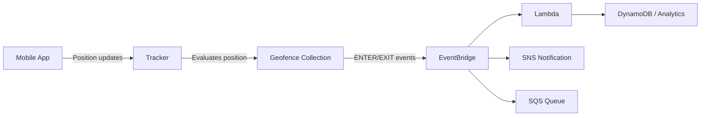

# How to Use Amazon Location Service for Maps and Geolocation

Author: [nawazdhandala](https://github.com/nawazdhandala)

Tags: AWS, Amazon Location Service, Geolocation, Map, Cloud

Description: A practical guide to using Amazon Location Service for adding maps, geocoding, routing, and geofencing to your applications without third-party dependencies.

---

Building location-aware apps usually means reaching for Google Maps or Mapbox, tacking on API keys, and hoping your usage doesn't blow up your bill at the end of the month. Amazon Location Service offers an alternative that lives right inside your AWS ecosystem. It handles maps, place search, routing, geofencing, and device tracking - all with usage-based pricing and tight integration with other AWS services.

Let's dig into how to actually use it, from rendering a map on a web page to setting up geofences that trigger alerts when devices enter or leave a specific area.

## What Amazon Location Service Offers

The service breaks down into five main features:

- **Maps** - Render interactive maps using AWS map styles such as Standard, Monochrome, Hybrid, and Satellite
- **Places** - Search for locations, geocode addresses, reverse geocode coordinates
- **Routes** - Calculate driving, walking, or trucking routes between points
- **Geofencing** - Define virtual boundaries and detect when devices cross them
- **Trackers** - Track device positions over time

Older Amazon Location Maps, Places, and Routes APIs required you to create resources and pick a data provider such as Esri or HERE. The current Maps V2, Places V2, and Routes V2 APIs use standalone endpoints, while geofences and trackers are still created as AWS resources.

## Setting Up Your First Map

Start by choosing a map style. The current Maps V2 API doesn't require you to create a map resource first.

Available styles include Standard, Monochrome, Hybrid, and Satellite. Pick whatever fits your use case.

Next, you'll want to display this map in a web app. Amazon Location Service works with MapLibre GL JS, which is an open-source mapping library.

Here's a basic HTML page that renders your map.

```html
<!DOCTYPE html>
<html>
<head>
  <meta charset="utf-8">
  <title>My AWS Map</title>
  <link href="https://unpkg.com/maplibre-gl@5.x/dist/maplibre-gl.css" rel="stylesheet" />
  <script src="https://unpkg.com/maplibre-gl@5.x/dist/maplibre-gl.js"></script>
  <!-- AWS SDK and auth helper -->
  <script src="https://cdn.jsdelivr.net/npm/@aws/amazon-location-utilities-auth-helper@1"></script>
  <style>
    body { margin: 0; }
    #map { height: 100vh; width: 100vw; }
  </style>
</head>
<body>
  <div id="map"></div>
  <script>
    const mapStyle = "Standard";
    const region = "us-east-1";
    const identityPoolId = "us-east-1:your-identity-pool-id";

    async function initMap() {
      // Use Cognito for unauthenticated access
      const authHelper = await amazonLocationAuthHelper.withIdentityPoolId(identityPoolId);

      const map = new maplibregl.Map({
        container: "map",
        center: [-122.4194, 37.7749], // San Francisco
        zoom: 12,
        style: `https://maps.geo.${region}.amazonaws.com/v2/styles/${mapStyle}/descriptor`,
        ...authHelper.getMapAuthenticationOptions(),
      });

      // Add navigation controls
      map.addControl(new maplibregl.NavigationControl(), "top-left");
    }

    initMap();
  </script>
</body>
</html>
```

You'll need an Amazon Cognito identity pool to authenticate unauthenticated users (public map access). Create one with this command.

```bash
# Create a Cognito identity pool for unauthenticated map access
aws cognito-identity create-identity-pool \
  --identity-pool-name "map-users" \
  --allow-unauthenticated-identities
```

Then attach a role to the identity pool that grants the Maps V2 read permissions your map needs, such as `geo-maps:GetStyleDescriptor`, `geo-maps:GetTile`, `geo-maps:GetSprites`, and `geo-maps:GetGlyphs`.

## Geocoding and Place Search

Geocoding converts an address into coordinates. Reverse geocoding does the opposite. Both are straightforward with the Places API.

With Places V2, you don't need to create a place index first. You call the standalone Places client.

```python
import boto3

# Initialize the Places V2 client
client = boto3.client('geo-places')

# Forward geocoding - address to coordinates
response = client.geocode(
    QueryText='350 Fifth Avenue, New York, NY',
    MaxResults=5
)

for place in response['ResultItems']:
    point = place['Position']
    print(f"Found: {place['Address']['Label']}")
    print(f"  Coordinates: {point[1]}, {point[0]}")  # lat, lng

# Reverse geocoding - coordinates to address
response = client.reverse_geocode(
    QueryPosition=[-73.9857, 40.7484],  # lng, lat (note the order)
    MaxResults=1
)

for place in response['ResultItems']:
    print(f"Address: {place['Address']['Label']}")
```

Watch out for the coordinate order. Amazon Location Service uses `[longitude, latitude]`, which trips people up constantly since most of us think in `lat, lng`.

## Calculating Routes

With Routes V2, you don't need to create a route calculator first. Here's how to calculate a route in Python.

```python
import boto3

client = boto3.client('geo-routes')

# Calculate a driving route from San Francisco to Los Angeles
response = client.calculate_routes(
    Origin=[-122.4194, 37.7749],  # SF
    Destination=[-118.2437, 34.0522],  # LA
    TravelMode='Car',
    LegGeometryFormat='Simple',
    LegAdditionalFeatures=['Summary', 'TravelStepInstructions'],
    TravelStepType='Default',
    DepartNow=True
)

route = response['Routes'][0]
summary = route['Summary']
print(f"Distance: {summary['Distance'] / 1000:.1f} km")
print(f"Duration: {summary['Duration'] / 60:.0f} minutes")

# Each leg contains step-by-step geometry
for i, leg in enumerate(route['Legs']):
    overview = leg['Summary']['Overview']
    print(f"\nLeg {i + 1}: {overview['Distance'] / 1000:.1f} km")
    for step in leg.get('VehicleLegDetails', {}).get('TravelSteps', []):
        print(f"  - {step['Distance'] / 1000:.1f} km, {step['Duration']:.0f}s")
```

## Setting Up Geofences

Geofences are virtual boundaries. You define a polygon or circle, and the service detects when tracked devices enter or exit. This is incredibly useful for delivery apps, fleet management, or any location-triggered workflow.

Create a geofence collection and add a geofence.

```python
import boto3

client = boto3.client('location')

# Create a geofence collection
client.create_geofence_collection(
    CollectionName='delivery-zones',
    Description='Delivery zone boundaries'
)

# Add a circular geofence around a warehouse
client.put_geofence(
    CollectionName='delivery-zones',
    GeofenceId='warehouse-sf',
    Geometry={
        'Circle': {
            'Center': [-122.4194, 37.7749],
            'Radius': 500  # meters
        }
    }
)

# Or define a polygon geofence for a custom shape
client.put_geofence(
    CollectionName='delivery-zones',
    GeofenceId='downtown-zone',
    Geometry={
        'Polygon': [[
            [-122.425, 37.780],
            [-122.425, 37.770],
            [-122.415, 37.770],
            [-122.415, 37.780],
            [-122.425, 37.780]  # must close the polygon
        ]]
    }
)
```

## Device Tracking with Geofence Events

Create a tracker and link it to your geofence collection. When tracked devices cross a geofence boundary, events fire to EventBridge.

```python
import boto3
from datetime import datetime, timezone

client = boto3.client('location')

# Create a tracker
client.create_tracker(
    TrackerName='delivery-tracker',
    Description='Track delivery vehicles'
)

# Associate the tracker with the geofence collection
client.associate_tracker_consumer(
    TrackerName='delivery-tracker',
    ConsumerArn='arn:aws:geo:us-east-1:123456789:geofence-collection/delivery-zones'
)

# Update a device position (call this from your mobile app or IoT device)
client.batch_update_device_position(
    TrackerName='delivery-tracker',
    Updates=[{
        'DeviceId': 'vehicle-42',
        'Position': [-122.4200, 37.7755],
        'SampleTime': datetime(2026, 2, 12, 10, 30, tzinfo=timezone.utc)
    }]
)
```

Set up an EventBridge rule to catch geofence events and route them wherever you need - SNS, Lambda, SQS, or anything else.

```bash
# Create EventBridge rule for geofence ENTER events
aws events put-rule \
  --name "geofence-enter-alert" \
  --event-pattern '{
    "source": ["aws.geo"],
    "detail-type": ["Location Geofence Event"],
    "detail": {
      "EventType": ["ENTER"]
    }
  }'
```

## Architecture Overview

Here's how the pieces fit together.


```mermaid
graph LR
    A[Mobile App] -->|Position updates| B[Tracker]
    B -->|Evaluates position| C[Geofence Collection]
    C -->|ENTER/EXIT events| D[EventBridge]
    D --> E[Lambda]
    D --> F[SNS Notification]
    D --> G[SQS Queue]
    E --> H[DynamoDB / Analytics]
```

## Cost Tips

Amazon Location Service pricing is usage-based. Map tiles, geocoding queries, route calculations, and geofence evaluations each have their own price dimensions. For many applications, the cost can be lower than Google Maps Platform, especially at scale.

A few tips to keep costs down:

- Cache geocoding results. If you're geocoding the same addresses repeatedly, store the results.
- Use position filtering on trackers. The `AccuracyBased` filter skips position updates that haven't moved meaningfully, reducing geofence evaluations.
- Batch device updates when possible instead of sending individual ones.

## Monitoring

Keep an eye on your API usage through CloudWatch metrics. Amazon Location Service publishes metrics like `CallCount` and `ErrorCount` for each resource type. For broader infrastructure monitoring, check out how [OneUptime can help track your AWS services](https://oneuptime.com/blog/post/2026-02-06-aws-cloudwatch-logs-exporter-opentelemetry-collector/view).

## Final Thoughts

Amazon Location Service won't replace Google Maps for consumer-facing apps that need Street View or super detailed business listings. But for backend geolocation work - geofencing, fleet tracking, route optimization, geocoding - it's a solid choice that integrates cleanly with the rest of your AWS stack. The pricing model is simpler, sensitive tracking and geofencing data stays in your AWS account, and you don't need to manage yet another third-party API key.
