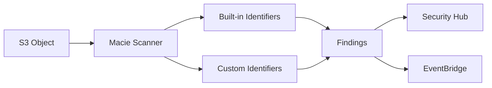

# How to Use Amazon Macie Custom Data Identifiers

Author: [nawazdhandala](https://github.com/nawazdhandala)

Tags: AWS, Macie, Data Privacy, S3, Security

Description: Create custom data identifiers in Amazon Macie to detect organization-specific sensitive data patterns in your S3 buckets beyond the built-in detectors.

---

Amazon Macie comes with a solid set of built-in data identifiers - it can find credit card numbers, social security numbers, passport numbers, API keys, and dozens of other common sensitive data types. But every organization has its own proprietary data that's equally sensitive. Internal employee IDs, custom account numbers, proprietary format medical record numbers, internal project codes - Macie doesn't know about these by default.

Custom data identifiers let you teach Macie to find your organization's specific sensitive data patterns. You define them using regular expressions and optional keyword lists, and Macie applies them during S3 bucket scans alongside the built-in detectors. Let's set them up.

## How Custom Data Identifiers Work

A custom data identifier has three components:

1. **Regular expression** - The pattern to match. This is the primary detection mechanism.
2. **Keywords** (optional) - Words that must appear near the regex match. This reduces false positives.
3. **Maximum match distance** (optional) - How close the keyword must be to the regex match (in characters).

When Macie scans an S3 object, it evaluates custom identifiers alongside the built-in ones. Matches are reported as findings with the severity you define.



## Creating Custom Data Identifiers

### Via CLI

Let's start with a common example: detecting internal employee IDs that follow a specific format.

This creates a custom identifier for employee IDs matching the pattern EMP-XXXXXX:

```bash
# Create custom data identifier for employee IDs
aws macie2 create-custom-data-identifier \
  --name "InternalEmployeeID" \
  --description "Detects internal employee identifiers in format EMP-XXXXXX" \
  --regex "EMP-[0-9]{6}" \
  --keywords '["employee", "emp_id", "employee_id", "staff", "worker"]' \
  --maximum-match-distance 50 \
  --severity-levels '[
    {
      "occurrencesThreshold": 1,
      "severity": "MEDIUM"
    },
    {
      "occurrencesThreshold": 10,
      "severity": "HIGH"
    }
  ]' \
  --tags Key=Team,Value=Security
```

The severity levels let you escalate based on volume. A single employee ID might be a low-risk issue, but 10 or more in the same file suggests a data dump.

### More Examples

Here are custom identifiers for common internal data patterns.

Custom account numbers (format: ACC-XXXX-XXXX-XXXX):

```bash
aws macie2 create-custom-data-identifier \
  --name "InternalAccountNumber" \
  --description "Internal customer account numbers" \
  --regex "ACC-[0-9]{4}-[0-9]{4}-[0-9]{4}" \
  --keywords '["account", "customer", "acct", "account_number"]' \
  --maximum-match-distance 50 \
  --severity-levels '[
    {"occurrencesThreshold": 1, "severity": "HIGH"}
  ]'
```

Internal project codes:

```bash
aws macie2 create-custom-data-identifier \
  --name "ProjectCode" \
  --description "Internal project codes format PRJ-XXX-XXXX" \
  --regex "PRJ-[A-Z]{3}-[0-9]{4}" \
  --keywords '["project", "initiative", "program", "budget"]' \
  --maximum-match-distance 100
```

Medical record numbers (custom format):

```bash
aws macie2 create-custom-data-identifier \
  --name "MedicalRecordNumber" \
  --description "Patient medical record numbers" \
  --regex "MRN[0-9]{8,10}" \
  --keywords '["patient", "medical", "record", "health", "diagnosis", "treatment"]' \
  --maximum-match-distance 75 \
  --severity-levels '[
    {"occurrencesThreshold": 1, "severity": "HIGH"},
    {"occurrencesThreshold": 50, "severity": "CRITICAL"}
  ]'
```

Internal API tokens:

```bash
aws macie2 create-custom-data-identifier \
  --name "InternalAPIToken" \
  --description "Internal API tokens with known prefix" \
  --regex "mycompany_[a-zA-Z0-9]{32,64}" \
  --keywords '["api_key", "token", "secret", "authorization", "bearer"]' \
  --maximum-match-distance 30 \
  --severity-levels '[
    {"occurrencesThreshold": 1, "severity": "CRITICAL"}
  ]'
```

## Testing Custom Identifiers

Before using a custom identifier in production scans, test it to make sure it matches what you expect and doesn't generate too many false positives.

This tests your regex against sample data:

```bash
# Test a custom data identifier
aws macie2 test-custom-data-identifier \
  --regex "EMP-[0-9]{6}" \
  --keywords '["employee", "emp_id"]' \
  --maximum-match-distance 50 \
  --sample-text "The employee with emp_id EMP-123456 was assigned to the project. Another team member EMP-789012 joined later."
```

The response tells you how many matches were found and where they are. If the count seems wrong, adjust your regex or keywords.

Test for false positives too:

```bash
# Test with non-matching text to verify no false positives
aws macie2 test-custom-data-identifier \
  --regex "EMP-[0-9]{6}" \
  --keywords '["employee", "emp_id"]' \
  --maximum-match-distance 50 \
  --sample-text "The temperature reading was -123456 degrees. The EMP frequency range is 300 Hz."
```

## Managing Custom Identifiers

### List Existing Identifiers

```bash
# List all custom data identifiers
aws macie2 list-custom-data-identifiers \
  --query 'Items[].{Name:Name,Id:Id,CreatedAt:CreatedAt}'
```

### Get Details

```bash
aws macie2 get-custom-data-identifier \
  --id abc123-def456
```

### Delete an Identifier

```bash
# Soft delete - marks as deleted but preserves for audit
aws macie2 delete-custom-data-identifier \
  --id abc123-def456
```

## Using Custom Identifiers in Classification Jobs

Custom identifiers need to be included in your Macie classification jobs. Here's how to create a job that uses both built-in and custom identifiers.

This creates a Macie job that scans specific S3 buckets using your custom identifiers:

```bash
# Create a classification job with custom identifiers
aws macie2 create-classification-job \
  --job-type SCHEDULED \
  --name "weekly-sensitive-data-scan" \
  --description "Weekly scan for all sensitive data types" \
  --schedule-frequency-details '{
    "WeeklySchedule": {
      "DayOfWeek": "SUNDAY"
    }
  }' \
  --s3-job-definition '{
    "BucketDefinitions": [
      {
        "AccountId": "111111111111",
        "Buckets": [
          "production-data-bucket",
          "analytics-data-bucket",
          "user-uploads-bucket"
        ]
      }
    ],
    "Scoping": {
      "Includes": {
        "And": [
          {
            "SimpleScopeTerm": {
              "Comparator": "STARTS_WITH",
              "Key": "OBJECT_KEY",
              "Values": ["data/", "exports/", "reports/"]
            }
          }
        ]
      }
    }
  }' \
  --custom-data-identifier-ids '["id-1", "id-2", "id-3"]' \
  --managed-data-identifier-selector "ALL"
```

The `--managed-data-identifier-selector "ALL"` includes all built-in identifiers. You can also use `EXCLUDE` with `--managed-data-identifier-ids` to exclude specific built-in identifiers that generate too many false positives for your environment.

## One-Time Scan

For ad-hoc scanning when investigating a specific bucket:

```bash
aws macie2 create-classification-job \
  --job-type ONE_TIME \
  --name "investigate-data-export" \
  --s3-job-definition '{
    "BucketDefinitions": [
      {
        "AccountId": "111111111111",
        "Buckets": ["suspicious-data-export-bucket"]
      }
    ]
  }' \
  --custom-data-identifier-ids '["id-1", "id-2"]' \
  --managed-data-identifier-selector "ALL"
```

## Terraform Configuration

Here's the Terraform setup for custom identifiers and a classification job:

```hcl
resource "aws_macie2_custom_data_identifier" "employee_id" {
  name                   = "InternalEmployeeID"
  description            = "Detects internal employee IDs"
  regex                  = "EMP-[0-9]{6}"
  keywords               = ["employee", "emp_id", "employee_id", "staff"]
  maximum_match_distance = 50
}

resource "aws_macie2_custom_data_identifier" "account_number" {
  name                   = "InternalAccountNumber"
  description            = "Internal customer account numbers"
  regex                  = "ACC-[0-9]{4}-[0-9]{4}-[0-9]{4}"
  keywords               = ["account", "customer", "acct"]
  maximum_match_distance = 50
}

resource "aws_macie2_custom_data_identifier" "api_token" {
  name                   = "InternalAPIToken"
  description            = "Internal API tokens"
  regex                  = "mycompany_[a-zA-Z0-9]{32,64}"
  keywords               = ["api_key", "token", "secret"]
  maximum_match_distance = 30
}

resource "aws_macie2_classification_job" "weekly_scan" {
  job_type = "SCHEDULED"
  name     = "weekly-sensitive-data-scan"

  s3_job_definition {
    bucket_definitions {
      account_id = data.aws_caller_identity.current.account_id
      buckets    = ["production-data-bucket", "analytics-bucket"]
    }
  }

  custom_data_identifier_ids = [
    aws_macie2_custom_data_identifier.employee_id.id,
    aws_macie2_custom_data_identifier.account_number.id,
    aws_macie2_custom_data_identifier.api_token.id,
  ]

  schedule_frequency_details {
    weekly_schedule {
      day_of_week = "SUNDAY"
    }
  }
}
```

## Handling Findings

When custom identifiers match, Macie generates findings. Route them to EventBridge for automated handling.

This EventBridge rule catches Macie findings from your custom identifiers:

```json
{
  "source": ["aws.macie"],
  "detail-type": ["Macie Finding"],
  "detail": {
    "classificationDetails": {
      "result": {
        "customDataIdentifiers": {
          "detections": {
            "name": [{
              "anything-but": []
            }]
          }
        }
      }
    }
  }
}
```

A Lambda function to process custom identifier findings:

```python
import boto3
import json

sns = boto3.client('sns')
s3 = boto3.client('s3')

def handler(event, context):
    finding = event['detail']

    # Extract details
    severity = finding['severity']['description']
    bucket = finding['resourcesAffected']['s3Bucket']['name']
    key = finding['resourcesAffected']['s3Object']['key']

    # Get custom identifier matches
    custom_detections = finding['classificationDetails']['result']['customDataIdentifiers']['detections']

    identifiers_found = []
    for detection in custom_detections:
        identifiers_found.append({
            'name': detection['name'],
            'count': detection['count']
        })

    message = {
        'severity': severity,
        'bucket': bucket,
        'object_key': key,
        'custom_identifiers_matched': identifiers_found
    }

    print(f"Custom data found: {json.dumps(message)}")

    # Notify security team
    sns.publish(
        TopicArn='arn:aws:sns:us-east-1:111111111111:data-exposure-alerts',
        Subject=f'[{severity}] Sensitive data found in {bucket}',
        Message=json.dumps(message, indent=2)
    )

    # For critical findings, add a quarantine tag to the object
    if severity == 'High':
        s3.put_object_tagging(
            Bucket=bucket,
            Key=key,
            Tagging={
                'TagSet': [
                    {'Key': 'SensitiveData', 'Value': 'true'},
                    {'Key': 'ReviewRequired', 'Value': 'true'}
                ]
            }
        )

    return {'statusCode': 200}
```

## Regex Tips for Better Detection

**Be specific enough to avoid false positives.** `[0-9]{6}` alone will match any 6-digit number. Add context: `EMP-[0-9]{6}` or use keywords to narrow it down.

**Use non-capturing groups for alternatives.** `(?:EMP|EMPLOYEE)-[0-9]{6}` matches both formats without creating regex capture groups.

**Anchor when appropriate.** If your pattern should appear as a standalone token, use word boundaries: `\bEMP-[0-9]{6}\b`.

**Account for variations.** Internal IDs might appear with different separators: `EMP[- ]?[0-9]{6}` matches `EMP-123456`, `EMP 123456`, and `EMP123456`.

**Test extensively.** Use the test API with realistic sample data, including edge cases and near-misses.

## Viewing Scan Results

Check findings from your classification jobs:

```bash
# List findings
aws macie2 list-findings \
  --finding-criteria '{
    "criterion": {
      "classificationDetails.result.customDataIdentifiers.detections.name": {
        "neq": []
      }
    }
  }' \
  --sort-criteria '{
    "attributeName": "severity.score",
    "orderBy": "DESC"
  }'
```

## Best Practices

**Start with the most critical data.** Don't try to create identifiers for everything at once. Start with the data that would cause the most damage if exposed.

**Use keywords to reduce noise.** A regex alone might match too broadly. Keywords provide context that dramatically reduces false positives.

**Test before deploying.** Always use the test API before adding an identifier to a production scan. False positives waste security team time and create alert fatigue.

**Review and tune regularly.** As your data patterns evolve, update your custom identifiers. Set a quarterly review cadence.

**Combine with S3 access monitoring.** Finding sensitive data is step one. Monitoring who accesses it is step two. Check out our guide on [GuardDuty S3 Protection](https://oneuptime.com/blog/post/2026-02-12-guardduty-s3-protection/view) for access monitoring. Use [OneUptime](https://oneuptime.com) to track your overall data security posture across all your monitoring tools.
