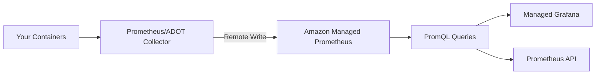

# How to Use Amazon Managed Prometheus for Container Metrics

Author: [nawazdhandala](https://github.com/nawazdhandala)

Tags: AWS, Prometheus, Container Metrics, EKS, Monitoring

Description: Learn how to set up Amazon Managed Service for Prometheus to collect, store, and query container metrics from EKS and ECS workloads at scale.

---

If you're running containers on AWS and your team already knows Prometheus, Amazon Managed Service for Prometheus (AMP) is a natural fit. It gives you a fully managed Prometheus-compatible monitoring service - you don't have to provision servers, manage storage, or worry about scaling the Prometheus backend. You just send metrics in, and query them with PromQL.

AMP integrates well with EKS, works with standard Prometheus tooling, and pairs nicely with Amazon Managed Grafana for visualization. Let's walk through the full setup.

## What AMP Does and Doesn't Do

AMP handles the **backend** - metric storage, query processing, and high availability. It does **not** handle metric collection. You still need a Prometheus server or an OpenTelemetry collector running in your cluster to scrape metrics from your containers and remote-write them to AMP.

Think of it this way:



AMP is API-compatible with Prometheus, so any tool that speaks PromQL can query it.

## Setting Up AMP

### Step 1: Create a Workspace

```bash
# Create an AMP workspace
aws amp create-workspace \
  --alias "production-metrics" \
  --tags Environment=production
```

Save the workspace ID from the output. You'll also need the remote write URL and query URL:

```bash
# Get workspace details
aws amp describe-workspace \
  --workspace-id ws-abc123def456

# The endpoints follow this pattern:
# Remote write: https://aps-workspaces.us-east-1.amazonaws.com/workspaces/ws-abc123/api/v1/remote_write
# Query: https://aps-workspaces.us-east-1.amazonaws.com/workspaces/ws-abc123/api/v1/query
```

### Step 2: Set Up IAM for Remote Write

The Prometheus server in your cluster needs IAM permissions to write to AMP. Use IRSA (IAM Roles for Service Accounts) for EKS:

```bash
# Create an IAM policy for AMP remote write
aws iam create-policy \
  --policy-name AMPRemoteWritePolicy \
  --policy-document '{
    "Version": "2012-10-17",
    "Statement": [
      {
        "Effect": "Allow",
        "Action": [
          "aps:RemoteWrite"
        ],
        "Resource": "arn:aws:aps:us-east-1:123456789012:workspace/ws-abc123def456"
      }
    ]
  }'
```

Create the IRSA role:

```bash
# Create the service account role using eksctl
eksctl create iamserviceaccount \
  --name prometheus-server \
  --namespace monitoring \
  --cluster my-cluster \
  --attach-policy-arn arn:aws:iam::123456789012:policy/AMPRemoteWritePolicy \
  --approve
```

## Option 1: Deploy Prometheus with Helm

The standard approach uses the Prometheus community Helm chart with remote write configured:

```bash
# Add the Prometheus community Helm repo
helm repo add prometheus-community https://prometheus-community.github.io/helm-charts
helm repo update
```

Create a values file:

```yaml
# prometheus-values.yaml
serviceAccount:
  name: prometheus-server
  annotations:
    eks.amazonaws.com/role-arn: arn:aws:iam::123456789012:role/PrometheusServerRole

server:
  remoteWrite:
    - url: https://aps-workspaces.us-east-1.amazonaws.com/workspaces/ws-abc123def456/api/v1/remote_write
      sigv4:
        region: us-east-1
      queue_config:
        max_samples_per_send: 1000
        max_shards: 200
        capacity: 2500

  # Reduce local storage since data goes to AMP
  retention: 2h

  # Scrape configuration for Kubernetes
  global:
    scrape_interval: 30s
    evaluation_interval: 30s

alertmanager:
  enabled: false  # Use CloudWatch/SNS for alerting instead
```

Install Prometheus:

```bash
# Install Prometheus with AMP remote write
helm install prometheus prometheus-community/prometheus \
  --namespace monitoring \
  --create-namespace \
  --values prometheus-values.yaml
```

## Option 2: Use AWS Distro for OpenTelemetry (ADOT)

ADOT is AWS's distribution of OpenTelemetry and works well as a metrics collector:

```bash
# Install the ADOT collector add-on on EKS
aws eks create-addon \
  --cluster-name my-cluster \
  --addon-name adot \
  --addon-version v0.88.0-eksbuild.1 \
  --service-account-role-arn arn:aws:iam::123456789012:role/ADOTCollectorRole
```

Configure the ADOT collector to scrape Prometheus metrics and remote-write to AMP:

```yaml
# ADOT collector configuration
apiVersion: opentelemetry.io/v1alpha1
kind: OpenTelemetryCollector
metadata:
  name: adot-collector
  namespace: monitoring
spec:
  mode: deployment
  serviceAccount: adot-collector
  config: |
    receivers:
      prometheus:
        config:
          scrape_configs:
            - job_name: 'kubernetes-pods'
              kubernetes_sd_configs:
                - role: pod
              relabel_configs:
                - source_labels: [__meta_kubernetes_pod_annotation_prometheus_io_scrape]
                  action: keep
                  regex: true
                - source_labels: [__meta_kubernetes_pod_annotation_prometheus_io_path]
                  action: replace
                  target_label: __metrics_path__
                  regex: (.+)
                - source_labels: [__address__, __meta_kubernetes_pod_annotation_prometheus_io_port]
                  action: replace
                  regex: ([^:]+)(?::\d+)?;(\d+)
                  replacement: $1:$2
                  target_label: __address__

    exporters:
      prometheusremotewrite:
        endpoint: https://aps-workspaces.us-east-1.amazonaws.com/workspaces/ws-abc123def456/api/v1/remote_write
        auth:
          authenticator: sigv4auth

    extensions:
      sigv4auth:
        region: us-east-1
        service: aps

    service:
      extensions: [sigv4auth]
      pipelines:
        metrics:
          receivers: [prometheus]
          exporters: [prometheusremotewrite]
```

## Exposing Application Metrics

For Prometheus to scrape your containers, your applications need to expose a `/metrics` endpoint. Add Prometheus annotations to your pods:

```yaml
# Kubernetes deployment with Prometheus scrape annotations
apiVersion: apps/v1
kind: Deployment
metadata:
  name: my-app
spec:
  template:
    metadata:
      annotations:
        prometheus.io/scrape: "true"
        prometheus.io/port: "8080"
        prometheus.io/path: "/metrics"
    spec:
      containers:
        - name: app
          image: my-app:latest
          ports:
            - containerPort: 8080
```

Here's a simple Node.js application exposing Prometheus metrics:

```javascript
// Express app with Prometheus metrics endpoint
const express = require('express');
const client = require('prom-client');

const app = express();

// Collect default Node.js metrics (CPU, memory, event loop, etc.)
client.collectDefaultMetrics({ prefix: 'myapp_' });

// Custom counter for HTTP requests
const httpRequestsTotal = new client.Counter({
  name: 'myapp_http_requests_total',
  help: 'Total number of HTTP requests',
  labelNames: ['method', 'path', 'status']
});

// Custom histogram for request duration
const httpRequestDuration = new client.Histogram({
  name: 'myapp_http_request_duration_seconds',
  help: 'HTTP request duration in seconds',
  labelNames: ['method', 'path'],
  buckets: [0.01, 0.05, 0.1, 0.5, 1, 2, 5]
});

// Middleware to track request metrics
app.use((req, res, next) => {
  const end = httpRequestDuration.startTimer({ method: req.method, path: req.path });
  res.on('finish', () => {
    httpRequestsTotal.inc({ method: req.method, path: req.path, status: res.statusCode });
    end();
  });
  next();
});

// Metrics endpoint for Prometheus to scrape
app.get('/metrics', async (req, res) => {
  res.set('Content-Type', client.register.contentType);
  res.end(await client.register.metrics());
});

app.get('/api/health', (req, res) => res.json({ status: 'ok' }));

app.listen(8080);
```

## Querying Metrics in AMP

You can query AMP using any Prometheus-compatible tool. The most common approach is through Managed Grafana with the AMP data source.

For CLI queries:

```bash
# Query AMP using awscurl for SigV4 authentication
pip install awscurl

# Simple instant query
awscurl --service aps --region us-east-1 \
  "https://aps-workspaces.us-east-1.amazonaws.com/workspaces/ws-abc123/api/v1/query?query=up"

# Range query for CPU usage over the last hour
awscurl --service aps --region us-east-1 \
  "https://aps-workspaces.us-east-1.amazonaws.com/workspaces/ws-abc123/api/v1/query_range?query=rate(container_cpu_usage_seconds_total[5m])&start=$(date -u -d '1 hour ago' +%Y-%m-%dT%H:%M:%SZ)&end=$(date -u +%Y-%m-%dT%H:%M:%SZ)&step=60"
```

Useful PromQL queries for container monitoring:

```promql
# CPU usage by pod
sum(rate(container_cpu_usage_seconds_total{namespace="production"}[5m])) by (pod)

# Memory usage as percentage of limit
sum(container_memory_working_set_bytes{namespace="production"}) by (pod) /
sum(kube_pod_container_resource_limits{resource="memory", namespace="production"}) by (pod) * 100

# Request rate per service
sum(rate(myapp_http_requests_total[5m])) by (service)

# P99 request latency
histogram_quantile(0.99, rate(myapp_http_request_duration_seconds_bucket[5m]))

# Pod restart rate
rate(kube_pod_container_status_restarts_total[15m]) > 0
```

## Setting Up Recording Rules

Recording rules pre-compute frequently used PromQL expressions. Upload them to AMP:

```yaml
# recording-rules.yaml
groups:
  - name: container-aggregations
    interval: 60s
    rules:
      - record: namespace:container_cpu_usage:sum_rate5m
        expr: sum(rate(container_cpu_usage_seconds_total[5m])) by (namespace)

      - record: namespace:container_memory_usage:sum
        expr: sum(container_memory_working_set_bytes) by (namespace)

      - record: service:http_request_rate:sum_rate5m
        expr: sum(rate(myapp_http_requests_total[5m])) by (service)
```

Upload the rules:

```bash
# Upload recording rules to AMP
aws amp create-rule-groups-namespace \
  --workspace-id ws-abc123def456 \
  --name "container-rules" \
  --data fileb://recording-rules.yaml
```

## Connecting to Amazon Managed Grafana

Add AMP as a data source in Managed Grafana:

1. In Grafana, go to Configuration > Data Sources
2. Add "Prometheus" data source
3. Set the URL to your AMP query endpoint
4. Enable SigV4 authentication
5. Set the region to match your workspace

Now you can build PromQL dashboards in Grafana using your AMP data. For more on setting up Grafana, see our [Amazon Managed Grafana guide](https://oneuptime.com/blog/post/amazon-managed-grafana-cloudwatch/view).

## Cost Considerations

AMP pricing is based on:

- **Metric samples ingested:** $0.003 per 10,000 samples (first 2 billion/month)
- **Metrics stored:** $0.03 per million samples stored per month
- **Query samples processed:** $0.003 per 10,000 samples scanned

For a cluster with 100 pods each exposing 50 metrics scraped every 30 seconds:
- 100 pods * 50 metrics * 2 scrapes/minute * 60 * 24 * 30 = ~432 million samples/month
- Ingestion cost: ~$130/month
- Storage cost: depends on retention

Tips to control costs:
- Increase the scrape interval from 15s to 30s or 60s for non-critical metrics
- Drop high-cardinality labels you don't need
- Use metric relabeling to filter out unnecessary metrics before remote-write

## Wrapping Up

Amazon Managed Prometheus lets your team keep using Prometheus and PromQL without managing the backend infrastructure. The setup involves deploying a collector in your cluster, configuring remote write, and pointing your Grafana dashboards at the AMP endpoint. If you're already invested in the Prometheus ecosystem, AMP is the path of least resistance for running it on AWS at scale.
