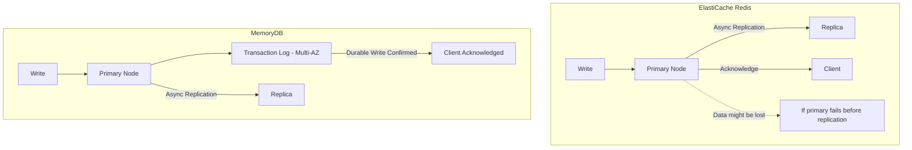

# How to Use Amazon MemoryDB for Redis

Author: [nawazdhandala](https://github.com/nawazdhandala)

Tags: AWS, MemoryDB, Redis, Database, In-Memory

Description: A complete guide to Amazon MemoryDB for Redis, covering setup, configuration, data durability, and when to use it as your primary database instead of just a cache.

---

What if Redis wasn't just a cache but an actual database with full durability guarantees? That's exactly what Amazon MemoryDB for Redis is. It's a Redis-compatible, durable, in-memory database service that gives you Redis performance with the durability of a traditional database. Your data survives node failures, cluster failures, and even AZ outages without losing a single write.

Let's walk through setting it up and understanding when it makes sense over ElastiCache.

## How MemoryDB Differs from ElastiCache

The key difference is durability. ElastiCache Redis uses asynchronous replication - if the primary dies before replicating a write, that write is lost. MemoryDB uses a distributed transaction log that durably stores every write across multiple AZs before acknowledging it to the client.



This means MemoryDB can serve as your **primary database**, not just a cache in front of another database.

## When to Use MemoryDB

MemoryDB makes sense when:

- You're using Redis as a primary data store (not just a cache)
- You need microsecond read latency with full durability
- You want to eliminate a separate database for Redis-backed workloads
- You need strong consistency on reads from the primary
- You're building real-time applications like gaming leaderboards, session stores, or financial systems

MemoryDB doesn't make sense when:

- You're using Redis purely as a cache (ElastiCache is cheaper for this)
- Write latency is critical (MemoryDB writes are slightly slower due to the durable transaction log)
- You need the cheapest possible Redis deployment

## Creating a MemoryDB Cluster

### Via the AWS CLI

First, create a subnet group:

```bash
# Create a subnet group for MemoryDB
aws memorydb create-subnet-group \
  --subnet-group-name my-memorydb-subnets \
  --subnet-ids subnet-abc123 subnet-def456 subnet-ghi789 \
  --description "MemoryDB subnet group"
```

Create an ACL (Access Control List) for authentication:

```bash
# Create a MemoryDB user
aws memorydb create-user \
  --user-name app-user \
  --authentication-mode '{
    "Type": "password",
    "Passwords": ["YourStrongPassword123!"]
  }' \
  --access-string "on ~* +@all"

# Create an ACL and associate the user
aws memorydb create-acl \
  --acl-name my-app-acl \
  --user-names app-user default
```

Now create the cluster:

```bash
# Create a MemoryDB cluster
aws memorydb create-cluster \
  --cluster-name my-memorydb-cluster \
  --node-type db.r6g.large \
  --num-shards 3 \
  --num-replicas-per-shard 1 \
  --acl-name my-app-acl \
  --subnet-group-name my-memorydb-subnets \
  --security-group-ids sg-memorydb123 \
  --tls-enabled \
  --engine-version 7.0 \
  --snapshot-retention-limit 7 \
  --snapshot-window "03:00-04:00" \
  --maintenance-window "sun:05:00-sun:06:00"
```

Wait for the cluster to become available:

```bash
# Check cluster status
aws memorydb describe-clusters \
  --cluster-name my-memorydb-cluster \
  --query 'Clusters[0].{
    Status:Status,
    Endpoint:ClusterEndpoint,
    Shards:NumberOfShards,
    Engine:EngineVersion
  }'
```

### Via Terraform

```hcl
# MemoryDB subnet group
resource "aws_memorydb_subnet_group" "main" {
  name       = "my-memorydb-subnets"
  subnet_ids = var.private_subnet_ids
}

# MemoryDB parameter group
resource "aws_memorydb_parameter_group" "main" {
  name   = "my-memorydb-params"
  family = "memorydb_redis7"

  parameter {
    name  = "maxmemory-policy"
    value = "noeviction"  # Don't evict data - it's a primary database
  }
}

# MemoryDB ACL
resource "aws_memorydb_user" "app" {
  user_name     = "app-user"
  access_string = "on ~* +@all"

  authentication_mode {
    type      = "password"
    passwords = [var.memorydb_password]
  }
}

resource "aws_memorydb_acl" "main" {
  name       = "my-app-acl"
  user_names = [aws_memorydb_user.app.user_name, "default"]
}

# MemoryDB cluster
resource "aws_memorydb_cluster" "main" {
  name                   = "my-memorydb-cluster"
  node_type              = "db.r6g.large"
  num_shards             = 3
  num_replicas_per_shard = 1
  acl_name               = aws_memorydb_acl.main.name
  subnet_group_name      = aws_memorydb_subnet_group.main.name
  security_group_ids     = [aws_security_group.memorydb.id]
  tls_enabled            = true
  engine_version         = "7.0"
  parameter_group_name   = aws_memorydb_parameter_group.main.name

  snapshot_retention_limit = 7
  snapshot_window          = "03:00-04:00"
  maintenance_window       = "sun:05:00-sun:06:00"

  tags = {
    Environment = "production"
  }
}
```

## Connecting to MemoryDB

MemoryDB uses the Redis protocol, so any Redis client works. The main difference is that TLS is always required and you must authenticate.

### Python Connection

```python
import redis

# Connect to MemoryDB (cluster mode is always enabled)
from redis.cluster import RedisCluster

client = RedisCluster(
    host='clustercfg.my-memorydb-cluster.abc123.memorydb.us-east-1.amazonaws.com',
    port=6379,
    username='app-user',
    password='YourStrongPassword123!',
    ssl=True,
    ssl_cert_reqs='required',
    decode_responses=True,
    skip_full_coverage_check=True,
)

# All standard Redis operations work
client.set('user:1001', '{"name": "Alice", "email": "alice@example.com"}')
result = client.get('user:1001')
print(result)

# Durable - this write is guaranteed to survive node failures
client.hset('account:5001', mapping={
    'balance': '10000.00',
    'currency': 'USD',
    'last_updated': '2026-02-12T10:00:00Z'
})
```

### Node.js Connection

```javascript
const Redis = require('ioredis');

// Connect to MemoryDB cluster
const cluster = new Redis.Cluster([
  {
    host: 'clustercfg.my-memorydb-cluster.abc123.memorydb.us-east-1.amazonaws.com',
    port: 6379
  }
], {
  redisOptions: {
    username: 'app-user',
    password: 'YourStrongPassword123!',
    tls: {
      rejectUnauthorized: true
    },
    connectTimeout: 5000,
  },
  scaleReads: 'slave', // Read from replicas for read-heavy workloads
  clusterRetryStrategy: (times) => Math.min(times * 200, 3000),
});

cluster.on('connect', () => console.log('Connected to MemoryDB'));

// Use as a primary database
async function createOrder(orderId, orderData) {
  const key = `order:${orderId}`;
  await cluster.hset(key, orderData);
  // This write is durable - no need for a separate database
}

async function getOrder(orderId) {
  const key = `order:${orderId}`;
  return cluster.hgetall(key);
}
```

## Using MemoryDB as a Primary Database

When using MemoryDB as your primary database instead of a cache, there are a few design patterns to follow.

### Data Modeling

Model your data using Redis data structures:

```python
# User profile as a Hash
client.hset('user:1001', mapping={
    'name': 'Alice Johnson',
    'email': 'alice@example.com',
    'created_at': '2026-01-15',
    'plan': 'premium'
})

# User's orders as a Sorted Set (sorted by timestamp)
client.zadd('user:1001:orders', {
    'order:5001': 1707696000,
    'order:5002': 1707782400,
    'order:5003': 1707868800,
})

# Order details as a Hash
client.hset('order:5001', mapping={
    'user_id': '1001',
    'total': '149.99',
    'status': 'delivered',
    'items': '["SKU-001", "SKU-002"]'
})

# Secondary index for email lookups
client.set('email:alice@example.com', 'user:1001')
```

### Transaction Support

MemoryDB supports Redis transactions (MULTI/EXEC):

```python
# Atomic transfer between accounts
def transfer_funds(from_account, to_account, amount):
    pipe = client.pipeline()
    pipe.hincrbyfloat(f'account:{from_account}', 'balance', -amount)
    pipe.hincrbyfloat(f'account:{to_account}', 'balance', amount)
    pipe.execute()
    # Both operations are atomic and durable
```

### Setting maxmemory-policy to noeviction

When Redis is your primary database, you don't want it silently deleting data:

```bash
# Set noeviction policy - return errors when memory is full instead of deleting data
aws memorydb update-parameter-group \
  --parameter-group-name my-memorydb-params \
  --parameter-name-values "ParameterName=maxmemory-policy,ParameterValue=noeviction"
```

## Scaling MemoryDB

### Adding Shards

```bash
# Scale from 3 to 5 shards
aws memorydb update-cluster \
  --cluster-name my-memorydb-cluster \
  --shard-configuration '{
    "ShardCount": 5
  }'
```

### Changing Node Types

```bash
# Scale to a larger node type
aws memorydb update-cluster \
  --cluster-name my-memorydb-cluster \
  --node-type db.r6g.xlarge
```

### Adding Replicas

```bash
# Add replicas for read scaling
aws memorydb update-cluster \
  --cluster-name my-memorydb-cluster \
  --replica-configuration '{
    "ReplicaCount": 2
  }'
```

## Monitoring MemoryDB

MemoryDB publishes metrics to CloudWatch just like ElastiCache:

```bash
# Check key MemoryDB metrics
aws cloudwatch get-metric-statistics \
  --namespace AWS/MemoryDB \
  --metric-name DatabaseMemoryUsagePercentage \
  --dimensions Name=ClusterName,Value=my-memorydb-cluster \
  --start-time $(date -u -d '6 hours ago' +%Y-%m-%dT%H:%M:%S) \
  --end-time $(date -u +%Y-%m-%dT%H:%M:%S) \
  --period 300 \
  --statistics Average Maximum

# Check primary endpoint latency
aws cloudwatch get-metric-statistics \
  --namespace AWS/MemoryDB \
  --metric-name PrimaryLinkHealthStatus \
  --dimensions Name=ClusterName,Value=my-memorydb-cluster \
  --start-time $(date -u -d '1 hour ago' +%Y-%m-%dT%H:%M:%S) \
  --end-time $(date -u +%Y-%m-%dT%H:%M:%S) \
  --period 60 \
  --statistics Average
```

## Backup and Restore

MemoryDB supports snapshots similar to ElastiCache:

```bash
# Create a manual snapshot
aws memorydb create-snapshot \
  --cluster-name my-memorydb-cluster \
  --snapshot-name my-memorydb-backup-20260212

# Restore from a snapshot
aws memorydb create-cluster \
  --cluster-name my-restored-cluster \
  --node-type db.r6g.large \
  --num-shards 3 \
  --num-replicas-per-shard 1 \
  --snapshot-name my-memorydb-backup-20260212 \
  --acl-name my-app-acl \
  --subnet-group-name my-memorydb-subnets \
  --security-group-ids sg-memorydb123 \
  --tls-enabled
```

## Wrapping Up

MemoryDB for Redis changes the game by making Redis a viable primary database, not just a cache. The durable transaction log means your writes are safe across AZ failures, and you still get microsecond read latency. Use it when you need Redis as a system of record, and stick with ElastiCache when you just need a cache. For a detailed feature and cost comparison, check out the guide on [comparing MemoryDB vs ElastiCache](https://oneuptime.com/blog/post/2026-02-12-compare-memorydb-vs-elasticache/view).
