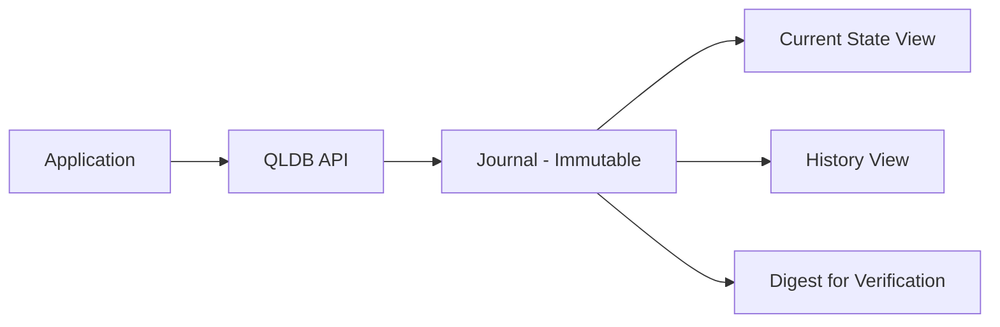

# How to Set Up Amazon QLDB for Immutable Ledger

Author: [nawazdhandala](https://github.com/nawazdhandala)

Tags: AWS, QLDB, Ledger, Database, Blockchain

Description: Learn how to set up and use Amazon QLDB for building immutable, cryptographically verifiable ledger applications with complete data history tracking.

---

There are situations where you need an absolute guarantee that your data history hasn't been tampered with. Financial transactions, supply chain tracking, regulatory compliance records, insurance claims - these all demand a system of record that's immutable and verifiable. Amazon QLDB (Quantum Ledger Database) was designed for exactly this.

QLDB gives you a fully managed ledger database with a built-in, immutable journal. Every change to your data is tracked in a cryptographically verifiable way. You don't need blockchain - QLDB provides the same integrity guarantees with better performance and simpler programming model.

## How QLDB Works

QLDB stores data in a journal, which is an append-only, immutable log. When you insert, update, or delete a record, QLDB writes a new entry to the journal. The previous versions of the record are preserved forever. You can't go back and modify historical entries.

Every journal block is cryptographically hashed and chained to the previous block (similar to a blockchain). This means you can mathematically prove that no one has tampered with the data, not even a database administrator.

The data flow looks like this:



## Creating a Ledger

Setting up a QLDB ledger takes one command.

```bash
# Create a QLDB ledger with standard permissions mode
aws qldb create-ledger \
  --name financial-records \
  --permissions-mode STANDARD \
  --deletion-protection
```

The `STANDARD` permissions mode uses IAM for fine-grained access control. The `deletion-protection` flag prevents accidental deletion - you'd have to explicitly remove this protection before deleting the ledger.

Wait for the ledger to become active.

```bash
# Check ledger status
aws qldb describe-ledger --name financial-records
```

## Connecting and Running PartiQL Queries

QLDB uses PartiQL, which is SQL-compatible with extensions for working with nested and semi-structured data. Here's how to connect from Python.

```python
# Install with: pip install pyqldb amazon.ion
from pyqldb.driver.qldb_driver import QldbDriver

# Create a driver instance - handles connection pooling automatically
driver = QldbDriver(ledger_name='financial-records', region_name='us-east-1')

def execute_query(transaction, query, *params):
    """Helper to execute a PartiQL query within a transaction"""
    cursor = transaction.execute_statement(query, *params)
    return list(cursor)
```

## Creating Tables and Indexes

QLDB tables don't have a fixed schema - they store Amazon Ion documents (a superset of JSON). But you should still create indexes for query performance.

```python
# Create tables for a financial ledger application
def create_tables(transaction):
    transaction.execute_statement("CREATE TABLE Accounts")
    transaction.execute_statement("CREATE TABLE Transactions")
    transaction.execute_statement("CREATE TABLE AuditLog")

driver.execute_lambda(create_tables)

# Create indexes on fields you'll query frequently
def create_indexes(transaction):
    # Indexes are required for efficient lookups
    transaction.execute_statement("CREATE INDEX ON Accounts (accountId)")
    transaction.execute_statement("CREATE INDEX ON Accounts (email)")
    transaction.execute_statement("CREATE INDEX ON Transactions (transactionId)")
    transaction.execute_statement("CREATE INDEX ON Transactions (accountId)")

driver.execute_lambda(create_indexes)
```

Important: QLDB requires an indexed lookup in the WHERE clause for any table scan to be efficient. Without an index, queries will scan the entire table.

## Inserting Data

```python
# Insert account records
def create_account(transaction, account):
    transaction.execute_statement(
        "INSERT INTO Accounts ?",
        account
    )

# Create some sample accounts
driver.execute_lambda(
    lambda tx: create_account(tx, {
        'accountId': 'ACC-001',
        'name': 'Alice Johnson',
        'email': 'alice@example.com',
        'balance': 10000.00,
        'currency': 'USD',
        'status': 'ACTIVE',
        'openedDate': '2026-01-15'
    })
)

driver.execute_lambda(
    lambda tx: create_account(tx, {
        'accountId': 'ACC-002',
        'name': 'Bob Smith',
        'email': 'bob@example.com',
        'balance': 5000.00,
        'currency': 'USD',
        'status': 'ACTIVE',
        'openedDate': '2026-01-20'
    })
)
```

## Updating Data

When you update a record in QLDB, the old version is preserved in the journal. You only see the current state by default, but the complete history is always available.

```python
# Transfer funds between accounts - both updates happen atomically
def transfer_funds(transaction, from_account, to_account, amount):
    # Check the sender has enough balance
    result = list(transaction.execute_statement(
        "SELECT balance FROM Accounts WHERE accountId = ?", from_account
    ))

    if not result:
        raise Exception(f"Account {from_account} not found")

    current_balance = result[0]['balance']
    if current_balance < amount:
        raise Exception(f"Insufficient funds: {current_balance} < {amount}")

    # Debit the sender
    transaction.execute_statement(
        "UPDATE Accounts SET balance = balance - ? WHERE accountId = ?",
        amount, from_account
    )

    # Credit the receiver
    transaction.execute_statement(
        "UPDATE Accounts SET balance = balance + ? WHERE accountId = ?",
        amount, to_account
    )

    # Record the transaction
    transaction.execute_statement(
        "INSERT INTO Transactions ?",
        {
            'transactionId': f'TXN-{int(time.time())}',
            'fromAccount': from_account,
            'toAccount': to_account,
            'amount': amount,
            'currency': 'USD',
            'timestamp': datetime.now().isoformat()
        }
    )

# Execute the transfer
import time
from datetime import datetime
driver.execute_lambda(
    lambda tx: transfer_funds(tx, 'ACC-001', 'ACC-002', 500.00)
)
```

## Querying Document History

This is where QLDB really shines. You can query the complete history of any document.

```python
# Get the full history of an account - every version ever recorded
def get_account_history(transaction, account_id):
    results = transaction.execute_statement(
        "SELECT * FROM history(Accounts) WHERE data.accountId = ?",
        account_id
    )
    return list(results)

history = driver.execute_lambda(
    lambda tx: get_account_history(tx, 'ACC-001')
)

for revision in history:
    print(f"Version: {revision['version']}")
    print(f"  Balance: {revision['data']['balance']}")
    print(f"  Modified: {revision['metadata']['txTime']}")
    print()
```

Each history record includes metadata about when it was modified, the transaction ID, and the version number.

## Cryptographic Verification

QLDB lets you prove that a specific document revision exists in the ledger and hasn't been altered.

```python
import boto3

qldb_client = boto3.client('qldb', region_name='us-east-1')

# Get the current digest - a cryptographic hash of the entire journal
digest_response = qldb_client.get_digest(Name='financial-records')
digest = digest_response['Digest']
digest_tip = digest_response['DigestTipAddress']

print(f"Digest: {digest.hex()}")

# To verify a specific revision, you need its document ID and block address
# These come from the metadata when you query the document
def get_document_id(transaction, account_id):
    results = transaction.execute_statement(
        "SELECT r.metadata.id, r.blockAddress FROM _ql_committed_Accounts r WHERE r.data.accountId = ?",
        account_id
    )
    return list(results)

doc_info = driver.execute_lambda(
    lambda tx: get_document_id(tx, 'ACC-001')
)
```

The verification process uses Merkle tree proofs. You can verify independently that a specific document revision is part of the ledger without needing to trust the database service itself.

## Streaming Data to Other Services

QLDB supports streaming journal data to Kinesis Data Streams, which lets you react to changes in real time.

```bash
# Create a Kinesis stream for QLDB journal data
aws kinesis create-stream \
  --stream-name qldb-financial-stream \
  --shard-count 2

# Create a QLDB journal stream
aws qldb stream-journal-to-kinesis \
  --ledger-name financial-records \
  --role-arn arn:aws:iam::123456789:role/QLDBStreamRole \
  --inclusive-start-time 2026-01-01T00:00:00Z \
  --kinesis-configuration '{
    "StreamArn": "arn:aws:kinesis:us-east-1:123456789:stream/qldb-financial-stream",
    "AggregationEnabled": true
  }' \
  --stream-name financial-records-stream
```

You can then process these events with Lambda, build materialized views in DynamoDB, or feed them into analytics systems.

## Best Practices

Keep these things in mind when working with QLDB:

**Always create indexes before querying.** Without indexes, every query scans the full table. QLDB supports up to 5 indexes per table.

**Design for immutability.** Since you can't delete history, be careful about what you store. Don't put PII that's subject to "right to be forgotten" regulations unless you have a clear strategy for handling it.

**Use document versioning in your application.** QLDB tracks versions automatically, but your application should understand that the current state might change between reads and writes. Use optimistic concurrency control (OCC) - QLDB's transactions handle this automatically.

**Monitor with CloudWatch.** Watch for `CommandLatency`, `OccConflictExceptions` (indicates contention), and `JournalStorage` metrics.

## Wrapping Up

QLDB fills a specific niche - when you need provable data integrity with a complete, immutable audit trail. It's not a general-purpose database, and you shouldn't use it as one. But for financial ledgers, compliance records, and any scenario where "who changed what and when" needs to be cryptographically verifiable, it's an excellent fit. The PartiQL query language keeps things familiar, and the managed nature means you don't have to run your own blockchain infrastructure.
