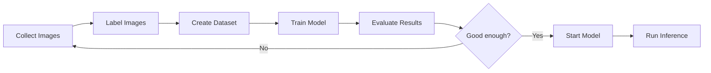

# How to Use Amazon Rekognition Custom Labels

Author: [nawazdhandala](https://github.com/nawazdhandala)

Tags: AWS, Amazon Rekognition, Custom Labels, Computer Vision, Machine Learning

Description: Train custom image classification and object detection models with Amazon Rekognition Custom Labels without any machine learning expertise.

---

The built-in Rekognition features are great for generic detection - finding cars, people, text, and common objects. But what if you need to identify specific product defects on a manufacturing line? Or distinguish between your company's different product models? Or classify medical images? That's where Rekognition Custom Labels comes in.

Custom Labels lets you train your own computer vision models by uploading labeled images. You don't need any ML expertise - Rekognition handles the model architecture, training, and optimization. You just provide images and labels. The resulting model can do image classification (what is this?) or object detection (where is this in the image?).

## The Custom Labels Workflow

The process follows a straightforward pattern:



## Preparing Your Image Dataset

Good training data is the single biggest factor in model quality. Here are the guidelines:

- Minimum 10 images per label, but aim for at least 50-100
- Images should represent the real conditions your model will encounter
- Include variations in lighting, angle, and background
- Balance your dataset - similar numbers of images per label
- Use JPEG or PNG format

For object detection, you'll also need bounding box annotations showing where objects are in each image.

## Creating a Project and Dataset

Start by creating a project and uploading your dataset.

```python
import boto3
import json
import time

rekognition = boto3.client('rekognition', region_name='us-east-1')

# Create a project
project_response = rekognition.create_project(
    ProjectName='product-quality-inspection'
)
project_arn = project_response['ProjectArn']
print(f"Project created: {project_arn}")
```

## Labeling with a Manifest File

Rekognition Custom Labels uses SageMaker Ground Truth manifest format. Each line in the manifest describes one image and its labels.

For image classification, the manifest looks like this.

```python
import json

def create_classification_manifest(labeled_images, output_file):
    """Create a manifest file for image classification.

    Args:
        labeled_images: List of dicts with 's3_uri' and 'label' keys
        output_file: Path to write the manifest
    """
    with open(output_file, 'w') as f:
        for item in labeled_images:
            manifest_line = {
                "source-ref": item['s3_uri'],
                "quality-label": item['label'],
                "quality-label-metadata": {
                    "confidence": 1,
                    "job-name": "manual-labeling",
                    "class-name": item['label'],
                    "human-annotated": "yes",
                    "creation-date": "2026-02-12T00:00:00",
                    "type": "groundtruth/image-classification"
                }
            }
            f.write(json.dumps(manifest_line) + '\n')

    print(f"Created manifest with {len(labeled_images)} entries")

# Create a manifest for product quality inspection
images = [
    {"s3_uri": "s3://training-data/products/good/img001.jpg", "label": "good"},
    {"s3_uri": "s3://training-data/products/good/img002.jpg", "label": "good"},
    {"s3_uri": "s3://training-data/products/defective/img001.jpg", "label": "defective"},
    {"s3_uri": "s3://training-data/products/defective/img002.jpg", "label": "defective"},
    # ... add more images
]

create_classification_manifest(images, 'training_manifest.jsonl')
```

For object detection with bounding boxes, the manifest includes coordinate data.

```python
def create_detection_manifest(annotated_images, output_file):
    """Create a manifest file for object detection with bounding boxes.

    Args:
        annotated_images: List of dicts with 's3_uri', 'image_size',
                         and 'annotations' (list of bounding boxes with labels)
    """
    with open(output_file, 'w') as f:
        for item in annotated_images:
            annotations = []
            for ann in item['annotations']:
                annotations.append({
                    "class_id": ann['class_id'],
                    "top": ann['top'],
                    "left": ann['left'],
                    "width": ann['width'],
                    "height": ann['height']
                })

            # Map class IDs to names
            class_map = {str(k): v for k, v in item.get('class_map', {}).items()}

            manifest_line = {
                "source-ref": item['s3_uri'],
                "bounding-box": {
                    "image_size": [item['image_size']],
                    "annotations": annotations
                },
                "bounding-box-metadata": {
                    "objects": [{"confidence": 1} for _ in annotations],
                    "class-map": class_map,
                    "type": "groundtruth/object-detection",
                    "human-annotated": "yes",
                    "creation-date": "2026-02-12T00:00:00",
                    "job-name": "manual-annotation"
                }
            }
            f.write(json.dumps(manifest_line) + '\n')

    print(f"Created detection manifest with {len(annotated_images)} entries")
```

## Creating the Dataset and Training

Upload your manifest to S3 and create the dataset.

```python
s3 = boto3.client('s3', region_name='us-east-1')

# Upload manifest
s3.upload_file(
    'training_manifest.jsonl',
    'training-data',
    'manifests/training.manifest'
)

# Create a dataset version with the manifest
dataset_response = rekognition.create_dataset(
    ProjectArn=project_arn,
    DatasetType='TRAIN',
    DatasetSource={
        'GroundTruthManifest': {
            'S3Object': {
                'Bucket': 'training-data',
                'Name': 'manifests/training.manifest'
            }
        }
    }
)

dataset_arn = dataset_response['DatasetArn']
print(f"Dataset created: {dataset_arn}")

# Also create a test dataset (Rekognition can auto-split if you prefer)
test_dataset_response = rekognition.create_dataset(
    ProjectArn=project_arn,
    DatasetType='TEST',
    DatasetSource={
        'GroundTruthManifest': {
            'S3Object': {
                'Bucket': 'training-data',
                'Name': 'manifests/test.manifest'
            }
        }
    }
)
```

Now train the model.

```python
# Start model training
training_response = rekognition.create_project_version(
    ProjectArn=project_arn,
    VersionName='v1',
    OutputConfig={
        'S3Bucket': 'training-data',
        'S3KeyPrefix': 'model-output/v1/'
    }
)

model_arn = training_response['ProjectVersionArn']
print(f"Training started: {model_arn}")

# Monitor training
def wait_for_training(model_arn):
    while True:
        response = rekognition.describe_project_versions(
            ProjectArn=project_arn,
            VersionNames=['v1']
        )
        version = response['ProjectVersionDescriptions'][0]
        status = version['Status']
        print(f"Status: {status}")

        if status == 'TRAINING_COMPLETED':
            # Show evaluation results
            eval_result = version.get('EvaluationResult', {})
            summary = eval_result.get('Summary', {})
            print(f"\nTraining complete!")
            print(f"F1 Score: {summary.get('F1Score', 'N/A')}")
            print(f"Precision: {summary.get('Precision', 'N/A')}")
            print(f"Recall: {summary.get('Recall', 'N/A')}")
            return version

        elif status == 'TRAINING_FAILED':
            print(f"Training failed: {version.get('StatusMessage', '')}")
            return version

        time.sleep(120)  # Check every 2 minutes

wait_for_training(model_arn)
```

## Starting and Using the Model

Custom Labels models need to be started before you can run inference. They run on dedicated compute resources.

```python
# Start the model with minimum inference units
rekognition.start_project_version(
    ProjectVersionArn=model_arn,
    MinInferenceUnits=1
)

# Wait for the model to start
while True:
    response = rekognition.describe_project_versions(
        ProjectArn=project_arn,
        VersionNames=['v1']
    )
    status = response['ProjectVersionDescriptions'][0]['Status']
    if status == 'RUNNING':
        print("Model is running!")
        break
    print(f"Starting... ({status})")
    time.sleep(30)

# Run inference on a new image
def classify_image(bucket, key, model_arn, min_confidence=70):
    """Classify an image using the custom model."""
    response = rekognition.detect_custom_labels(
        ProjectVersionArn=model_arn,
        Image={'S3Object': {'Bucket': bucket, 'Name': key}},
        MinConfidence=min_confidence
    )

    labels = response['CustomLabels']
    for label in labels:
        print(f"  {label['Name']}: {label['Confidence']:.1f}%")
        if 'Geometry' in label:
            box = label['Geometry']['BoundingBox']
            print(f"    Location: ({box['Left']:.2f}, {box['Top']:.2f}) "
                  f"Size: {box['Width']:.2f}x{box['Height']:.2f}")

    return labels

# Classify a product image
classify_image('production-images', 'inspection/item-001.jpg', model_arn)
```

## Cost Management

Custom Labels models charge per hour while running. Stop them when not in use.

```python
def stop_model(model_arn):
    """Stop the model to avoid ongoing charges."""
    rekognition.stop_project_version(ProjectVersionArn=model_arn)
    print("Model stopping...")

# Stop the model when you're done
stop_model(model_arn)
```

## Integration with Lambda

Here's a Lambda function that uses your custom model to inspect images uploaded to S3.

```python
def lambda_handler(event, context):
    """Inspect uploaded product images using Custom Labels."""
    rekognition = boto3.client('rekognition')
    model_arn = os.environ['CUSTOM_MODEL_ARN']

    for record in event['Records']:
        bucket = record['s3']['bucket']['name']
        key = record['s3']['object']['key']

        response = rekognition.detect_custom_labels(
            ProjectVersionArn=model_arn,
            Image={'S3Object': {'Bucket': bucket, 'Name': key}},
            MinConfidence=80
        )

        labels = {l['Name']: l['Confidence'] for l in response['CustomLabels']}

        if 'defective' in labels:
            # Flag the item for review
            print(f"DEFECT DETECTED in {key} "
                  f"(confidence: {labels['defective']:.1f}%)")
            # Send alert, move to quarantine, etc.
        else:
            print(f"Item {key} passed inspection")
```

Custom Labels makes computer vision accessible for domain-specific problems. The biggest investment is in labeling quality training data - everything else is handled by the service. If you also need general image analysis features like text detection and content moderation, see our guide on [Amazon Rekognition for image analysis](https://oneuptime.com/blog/post/amazon-rekognition-image-analysis/view).
