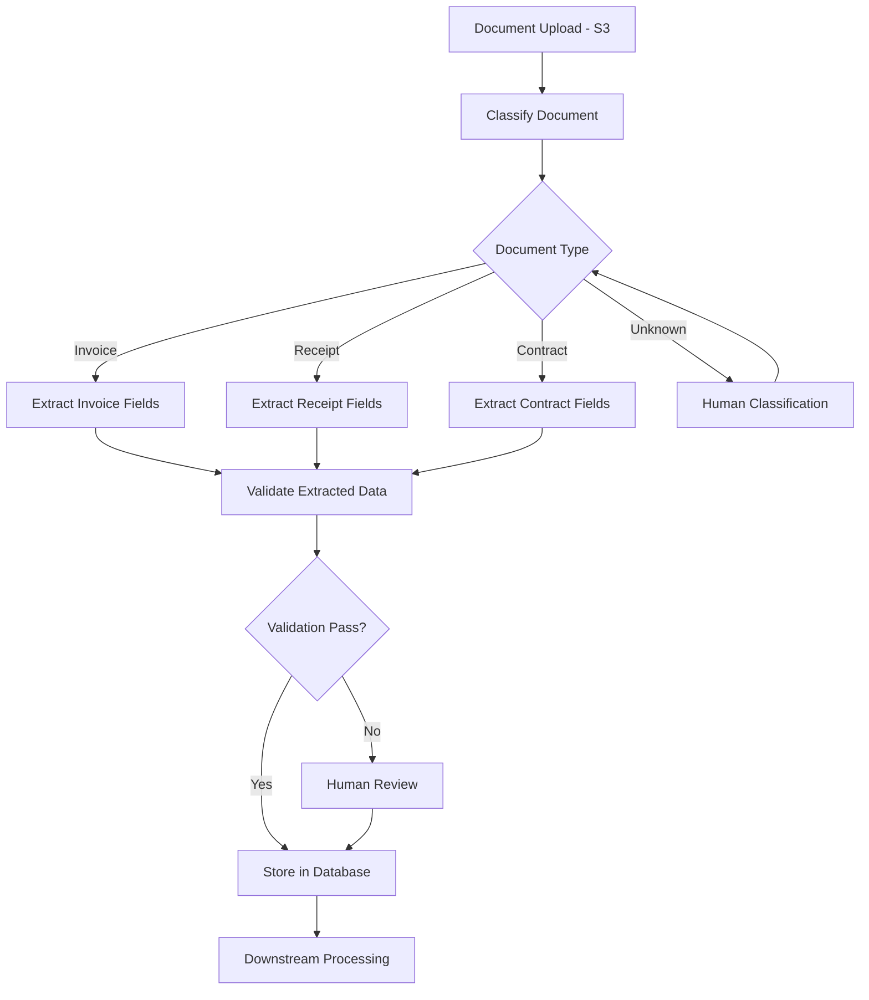

# How to Use Amazon Textract with Intelligent Document Processing

Author: [nawazdhandala](https://github.com/nawazdhandala)

Tags: AWS, Amazon Textract, Intelligent Document Processing, Automation

Description: Build end-to-end intelligent document processing workflows combining Amazon Textract with classification, validation, and human review pipelines.

---

Extracting text from documents is just the first step. A real intelligent document processing (IDP) pipeline does much more: it classifies incoming documents, routes them to the right extraction logic, validates the extracted data, handles exceptions, and feeds results into your business systems. This is where you go from "cool demo" to "production system that saves the business thousands of hours."

Amazon Textract forms the extraction core, but a complete IDP solution combines it with services like Comprehend for classification, Lambda for orchestration, Step Functions for workflow management, and human review for handling edge cases.

## The IDP Pipeline Architecture

Here's what a production IDP pipeline looks like.



## Document Classification

Before you can extract data, you need to know what kind of document you're looking at. You can use Comprehend Custom Classification or a simpler rule-based approach.

```python
import boto3
import json

textract = boto3.client('textract', region_name='us-east-1')
comprehend = boto3.client('comprehend', region_name='us-east-1')

def classify_document(bucket, key):
    """Classify a document by extracting text and analyzing it."""
    # Quick text extraction for classification
    response = textract.detect_document_text(
        Document={'S3Object': {'Bucket': bucket, 'Name': key}}
    )

    # Collect all text
    text = ' '.join(
        block['Text'] for block in response['Blocks']
        if block['BlockType'] == 'LINE'
    )

    # Simple keyword-based classification
    # For production, use Comprehend Custom Classification
    text_lower = text.lower()

    classification_rules = {
        'invoice': ['invoice', 'bill to', 'invoice number', 'payment due'],
        'receipt': ['receipt', 'total', 'subtotal', 'tax', 'payment received'],
        'contract': ['agreement', 'hereby', 'parties', 'terms and conditions'],
        'id_document': ['driver license', 'passport', 'date of birth', 'identification'],
        'tax_form': ['w-2', 'w-4', '1099', 'tax return', 'internal revenue']
    }

    scores = {}
    for doc_type, keywords in classification_rules.items():
        score = sum(1 for kw in keywords if kw in text_lower)
        if score > 0:
            scores[doc_type] = score

    if scores:
        best_type = max(scores, key=scores.get)
        confidence = scores[best_type] / len(classification_rules[best_type])
        return best_type, confidence, text
    else:
        return 'unknown', 0, text

doc_type, confidence, text = classify_document('incoming-docs', 'scan-001.pdf')
print(f"Document type: {doc_type} (confidence: {confidence:.0%})")
```

## Type-Specific Extraction

Different document types need different extraction strategies.

```python
class DocumentExtractor:
    """Route documents to type-specific extraction logic."""

    def __init__(self):
        self.textract = boto3.client('textract', region_name='us-east-1')

    def extract(self, bucket, key, doc_type):
        """Extract data based on document type."""
        extractors = {
            'invoice': self._extract_invoice,
            'receipt': self._extract_receipt,
            'id_document': self._extract_id,
            'contract': self._extract_contract
        }

        extractor = extractors.get(doc_type, self._extract_generic)
        return extractor(bucket, key)

    def _extract_invoice(self, bucket, key):
        """Extract structured data from an invoice."""
        response = self.textract.analyze_expense(
            Document={'S3Object': {'Bucket': bucket, 'Name': key}}
        )

        result = {
            'type': 'invoice',
            'vendor': None,
            'invoice_number': None,
            'date': None,
            'total': None,
            'line_items': []
        }

        for doc in response['ExpenseDocuments']:
            for field in doc.get('SummaryFields', []):
                field_type = field.get('Type', {}).get('Text', '')
                value = field.get('ValueDetection', {}).get('Text', '')

                if field_type == 'VENDOR_NAME':
                    result['vendor'] = value
                elif field_type == 'INVOICE_RECEIPT_ID':
                    result['invoice_number'] = value
                elif field_type == 'INVOICE_RECEIPT_DATE':
                    result['date'] = value
                elif field_type == 'TOTAL':
                    result['total'] = value

            for group in doc.get('LineItemGroups', []):
                for item in group.get('LineItems', []):
                    line = {}
                    for field in item.get('LineItemExpenseFields', []):
                        ft = field.get('Type', {}).get('Text', '')
                        fv = field.get('ValueDetection', {}).get('Text', '')
                        line[ft] = fv
                    result['line_items'].append(line)

        return result

    def _extract_receipt(self, bucket, key):
        """Extract data from a receipt."""
        # Similar to invoice but with receipt-specific fields
        response = self.textract.analyze_expense(
            Document={'S3Object': {'Bucket': bucket, 'Name': key}}
        )

        result = {
            'type': 'receipt',
            'merchant': None,
            'date': None,
            'subtotal': None,
            'tax': None,
            'total': None,
            'items': []
        }

        for doc in response['ExpenseDocuments']:
            for field in doc.get('SummaryFields', []):
                ft = field.get('Type', {}).get('Text', '')
                fv = field.get('ValueDetection', {}).get('Text', '')

                mapping = {
                    'VENDOR_NAME': 'merchant',
                    'INVOICE_RECEIPT_DATE': 'date',
                    'SUBTOTAL': 'subtotal',
                    'TAX': 'tax',
                    'TOTAL': 'total'
                }
                if ft in mapping:
                    result[mapping[ft]] = fv

        return result

    def _extract_id(self, bucket, key):
        """Extract data from an identity document."""
        response = self.textract.analyze_id(
            DocumentPages=[
                {'S3Object': {'Bucket': bucket, 'Name': key}}
            ]
        )

        result = {'type': 'id_document'}
        for doc in response['IdentityDocuments']:
            for field in doc['IdentityDocumentFields']:
                field_type = field['Type']['Text']
                value = field['ValueDetection']['Text']
                confidence = field['ValueDetection']['Confidence']
                result[field_type] = {
                    'value': value,
                    'confidence': confidence
                }

        return result

    def _extract_contract(self, bucket, key):
        """Extract text and key terms from a contract."""
        response = self.textract.analyze_document(
            Document={'S3Object': {'Bucket': bucket, 'Name': key}},
            FeatureTypes=['FORMS']
        )

        blocks = {b['Id']: b for b in response['Blocks']}
        result = {
            'type': 'contract',
            'full_text': '',
            'key_terms': {}
        }

        lines = []
        for block in response['Blocks']:
            if block['BlockType'] == 'LINE':
                lines.append(block['Text'])

        result['full_text'] = '\n'.join(lines)
        return result

    def _extract_generic(self, bucket, key):
        """Fallback extraction for unknown document types."""
        response = self.textract.analyze_document(
            Document={'S3Object': {'Bucket': bucket, 'Name': key}},
            FeatureTypes=['TABLES', 'FORMS']
        )

        lines = [b['Text'] for b in response['Blocks'] if b['BlockType'] == 'LINE']
        return {'type': 'generic', 'text': '\n'.join(lines)}
```

## Data Validation

Extracted data needs validation before it enters your systems. Build validation rules for each document type.

```python
import re
from datetime import datetime

class DataValidator:
    """Validate extracted document data."""

    def validate(self, extracted_data):
        """Run type-specific validation."""
        doc_type = extracted_data.get('type', 'unknown')

        validators = {
            'invoice': self._validate_invoice,
            'receipt': self._validate_receipt,
            'id_document': self._validate_id
        }

        validator = validators.get(doc_type)
        if not validator:
            return True, []

        return validator(extracted_data)

    def _validate_invoice(self, data):
        """Validate invoice extraction results."""
        errors = []

        if not data.get('invoice_number'):
            errors.append('Missing invoice number')

        if not data.get('vendor'):
            errors.append('Missing vendor name')

        if data.get('total'):
            # Check that total looks like a monetary value
            total = data['total'].replace('$', '').replace(',', '').strip()
            try:
                float(total)
            except ValueError:
                errors.append(f"Invalid total amount: {data['total']}")

        if data.get('date'):
            if not self._is_valid_date(data['date']):
                errors.append(f"Invalid date format: {data['date']}")

        if not data.get('line_items'):
            errors.append('No line items found')

        return len(errors) == 0, errors

    def _validate_receipt(self, data):
        """Validate receipt extraction results."""
        errors = []

        if not data.get('total'):
            errors.append('Missing total amount')

        if not data.get('merchant'):
            errors.append('Missing merchant name')

        return len(errors) == 0, errors

    def _validate_id(self, data):
        """Validate ID document extraction."""
        errors = []
        required_fields = ['FIRST_NAME', 'LAST_NAME', 'DATE_OF_BIRTH']

        for field in required_fields:
            if field not in data:
                errors.append(f'Missing field: {field}')
            elif data[field].get('confidence', 0) < 80:
                errors.append(f'Low confidence for {field}: {data[field]["confidence"]:.1f}%')

        return len(errors) == 0, errors

    def _is_valid_date(self, date_str):
        """Check if a string looks like a valid date."""
        patterns = [
            '%m/%d/%Y', '%Y-%m-%d', '%d-%m-%Y',
            '%B %d, %Y', '%m/%d/%y'
        ]
        for pattern in patterns:
            try:
                datetime.strptime(date_str, pattern)
                return True
            except ValueError:
                continue
        return False
```

## The Complete Pipeline

Tie everything together into a Lambda-based pipeline triggered by S3 uploads.

```python
def lambda_handler(event, context):
    """Process documents uploaded to S3."""
    bucket = event['Records'][0]['s3']['bucket']['name']
    key = event['Records'][0]['s3']['object']['key']

    # Step 1: Classify
    doc_type, confidence, _ = classify_document(bucket, key)
    print(f"Classified as: {doc_type} ({confidence:.0%})")

    if doc_type == 'unknown' or confidence < 0.5:
        # Route to human classification
        send_to_human_review(bucket, key, 'classification')
        return {'status': 'sent_to_review'}

    # Step 2: Extract
    extractor = DocumentExtractor()
    extracted = extractor.extract(bucket, key, doc_type)

    # Step 3: Validate
    validator = DataValidator()
    is_valid, errors = validator.validate(extracted)

    if not is_valid:
        print(f"Validation errors: {errors}")
        send_to_human_review(bucket, key, 'validation', errors=errors)
        return {'status': 'validation_failed', 'errors': errors}

    # Step 4: Store results
    store_results(bucket, key, extracted)
    return {'status': 'success', 'data': extracted}

def send_to_human_review(bucket, key, reason, errors=None):
    """Queue a document for human review."""
    sqs = boto3.client('sqs')
    sqs.send_message(
        QueueUrl='https://sqs.us-east-1.amazonaws.com/123456789012/document-review',
        MessageBody=json.dumps({
            'bucket': bucket,
            'key': key,
            'reason': reason,
            'errors': errors or []
        })
    )
```

Building an IDP pipeline is an iterative process. Start with your most common document types, measure extraction accuracy, and gradually expand coverage. The human review loop is essential early on - it catches errors and generates training data for improving your classifiers. For more on the extraction layer, see our guides on [Textract document processing](https://oneuptime.com/blog/post/2026-02-12-amazon-textract-document-processing/view) and [extracting tables and forms](https://oneuptime.com/blog/post/2026-02-12-extract-tables-forms-amazon-textract/view).
