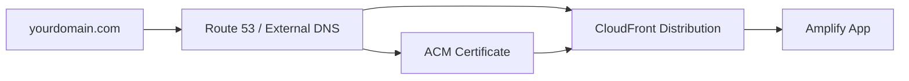

# How to Set Up Amplify with Custom Domains

Author: [nawazdhandala](https://github.com/nawazdhandala)

Tags: AWS, Amplify, DNS, Custom Domains

Description: Step-by-step guide to connecting a custom domain to your AWS Amplify app, including subdomains, SSL certificates, and DNS configuration.

---

You've built something great with Amplify and it's running at some auto-generated URL like `https://main.d1234abcdef.amplifyapp.com`. That's fine for development, but you probably don't want to share that with users. Setting up a custom domain gives your app a professional address and builds trust with your audience.

Amplify makes this process relatively painless, but there are a few gotchas depending on where your domain is registered. Let's walk through the whole process.

## Prerequisites

Before you start, make sure you have:

- An Amplify app deployed and running
- A domain name registered (through Route 53, GoDaddy, Namecheap, or any registrar)
- Access to your domain's DNS settings

## Setting Up the Domain in Amplify Console

Head to the Amplify Console and select your app. In the left sidebar, click on "Hosting" then "Custom domains."

Click "Add domain" and enter your domain name. Amplify will check if it's managed by Route 53. If it is, the process is almost automatic.

Here's what Amplify sets up behind the scenes:



Amplify creates a CloudFront distribution and provisions an SSL certificate through AWS Certificate Manager (ACM). It then updates your DNS records to point to CloudFront.

## Configuring Subdomains

By default, Amplify maps your branches to subdomains. You get to choose which branch maps to which domain:

| Branch | Domain |
|--------|--------|
| main | yourdomain.com |
| main | www.yourdomain.com |
| dev | dev.yourdomain.com |
| staging | staging.yourdomain.com |

You configure this mapping in the "Subdomains" section. A typical setup looks like this:

```
Root domain (yourdomain.com)       -> main branch
www subdomain (www.yourdomain.com) -> main branch (redirect to root)
dev subdomain (dev.yourdomain.com) -> develop branch
```

## DNS Configuration for Route 53

If your domain is in Route 53, Amplify handles everything automatically. It creates the necessary CNAME records and the alias record for the root domain.

After you add the domain, Amplify creates these records:

```
# Amplify creates these DNS records automatically in Route 53
Type: CNAME
Name: _c3e2d7e8a9.yourdomain.com
Value: _a1b2c3d4e5.acm-validations.aws  # For SSL validation

Type: ALIAS
Name: yourdomain.com
Value: d1234abcdef.cloudfront.net  # Points to CloudFront

Type: CNAME
Name: www.yourdomain.com
Value: d1234abcdef.cloudfront.net
```

## DNS Configuration for External Registrars

If your domain is with GoDaddy, Namecheap, Cloudflare, or another provider, you'll need to add the DNS records manually.

Amplify shows you the exact records to add. Here's what they typically look like:

```
# Step 1: Add the CNAME for SSL certificate validation
Type: CNAME
Host: _c3e2d7e8a9
Value: _a1b2c3d4e5.acm-validations.aws

# Step 2: Add the CNAME for your subdomain
Type: CNAME
Host: www
Value: d1234abcdef.cloudfront.net

# Step 3: For the root domain, add an ANAME/ALIAS record
# Note: Not all registrars support ANAME/ALIAS records
Type: ANAME or ALIAS
Host: @
Value: d1234abcdef.cloudfront.net
```

Here's the tricky part: some DNS providers don't support ANAME or ALIAS records for the root domain. If that's your situation, you have a few options:

1. **Transfer to Route 53** - this is the cleanest solution
2. **Use a provider that supports ALIAS records** - Cloudflare does, for example
3. **Use a www redirect** - point the root domain to www using your registrar's redirect feature

## SSL Certificate Provisioning

Amplify uses ACM to provision a free SSL certificate. The certificate validation happens through DNS. After you add the CNAME validation record, it typically takes 10-30 minutes for the certificate to validate.

You can check the status in the Amplify Console. It goes through these stages:

```
Pending validation -> Requesting certificate -> Available
```

If validation gets stuck, double-check that:

- The CNAME record is correctly added to your DNS
- There are no typos in the record name or value
- You haven't accidentally added the full domain in the host field (some providers auto-append the domain)

## Handling WWW Redirects

Most sites want `www.yourdomain.com` to redirect to `yourdomain.com` (or vice versa). Amplify handles this automatically.

In the subdomain configuration, set up your redirect:

```
yourdomain.com       -> main branch (primary)
www.yourdomain.com   -> redirects to yourdomain.com
```

Amplify sets up a 301 redirect so that `www.yourdomain.com/any-path` correctly redirects to `yourdomain.com/any-path`.

## Branch-Based Preview URLs

One of Amplify's nice features is automatic preview environments for branches. You can set up pattern-based subdomains:

```
Pattern: pr-*
Domain: pr-*.yourdomain.com
```

This means when you push a branch called `pr-42`, it's automatically available at `pr-42.yourdomain.com`. This is incredibly useful for PR reviews.

To enable this, go to the "Previews" section in Amplify Console and enable previews for your repository. You can configure which branches get preview URLs:

```bash
# In your amplify.yml or through the console
# Enable previews for pull request branches
previews:
  pullRequestPreviewsEnabled: true
  pullRequestEnvironment:
    stage: PULL_REQUEST
    framework: null
```

## Custom Headers and Redirects

While you're configuring your domain, you might also want to set up redirects for common patterns. Amplify supports custom redirect rules:

```json
[
  {
    "source": "/old-page",
    "target": "/new-page",
    "status": "301",
    "condition": null
  },
  {
    "source": "/api/<*>",
    "target": "https://api.yourdomain.com/<*>",
    "status": "200",
    "condition": null
  },
  {
    "source": "/<*>",
    "target": "/index.html",
    "status": "200",
    "condition": null
  }
]
```

The last rule is essential for single-page applications. It ensures that all routes are handled by your app's router instead of returning 404s.

## Troubleshooting Common Issues

### Domain Shows "Pending Verification"

This usually means the CNAME validation record hasn't propagated yet. DNS propagation can take anywhere from a few minutes to 48 hours, though it's usually under an hour. Use a tool like `dig` to check:

```bash
# Check if your CNAME record has propagated
dig _c3e2d7e8a9.yourdomain.com CNAME

# You should see the ACM validation value in the response
```

### SSL Certificate Won't Validate

If the certificate has been pending for more than an hour, verify the CNAME record is correct. A common mistake is including the domain name in the host field. For example, if your domain is `example.com`, the host should be `_c3e2d7e8a9` not `_c3e2d7e8a9.example.com` (some providers auto-append the domain).

### Root Domain Returns 404

This happens when your DNS provider doesn't support ALIAS records. The root domain (without www) requires an ALIAS or ANAME record. If your provider doesn't support it, consider using Route 53 for DNS or redirecting the root to www.

### Slow Initial Load After Domain Change

After configuring a custom domain, CloudFront needs to cache your content at edge locations. The first few requests might be slower than usual. This resolves itself as CloudFront populates its cache.

## Monitoring Domain Health

Once your custom domain is live, keep an eye on SSL certificate expiration and DNS resolution. Amplify renews ACM certificates automatically, but DNS misconfigurations can cause outages. Consider setting up uptime monitoring through [OneUptime](https://oneuptime.com/blog/post/2026-02-06-aws-cloudwatch-logs-exporter-opentelemetry-collector/view) to get alerts if your domain becomes unreachable.

## Wrapping Up

Setting up a custom domain with Amplify is straightforward if your domain is on Route 53, and only slightly more involved for external registrars. The key steps are adding the domain in the Amplify Console, configuring DNS records, and waiting for SSL validation. Branch-based subdomains for preview environments are a bonus that makes your team's workflow smoother. Take the time to set up proper redirects and monitoring from day one, and you won't have to scramble later.
