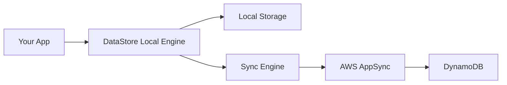

# How to Use Amplify DataStore for Offline-First Apps

Author: [nawazdhandala](https://github.com/nawazdhandala)

Tags: AWS, Amplify, DataStore, Offline-First, Mobile

Description: Learn how to build offline-first applications using AWS Amplify DataStore with automatic cloud sync, conflict resolution, and local persistence.

---

Building apps that work without an internet connection used to be a real headache. You'd have to manage local databases, build sync logic, handle conflicts, and hope nothing fell apart when the user reconnected. AWS Amplify DataStore takes most of that pain away.

DataStore gives you a local-first programming model. Your app reads and writes to a local store on the device, and DataStore handles syncing those changes to the cloud when connectivity is available. It's powered by AppSync under the hood, but you don't have to think about GraphQL queries or mutations.

## How DataStore Works

Think of DataStore as a local database that happens to sync with the cloud. Here's the flow:



When your app saves data, it goes to the local store immediately. The sync engine then pushes that change to AppSync in the background. If the device is offline, changes queue up and sync when the connection comes back.

For the other direction, DataStore subscribes to AppSync mutations and pulls remote changes into the local store automatically.

## Setting It Up

You need an Amplify project with a GraphQL API already configured. If you haven't done that yet, check out our post on [using Amplify API with AppSync](https://oneuptime.com/blog/post/amplify-api-graphql-appsync/view).

The schema for DataStore is the same GraphQL schema you'd use for the API:

```graphql
# A simple task management schema
type Task @model @auth(rules: [{ allow: owner }]) {
  id: ID!
  title: String!
  description: String
  priority: Priority!
  isComplete: Boolean!
  dueDate: AWSDate
}

enum Priority {
  LOW
  MEDIUM
  HIGH
  URGENT
}
```

After pushing your schema with `amplify push`, Amplify generates model classes you can use directly in your code.

## Basic CRUD Operations

Working with DataStore feels like working with a local ORM. There are no network calls to think about.

Here's how to create a new task:

```javascript
import { DataStore } from 'aws-amplify';
import { Task, Priority } from './models';

// Save a new task - it's stored locally and synced to the cloud
async function createTask(title, description) {
  const task = await DataStore.save(
    new Task({
      title: title,
      description: description,
      priority: Priority.MEDIUM,
      isComplete: false,
      dueDate: '2026-03-01'
    })
  );
  console.log('Task saved:', task.id);
  return task;
}
```

Querying is just as simple:

```javascript
// Fetch all incomplete tasks sorted by priority
async function getIncompleteTasks() {
  const tasks = await DataStore.query(Task, (t) =>
    t.isComplete.eq(false)
  );
  return tasks;
}

// Fetch a single task by ID
async function getTaskById(taskId) {
  const task = await DataStore.query(Task, taskId);
  return task;
}
```

Updating a record requires creating a copy with the modified fields. DataStore uses immutable models:

```javascript
// Mark a task as complete
async function completeTask(taskId) {
  const original = await DataStore.query(Task, taskId);

  if (original) {
    // DataStore models are immutable, so copy and update
    const updated = await DataStore.save(
      Task.copyOf(original, (updated) => {
        updated.isComplete = true;
      })
    );
    console.log('Task completed:', updated.id);
    return updated;
  }
}
```

Deleting works as you'd expect:

```javascript
// Delete a task
async function deleteTask(taskId) {
  const toDelete = await DataStore.query(Task, taskId);
  if (toDelete) {
    await DataStore.delete(toDelete);
    console.log('Task deleted');
  }
}
```

## Observing Changes in Real-Time

DataStore supports observers that fire whenever data changes, whether from local operations or remote sync. This is perfect for keeping your UI in sync.

```javascript
import { DataStore } from 'aws-amplify';
import { Task } from './models';

// Subscribe to all changes on the Task model
function observeTasks(callback) {
  const subscription = DataStore.observe(Task).subscribe((msg) => {
    console.log('Change detected:', msg.opType, msg.element);
    // msg.opType is INSERT, UPDATE, or DELETE
    callback(msg);
  });

  // Don't forget to unsubscribe when done
  return subscription;
}
```

In a React app, you'd wire this into a `useEffect`:

```javascript
import { useState, useEffect } from 'react';
import { DataStore } from 'aws-amplify';
import { Task } from './models';

function useTaskList() {
  const [tasks, setTasks] = useState([]);

  useEffect(() => {
    // Initial fetch
    DataStore.query(Task).then(setTasks);

    // Subscribe to changes and re-fetch when anything changes
    const sub = DataStore.observe(Task).subscribe(() => {
      DataStore.query(Task).then(setTasks);
    });

    return () => sub.unsubscribe();
  }, []);

  return tasks;
}
```

## Conflict Resolution

When multiple devices edit the same record while offline, you get a conflict. DataStore offers three built-in strategies:

1. **Auto Merge** (default) - merges non-conflicting field changes automatically
2. **Optimistic Concurrency** - last writer wins based on version
3. **Custom** - you write your own resolution logic

You configure the strategy in your AppSync resolver. For most apps, Auto Merge works great. But if you need custom logic, here's how you set it up:

```javascript
// Configure DataStore with a custom conflict handler
DataStore.configure({
  conflictHandler: async (data) => {
    const { modelConstructor, localModel, remoteModel } = data;

    // Example: server always wins except for the title field
    const resolved = modelConstructor.copyOf(remoteModel, (draft) => {
      draft.title = localModel.title;  // Keep local title
    });

    return resolved;
  }
});
```

## Selective Sync

You don't always want to sync every record to every device. Selective sync lets you filter what gets pulled down from the cloud.

```javascript
// Only sync tasks that belong to the current user's team
DataStore.configure({
  syncExpressions: [
    syncExpression(Task, () => {
      return (task) => task.teamId.eq(currentTeamId);
    })
  ]
});
```

This is especially useful for multi-tenant apps or when you have large datasets and don't want to overwhelm mobile devices with data they'll never use.

## Clearing the Local Store

Sometimes you need to wipe the local data - like when a user logs out or you need to reset state.

```javascript
// Clear all local DataStore data
async function clearLocalData() {
  await DataStore.clear();
  console.log('Local data cleared');
}

// Start fresh sync from the cloud
async function resetAndResync() {
  await DataStore.clear();
  await DataStore.start();
  console.log('DataStore reset and sync restarted');
}
```

## Testing Offline Behavior

Testing offline scenarios can be tricky. Here are a few approaches:

**In the browser**, use Chrome DevTools to toggle offline mode under the Network tab. Make changes while offline, then go back online and verify sync.

**For mobile apps**, toggle airplane mode. DataStore queues mutations automatically and replays them when connectivity returns.

**In automated tests**, you can mock the DataStore:

```javascript
// Jest mock for DataStore in unit tests
jest.mock('aws-amplify', () => ({
  DataStore: {
    save: jest.fn().mockResolvedValue({ id: 'mock-id', title: 'Test' }),
    query: jest.fn().mockResolvedValue([]),
    delete: jest.fn().mockResolvedValue(undefined),
    observe: jest.fn().mockReturnValue({
      subscribe: jest.fn().mockReturnValue({ unsubscribe: jest.fn() })
    })
  }
}));
```

## Monitoring Sync Health

DataStore exposes hub events you can listen to for monitoring sync status:

```javascript
import { Hub } from 'aws-amplify';

// Listen to DataStore sync events
Hub.listen('datastore', (capsule) => {
  const { event, data } = capsule.payload;

  if (event === 'networkStatus') {
    console.log('Network active:', data.active);
  }

  if (event === 'syncQueriesStarted') {
    console.log('Sync started for models:', data.models);
  }

  if (event === 'ready') {
    console.log('DataStore is fully synced and ready');
  }

  if (event === 'outboxMutationFailed') {
    console.error('Sync failed for mutation:', data);
  }
});
```

For production apps, you'll want to pipe these events into your monitoring system. Tools like [OneUptime](https://oneuptime.com/blog/post/aws-cloudwatch-alarms/view) can help you track sync failures and latency across your user base.

## When to Use DataStore vs. API

DataStore isn't always the right choice. Here's a quick rule of thumb:

- **Use DataStore** when you need offline support, real-time sync across devices, or when your app is primarily CRUD-based.
- **Use the API directly** when you need fine-grained control over queries, are doing complex aggregations, or when offline support isn't important.

You can actually use both in the same app. DataStore for the data that needs offline support, and direct API calls for everything else.

## Wrapping Up

Amplify DataStore makes offline-first development accessible. The local-first model means your app is always responsive, and the automatic sync means you don't have to build that infrastructure yourself. Start with the default Auto Merge conflict resolution, and only switch to custom handlers when you actually need them. Keep your schemas simple, use selective sync to limit what each device stores, and monitor sync health so you can catch issues before your users do.
