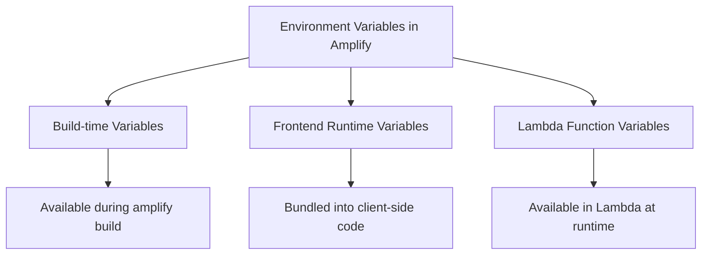

# How to Configure Amplify Environment Variables

Author: [nawazdhandala](https://github.com/nawazdhandala)

Tags: AWS, Amplify, Configuration, Environment Variables

Description: Learn how to manage environment variables in AWS Amplify for builds, runtime, and Lambda functions across different deployment stages.

---

Environment variables are a basic building block of any application, but Amplify has a few different places where they come into play. There are build-time variables, runtime variables for your frontend, and environment variables for your Lambda functions. Each works a little differently, and mixing them up is a common source of bugs.

Let's break down where environment variables live in Amplify and how to configure them properly.

## The Three Types of Amplify Environment Variables

Here's a quick overview of what's what:



**Build-time variables** are available during your build process. They're used by your build scripts but don't end up in your deployed app unless you explicitly bundle them.

**Frontend runtime variables** are baked into your JavaScript bundle at build time. They're accessible in the browser, so never put secrets here.

**Lambda function variables** are true runtime variables. They're available when your function executes and are stored securely by AWS.

## Setting Build-Time Variables in the Console

The simplest way to add environment variables is through the Amplify Console:

1. Open your app in the Amplify Console
2. Go to "Hosting" then "Environment variables"
3. Click "Manage variables"
4. Add your key-value pairs

Variables set here are available during the build step. You can reference them in your `amplify.yml` build spec:

```yaml
# amplify.yml
version: 1
frontend:
  phases:
    preBuild:
      commands:
        - npm ci
    build:
      commands:
        # Environment variables from the console are available here
        - echo "Building for $BUILD_ENV"
        - npm run build
  artifacts:
    baseDirectory: build
    files:
      - '**/*'
  cache:
    paths:
      - node_modules/**/*
```

## Branch-Specific Variables

One of Amplify's nice features is branch-specific overrides. You might want different API endpoints for staging vs production:

```
Variable: API_ENDPOINT
Default: https://api-staging.example.com
Branch override (main): https://api.example.com
Branch override (develop): https://api-dev.example.com
```

In the Amplify Console, when you add a variable, you can click "Add variable override" and select which branch gets a different value. This is way cleaner than maintaining separate config files.

## Frontend Runtime Variables (Next.js, React, Vue)

For frontend frameworks, environment variables need to be prefixed correctly to be included in the client-side bundle.

For Next.js apps:

```bash
# Variables prefixed with NEXT_PUBLIC_ are available in the browser
NEXT_PUBLIC_API_URL=https://api.example.com
NEXT_PUBLIC_ANALYTICS_ID=UA-12345

# Variables without the prefix are only available server-side
DATABASE_URL=postgresql://...
SECRET_KEY=supersecret
```

For Create React App:

```bash
# Variables prefixed with REACT_APP_ are bundled into the client
REACT_APP_API_URL=https://api.example.com
REACT_APP_FEATURE_FLAG=true
```

For Vite-based apps:

```bash
# Variables prefixed with VITE_ are available client-side
VITE_API_URL=https://api.example.com
```

You reference these in your code like any environment variable:

```javascript
// In a React component
const apiUrl = process.env.REACT_APP_API_URL;

// In a Next.js component
const apiUrl = process.env.NEXT_PUBLIC_API_URL;

// In a Vite app
const apiUrl = import.meta.env.VITE_API_URL;
```

Remember: these values are baked into your JavaScript at build time. Anyone can see them by inspecting your bundle. Never put API keys, database credentials, or any secrets in frontend environment variables.

## Lambda Function Environment Variables

For Amplify Lambda functions, you configure environment variables in the function's CloudFormation template or through the CLI.

In Amplify Gen 1:

```json
// amplify/backend/function/myFunction/parameters.json
{
  "STRIPE_API_KEY": "sk_live_...",
  "EMAIL_FROM": "noreply@example.com"
}
```

Or update them through the CLI:

```bash
# Update function configuration including env vars
amplify update function
```

In Amplify Gen 2, it's cleaner:

```typescript
// amplify/functions/my-function/resource.ts
import { defineFunction } from '@aws-amplify/backend';

export const myFunction = defineFunction({
  name: 'my-function',
  environment: {
    STRIPE_API_KEY: 'sk_live_...',
    EMAIL_FROM: 'noreply@example.com',
    TABLE_NAME: 'orders-table',
  },
});
```

Access them in your handler:

```javascript
// Lambda function handler
exports.handler = async (event) => {
  const stripeKey = process.env.STRIPE_API_KEY;
  const emailFrom = process.env.EMAIL_FROM;
  const tableName = process.env.TABLE_NAME;

  // Use the variables
  console.log(`Sending email from ${emailFrom}`);
};
```

## Using AWS Systems Manager for Secrets

Hardcoding secrets in your Amplify configuration isn't ideal. For sensitive values, use AWS Systems Manager Parameter Store or AWS Secrets Manager.

Store the secret first:

```bash
# Store a secret in Parameter Store
aws ssm put-parameter \
  --name "/myapp/prod/stripe-key" \
  --value "sk_live_abc123" \
  --type SecureString
```

Then fetch it at runtime in your Lambda function:

```javascript
const { SSMClient, GetParameterCommand } = require('@aws-sdk/client-ssm');

const ssm = new SSMClient();

// Cache the secret to avoid fetching on every invocation
let cachedSecret = null;

async function getStripeKey() {
  if (cachedSecret) return cachedSecret;

  const command = new GetParameterCommand({
    Name: '/myapp/prod/stripe-key',
    WithDecryption: true,
  });

  const response = await ssm.send(command);
  cachedSecret = response.Parameter.Value;
  return cachedSecret;
}

exports.handler = async (event) => {
  const stripeKey = await getStripeKey();
  // Use the key safely
};
```

For Amplify Gen 2, you can reference SSM parameters directly:

```typescript
// amplify/backend.ts
import { defineBackend } from '@aws-amplify/backend';
import * as ssm from 'aws-cdk-lib/aws-ssm';

const backend = defineBackend({ auth, data, myFunction });

// Reference an SSM parameter
const stripeKey = ssm.StringParameter.fromSecureStringParameterAttributes(
  backend.myFunction.stack,
  'StripeKey',
  { parameterName: '/myapp/prod/stripe-key' }
);

// Grant the function permission to read it
stripeKey.grantRead(backend.myFunction.resources.lambda);
```

## Environment-Specific Configuration

A clean pattern for managing configs across environments is to use a config file that reads from environment variables:

```javascript
// config.js - centralized configuration
const config = {
  api: {
    url: process.env.NEXT_PUBLIC_API_URL || 'http://localhost:3001',
    timeout: parseInt(process.env.NEXT_PUBLIC_API_TIMEOUT || '5000'),
  },
  features: {
    darkMode: process.env.NEXT_PUBLIC_DARK_MODE === 'true',
    analytics: process.env.NEXT_PUBLIC_ANALYTICS_ENABLED === 'true',
  },
  pagination: {
    pageSize: parseInt(process.env.NEXT_PUBLIC_PAGE_SIZE || '20'),
  },
};

export default config;
```

Then use it throughout your app:

```javascript
import config from './config';

async function fetchData() {
  const response = await fetch(`${config.api.url}/data`, {
    signal: AbortSignal.timeout(config.api.timeout),
  });
  return response.json();
}
```

## Debugging Environment Variables

When things aren't working, here's how to debug:

During build, add a step to print (non-sensitive) variables:

```yaml
# amplify.yml - debug build variables
frontend:
  phases:
    preBuild:
      commands:
        - echo "NODE_ENV=$NODE_ENV"
        - echo "API_URL=$NEXT_PUBLIC_API_URL"
        - printenv | grep NEXT_PUBLIC  # Print all public vars
```

For Lambda functions, log the variables at the start of the handler:

```javascript
exports.handler = async (event) => {
  // Log non-sensitive env vars for debugging
  console.log('Environment:', {
    NODE_ENV: process.env.NODE_ENV,
    TABLE_NAME: process.env.TABLE_NAME,
    REGION: process.env.AWS_REGION,
    // Never log secrets!
  });
};
```

## Common Mistakes

**Putting secrets in NEXT_PUBLIC_ variables.** These end up in your browser bundle. Anyone can see them. Use server-side API routes or Lambda functions for secret access.

**Forgetting to redeploy after changing variables.** Build-time variables require a new build to take effect. Changing them in the console doesn't instantly update your live app.

**Not using branch overrides.** If you're using the same API endpoint for dev and production, you're going to have a bad time. Always set up branch-specific overrides for URLs, feature flags, and configuration.

**Caching secrets incorrectly in Lambda.** Lambda execution environments are reused. Caching is good for performance, but make sure cached values don't outlive their intended TTL if you rotate secrets regularly.

## Monitoring Configuration Issues

Configuration problems are a sneaky source of production incidents. A missing or incorrect environment variable can cause subtle bugs that are hard to track down. Set up monitoring with [OneUptime](https://oneuptime.com/blog/post/2026-02-06-aws-cloudwatch-logs-exporter-opentelemetry-collector/view) to catch errors that spike after deployments - they're often caused by misconfigured environment variables.

## Wrapping Up

Environment variables in Amplify aren't complicated, but they are easy to get wrong. Remember the three types: build-time, frontend runtime, and Lambda runtime. Keep secrets out of your frontend bundle. Use branch overrides for environment-specific configuration. And store sensitive values in SSM Parameter Store or Secrets Manager rather than in your Amplify config files. Get these basics right and you'll avoid a whole category of deployment headaches.
