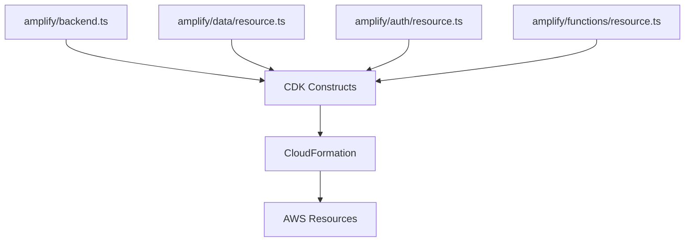

# How to Use Amplify Gen 2 for Full-Stack Development

Author: [nawazdhandala](https://github.com/nawazdhandala)

Tags: AWS, Amplify, Full-Stack, TypeScript, Serverless

Description: Explore AWS Amplify Gen 2's code-first approach to full-stack development with TypeScript-native backends, sandbox environments, and per-developer cloud sandboxes.

---

AWS Amplify Gen 2 is a pretty significant departure from the original Amplify. The old CLI-driven, category-based workflow has been replaced with a code-first, TypeScript-native approach. If you tried Amplify Gen 1 and felt limited by the CLI wizards, Gen 2 might change your mind.

The biggest shift? You define your entire backend in TypeScript. No more JSON configs, no more CLI prompts. Your backend is just code, which means it's version-controlled, reviewable, and testable like everything else in your project.

## What Changed from Gen 1

In Gen 1, you'd run `amplify add api` and answer a series of questions. The CLI would generate CloudFormation templates you weren't supposed to touch. Customization often felt like fighting the framework.

Gen 2 flips this model. Your backend definition lives in an `amplify/` directory as TypeScript files. You write code, and Amplify translates that into cloud resources.



## Project Setup

Start a new Gen 2 project or migrate an existing one:

```bash
# Create a new Next.js app with Amplify Gen 2
npm create amplify@latest

# Or add Amplify to an existing project
npm add @aws-amplify/backend @aws-amplify/backend-cli
```

After setup, your project structure looks like this:

```
amplify/
  auth/
    resource.ts        # Authentication config
  data/
    resource.ts        # Data model and API
  functions/
    my-function/
      handler.ts       # Lambda function code
      resource.ts      # Function config
  backend.ts           # Main backend definition
```

## Defining Your Data Model

The data model is where Gen 2 really shines. Instead of a GraphQL schema file, you define models in TypeScript with full type safety:

```typescript
// amplify/data/resource.ts
import { defineData, a, type ClientSchema } from '@aws-amplify/backend';

const schema = a.schema({
  // Define a Todo model with typed fields
  Todo: a.model({
    title: a.string().required(),
    description: a.string(),
    priority: a.enum(['LOW', 'MEDIUM', 'HIGH']),
    isComplete: a.boolean().default(false),
    dueDate: a.date(),
    tags: a.string().array(),
  })
  .authorization(allow => [
    allow.owner(),           // Owner can do everything
    allow.guest().to(['read']) // Guests can only read
  ]),

  // Define a Category model
  Category: a.model({
    name: a.string().required(),
    todos: a.hasMany('Todo', 'categoryId'),
  })
  .authorization(allow => [allow.authenticated()]),
});

// Export the schema type for client-side type safety
export type Schema = ClientSchema<typeof schema>;

export const data = defineData({
  schema,
  authorizationModes: {
    defaultAuthorizationMode: 'userPool',
  },
});
```

The beauty here is that the `Schema` type flows all the way to your frontend code. Your queries and mutations are fully typed.

## Setting Up Authentication

Auth configuration is similarly code-first:

```typescript
// amplify/auth/resource.ts
import { defineAuth } from '@aws-amplify/backend';

export const auth = defineAuth({
  loginWith: {
    email: {
      // Customize the verification email
      verificationEmailStyle: 'CODE',
      verificationEmailSubject: 'Welcome to our app!',
      verificationEmailBody: (code) =>
        `Your verification code is: ${code}`,
    },
    // Enable social sign-in providers
    externalProviders: {
      google: {
        clientId: 'your-google-client-id',
        clientSecret: 'your-google-client-secret',
      },
      callbackUrls: ['http://localhost:3000/'],
      logoutUrls: ['http://localhost:3000/'],
    },
  },
  // Custom user attributes
  userAttributes: {
    preferredUsername: { required: true },
    profilePicture: { required: false },
  },
});
```

## Adding Lambda Functions

Functions in Gen 2 are defined as TypeScript files with full access to the AWS CDK:

```typescript
// amplify/functions/send-notification/resource.ts
import { defineFunction } from '@aws-amplify/backend';

export const sendNotification = defineFunction({
  name: 'send-notification',
  // Set a longer timeout for this function
  timeoutSeconds: 60,
  // Add environment variables
  environment: {
    NOTIFICATION_SERVICE_URL: 'https://api.notification.service',
  },
});
```

```typescript
// amplify/functions/send-notification/handler.ts
import type { Handler } from 'aws-lambda';

// The handler receives typed events
export const handler: Handler = async (event) => {
  const { userId, message } = event.arguments;

  const response = await fetch(process.env.NOTIFICATION_SERVICE_URL!, {
    method: 'POST',
    headers: { 'Content-Type': 'application/json' },
    body: JSON.stringify({ userId, message }),
  });

  return {
    success: response.ok,
    statusCode: response.status,
  };
};
```

## Wiring It All Together

The `backend.ts` file is where you combine all your resources:

```typescript
// amplify/backend.ts
import { defineBackend } from '@aws-amplify/backend';
import { auth } from './auth/resource';
import { data } from './data/resource';
import { sendNotification } from './functions/send-notification/resource';

const backend = defineBackend({
  auth,
  data,
  sendNotification,
});

// Access CDK constructs for advanced customization
const dataStack = backend.data.stack;
// Add custom CloudFormation resources here if needed
```

## Per-Developer Sandboxes

One of Gen 2's best features is per-developer cloud sandboxes. Every developer gets their own isolated backend environment:

```bash
# Start a sandbox for your personal development
npx ampx sandbox

# This creates a cloud environment named after your user
# Changes are deployed automatically on file save
```

The sandbox watches your files and deploys changes in real-time. It's like hot-reloading for your backend. When you save a change to your data model, the sandbox updates the cloud resources within seconds.

```bash
# List active sandboxes
npx ampx sandbox list

# Delete your sandbox when done
npx ampx sandbox delete
```

This eliminates the "it works on my machine" problem for backends. Each developer has their own DynamoDB tables, Cognito user pool, and AppSync API.

## Client-Side Usage with Type Safety

The frontend experience is where type safety pays off. Here's a React example:

```typescript
// Configure Amplify in your app
import { Amplify } from 'aws-amplify';
import outputs from '../amplify_outputs.json';
import { generateClient } from 'aws-amplify/data';
import type { Schema } from '../amplify/data/resource';

Amplify.configure(outputs);

// Generate a typed client
const client = generateClient<Schema>();

// Full type safety on queries - TypeScript knows the shape
async function listTodos() {
  const { data: todos } = await client.models.Todo.list();
  // todos is typed as Schema['Todo']['type'][]
  return todos;
}

// Create with type checking
async function createTodo(title: string) {
  const { data: newTodo } = await client.models.Todo.create({
    title,           // Required - TS would complain if missing
    priority: 'HIGH', // Must be LOW, MEDIUM, or HIGH
    isComplete: false,
  });
  return newTodo;
}

// Real-time subscriptions are also typed
function subscribeTodos(callback: (todo: Schema['Todo']['type']) => void) {
  const sub = client.models.Todo.onCreate().subscribe({
    next: (todo) => callback(todo),
  });
  return sub;
}
```

## Custom Queries and Mutations

You can define custom operations that go beyond basic CRUD:

```typescript
// In your schema definition
const schema = a.schema({
  Todo: a.model({ /* ... */ }),

  // Custom query backed by a Lambda function
  getTodoStats: a.query()
    .arguments({ userId: a.string().required() })
    .returns(a.customType({
      totalTodos: a.integer(),
      completedTodos: a.integer(),
      completionRate: a.float(),
    }))
    .handler(a.handler.function('getTodoStats'))
    .authorization(allow => [allow.authenticated()]),
});
```

## Deploying to Production

When you're ready to deploy, Amplify Gen 2 integrates with CI/CD pipelines:

```bash
# Deploy to a named environment
npx ampx pipeline-deploy --branch main

# Or connect to Amplify Hosting for automatic deployments
# Push to your Git repo and Amplify builds automatically
```

The recommended approach is connecting your repo to Amplify Hosting. Every push to your main branch triggers a build and deploy. Pull requests get preview environments automatically.

## Monitoring Your Full-Stack App

With your entire stack on AWS, monitoring becomes important. AppSync, Lambda, DynamoDB, and Cognito all emit CloudWatch metrics. For a unified view of your application's health, check out [OneUptime's monitoring capabilities](https://oneuptime.com/blog/post/2026-02-06-aws-cloudwatch-logs-exporter-opentelemetry-collector/view) to aggregate metrics across services.

## Wrapping Up

Amplify Gen 2 is a genuine improvement over Gen 1. The code-first approach means your backend is as reviewable and testable as your frontend. Per-developer sandboxes remove environment conflicts. And the TypeScript-native data modeling gives you end-to-end type safety that catches errors at compile time instead of runtime.

If you've been on the fence about Amplify, Gen 2 is worth a fresh look. Start with the data model, add auth, and layer in functions as you need them. The developer experience is noticeably better than managing CloudFormation by hand.
