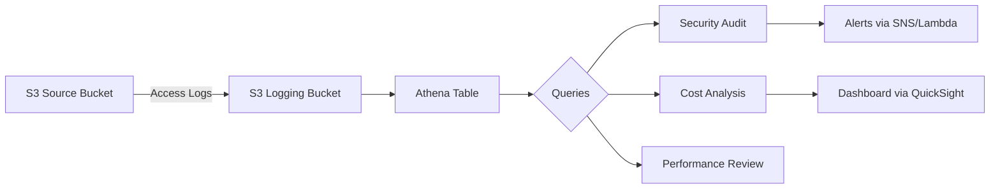

# How to Analyze S3 Access Logs with Athena

Author: [nawazdhandala](https://github.com/nawazdhandala)

Tags: AWS, S3, Athena, Log Analysis, Security

Description: Learn how to query S3 server access logs using Amazon Athena for security auditing, cost analysis, and performance troubleshooting at scale.

---

When you've got millions of S3 access log entries, grep isn't going to cut it. You need something that can scan terabytes of logs in seconds and let you run SQL queries against them. Amazon Athena is perfect for this - it's a serverless query engine that reads data directly from S3, so you don't need to load logs into a database. You just define a table schema, point it at your logs, and start querying.

## Prerequisites

You'll need:
1. S3 access logging already enabled (see our guide on [setting up S3 access logging](https://oneuptime.com/blog/post/s3-access-logging-audit-trails/view))
2. An Athena workgroup configured with a query results bucket
3. Logs accumulated in your logging bucket

## Step 1: Create the Athena Table

S3 access logs use a space-delimited format with specific fields. Here's the table definition that matches the log format.

```sql
CREATE EXTERNAL TABLE IF NOT EXISTS s3_access_logs (
  bucket_owner string,
  bucket_name string,
  request_datetime string,
  remote_ip string,
  requester string,
  request_id string,
  operation string,
  key string,
  request_uri string,
  http_status int,
  error_code string,
  bytes_sent bigint,
  object_size bigint,
  total_time int,
  turn_around_time int,
  referrer string,
  user_agent string,
  version_id string,
  host_id string,
  signature_version string,
  cipher_suite string,
  authentication_type string,
  host_header string,
  tls_version string,
  access_point_arn string,
  acl_required string
)
ROW FORMAT SERDE 'org.apache.hadoop.hive.serde2.RegexSerDe'
WITH SERDEPROPERTIES (
  'serialization.format' = '1',
  'input.regex' = '([^ ]*) ([^ ]*) \\[(.*?)\\] ([^ ]*) ([^ ]*) ([^ ]*) ([^ ]*) ([^ ]*) (\"[^\"]*\"|-) (-|[0-9]*) ([^ ]*) ([^ ]*) ([^ ]*) ([^ ]*) ([^ ]*) ([^ ]*) (\"[^\"]*\"|-) ([^ ]*) ([^ ]*) ([^ ]*) ([^ ]*) ([^ ]*) ([^ ]*) ([^ ]*) ([^ ]*) ([^ ]*)'
)
LOCATION 's3://my-s3-access-logs/logs/my-source-bucket/'
TBLPROPERTIES ('has_encrypted_data'='false');
```

Run this in the Athena query editor or through the CLI.

```bash
aws athena start-query-execution \
  --query-string "$(cat create-table.sql)" \
  --result-configuration OutputLocation=s3://my-athena-results/ \
  --work-group primary
```

## Step 2: Basic Queries

Now let's run some queries. Start with something simple to verify the table works.

Count total requests by operation type.

```sql
SELECT
  operation,
  COUNT(*) as request_count
FROM s3_access_logs
WHERE request_datetime >= '2026-02-01'
GROUP BY operation
ORDER BY request_count DESC
LIMIT 20;
```

Find the most accessed objects.

```sql
SELECT
  key,
  COUNT(*) as access_count,
  SUM(bytes_sent) as total_bytes_sent
FROM s3_access_logs
WHERE operation = 'REST.GET.OBJECT'
  AND request_datetime >= '2026-02-01'
GROUP BY key
ORDER BY access_count DESC
LIMIT 25;
```

## Step 3: Security Analysis Queries

These queries help identify potential security issues.

Find all failed access attempts (403 and 401 errors).

```sql
SELECT
  request_datetime,
  remote_ip,
  requester,
  operation,
  key,
  http_status,
  error_code
FROM s3_access_logs
WHERE http_status IN (401, 403)
  AND request_datetime >= '2026-02-01'
ORDER BY request_datetime DESC
LIMIT 100;
```

Identify unusual IP addresses making requests.

```sql
SELECT
  remote_ip,
  COUNT(*) as request_count,
  COUNT(DISTINCT key) as unique_objects,
  MIN(request_datetime) as first_seen,
  MAX(request_datetime) as last_seen
FROM s3_access_logs
WHERE request_datetime >= '2026-02-01'
GROUP BY remote_ip
HAVING COUNT(*) > 1000
ORDER BY request_count DESC;
```

Find anonymous (unauthenticated) access.

```sql
SELECT
  request_datetime,
  remote_ip,
  operation,
  key,
  http_status,
  user_agent
FROM s3_access_logs
WHERE requester = '-'
  AND http_status = 200
  AND request_datetime >= '2026-02-01'
ORDER BY request_datetime DESC
LIMIT 50;
```

Detect potential data exfiltration - users downloading large amounts of data.

```sql
SELECT
  requester,
  remote_ip,
  COUNT(*) as download_count,
  SUM(bytes_sent) / 1024 / 1024 / 1024 as total_gb_downloaded,
  COUNT(DISTINCT key) as unique_files
FROM s3_access_logs
WHERE operation = 'REST.GET.OBJECT'
  AND http_status = 200
  AND request_datetime >= '2026-02-01'
GROUP BY requester, remote_ip
HAVING SUM(bytes_sent) > 1073741824  -- more than 1GB
ORDER BY total_gb_downloaded DESC;
```

## Step 4: Cost Analysis Queries

Understand what's driving your S3 costs.

Find the most expensive operations by request count.

```sql
SELECT
  operation,
  COUNT(*) as request_count,
  SUM(bytes_sent) / 1024 / 1024 / 1024 as gb_transferred,
  -- Approximate cost for GET requests at $0.0004/1000
  CASE
    WHEN operation LIKE '%GET%' THEN COUNT(*) * 0.0004 / 1000
    WHEN operation LIKE '%PUT%' THEN COUNT(*) * 0.005 / 1000
    WHEN operation LIKE '%LIST%' THEN COUNT(*) * 0.005 / 1000
    ELSE 0
  END as estimated_request_cost
FROM s3_access_logs
WHERE request_datetime >= '2026-02-01'
GROUP BY operation
ORDER BY request_count DESC;
```

Identify hotspots - prefixes generating the most traffic.

```sql
SELECT
  SUBSTRING(key, 1, POSITION('/' IN key)) as prefix,
  COUNT(*) as request_count,
  SUM(bytes_sent) / 1024 / 1024 as mb_transferred
FROM s3_access_logs
WHERE operation = 'REST.GET.OBJECT'
  AND key != '-'
  AND request_datetime >= '2026-02-01'
GROUP BY SUBSTRING(key, 1, POSITION('/' IN key))
ORDER BY request_count DESC
LIMIT 20;
```

Find objects that are frequently listed but rarely downloaded (potential for optimization).

```sql
WITH list_ops AS (
  SELECT key, COUNT(*) as list_count
  FROM s3_access_logs
  WHERE operation LIKE '%LIST%'
  GROUP BY key
),
get_ops AS (
  SELECT key, COUNT(*) as get_count
  FROM s3_access_logs
  WHERE operation = 'REST.GET.OBJECT'
  GROUP BY key
)
SELECT
  l.key,
  l.list_count,
  COALESCE(g.get_count, 0) as get_count
FROM list_ops l
LEFT JOIN get_ops g ON l.key = g.key
WHERE l.list_count > 100
ORDER BY l.list_count DESC
LIMIT 20;
```

## Step 5: Performance Analysis

Find slow requests.

```sql
SELECT
  request_datetime,
  operation,
  key,
  object_size / 1024 / 1024 as size_mb,
  total_time as total_ms,
  turn_around_time as server_ms,
  (total_time - turn_around_time) as network_ms
FROM s3_access_logs
WHERE total_time > 5000  -- requests taking more than 5 seconds
  AND http_status = 200
  AND request_datetime >= '2026-02-01'
ORDER BY total_time DESC
LIMIT 50;
```

Analyze request patterns by hour.

```sql
SELECT
  SUBSTR(request_datetime, 13, 2) as hour_utc,
  COUNT(*) as request_count,
  SUM(bytes_sent) / 1024 / 1024 / 1024 as gb_transferred
FROM s3_access_logs
WHERE request_datetime >= '2026-02-10'
  AND request_datetime < '2026-02-11'
GROUP BY SUBSTR(request_datetime, 13, 2)
ORDER BY hour_utc;
```

## Step 6: Create Partitioned Tables for Better Performance

If you have a lot of logs, querying the entire dataset every time is slow and expensive. Partition by date for much better performance.

```sql
CREATE EXTERNAL TABLE s3_access_logs_partitioned (
  bucket_owner string,
  bucket_name string,
  request_datetime string,
  remote_ip string,
  requester string,
  request_id string,
  operation string,
  key string,
  request_uri string,
  http_status int,
  error_code string,
  bytes_sent bigint,
  object_size bigint,
  total_time int,
  turn_around_time int,
  referrer string,
  user_agent string,
  version_id string
)
PARTITIONED BY (dt string)
ROW FORMAT SERDE 'org.apache.hadoop.hive.serde2.RegexSerDe'
WITH SERDEPROPERTIES (
  'serialization.format' = '1',
  'input.regex' = '([^ ]*) ([^ ]*) \\[(.*?)\\] ([^ ]*) ([^ ]*) ([^ ]*) ([^ ]*) ([^ ]*) (\"[^\"]*\"|-) (-|[0-9]*) ([^ ]*) ([^ ]*) ([^ ]*) ([^ ]*) ([^ ]*) ([^ ]*) (\"[^\"]*\"|-) ([^ ]*)'
)
LOCATION 's3://my-s3-access-logs/logs/my-source-bucket/';
```

## Query Architecture



## Cost Tips for Athena

Athena charges $5 per TB of data scanned. To reduce costs:

1. **Use partitions** to limit the data scanned per query
2. **Convert logs to Parquet** format for columnar storage (much less data scanned)
3. **Add WHERE clauses** that filter on partitions
4. **Use LIMIT** when exploring data
5. **Use approximate functions** like `approx_distinct()` instead of `COUNT(DISTINCT)`

## Wrapping Up

Athena turns your raw S3 access logs into a queryable security and analytics platform. The combination of zero infrastructure, SQL familiarity, and the ability to scan months of logs in seconds makes it the best tool for S3 log analysis. Start with the security queries to verify nobody is accessing data they shouldn't be, then move to cost analysis to find optimization opportunities. Just remember to partition your data and use efficient query patterns to keep Athena costs down.
