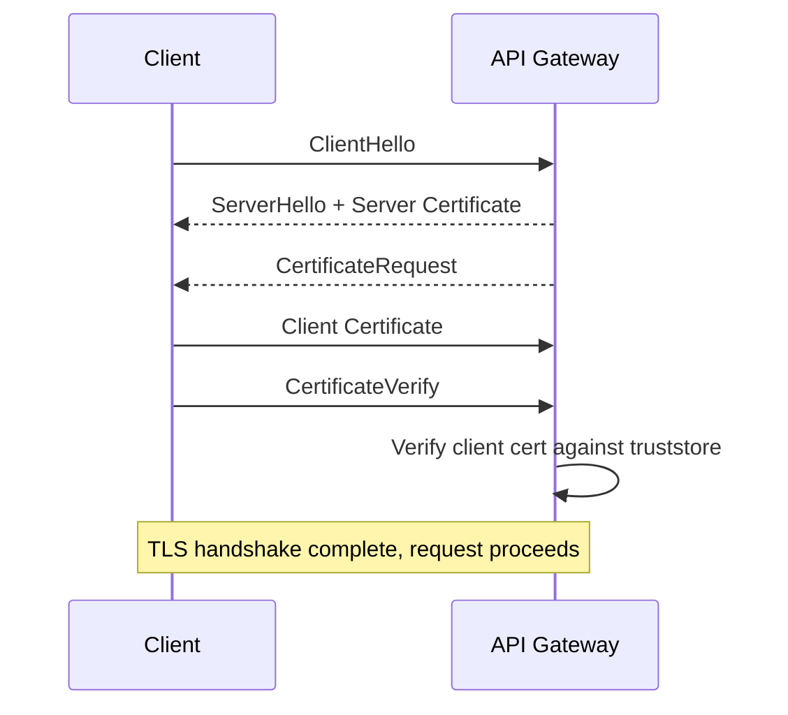

# How to Set Up API Gateway Mutual TLS (mTLS)

Author: [nawazdhandala](https://github.com/nawazdhandala)

Tags: AWS, API Gateway, Security, TLS

Description: Learn how to configure mutual TLS authentication on API Gateway to verify client certificates for zero-trust API security.

---

Standard HTTPS only verifies the server's identity - the client checks the server's certificate but the server accepts any client. Mutual TLS (mTLS) flips this by requiring clients to present their own certificate too. Both sides verify each other. It's the gold standard for API-to-API authentication in zero-trust environments.

## How mTLS Works

In a normal TLS handshake, only the server presents a certificate. With mTLS, both sides exchange certificates:



API Gateway verifies the client certificate against a truststore you provide. If the certificate isn't signed by a trusted CA or has been revoked, the connection is rejected at the TLS level before any application logic runs.

## Prerequisites

You need:
1. A custom domain name on API Gateway (mTLS doesn't work with the default execute-api endpoint)
2. A Certificate Authority (CA) or self-signed CA to issue client certificates
3. The CA certificate (truststore) uploaded to S3

## Step 1: Create a Certificate Authority

For testing, you can create your own CA. For production, use your organization's PKI or a service like AWS Private CA.

Create a self-signed CA for testing:

```bash
# Generate the CA private key
openssl genrsa -out ca.key 4096

# Create the CA certificate (valid for 10 years)
openssl req -new -x509 \
  -days 3650 \
  -key ca.key \
  -out ca.pem \
  -subj "/C=US/ST=California/O=MyCompany/CN=MyCompany CA"

# Verify the CA certificate
openssl x509 -in ca.pem -text -noout
```

## Step 2: Generate a Client Certificate

Create a client certificate signed by your CA:

```bash
# Generate the client's private key
openssl genrsa -out client.key 2048

# Create a certificate signing request (CSR)
openssl req -new \
  -key client.key \
  -out client.csr \
  -subj "/C=US/ST=California/O=MyCompany/CN=api-client-1"

# Sign the CSR with the CA to create the client certificate
openssl x509 -req \
  -days 365 \
  -in client.csr \
  -CA ca.pem \
  -CAkey ca.key \
  -CAcreateserial \
  -out client.pem

# Verify the client certificate
openssl verify -CAfile ca.pem client.pem
```

## Step 3: Upload the Truststore to S3

The truststore is a PEM file containing the CA certificates that API Gateway trusts. Upload it to an S3 bucket.

Upload the CA certificate as a truststore:

```bash
# Create a bucket for the truststore (if needed)
aws s3 mb s3://my-api-truststores

# Upload the CA certificate
aws s3 cp ca.pem s3://my-api-truststores/truststore.pem

# You can include multiple CA certificates in one file
# Just concatenate them
cat ca1.pem ca2.pem > combined-truststore.pem
aws s3 cp combined-truststore.pem s3://my-api-truststores/truststore.pem
```

## Step 4: Enable mTLS on the Custom Domain

Configure mTLS on your API Gateway custom domain:

```bash
# Create or update the custom domain with mTLS
aws apigateway create-domain-name \
  --domain-name "api.yourcompany.com" \
  --regional-certificate-arn arn:aws:acm:us-east-1:123456789012:certificate/abc-123 \
  --endpoint-configuration types=REGIONAL \
  --mutual-tls-authentication truststoreUri=s3://my-api-truststores/truststore.pem

# To update an existing domain
aws apigateway update-domain-name \
  --domain-name "api.yourcompany.com" \
  --patch-operations \
    op=replace,path=/mutualTlsAuthentication/truststoreUri,value=s3://my-api-truststores/truststore.pem
```

For HTTP API:

```bash
# Enable mTLS on HTTP API custom domain
aws apigatewayv2 create-domain-name \
  --domain-name "api.yourcompany.com" \
  --domain-name-configurations \
    CertificateArn=arn:aws:acm:us-east-1:123456789012:certificate/abc-123,EndpointType=REGIONAL \
  --mutual-tls-authentication truststoreUri=s3://my-api-truststores/truststore.pem
```

## Step 5: Test the Connection

Test with and without the client certificate to verify mTLS is working:

```bash
# This should succeed - providing client certificate
curl -v \
  --cert client.pem \
  --key client.key \
  https://api.yourcompany.com/resource

# This should fail - no client certificate
curl -v https://api.yourcompany.com/resource
# Expected: SSL handshake error

# Test with a certificate not signed by the trusted CA
curl -v \
  --cert untrusted-client.pem \
  --key untrusted-client.key \
  https://api.yourcompany.com/resource
# Expected: SSL handshake error
```

## CloudFormation Template

Complete setup with CloudFormation:

```yaml
Parameters:
  DomainName:
    Type: String
    Default: api.yourcompany.com
  CertificateArn:
    Type: String
  TruststoreBucket:
    Type: String
    Default: my-api-truststores

Resources:
  TruststoreBucketResource:
    Type: AWS::S3::Bucket
    Properties:
      BucketName: !Ref TruststoreBucket
      VersioningConfiguration:
        Status: Enabled  # Recommended for truststore management

  CustomDomain:
    Type: AWS::ApiGateway::DomainName
    Properties:
      DomainName: !Ref DomainName
      RegionalCertificateArn: !Ref CertificateArn
      EndpointConfiguration:
        Types:
          - REGIONAL
      MutualTlsAuthentication:
        TruststoreUri: !Sub "s3://${TruststoreBucket}/truststore.pem"

  BasePathMapping:
    Type: AWS::ApiGateway::BasePathMapping
    Properties:
      DomainName: !Ref CustomDomain
      RestApiId: !Ref MyApi
      Stage: prod
```

## Terraform Configuration

```hcl
resource "aws_s3_object" "truststore" {
  bucket = aws_s3_bucket.truststores.id
  key    = "truststore.pem"
  source = "certs/ca.pem"
  etag   = filemd5("certs/ca.pem")
}

resource "aws_api_gateway_domain_name" "api" {
  domain_name              = "api.yourcompany.com"
  regional_certificate_arn = aws_acm_certificate.api.arn

  endpoint_configuration {
    types = ["REGIONAL"]
  }

  mutual_tls_authentication {
    truststore_uri = "s3://${aws_s3_bucket.truststores.id}/truststore.pem"
  }
}
```

## Accessing Client Certificate Info in Lambda

When mTLS is enabled, API Gateway passes the client certificate information to your Lambda function. You can use this for fine-grained authorization.

Extract and use client certificate details:

```python
import json


def lambda_handler(event, context):
    # Client certificate info is in the request context
    request_context = event.get("requestContext", {})
    identity = request_context.get("identity", {})

    # Get certificate details
    client_cert = identity.get("clientCert", {})

    if client_cert:
        subject_dn = client_cert.get("subjectDN", "")
        issuer_dn = client_cert.get("issuerDN", "")
        serial_number = client_cert.get("serialNumber", "")
        validity = client_cert.get("validity", {})
        not_before = validity.get("notBefore", "")
        not_after = validity.get("notAfter", "")

        print(f"Client: {subject_dn}")
        print(f"Issuer: {issuer_dn}")
        print(f"Serial: {serial_number}")
        print(f"Valid: {not_before} to {not_after}")

        # Authorize based on the certificate subject
        if "CN=api-client-1" not in subject_dn:
            return {
                "statusCode": 403,
                "body": json.dumps({"error": "Unauthorized client certificate"}),
            }

    return {
        "statusCode": 200,
        "body": json.dumps({"message": "Authenticated via mTLS"}),
    }
```

## Updating the Truststore

When you need to add or remove trusted CAs, update the truststore file in S3.

Rotate the truststore:

```bash
# Upload the new truststore
aws s3 cp new-truststore.pem s3://my-api-truststores/truststore.pem

# If you use a specific version
aws apigateway update-domain-name \
  --domain-name "api.yourcompany.com" \
  --patch-operations \
    op=replace,path=/mutualTlsAuthentication/truststoreVersion,value=new-version-id
```

If you enable S3 versioning on the truststore bucket, you can specify which version to use. This lets you roll back quickly if a truststore update causes issues.

## Certificate Revocation

To revoke a client certificate without updating the entire truststore, you can use a Lambda authorizer that checks a revocation list:

```python
import json
import boto3

dynamodb = boto3.resource("dynamodb")
revocation_table = dynamodb.Table("RevokedCertificates")


def lambda_handler(event, context):
    client_cert = event["requestContext"]["identity"]["clientCert"]
    serial_number = client_cert["serialNumber"]

    # Check if the certificate is revoked
    response = revocation_table.get_item(
        Key={"serial_number": serial_number}
    )

    if "Item" in response:
        # Certificate is revoked
        return generate_policy("Deny", event["methodArn"])

    return generate_policy("Allow", event["methodArn"])


def generate_policy(effect, resource):
    return {
        "principalId": "user",
        "policyDocument": {
            "Version": "2012-10-17",
            "Statement": [
                {
                    "Action": "execute-api:Invoke",
                    "Effect": effect,
                    "Resource": resource,
                }
            ],
        },
    }
```

## Combining mTLS with Other Auth

mTLS can work alongside other authentication methods. A common pattern is mTLS for service-to-service auth plus API keys for metering:

```bash
# Method requires both mTLS (at the domain level) and API key
aws apigateway update-method \
  --rest-api-id abc123api \
  --resource-id res456 \
  --http-method GET \
  --patch-operations \
    op=replace,path=/apiKeyRequired,value=true
```

This gives you certificate-based identity verification (mTLS) plus usage tracking (API keys).

For monitoring mTLS handshake failures and tracking certificate expiration, check out our guide on [API security monitoring](https://oneuptime.com/blog/post/2026-01-26-restful-api-best-practices/view).

## Wrapping Up

Mutual TLS adds a strong layer of authentication to your APIs. Clients must present a valid certificate signed by a trusted CA, and the verification happens at the TLS level before any application code runs. The setup involves creating a CA, generating client certificates, uploading a truststore to S3, and enabling mTLS on your custom domain. For production, use AWS Private CA instead of self-signed certificates, and implement a revocation strategy for handling compromised credentials.
