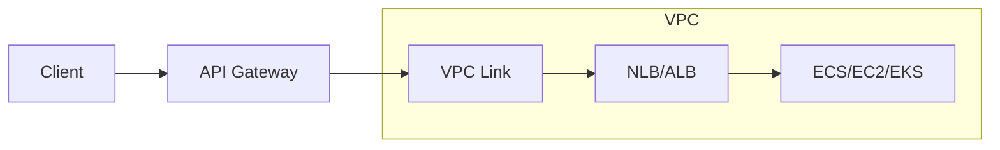

# How to Set Up API Gateway with VPC Link for Private APIs

Author: [nawazdhandala](https://github.com/nawazdhandala)

Tags: AWS, API Gateway, VPC, Networking, Serverless

Description: Step-by-step guide to setting up API Gateway with VPC Links to securely expose private resources like ECS services, ALBs, and NLBs through a public API endpoint.

---

Most production backends don't sit on the public internet. They're tucked away inside VPCs, behind private subnets, accessible only through internal load balancers. But your customers need a public API endpoint. VPC Links bridge that gap - they let API Gateway reach into your VPC and connect to private resources without exposing them to the internet.

This is how you build a secure, public-facing API that talks to private backends. Let's set it up.

## How VPC Links Work

A VPC Link is a connection between API Gateway and a private resource inside your VPC. The traffic stays within the AWS network - it never touches the public internet.

For REST APIs, VPC Links connect to Network Load Balancers (NLBs). For HTTP APIs, they connect to Application Load Balancers (ALBs), NLBs, or AWS Cloud Map services. The HTTP API version is newer and more flexible.

Here's the flow:



The key thing to understand: API Gateway creates ENIs (Elastic Network Interfaces) in your VPC subnets. These ENIs are how traffic flows from API Gateway into your private network.

## Prerequisites

You'll need:
- A VPC with private subnets
- A Network Load Balancer (for REST API) or Application Load Balancer (for HTTP API) in those subnets
- A backend service registered as a target (ECS, EC2, etc.)
- An API Gateway API

## Setting Up a VPC Link for REST APIs

REST APIs require an NLB as the VPC Link target. Let's set up the full stack.

### Step 1: Create the Network Load Balancer

This CloudFormation snippet creates an internal NLB in private subnets:

```yaml
Resources:
  InternalNLB:
    Type: AWS::ElasticLoadBalancingV2::LoadBalancer
    Properties:
      Name: api-backend-nlb
      Scheme: internal
      Type: network
      Subnets:
        - !Ref PrivateSubnet1
        - !Ref PrivateSubnet2

  NLBTargetGroup:
    Type: AWS::ElasticLoadBalancingV2::TargetGroup
    Properties:
      Name: api-backend-targets
      Port: 80
      Protocol: TCP
      VpcId: !Ref VPC
      TargetType: ip
      HealthCheckProtocol: TCP
      HealthCheckPort: '80'

  NLBListener:
    Type: AWS::ElasticLoadBalancingV2::Listener
    Properties:
      LoadBalancerArn: !Ref InternalNLB
      Port: 80
      Protocol: TCP
      DefaultActions:
        - Type: forward
          TargetGroupArn: !Ref NLBTargetGroup
```

### Step 2: Create the VPC Link

This command creates a VPC Link pointing to your NLB:

```bash
# Create the VPC Link (REST API)
aws apigateway create-vpc-link \
  --name my-api-vpc-link \
  --target-arns arn:aws:elasticloadbalancing:us-east-1:123456789012:loadbalancer/net/api-backend-nlb/abc123

# Check the status (it takes a few minutes to become AVAILABLE)
aws apigateway get-vpc-link \
  --vpc-link-id abc123
```

VPC Link creation takes a few minutes. The status goes from `PENDING` to `AVAILABLE`. Don't try to use it until it's ready.

### Step 3: Configure the API Integration

This command creates an integration that uses the VPC Link:

```bash
# Create the integration
aws apigateway put-integration \
  --rest-api-id a1b2c3d4e5 \
  --resource-id res123 \
  --http-method GET \
  --type HTTP_PROXY \
  --integration-http-method GET \
  --uri 'http://api-backend-nlb-abc123.elb.us-east-1.amazonaws.com/api/orders' \
  --connection-type VPC_LINK \
  --connection-id abc123
```

## Setting Up a VPC Link for HTTP APIs

HTTP APIs support ALBs, NLBs, and Cloud Map - and the setup is simpler.

### Create the VPC Link for HTTP API

This command creates a VPC Link for an HTTP API using specific subnets and security groups:

```bash
# Create VPC Link for HTTP API (different from REST API VPC Links)
aws apigatewayv2 create-vpc-link \
  --name my-http-api-vpc-link \
  --subnet-ids subnet-abc123 subnet-def456 \
  --security-group-ids sg-abc123
```

Notice the difference: HTTP API VPC Links specify subnets and security groups directly, while REST API VPC Links point to an NLB.

### Configure the Route Integration

```bash
# Create the integration
aws apigatewayv2 create-integration \
  --api-id a1b2c3d4e5 \
  --integration-type HTTP_PROXY \
  --integration-method GET \
  --integration-uri arn:aws:elasticloadbalancing:us-east-1:123456789012:listener/app/my-alb/abc123/def456 \
  --connection-type VPC_LINK \
  --connection-id abc123 \
  --payload-format-version 1.0
```

## Complete CDK Example

CDK ties everything together neatly. Here's a complete stack with an ECS service, ALB, VPC Link, and HTTP API.

This CDK stack creates a private ECS Fargate service exposed through API Gateway via VPC Link:

```typescript
import * as cdk from 'aws-cdk-lib';
import * as ec2 from 'aws-cdk-lib/aws-ec2';
import * as ecs from 'aws-cdk-lib/aws-ecs';
import * as elbv2 from 'aws-cdk-lib/aws-elasticloadbalancingv2';
import * as apigatewayv2 from 'aws-cdk-lib/aws-apigatewayv2';
import * as integrations from 'aws-cdk-lib/aws-apigatewayv2-integrations';
import { Construct } from 'constructs';

export class VpcLinkApiStack extends cdk.Stack {
  constructor(scope: Construct, id: string, props?: cdk.StackProps) {
    super(scope, id, props);

    // VPC with private subnets
    const vpc = new ec2.Vpc(this, 'ApiVpc', {
      maxAzs: 2,
      natGateways: 1,
    });

    // ECS cluster
    const cluster = new ecs.Cluster(this, 'Cluster', { vpc });

    // Task definition
    const taskDef = new ecs.FargateTaskDefinition(this, 'TaskDef', {
      memoryLimitMiB: 512,
      cpu: 256,
    });

    taskDef.addContainer('api', {
      image: ecs.ContainerImage.fromRegistry('my-api:latest'),
      portMappings: [{ containerPort: 8080 }],
      logging: ecs.LogDrivers.awsLogs({ streamPrefix: 'api' }),
    });

    // Internal ALB
    const alb = new elbv2.ApplicationLoadBalancer(this, 'InternalALB', {
      vpc,
      internetFacing: false,
      vpcSubnets: { subnetType: ec2.SubnetType.PRIVATE_WITH_EGRESS },
    });

    // ECS service behind the ALB
    const service = new ecs.FargateService(this, 'ApiService', {
      cluster,
      taskDefinition: taskDef,
      desiredCount: 2,
      vpcSubnets: { subnetType: ec2.SubnetType.PRIVATE_WITH_EGRESS },
    });

    const listener = alb.addListener('HttpListener', { port: 80 });
    listener.addTargets('EcsTargets', {
      port: 8080,
      targets: [service],
      healthCheck: { path: '/health' },
    });

    // VPC Link
    const vpcLink = new apigatewayv2.VpcLink(this, 'VpcLink', {
      vpc,
      subnets: { subnetType: ec2.SubnetType.PRIVATE_WITH_EGRESS },
    });

    // HTTP API with VPC Link integration
    const httpApi = new apigatewayv2.HttpApi(this, 'HttpApi', {
      apiName: 'My Private API',
    });

    // Add route with ALB integration via VPC Link
    httpApi.addRoutes({
      path: '/api/{proxy+}',
      methods: [apigatewayv2.HttpMethod.ANY],
      integration: new integrations.HttpAlbIntegration('AlbIntegration', listener, {
        vpcLink,
      }),
    });

    new cdk.CfnOutput(this, 'ApiUrl', {
      value: httpApi.apiEndpoint,
    });
  }
}
```

## Security Group Configuration

The security group on your VPC Link ENIs needs to allow traffic to your backend. And your backend's security group needs to accept traffic from the VPC Link.

This configuration ensures proper security group rules:

```typescript
// Security group for VPC Link
const vpcLinkSg = new ec2.SecurityGroup(this, 'VpcLinkSg', {
  vpc,
  description: 'Security group for API Gateway VPC Link',
});

// Allow VPC Link to reach the ALB
vpcLinkSg.addEgressRule(
  ec2.Peer.anyIpv4(),
  ec2.Port.tcp(80),
  'Allow outbound to ALB'
);

// Allow ALB to receive from VPC Link
albSecurityGroup.addIngressRule(
  vpcLinkSg,
  ec2.Port.tcp(80),
  'Allow inbound from VPC Link'
);

// Create VPC Link with the security group
const vpcLink = new apigatewayv2.VpcLink(this, 'VpcLink', {
  vpc,
  securityGroups: [vpcLinkSg],
  subnets: { subnetType: ec2.SubnetType.PRIVATE_WITH_EGRESS },
});
```

## Private API Endpoints

There's a related but different concept - Private APIs. These are API Gateway endpoints that are only accessible from within your VPC via VPC Endpoints (not VPC Links). Don't confuse the two.

- **VPC Link**: Public API Gateway connects to private backends
- **Private API**: API Gateway itself is only accessible from within a VPC

For private APIs, you create an interface VPC endpoint:

```bash
# Create a VPC endpoint for API Gateway
aws ec2 create-vpc-endpoint \
  --vpc-id vpc-abc123 \
  --service-name com.amazonaws.us-east-1.execute-api \
  --vpc-endpoint-type Interface \
  --subnet-ids subnet-abc123 subnet-def456 \
  --security-group-ids sg-abc123
```

Then set a resource policy on your API to restrict access:

```json
{
  "Version": "2012-10-17",
  "Statement": [
    {
      "Effect": "Deny",
      "Principal": "*",
      "Action": "execute-api:Invoke",
      "Resource": "arn:aws:execute-api:us-east-1:123456789012:a1b2c3d4e5/*",
      "Condition": {
        "StringNotEquals": {
          "aws:sourceVpce": "vpce-abc123"
        }
      }
    },
    {
      "Effect": "Allow",
      "Principal": "*",
      "Action": "execute-api:Invoke",
      "Resource": "arn:aws:execute-api:us-east-1:123456789012:a1b2c3d4e5/*"
    }
  ]
}
```

## Troubleshooting

**VPC Link stuck in PENDING** - Check that your NLB is active and healthy. If the NLB has no healthy targets, the VPC Link might not transition to AVAILABLE.

**502 Bad Gateway errors** - This usually means the VPC Link can reach the NLB/ALB but your backend isn't responding properly. Check security groups and make sure the backend target group has healthy targets.

**Timeouts** - API Gateway has a 30-second timeout for REST APIs and a configurable timeout for HTTP APIs. Make sure your backend responds within that window.

**Cannot reach private DNS** - If your backend uses private DNS names, make sure DNS resolution is enabled in your VPC and the VPC Link subnets can resolve those names.

## Wrapping Up

VPC Links are the standard way to connect API Gateway to private backends. They keep traffic off the public internet while giving your customers a clean, public API endpoint. Use NLB-based VPC Links for REST APIs and ALB/NLB-based links for HTTP APIs. Combined with proper security group configuration, you get a secure, performant connection between your public API and private services.
