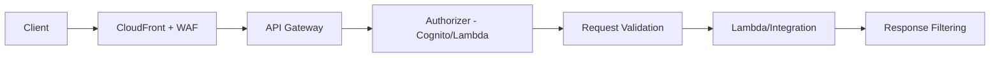

# How to Implement API Security Best Practices on AWS

Author: [nawazdhandala](https://github.com/nawazdhandala)

Tags: AWS, API Gateway, Security, WAF, Best Practices

Description: Learn how to secure APIs on AWS using API Gateway with authentication, rate limiting, WAF integration, input validation, and comprehensive monitoring.

---

APIs are the front door to your application. Every public API endpoint is an attack surface that bots, script kiddies, and sophisticated attackers will probe. If your API returns a stack trace on error, leaks internal data through overly verbose responses, or doesn't rate limit, you're going to have a bad time.

AWS API Gateway provides a solid foundation for API security, but you need to configure it properly and layer additional controls on top. Let's build a secure API from the ground up.

## API Gateway Security Architecture

A properly secured API has multiple layers of protection.



## Authentication and Authorization

Every API endpoint that isn't truly public should require authentication. API Gateway supports several options.

This Terraform configuration sets up a REST API with a Cognito authorizer.

```hcl
# Cognito User Pool for API authentication
resource "aws_cognito_user_pool" "api_users" {
  name = "api-users"

  # Password policy
  password_policy {
    minimum_length    = 12
    require_lowercase = true
    require_uppercase = true
    require_numbers   = true
    require_symbols   = true
  }

  # MFA configuration
  mfa_configuration = "OPTIONAL"
  software_token_mfa_configuration {
    enabled = true
  }

  # Account recovery
  account_recovery_setting {
    recovery_mechanism {
      name     = "verified_email"
      priority = 1
    }
  }

  # Prevent user enumeration
  user_pool_add_ons {
    advanced_security_mode = "ENFORCED"
  }
}

# API Gateway with Cognito authorizer
resource "aws_api_gateway_authorizer" "cognito" {
  name            = "cognito-authorizer"
  rest_api_id     = aws_api_gateway_rest_api.api.id
  type            = "COGNITO_USER_POOLS"
  provider_arns   = [aws_cognito_user_pool.api_users.arn]
  identity_source = "method.request.header.Authorization"
}

# Apply authorizer to a method
resource "aws_api_gateway_method" "get_orders" {
  rest_api_id   = aws_api_gateway_rest_api.api.id
  resource_id   = aws_api_gateway_resource.orders.id
  http_method   = "GET"
  authorization = "COGNITO_USER_POOLS"
  authorizer_id = aws_api_gateway_authorizer.cognito.id

  # Require specific OAuth scopes
  authorization_scopes = ["orders/read"]
}
```

For more complex authorization logic, use a Lambda authorizer.

```python
import json
import jwt
import os

def lambda_authorizer(event, context):
    """Custom Lambda authorizer with fine-grained access control."""
    token = event.get('authorizationToken', '').replace('Bearer ', '')

    try:
        # Verify the JWT token
        decoded = jwt.decode(
            token,
            os.environ['JWT_SECRET'],
            algorithms=['HS256'],
            audience=os.environ['API_AUDIENCE']
        )

        user_id = decoded['sub']
        roles = decoded.get('roles', [])
        method_arn = event['methodArn']

        # Build the policy based on user roles
        policy = generate_policy(user_id, roles, method_arn)
        return policy

    except jwt.ExpiredSignatureError:
        raise Exception('Unauthorized')  # 401
    except jwt.InvalidTokenError:
        raise Exception('Unauthorized')  # 401


def generate_policy(principal_id, roles, method_arn):
    """Generate IAM policy based on user roles."""
    arn_parts = method_arn.split(':')
    region = arn_parts[3]
    account_id = arn_parts[4]
    api_gateway_arn = arn_parts[5].split('/')
    api_id = api_gateway_arn[0]
    stage = api_gateway_arn[1]

    statements = []

    if 'admin' in roles:
        # Admins can access everything
        statements.append({
            'Action': 'execute-api:Invoke',
            'Effect': 'Allow',
            'Resource': f'arn:aws:execute-api:{region}:{account_id}:{api_id}/{stage}/*'
        })
    elif 'user' in roles:
        # Regular users can only GET and POST
        statements.append({
            'Action': 'execute-api:Invoke',
            'Effect': 'Allow',
            'Resource': [
                f'arn:aws:execute-api:{region}:{account_id}:{api_id}/{stage}/GET/*',
                f'arn:aws:execute-api:{region}:{account_id}:{api_id}/{stage}/POST/orders'
            ]
        })
        # Explicitly deny admin endpoints
        statements.append({
            'Action': 'execute-api:Invoke',
            'Effect': 'Deny',
            'Resource': f'arn:aws:execute-api:{region}:{account_id}:{api_id}/{stage}/*/admin/*'
        })

    return {
        'principalId': principal_id,
        'policyDocument': {
            'Version': '2012-10-17',
            'Statement': statements
        },
        'context': {
            'userId': principal_id,
            'roles': ','.join(roles)
        }
    }
```

## Request Validation

Validate requests before they reach your backend. API Gateway can validate request bodies against JSON schemas.

```hcl
# Request model (JSON Schema)
resource "aws_api_gateway_model" "create_order" {
  rest_api_id  = aws_api_gateway_rest_api.api.id
  name         = "CreateOrderRequest"
  content_type = "application/json"

  schema = jsonencode({
    "$schema"  = "http://json-schema.org/draft-04/schema#"
    type       = "object"
    required   = ["customer_id", "items"]
    properties = {
      customer_id = {
        type      = "string"
        pattern   = "^[a-zA-Z0-9-]{1,36}$"
        minLength = 1
        maxLength = 36
      }
      items = {
        type     = "array"
        minItems = 1
        maxItems = 100
        items = {
          type     = "object"
          required = ["product_id", "quantity"]
          properties = {
            product_id = {
              type    = "string"
              pattern = "^[A-Z0-9]{8}$"
            }
            quantity = {
              type    = "integer"
              minimum = 1
              maximum = 999
            }
          }
        }
      }
    }
    additionalProperties = false
  })
}

# Request validator
resource "aws_api_gateway_request_validator" "validate" {
  name                        = "validate-body-and-params"
  rest_api_id                 = aws_api_gateway_rest_api.api.id
  validate_request_body       = true
  validate_request_parameters = true
}
```

## Rate Limiting and Throttling

Without rate limits, a single client can overwhelm your API or run up your AWS bill.

```hcl
# Usage plan with rate limits
resource "aws_api_gateway_usage_plan" "standard" {
  name = "standard-plan"

  api_stages {
    api_id = aws_api_gateway_rest_api.api.id
    stage  = aws_api_gateway_stage.prod.stage_name

    # Per-method throttling
    throttle {
      path        = "/orders/GET"
      burst_limit = 50
      rate_limit  = 20
    }
    throttle {
      path        = "/orders/POST"
      burst_limit = 10
      rate_limit  = 5
    }
  }

  # Overall limits
  throttle_settings {
    burst_limit = 100
    rate_limit  = 50
  }

  # Monthly quota
  quota_settings {
    limit  = 100000
    period = "MONTH"
  }
}

# Stage-level throttling
resource "aws_api_gateway_method_settings" "all" {
  rest_api_id = aws_api_gateway_rest_api.api.id
  stage_name  = aws_api_gateway_stage.prod.stage_name
  method_path = "*/*"

  settings {
    throttling_burst_limit = 200
    throttling_rate_limit  = 100
    caching_enabled        = true
    cache_ttl_in_seconds   = 300
    metrics_enabled        = true
    logging_level          = "INFO"
    data_trace_enabled     = false  # Don't log request/response bodies
  }
}
```

## WAF Integration

AWS WAF adds another layer of protection in front of your API.

```hcl
# WAF Web ACL for API Gateway
resource "aws_wafv2_web_acl" "api" {
  name  = "api-protection"
  scope = "REGIONAL"

  default_action {
    allow {}
  }

  # Rate limiting rule
  rule {
    name     = "rate-limit"
    priority = 1
    action {
      block {}
    }
    statement {
      rate_based_statement {
        limit              = 2000
        aggregate_key_type = "IP"
      }
    }
    visibility_config {
      sampled_requests_enabled   = true
      cloudwatch_metrics_enabled = true
      metric_name               = "RateLimitRule"
    }
  }

  # SQL injection protection
  rule {
    name     = "sql-injection"
    priority = 2
    override_action {
      none {}
    }
    statement {
      managed_rule_group_statement {
        vendor_name = "AWS"
        name        = "AWSManagedRulesSQLiRuleSet"
      }
    }
    visibility_config {
      sampled_requests_enabled   = true
      cloudwatch_metrics_enabled = true
      metric_name               = "SQLInjectionRule"
    }
  }

  # Block known bad bots
  rule {
    name     = "bad-bots"
    priority = 3
    override_action {
      none {}
    }
    statement {
      managed_rule_group_statement {
        vendor_name = "AWS"
        name        = "AWSManagedRulesBotControlRuleSet"
      }
    }
    visibility_config {
      sampled_requests_enabled   = true
      cloudwatch_metrics_enabled = true
      metric_name               = "BotControlRule"
    }
  }

  visibility_config {
    sampled_requests_enabled   = true
    cloudwatch_metrics_enabled = true
    metric_name               = "APIWebACL"
  }
}

# Associate WAF with API Gateway stage
resource "aws_wafv2_web_acl_association" "api" {
  resource_arn = aws_api_gateway_stage.prod.arn
  web_acl_arn  = aws_wafv2_web_acl.api.arn
}
```

## Response Security

Don't leak internal details in your API responses. Configure proper response headers and error handling.

```python
def create_error_response(status_code, message):
    """Create a safe error response that doesn't leak internals."""
    # Map internal errors to safe external messages
    safe_messages = {
        400: "Invalid request",
        401: "Authentication required",
        403: "Insufficient permissions",
        404: "Resource not found",
        429: "Rate limit exceeded",
        500: "Internal server error"
    }

    return {
        'statusCode': status_code,
        'headers': {
            'Content-Type': 'application/json',
            'X-Content-Type-Options': 'nosniff',
            'X-Frame-Options': 'DENY',
            'Cache-Control': 'no-store',
            'Strict-Transport-Security': 'max-age=31536000; includeSubDomains',
            # Don't expose server information
            'Server': 'API',
        },
        'body': json.dumps({
            'error': safe_messages.get(status_code, "An error occurred"),
            'requestId': context.aws_request_id if status_code >= 500 else None
        })
    }
```

## API Monitoring

Monitor your API for security anomalies and performance issues.

```yaml
# CloudWatch alarms for API security monitoring
Resources:
  HighErrorRateAlarm:
    Type: AWS::CloudWatch::Alarm
    Properties:
      AlarmName: api-high-5xx-rate
      MetricName: 5XXError
      Namespace: AWS/ApiGateway
      Dimensions:
        - Name: ApiName
          Value: my-api
      Statistic: Sum
      Period: 300
      EvaluationPeriods: 2
      Threshold: 50
      ComparisonOperator: GreaterThanThreshold
      AlarmActions:
        - !Ref AlertTopic

  High4xxRateAlarm:
    Type: AWS::CloudWatch::Alarm
    Properties:
      AlarmName: api-high-4xx-rate
      MetricName: 4XXError
      Namespace: AWS/ApiGateway
      Dimensions:
        - Name: ApiName
          Value: my-api
      Statistic: Sum
      Period: 300
      EvaluationPeriods: 2
      Threshold: 500
      ComparisonOperator: GreaterThanThreshold
      AlarmActions:
        - !Ref AlertTopic
```

## Key Takeaways

API security isn't just about authentication. It's about validating every input, limiting request rates, protecting against common attacks with WAF, and monitoring for anomalies. A secure API is one where you've thought about what happens when someone sends unexpected data, makes thousands of requests per second, or tries to enumerate your endpoints.

Start with authentication and rate limiting - those cover the most common attack vectors. Then add WAF rules, request validation, and monitoring. Security is layers, and APIs need all of them.

For broader security guidance, see [defense in depth on AWS](https://oneuptime.com/blog/post/defense-in-depth-aws/view) and [serverless security best practices](https://oneuptime.com/blog/post/serverless-security-best-practices-aws/view).
