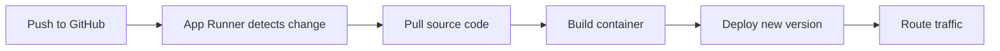

# How to Set Up App Runner with GitHub

Author: [nawazdhandala](https://github.com/nawazdhandala)

Tags: AWS, App Runner, GitHub, CI/CD, DevOps

Description: Learn how to connect AWS App Runner to your GitHub repository for automatic builds and deployments whenever you push code changes.

---

App Runner's GitHub integration takes things a step further than the ECR workflow. Instead of building Docker images yourself and pushing them to a registry, you connect App Runner directly to your GitHub repository. When you push code, App Runner pulls the source, builds the container, and deploys it. No CI/CD pipeline, no container registry management, no build servers.

This is the lowest-effort path from code to production on AWS. Let's set it up.

## How the GitHub Integration Works

The flow looks like this:



App Runner uses an AWS-managed GitHub connection to watch your repository. When it detects a change on the configured branch, it pulls the code, builds a container image using your Dockerfile (or a managed runtime), and deploys it.

## Step 1: Create a GitHub Connection

First, you need to authorize AWS to access your GitHub repositories. This is done through the AWS Console or CLI:

```bash
# Create a GitHub connection
aws apprunner create-connection \
  --connection-name my-github-connection \
  --provider-type GITHUB
```

This returns a connection ARN, but the connection is in `PENDING_HANDSHAKE` status. You need to complete the authorization in the AWS Console:

1. Go to the App Runner console
2. Navigate to "GitHub connections"
3. Click on your pending connection
4. Complete the GitHub OAuth flow
5. Select which repositories to grant access to

Once authorized, the connection status changes to `AVAILABLE`.

```bash
# Verify the connection is ready
aws apprunner describe-connection \
  --connection-name my-github-connection \
  --query "Connection.{name:ConnectionName, status:Status}"
```

## Step 2: Prepare Your Repository

App Runner supports two build approaches:

### Option A: Using a Dockerfile

If your repository has a Dockerfile, App Runner uses it to build the image. This gives you full control over the build process.

```dockerfile
# Dockerfile
FROM node:20-alpine AS builder
WORKDIR /app
COPY package*.json ./
RUN npm ci
COPY . .
RUN npm run build

FROM node:20-alpine
WORKDIR /app
COPY --from=builder /app/dist ./dist
COPY --from=builder /app/node_modules ./node_modules
COPY package*.json ./
EXPOSE 8080
USER node
CMD ["node", "dist/server.js"]
```

### Option B: Using a Managed Runtime

For supported runtimes (Node.js, Python, Java, .NET, Go, PHP, Ruby), you can skip the Dockerfile entirely and use App Runner's managed build. You configure the build and start commands in the service configuration or in an `apprunner.yaml` file.

Create an `apprunner.yaml` in your repo root:

```yaml
# apprunner.yaml
version: 1.0
runtime: nodejs18

build:
  commands:
    build:
      - npm ci
      - npm run build

run:
  command: node dist/server.js
  network:
    port: 8080
    env: PORT
  env:
    - name: NODE_ENV
      value: production
```

The managed runtime approach means App Runner handles the base image, security patches, and runtime updates for you.

## Step 3: Create the App Runner Service

Now create the service pointing to your GitHub repository:

```bash
# Create the service with GitHub source
aws apprunner create-service \
  --service-name my-webapp \
  --source-configuration '{
    "codeRepository": {
      "repositoryUrl": "https://github.com/myorg/my-webapp",
      "sourceCodeVersion": {
        "type": "BRANCH",
        "value": "main"
      },
      "codeConfiguration": {
        "configurationSource": "REPOSITORY",
        "codeConfigurationValues": {
          "runtime": "NODEJS_18",
          "buildCommand": "npm ci && npm run build",
          "startCommand": "node dist/server.js",
          "port": "8080",
          "runtimeEnvironmentVariables": {
            "NODE_ENV": "production"
          }
        }
      }
    },
    "autoDeploymentsEnabled": true,
    "authenticationConfiguration": {
      "connectionArn": "arn:aws:apprunner:us-east-1:123456789012:connection/my-github-connection/abc123"
    }
  }' \
  --instance-configuration '{
    "cpu": "1024",
    "memory": "2048"
  }' \
  --health-check-configuration '{
    "protocol": "HTTP",
    "path": "/health",
    "interval": 10,
    "timeout": 5,
    "healthyThreshold": 1,
    "unhealthyThreshold": 5
  }'
```

If you're using a Dockerfile instead of a managed runtime, change `configurationSource` to `"API"` and omit the runtime/build/start commands:

```bash
# For Dockerfile-based builds
"codeConfiguration": {
  "configurationSource": "API",
  "codeConfigurationValues": {
    "runtime": "DOCKER",
    "runtimeEnvironmentVariables": {
      "NODE_ENV": "production"
    }
  }
}
```

## Step 4: Verify the Deployment

Check the service status and get the URL:

```bash
# Get the service URL and status
aws apprunner describe-service \
  --service-arn arn:aws:apprunner:us-east-1:123456789012:service/my-webapp/abc123 \
  --query "Service.{status:Status, url:ServiceUrl, created:CreatedAt}"
```

The first deployment takes a few minutes since App Runner needs to build the container from scratch. Subsequent deployments are faster thanks to Docker layer caching.

## Branch-Based Deployments

You can configure which branch triggers deployments:

```json
"sourceCodeVersion": {
  "type": "BRANCH",
  "value": "main"
}
```

For a staging environment, point to a different branch:

```json
"sourceCodeVersion": {
  "type": "BRANCH",
  "value": "staging"
}
```

This gives you a simple promotion workflow: merge to `staging` for staging deployment, merge to `main` for production deployment. Each branch has its own App Runner service.

## Environment-Specific Configuration

Manage different environments by combining environment variables with the `apprunner.yaml` file:

```yaml
# apprunner.yaml - the build config is the same for all environments
version: 1.0
runtime: nodejs18

build:
  commands:
    build:
      - npm ci
      - npm run build

run:
  command: node dist/server.js
  network:
    port: 8080
    env: PORT
```

Then override environment-specific values in the service configuration:

```bash
# Production service
"runtimeEnvironmentVariables": {
  "NODE_ENV": "production",
  "LOG_LEVEL": "warn",
  "CACHE_TTL": "3600"
}

# Staging service
"runtimeEnvironmentVariables": {
  "NODE_ENV": "staging",
  "LOG_LEVEL": "debug",
  "CACHE_TTL": "60"
}
```

Secrets should always come from Secrets Manager or Parameter Store, not from environment variables:

```bash
"runtimeEnvironmentSecrets": {
  "DATABASE_URL": "arn:aws:secretsmanager:us-east-1:123456789012:secret:prod/db-url",
  "API_KEY": "arn:aws:ssm:us-east-1:123456789012:parameter/prod/api-key"
}
```

## Monitoring Builds and Deployments

Track your deployments to catch build failures:

```bash
# List recent operations
aws apprunner list-operations \
  --service-arn arn:aws:apprunner:us-east-1:123456789012:service/my-webapp/abc123 \
  --query "OperationSummaryList[0:5].{type:Type, status:Status, started:StartedAt, ended:EndedAt}"
```

If a build fails, check the CloudWatch logs. App Runner creates log groups for both the build process and the running application:

- Build logs: `/aws/apprunner/{service-name}/{service-id}/build`
- Application logs: `/aws/apprunner/{service-name}/{service-id}/application`

```bash
# Check recent build logs
aws logs get-log-events \
  --log-group-name "/aws/apprunner/my-webapp/abc123/build" \
  --log-stream-name $(aws logs describe-log-streams \
    --log-group-name "/aws/apprunner/my-webapp/abc123/build" \
    --order-by LastEventTime --descending --limit 1 \
    --query "logStreams[0].logStreamName" --output text) \
  --limit 50
```

## Handling Build Failures

Common build failures and their fixes:

**Missing dependencies:** Your build command installs dependencies, but a package fails to install. Check that your `package-lock.json` (or equivalent) is committed to the repository.

**Out of memory during build:** Large build processes can exhaust memory. Optimize your build or increase the instance size. App Runner uses the instance configuration for both build and runtime.

**Dockerfile issues:** If using a Dockerfile, make sure it works locally with `docker build .` before pushing. Common issues include missing files in the build context and incorrect COPY paths.

**Build timeout:** App Runner has a build timeout. If your build is complex (compiling native modules, running tests), it might time out. Simplify the build or move heavy work to a separate CI step.

## When GitHub Integration vs ECR

Use the GitHub integration when:
- You want the simplest possible setup
- Your build is straightforward (npm install + build, pip install, etc.)
- You don't need custom build environments
- Your team primarily works in one repository

Use ECR when:
- You have a complex build process that needs a full CI/CD pipeline
- You need to run tests before deployment
- You use a monorepo and only want to deploy on specific path changes
- You need build caching strategies that App Runner doesn't support
- You want to share images across multiple services

For the ECR approach, see our guide on [setting up App Runner with ECR](https://oneuptime.com/blog/post/2026-02-12-app-runner-with-ecr/view).

## Wrapping Up

The App Runner GitHub integration is the fastest path from code to a running web service on AWS. Push to your branch, and App Runner handles the build, deployment, scaling, and TLS. For teams that want to focus on writing code rather than managing infrastructure, it's an excellent choice.

Just remember that this simplicity comes with tradeoffs. You get less control over the build process, limited customization options, and fewer deployment strategies compared to a full CI/CD pipeline with ECR. Pick the approach that matches your team's needs and complexity requirements.
