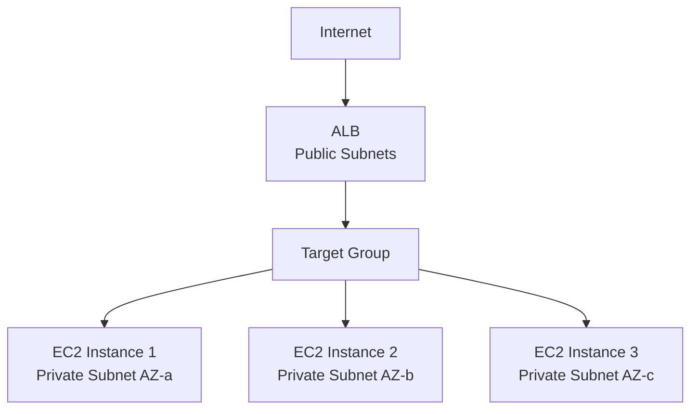

# How to Set Up an Application Load Balancer (ALB) for EC2

Author: [nawazdhandala](https://github.com/nawazdhandala)

Tags: AWS, EC2, ALB, Load Balancing, High Availability

Description: A complete guide to setting up an Application Load Balancer for EC2 instances including target groups, listeners, and health checks.

---

An Application Load Balancer (ALB) distributes incoming HTTP/HTTPS traffic across multiple EC2 instances. It operates at Layer 7 (application layer), which means it understands HTTP and can make routing decisions based on URL paths, hostnames, headers, and query strings. If you're running a web application on EC2, an ALB is usually the right choice for load balancing.

Let's build one from scratch.

## ALB Architecture

Here's how the pieces fit together:



The ALB sits in public subnets (at least 2 AZs required), and it routes traffic to instances registered in target groups. Target groups can be in private subnets - the ALB handles the connectivity.

## Creating the ALB

First, you need the ALB itself. It requires at least two subnets in different Availability Zones.

This command creates an internet-facing ALB across two public subnets:

```bash
# Create the ALB
ALB_ARN=$(aws elbv2 create-load-balancer \
  --name my-web-alb \
  --type application \
  --scheme internet-facing \
  --subnets subnet-public-1a subnet-public-1b subnet-public-1c \
  --security-groups sg-alb-security-group \
  --tags Key=Name,Value=my-web-alb \
  --query 'LoadBalancers[0].LoadBalancerArn' --output text)

echo "ALB ARN: $ALB_ARN"
```

For internal applications (not exposed to the internet), use `--scheme internal` and place the ALB in private subnets.

## Security Group for the ALB

The ALB needs its own security group. It should accept HTTP/HTTPS from the internet and forward traffic to your instances.

```bash
# Create ALB security group
ALB_SG=$(aws ec2 create-security-group \
  --group-name alb-sg \
  --description "ALB security group" \
  --vpc-id vpc-0123456789abcdef0 \
  --query 'GroupId' --output text)

# Allow HTTP from anywhere
aws ec2 authorize-security-group-ingress \
  --group-id $ALB_SG \
  --protocol tcp --port 80 \
  --cidr 0.0.0.0/0

# Allow HTTPS from anywhere
aws ec2 authorize-security-group-ingress \
  --group-id $ALB_SG \
  --protocol tcp --port 443 \
  --cidr 0.0.0.0/0
```

Your EC2 instances' security group should only accept traffic from the ALB:

```bash
# Instance security group - traffic from ALB only
aws ec2 authorize-security-group-ingress \
  --group-id $INSTANCE_SG \
  --protocol tcp --port 80 \
  --source-group $ALB_SG \
  --description "HTTP from ALB"
```

## Creating a Target Group

Target groups define where the ALB sends traffic and how it checks instance health.

This creates a target group for HTTP traffic on port 80 with a health check:

```bash
# Create target group
TG_ARN=$(aws elbv2 create-target-group \
  --name web-targets \
  --protocol HTTP \
  --port 80 \
  --vpc-id vpc-0123456789abcdef0 \
  --target-type instance \
  --health-check-protocol HTTP \
  --health-check-path /health \
  --health-check-interval-seconds 30 \
  --health-check-timeout-seconds 5 \
  --healthy-threshold-count 3 \
  --unhealthy-threshold-count 2 \
  --query 'TargetGroups[0].TargetGroupArn' --output text)

echo "Target Group ARN: $TG_ARN"
```

## Registering EC2 Instances

Add your EC2 instances to the target group:

```bash
# Register instances with the target group
aws elbv2 register-targets \
  --target-group-arn $TG_ARN \
  --targets Id=i-instance1 Id=i-instance2 Id=i-instance3

# Verify registration and health status
aws elbv2 describe-target-health \
  --target-group-arn $TG_ARN \
  --query 'TargetHealthDescriptions[].{
    ID:Target.Id,
    Port:Target.Port,
    Health:TargetHealth.State,
    Reason:TargetHealth.Reason
  }' --output table
```

## Creating Listeners

Listeners define what protocols and ports the ALB accepts traffic on and what to do with it.

Set up an HTTP listener that redirects to HTTPS, and an HTTPS listener that forwards to your target group:

```bash
# HTTP listener - redirect to HTTPS
aws elbv2 create-listener \
  --load-balancer-arn $ALB_ARN \
  --protocol HTTP \
  --port 80 \
  --default-actions '[{
    "Type": "redirect",
    "RedirectConfig": {
      "Protocol": "HTTPS",
      "Port": "443",
      "StatusCode": "HTTP_301"
    }
  }]'

# HTTPS listener - forward to target group
aws elbv2 create-listener \
  --load-balancer-arn $ALB_ARN \
  --protocol HTTPS \
  --port 443 \
  --certificates CertificateArn=arn:aws:acm:us-east-1:123456789012:certificate/abc123 \
  --ssl-policy ELBSecurityPolicy-TLS13-1-2-2021-06 \
  --default-actions '[{
    "Type": "forward",
    "TargetGroupArn": "'$TG_ARN'"
  }]'
```

The SSL certificate should be managed through AWS Certificate Manager (ACM). The SSL policy `ELBSecurityPolicy-TLS13-1-2-2021-06` enforces TLS 1.2 and 1.3 only, which is the recommended security baseline.

## Terraform Configuration

Here's a complete Terraform setup for an ALB:

```hcl
resource "aws_lb" "web" {
  name               = "web-alb"
  internal           = false
  load_balancer_type = "application"
  security_groups    = [aws_security_group.alb.id]
  subnets            = var.public_subnet_ids

  enable_deletion_protection = true
  drop_invalid_header_fields = true

  access_logs {
    bucket  = aws_s3_bucket.alb_logs.id
    prefix  = "alb-logs"
    enabled = true
  }

  tags = {
    Name = "web-alb"
  }
}

resource "aws_lb_target_group" "web" {
  name     = "web-targets"
  port     = 80
  protocol = "HTTP"
  vpc_id   = var.vpc_id

  health_check {
    path                = "/health"
    port                = "traffic-port"
    protocol            = "HTTP"
    healthy_threshold   = 3
    unhealthy_threshold = 2
    timeout             = 5
    interval            = 30
    matcher             = "200"
  }

  deregistration_delay = 60

  stickiness {
    type            = "lb_cookie"
    cookie_duration = 3600
    enabled         = false
  }
}

# HTTP to HTTPS redirect
resource "aws_lb_listener" "http" {
  load_balancer_arn = aws_lb.web.arn
  port              = 80
  protocol          = "HTTP"

  default_action {
    type = "redirect"
    redirect {
      port        = "443"
      protocol    = "HTTPS"
      status_code = "HTTP_301"
    }
  }
}

# HTTPS listener
resource "aws_lb_listener" "https" {
  load_balancer_arn = aws_lb.web.arn
  port              = 443
  protocol          = "HTTPS"
  ssl_policy        = "ELBSecurityPolicy-TLS13-1-2-2021-06"
  certificate_arn   = var.certificate_arn

  default_action {
    type             = "forward"
    target_group_arn = aws_lb_target_group.web.arn
  }
}

# Register instances (or use an ASG)
resource "aws_lb_target_group_attachment" "web" {
  count            = length(var.instance_ids)
  target_group_arn = aws_lb_target_group.web.arn
  target_id        = var.instance_ids[count.index]
  port             = 80
}
```

## Integrating with Auto Scaling

The best way to use an ALB is with an Auto Scaling group. The ASG automatically registers and deregisters instances from the target group.

```bash
# Create ASG with ALB target group
aws autoscaling create-auto-scaling-group \
  --auto-scaling-group-name web-asg \
  --launch-template LaunchTemplateId=lt-0123456789abcdef0,Version='$Latest' \
  --min-size 2 \
  --max-size 10 \
  --desired-capacity 3 \
  --vpc-zone-identifier "subnet-private-1a,subnet-private-1b,subnet-private-1c" \
  --target-group-arns $TG_ARN \
  --health-check-type ELB \
  --health-check-grace-period 300
```

Setting `health-check-type` to `ELB` means the ASG uses the ALB health check to determine if instances are healthy. If an instance fails the ALB health check, the ASG replaces it.

## Enabling Access Logs

ALB access logs provide detailed information about every request. Enable them for troubleshooting and analytics:

```bash
# Enable access logging
aws elbv2 modify-load-balancer-attributes \
  --load-balancer-arn $ALB_ARN \
  --attributes \
    Key=access_logs.s3.enabled,Value=true \
    Key=access_logs.s3.bucket,Value=my-alb-logs-bucket \
    Key=access_logs.s3.prefix,Value=web-alb
```

The S3 bucket needs a specific bucket policy to allow the ALB to write logs. Check the AWS documentation for the ELB account ID for your region.

## Connection Draining

When instances are removed from the target group (during scale-in or deployment), you want existing connections to finish gracefully:

```bash
# Set deregistration delay (connection draining timeout)
aws elbv2 modify-target-group-attributes \
  --target-group-arn $TG_ARN \
  --attributes Key=deregistration_delay.timeout_seconds,Value=60
```

60 seconds is a good default for most web applications. Adjust based on your longest expected request duration.

## Monitoring the ALB

Key CloudWatch metrics to watch:

- **RequestCount** - Total requests processed
- **TargetResponseTime** - How long your instances take to respond
- **HTTPCode_ELB_5XX_Count** - ALB-generated 5xx errors (capacity issues)
- **HTTPCode_Target_5XX_Count** - Application-generated 5xx errors
- **HealthyHostCount / UnHealthyHostCount** - Target health status
- **ActiveConnectionCount** - Current active connections

For comprehensive monitoring of your ALB metrics including response times, error rates, and target health, check out [health check configuration best practices](https://oneuptime.com/blog/post/2026-02-12-configure-health-checks-ec2-load-balancer/view) to keep your load balancer running smoothly.

## Summary

Setting up an ALB involves creating the load balancer in public subnets, defining target groups with health checks, setting up listeners for HTTP/HTTPS, and registering your instances. Combine it with an Auto Scaling group for automatic instance management, enable access logs for troubleshooting, and monitor the key CloudWatch metrics. The ALB handles SSL termination, HTTP/2, WebSocket support, and Layer 7 routing out of the box, making it the go-to choice for web application load balancing on AWS.
