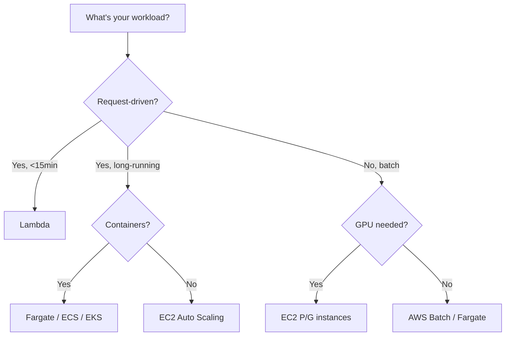

# How to Apply the Performance Efficiency Pillar on AWS

Author: [nawazdhandala](https://github.com/nawazdhandala)

Tags: AWS, Well-Architected, Performance, Optimization, Serverless

Description: How to implement the Performance Efficiency pillar of the AWS Well-Architected Framework with practical approaches to compute, storage, database, and network optimization.

---

The Performance Efficiency pillar is about using IT and computing resources efficiently. It's not just about making things fast - it's about choosing the right resources, keeping them optimized as workloads evolve, and staying current as AWS releases new capabilities. An architecture that was well-optimized two years ago might be running on outdated instance types with better alternatives available today.

Let's look at how to apply this pillar across compute, storage, database, and networking on AWS.

## Design Principles

The Performance Efficiency pillar has five design principles:

1. Democratize advanced technologies
2. Go global in minutes
3. Use serverless architectures
4. Experiment more often
5. Consider mechanical sympathy

## Selection: Choosing the Right Resources

The biggest performance wins often come from choosing the right service for your workload, not from tuning the wrong one.

### Compute Selection

Match your compute to your workload characteristics:



**Lambda for event-driven workloads:**

```hcl
resource "aws_lambda_function" "api" {
  function_name = "api-handler"
  runtime       = "nodejs20.x"
  handler       = "index.handler"
  memory_size   = 1769  # 1 vCPU equivalent
  timeout       = 30

  # Use ARM for better price-performance
  architectures = ["arm64"]

  environment {
    variables = {
      TABLE_NAME = aws_dynamodb_table.main.name
    }
  }

  # Enable SnapStart for Java functions
  # snap_start {
  #   apply_on = "PublishedVersions"
  # }
}
```

ARM-based Lambda functions (Graviton2) are up to 20% cheaper with comparable or better performance than x86. It's a free optimization for most workloads.

**Right-sizing EC2 instances:**

```hcl
# Use Compute Optimizer recommendations
# Start with a general-purpose instance
resource "aws_instance" "app" {
  ami           = var.ami_id
  instance_type = "m7g.large"  # Graviton3 - best price-performance

  # Enable detailed monitoring for better metrics
  monitoring = true

  tags = {
    Name = "app-server"
  }
}
```

AWS Compute Optimizer analyzes your CloudWatch metrics and recommends better instance types. Check it regularly.

### Storage Selection

Different storage types for different access patterns:

```hcl
# GP3 for general workloads - you set IOPS and throughput independently
resource "aws_ebs_volume" "app" {
  availability_zone = "us-east-1a"
  size              = 100
  type              = "gp3"
  iops              = 3000
  throughput        = 125
}

# IO2 for latency-sensitive databases
resource "aws_ebs_volume" "database" {
  availability_zone = "us-east-1a"
  size              = 500
  type              = "io2"
  iops              = 10000
}

# S3 with intelligent tiering for unpredictable access patterns
resource "aws_s3_bucket" "data" {
  bucket = "app-data-bucket"
}

resource "aws_s3_bucket_intelligent_tiering_configuration" "data" {
  bucket = aws_s3_bucket.data.id
  name   = "auto-tier"

  tiering {
    access_tier = "DEEP_ARCHIVE_ACCESS"
    days        = 180
  }

  tiering {
    access_tier = "ARCHIVE_ACCESS"
    days        = 90
  }
}
```

### Database Selection

Choose the right database engine for your access pattern:

- **DynamoDB** - Key-value or document queries with single-digit millisecond latency
- **RDS/Aurora** - Complex queries with joins, transactions, and SQL
- **ElastiCache** - Sub-millisecond caching layer
- **Neptune** - Graph queries
- **Timestream** - Time-series data

**DynamoDB with DAX caching for microsecond reads:**

```hcl
resource "aws_dynamodb_table" "main" {
  name         = "app-data"
  billing_mode = "PAY_PER_REQUEST"
  hash_key     = "PK"
  range_key    = "SK"

  attribute {
    name = "PK"
    type = "S"
  }

  attribute {
    name = "SK"
    type = "S"
  }
}

# DAX cluster for microsecond cached reads
resource "aws_dax_cluster" "main" {
  cluster_name       = "app-dax"
  iam_role_arn       = aws_iam_role.dax.arn
  node_type          = "dax.r5.large"
  replication_factor = 3  # nodes in the cluster

  subnet_group_name  = aws_dax_subnet_group.main.name
  security_group_ids = [aws_security_group.dax.id]
}
```

## Caching Strategies

Caching is often the single biggest performance improvement you can make:

```hcl
# ElastiCache Redis cluster
resource "aws_elasticache_replication_group" "main" {
  replication_group_id = "app-cache"
  description          = "Application cache"
  node_type            = "cache.r7g.large"  # Graviton3
  num_cache_clusters   = 3

  engine               = "redis"
  engine_version       = "7.1"
  port                 = 6379

  at_rest_encryption_enabled = true
  transit_encryption_enabled = true

  automatic_failover_enabled = true
  multi_az_enabled           = true

  subnet_group_name  = aws_elasticache_subnet_group.main.name
  security_group_ids = [aws_security_group.cache.id]
}
```

**CloudFront for edge caching:**

```hcl
resource "aws_cloudfront_distribution" "main" {
  enabled         = true
  is_ipv6_enabled = true

  origin {
    domain_name = aws_lb.main.dns_name
    origin_id   = "alb"

    custom_origin_config {
      http_port              = 80
      https_port             = 443
      origin_protocol_policy = "https-only"
      origin_ssl_protocols   = ["TLSv1.2"]
    }
  }

  default_cache_behavior {
    allowed_methods  = ["GET", "HEAD", "OPTIONS"]
    cached_methods   = ["GET", "HEAD"]
    target_origin_id = "alb"

    cache_policy_id          = aws_cloudfront_cache_policy.optimized.id
    origin_request_policy_id = aws_cloudfront_origin_request_policy.main.id

    viewer_protocol_policy = "redirect-to-https"
    compress               = true  # enable gzip/brotli compression
  }

  viewer_certificate {
    acm_certificate_arn = aws_acm_certificate.main.arn
    ssl_support_method  = "sni-only"
  }

  restrictions {
    geo_restriction {
      restriction_type = "none"
    }
  }
}
```

## Network Optimization

**VPC Endpoints** reduce latency for AWS service calls by keeping traffic on the AWS network:

```hcl
# Gateway endpoint for S3 - free and reduces latency
resource "aws_vpc_endpoint" "s3" {
  vpc_id       = aws_vpc.main.id
  service_name = "com.amazonaws.${var.region}.s3"

  route_table_ids = aws_route_table.private[*].id
}

# Gateway endpoint for DynamoDB - also free
resource "aws_vpc_endpoint" "dynamodb" {
  vpc_id       = aws_vpc.main.id
  service_name = "com.amazonaws.${var.region}.dynamodb"

  route_table_ids = aws_route_table.private[*].id
}
```

**Enhanced Networking** - Use instances with ENA (Elastic Network Adapter) for up to 100 Gbps networking. Most current-generation instances include this by default.

## Monitoring Performance

You can't optimize what you can't measure:

```hcl
# X-Ray for distributed tracing
resource "aws_xray_sampling_rule" "main" {
  rule_name      = "app-sampling"
  priority       = 1000
  reservoir_size = 1
  fixed_rate     = 0.05  # sample 5% of requests
  host           = "*"
  http_method    = "*"
  service_name   = "*"
  service_type   = "*"
  url_path       = "*"
  version        = 1
  resource_arn   = "*"
}

# CloudWatch custom metrics for application performance
resource "aws_cloudwatch_metric_alarm" "latency_p99" {
  alarm_name          = "api-latency-p99"
  comparison_operator = "GreaterThanThreshold"
  evaluation_periods  = 3
  metric_name         = "TargetResponseTime"
  namespace           = "AWS/ApplicationELB"
  period              = 300
  extended_statistic  = "p99"
  threshold           = 2  # 2 seconds
  alarm_actions       = [aws_sns_topic.alerts.arn]

  dimensions = {
    LoadBalancer = aws_lb.main.arn_suffix
  }
}
```

For a comprehensive monitoring approach, check out our guide on [AWS infrastructure monitoring](https://oneuptime.com/blog/post/2026-02-02-pulumi-aws-infrastructure/view).

## Continuous Optimization

Performance efficiency isn't a one-time activity:

1. **Review new instance types** - AWS releases new instance families regularly. Graviton-based instances offer the best price-performance for most workloads
2. **Check Compute Optimizer** - Regularly review its recommendations
3. **Load test** - Run load tests before major releases and after architecture changes
4. **Review metrics weekly** - Look at P99 latencies, error rates, and resource utilization

## Summary

Performance Efficiency is about consistently choosing the right resources, measuring their effectiveness, and evolving as better options become available. Use serverless and managed services where possible, cache aggressively at every layer, and let data (not intuition) drive your optimization decisions. The goal isn't just speed - it's getting the most value from every dollar of compute, storage, and networking you use.
