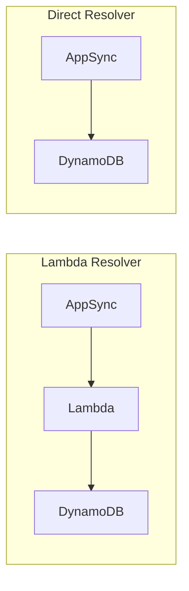

# Set Up AppSync with DynamoDB Direct Resolvers

Author: [nawazdhandala](https://github.com/nawazdhandala)

Tags: AWS, AppSync, DynamoDB, GraphQL, Serverless

Description: Learn how to connect AWS AppSync directly to DynamoDB without Lambda functions using VTL and JavaScript resolvers for faster, cheaper GraphQL APIs.

---

Lambda resolvers are flexible but they come with overhead - cold starts, invocation costs, and code to maintain. For simple CRUD operations against DynamoDB, you can skip Lambda entirely and have AppSync talk to DynamoDB directly. This means fewer moving parts, lower latency, and zero Lambda costs.

The tradeoff is that your resolver logic lives in VTL (Velocity Template Language) or JavaScript resolver code instead of a full Lambda function. For simple operations, that's a great deal.

## Direct Resolvers vs Lambda Resolvers

With Lambda resolvers, the flow is: AppSync -> Lambda -> DynamoDB -> Lambda -> AppSync. With direct resolvers, it's: AppSync -> DynamoDB -> AppSync. You cut out two network hops and the Lambda execution entirely.



## Setting Up the Schema

We'll use the same product catalog schema from our [AppSync Lambda resolvers post](https://oneuptime.com/blog/post/2026-02-12-appsync-graphql-apis-lambda-resolvers/view), but this time with DynamoDB direct resolvers.

This schema covers basic CRUD operations:

```graphql
type Product {
  id: ID!
  name: String!
  description: String
  price: Float!
  category: String!
  inStock: Boolean!
  createdAt: String
  updatedAt: String
}

type ProductConnection {
  items: [Product]
  nextToken: String
}

type Query {
  getProduct(id: ID!): Product
  listProducts(limit: Int, nextToken: String): ProductConnection
  productsByCategory(category: String!, limit: Int, nextToken: String): ProductConnection
}

type Mutation {
  createProduct(input: CreateProductInput!): Product
  updateProduct(id: ID!, input: UpdateProductInput!): Product
  deleteProduct(id: ID!): Product
}

input CreateProductInput {
  name: String!
  description: String
  price: Float!
  category: String!
}

input UpdateProductInput {
  name: String
  description: String
  price: Float
  category: String
  inStock: Boolean
}
```

## Creating the DynamoDB Data Source

First, create a DynamoDB data source in AppSync.

This connects your AppSync API to a DynamoDB table:

```bash
aws appsync create-data-source \
  --api-id YOUR_API_ID \
  --name ProductsTable \
  --type AMAZON_DYNAMODB \
  --dynamodb-config '{
    "tableName": "Products",
    "awsRegion": "us-east-1"
  }' \
  --service-role-arn arn:aws:iam::123456789:role/AppSyncDynamoDBRole
```

The IAM role needs permission to read and write to the DynamoDB table:

```json
{
  "Version": "2012-10-17",
  "Statement": [
    {
      "Effect": "Allow",
      "Action": [
        "dynamodb:GetItem",
        "dynamodb:PutItem",
        "dynamodb:UpdateItem",
        "dynamodb:DeleteItem",
        "dynamodb:Scan",
        "dynamodb:Query"
      ],
      "Resource": [
        "arn:aws:dynamodb:us-east-1:123456789:table/Products",
        "arn:aws:dynamodb:us-east-1:123456789:table/Products/index/*"
      ]
    }
  ]
}
```

## JavaScript Resolvers (Recommended)

AppSync now supports JavaScript resolvers, which are much more readable than VTL. Let's use those.

### GetProduct Resolver

This resolver fetches a single product by ID:

```javascript
// getProduct resolver
import { util } from '@aws-appsync/utils';

export function request(ctx) {
  return {
    operation: 'GetItem',
    key: util.dynamodb.toMapValues({ id: ctx.args.id })
  };
}

export function response(ctx) {
  if (ctx.error) {
    util.error(ctx.error.message, ctx.error.type);
  }
  return ctx.result;
}
```

### ListProducts Resolver

This resolver scans the table with pagination support:

```javascript
// listProducts resolver
import { util } from '@aws-appsync/utils';

export function request(ctx) {
  const { limit = 20, nextToken } = ctx.args;

  const request = {
    operation: 'Scan',
    limit: limit
  };

  if (nextToken) {
    request.nextToken = nextToken;
  }

  return request;
}

export function response(ctx) {
  if (ctx.error) {
    util.error(ctx.error.message, ctx.error.type);
  }

  return {
    items: ctx.result.items,
    nextToken: ctx.result.nextToken || null
  };
}
```

### ProductsByCategory Resolver

This resolver queries a GSI for products in a specific category:

```javascript
// productsByCategory resolver
import { util } from '@aws-appsync/utils';

export function request(ctx) {
  const { category, limit = 20, nextToken } = ctx.args;

  const request = {
    operation: 'Query',
    index: 'category-index',
    query: {
      expression: 'category = :category',
      expressionValues: util.dynamodb.toMapValues({
        ':category': category
      })
    },
    limit: limit
  };

  if (nextToken) {
    request.nextToken = nextToken;
  }

  return request;
}

export function response(ctx) {
  if (ctx.error) {
    util.error(ctx.error.message, ctx.error.type);
  }

  return {
    items: ctx.result.items,
    nextToken: ctx.result.nextToken || null
  };
}
```

### CreateProduct Resolver

This resolver creates a new product with auto-generated ID and timestamps:

```javascript
// createProduct resolver
import { util } from '@aws-appsync/utils';

export function request(ctx) {
  const id = util.autoId();
  const now = util.time.nowISO8601();

  const item = {
    id: id,
    ...ctx.args.input,
    inStock: true,
    createdAt: now,
    updatedAt: now
  };

  return {
    operation: 'PutItem',
    key: util.dynamodb.toMapValues({ id }),
    attributeValues: util.dynamodb.toMapValues(item)
  };
}

export function response(ctx) {
  if (ctx.error) {
    util.error(ctx.error.message, ctx.error.type);
  }
  return ctx.result;
}
```

### UpdateProduct Resolver

This resolver dynamically builds an update expression from the provided fields:

```javascript
// updateProduct resolver
import { util } from '@aws-appsync/utils';

export function request(ctx) {
  const { id, input } = ctx.args;

  const expressionParts = [];
  const expressionNames = {};
  const expressionValues = {};

  // Build update expression dynamically
  Object.entries(input).forEach(([key, value]) => {
    if (value !== null && value !== undefined) {
      const nameRef = `#${key}`;
      const valueRef = `:${key}`;
      expressionParts.push(`${nameRef} = ${valueRef}`);
      expressionNames[nameRef] = key;
      expressionValues[valueRef] = value;
    }
  });

  // Always update the timestamp
  expressionParts.push('#updatedAt = :updatedAt');
  expressionNames['#updatedAt'] = 'updatedAt';
  expressionValues[':updatedAt'] = util.time.nowISO8601();

  return {
    operation: 'UpdateItem',
    key: util.dynamodb.toMapValues({ id }),
    update: {
      expression: `SET ${expressionParts.join(', ')}`,
      expressionNames: expressionNames,
      expressionValues: util.dynamodb.toMapValues(expressionValues)
    }
  };
}

export function response(ctx) {
  if (ctx.error) {
    util.error(ctx.error.message, ctx.error.type);
  }
  return ctx.result;
}
```

### DeleteProduct Resolver

This resolver deletes a product and returns the deleted item:

```javascript
// deleteProduct resolver
import { util } from '@aws-appsync/utils';

export function request(ctx) {
  return {
    operation: 'DeleteItem',
    key: util.dynamodb.toMapValues({ id: ctx.args.id })
  };
}

export function response(ctx) {
  if (ctx.error) {
    util.error(ctx.error.message, ctx.error.type);
  }
  return ctx.result;
}
```

## Attaching Resolvers

Create resolvers for each field using the JavaScript runtime:

```bash
# Attach getProduct resolver
aws appsync create-resolver \
  --api-id YOUR_API_ID \
  --type-name Query \
  --field-name getProduct \
  --data-source-name ProductsTable \
  --runtime '{"name": "APPSYNC_JS", "runtimeVersion": "1.0.0"}' \
  --code file://resolvers/getProduct.js
```

Repeat for each resolver.

## CloudFormation Template

Here's a complete CloudFormation template for the direct resolver setup:

```yaml
AWSTemplateFormatVersion: '2010-09-09'
Transform: AWS::Serverless-2016-10-31

Resources:
  ProductApi:
    Type: AWS::AppSync::GraphQLApi
    Properties:
      Name: ProductCatalogDirect
      AuthenticationType: API_KEY

  Schema:
    Type: AWS::AppSync::GraphQLSchema
    Properties:
      ApiId: !GetAtt ProductApi.ApiId
      DefinitionS3Location: schema.graphql

  ProductsTable:
    Type: AWS::DynamoDB::Table
    Properties:
      TableName: Products
      AttributeDefinitions:
        - AttributeName: id
          AttributeType: S
        - AttributeName: category
          AttributeType: S
      KeySchema:
        - AttributeName: id
          KeyType: HASH
      GlobalSecondaryIndexes:
        - IndexName: category-index
          KeySchema:
            - AttributeName: category
              KeyType: HASH
          Projection:
            ProjectionType: ALL
      BillingMode: PAY_PER_REQUEST

  DynamoDBDataSource:
    Type: AWS::AppSync::DataSource
    Properties:
      ApiId: !GetAtt ProductApi.ApiId
      Name: ProductsTable
      Type: AMAZON_DYNAMODB
      DynamoDBConfig:
        TableName: !Ref ProductsTable
        AwsRegion: !Ref AWS::Region
      ServiceRoleArn: !GetAtt AppSyncRole.Arn

  GetProductResolver:
    Type: AWS::AppSync::Resolver
    Properties:
      ApiId: !GetAtt ProductApi.ApiId
      TypeName: Query
      FieldName: getProduct
      DataSourceName: !GetAtt DynamoDBDataSource.Name
      Runtime:
        Name: APPSYNC_JS
        RuntimeVersion: "1.0.0"
      CodeS3Location: resolvers/getProduct.js

  CreateProductResolver:
    Type: AWS::AppSync::Resolver
    Properties:
      ApiId: !GetAtt ProductApi.ApiId
      TypeName: Mutation
      FieldName: createProduct
      DataSourceName: !GetAtt DynamoDBDataSource.Name
      Runtime:
        Name: APPSYNC_JS
        RuntimeVersion: "1.0.0"
      CodeS3Location: resolvers/createProduct.js

  AppSyncRole:
    Type: AWS::IAM::Role
    Properties:
      AssumeRolePolicyDocument:
        Version: '2012-10-17'
        Statement:
          - Effect: Allow
            Principal:
              Service: appsync.amazonaws.com
            Action: sts:AssumeRole
      Policies:
        - PolicyName: DynamoDBAccess
          PolicyDocument:
            Version: '2012-10-17'
            Statement:
              - Effect: Allow
                Action:
                  - dynamodb:GetItem
                  - dynamodb:PutItem
                  - dynamodb:UpdateItem
                  - dynamodb:DeleteItem
                  - dynamodb:Scan
                  - dynamodb:Query
                Resource:
                  - !GetAtt ProductsTable.Arn
                  - !Sub "${ProductsTable.Arn}/index/*"
```

## When to Use Direct vs Lambda Resolvers

Use direct resolvers for straightforward CRUD operations, simple queries and scans, and operations where the business logic is minimal. Use Lambda resolvers when you need complex business logic, when you need to call external APIs, when you need to aggregate data from multiple sources, or when the resolver logic is too complex for JavaScript resolver code.

You can mix both approaches in the same API - some fields use direct resolvers, others use Lambda. Start with direct resolvers and switch to Lambda when you need more flexibility.

## Wrapping Up

DynamoDB direct resolvers eliminate the Lambda layer for simple operations, giving you lower latency and lower costs. The JavaScript resolver runtime makes the code readable and maintainable. For most CRUD operations, this is the simplest path to a working GraphQL API on AWS.
