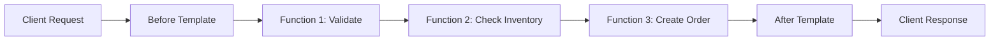

# Use AppSync Pipeline Resolvers

Author: [nawazdhandala](https://github.com/nawazdhandala)

Tags: AWS, AppSync, GraphQL, Serverless

Description: Learn how to use AWS AppSync pipeline resolvers to chain multiple data sources and operations in a single GraphQL resolver for complex queries.

---

Sometimes a single resolver isn't enough. You need to validate input, check permissions, fetch from one data source, then write to another - all within a single GraphQL operation. AppSync pipeline resolvers let you chain multiple functions together in sequence, where each function can use a different data source and the output of one feeds into the next.

Think of it as middleware for your GraphQL resolvers.

## Why Pipeline Resolvers?

With a unit resolver, you get one data source and one request/response cycle. If your mutation needs to check that a user exists, validate inventory, and then create an order, you'd need to either cram all that logic into a single Lambda function or use a pipeline resolver.

Pipeline resolvers give you:
- Separation of concerns (each function does one thing)
- Reusable resolver functions (use the same validation function across multiple fields)
- Multiple data sources in one resolver (DynamoDB for one step, Lambda for another)



## Pipeline Resolver Structure

A pipeline resolver has three parts:

1. **Before mapping template** - Runs before any functions. Sets up initial context.
2. **Functions** - An ordered list of resolver functions, each with its own data source.
3. **After mapping template** - Runs after all functions. Shapes the final response.

Each function has access to a shared `stash` object for passing data between steps.

## Creating Pipeline Functions

Let's build a create-order pipeline that validates the user, checks inventory, and creates the order.

### Function 1: Validate User

This function checks that the requesting user exists in the Users table:

```javascript
// validateUser function
import { util } from '@aws-appsync/utils';

export function request(ctx) {
  // Get the user ID from the Cognito identity
  const userId = ctx.identity.sub;

  return {
    operation: 'GetItem',
    key: util.dynamodb.toMapValues({ userId })
  };
}

export function response(ctx) {
  if (!ctx.result) {
    util.error('User not found', 'UserNotFoundError');
  }

  // Store user data in the stash for later functions
  ctx.stash.user = ctx.result;
  ctx.stash.userId = ctx.result.userId;

  return ctx.result;
}
```

### Function 2: Check Inventory

This function verifies that all requested items are available:

```javascript
// checkInventory function
import { util } from '@aws-appsync/utils';

export function request(ctx) {
  // Get the first item to check (we'll loop in a real implementation)
  const items = ctx.args.input.items;

  // For simplicity, check the first item
  // In production, you'd use a BatchGetItem or a Lambda for multiple items
  return {
    operation: 'GetItem',
    key: util.dynamodb.toMapValues({ productId: items[0].productId })
  };
}

export function response(ctx) {
  const inventoryItem = ctx.result;
  const requestedQty = ctx.args.input.items[0].quantity;

  if (!inventoryItem) {
    util.error('Product not found', 'ProductNotFoundError');
  }

  if (inventoryItem.quantity < requestedQty) {
    util.error(
      `Insufficient inventory. Available: ${inventoryItem.quantity}`,
      'InsufficientInventoryError'
    );
  }

  // Store inventory data for the order creation step
  ctx.stash.inventoryChecked = true;
  ctx.stash.productPrice = inventoryItem.price;

  return inventoryItem;
}
```

### Function 3: Create Order

This function creates the order in DynamoDB:

```javascript
// createOrder function
import { util } from '@aws-appsync/utils';

export function request(ctx) {
  const orderId = util.autoId();
  const now = util.time.nowISO8601();
  const input = ctx.args.input;

  // Calculate total using data from previous steps
  const total = input.items.reduce((sum, item) =>
    sum + (item.quantity * ctx.stash.productPrice), 0
  );

  const order = {
    orderId: orderId,
    userId: ctx.stash.userId,
    customerName: ctx.stash.user.name,
    items: input.items,
    total: total,
    status: 'pending',
    createdAt: now,
    updatedAt: now
  };

  return {
    operation: 'PutItem',
    key: util.dynamodb.toMapValues({ orderId }),
    attributeValues: util.dynamodb.toMapValues(order)
  };
}

export function response(ctx) {
  if (ctx.error) {
    util.error(ctx.error.message, ctx.error.type);
  }
  return ctx.result;
}
```

## Pipeline Resolver Definition

Now tie the functions together with a pipeline resolver.

The before and after templates manage the overall flow:

```javascript
// Pipeline resolver - before step
export function request(ctx) {
  // Initialize the stash with common data
  ctx.stash.startTime = util.time.nowISO8601();
  return {};
}

// Pipeline resolver - after step
export function response(ctx) {
  // Return the final result from the last function
  return ctx.prev.result;
}
```

## CloudFormation Setup

Here's the CloudFormation template that creates the pipeline resolver with its functions.

This template defines the full pipeline:

```yaml
AWSTemplateFormatVersion: '2010-09-09'

Resources:
  # Data sources
  UsersDataSource:
    Type: AWS::AppSync::DataSource
    Properties:
      ApiId: !GetAtt ProductApi.ApiId
      Name: UsersTable
      Type: AMAZON_DYNAMODB
      DynamoDBConfig:
        TableName: !Ref UsersTable
        AwsRegion: !Ref AWS::Region
      ServiceRoleArn: !GetAtt AppSyncRole.Arn

  InventoryDataSource:
    Type: AWS::AppSync::DataSource
    Properties:
      ApiId: !GetAtt ProductApi.ApiId
      Name: InventoryTable
      Type: AMAZON_DYNAMODB
      DynamoDBConfig:
        TableName: !Ref InventoryTable
        AwsRegion: !Ref AWS::Region
      ServiceRoleArn: !GetAtt AppSyncRole.Arn

  OrdersDataSource:
    Type: AWS::AppSync::DataSource
    Properties:
      ApiId: !GetAtt ProductApi.ApiId
      Name: OrdersTable
      Type: AMAZON_DYNAMODB
      DynamoDBConfig:
        TableName: !Ref OrdersTable
        AwsRegion: !Ref AWS::Region
      ServiceRoleArn: !GetAtt AppSyncRole.Arn

  # Pipeline functions
  ValidateUserFunction:
    Type: AWS::AppSync::FunctionConfiguration
    Properties:
      ApiId: !GetAtt ProductApi.ApiId
      Name: ValidateUser
      DataSourceName: !GetAtt UsersDataSource.Name
      Runtime:
        Name: APPSYNC_JS
        RuntimeVersion: "1.0.0"
      CodeS3Location: functions/validateUser.js

  CheckInventoryFunction:
    Type: AWS::AppSync::FunctionConfiguration
    Properties:
      ApiId: !GetAtt ProductApi.ApiId
      Name: CheckInventory
      DataSourceName: !GetAtt InventoryDataSource.Name
      Runtime:
        Name: APPSYNC_JS
        RuntimeVersion: "1.0.0"
      CodeS3Location: functions/checkInventory.js

  CreateOrderFunction:
    Type: AWS::AppSync::FunctionConfiguration
    Properties:
      ApiId: !GetAtt ProductApi.ApiId
      Name: CreateOrder
      DataSourceName: !GetAtt OrdersDataSource.Name
      Runtime:
        Name: APPSYNC_JS
        RuntimeVersion: "1.0.0"
      CodeS3Location: functions/createOrder.js

  # Pipeline resolver
  CreateOrderResolver:
    Type: AWS::AppSync::Resolver
    Properties:
      ApiId: !GetAtt ProductApi.ApiId
      TypeName: Mutation
      FieldName: createOrder
      Kind: PIPELINE
      PipelineConfig:
        Functions:
          - !GetAtt ValidateUserFunction.FunctionId
          - !GetAtt CheckInventoryFunction.FunctionId
          - !GetAtt CreateOrderFunction.FunctionId
      Runtime:
        Name: APPSYNC_JS
        RuntimeVersion: "1.0.0"
      Code: |
        export function request(ctx) {
          ctx.stash.startTime = util.time.nowISO8601();
          return {};
        }
        export function response(ctx) {
          return ctx.prev.result;
        }
```

## Reusable Functions

The real power of pipeline resolvers is reusability. The `ValidateUser` function can be used in any resolver that needs to verify the user exists.

This shows how multiple resolvers share the same validation function:

```yaml
# Create Order uses all three functions
CreateOrderResolver:
  Type: AWS::AppSync::Resolver
  Properties:
    Kind: PIPELINE
    PipelineConfig:
      Functions:
        - !GetAtt ValidateUserFunction.FunctionId
        - !GetAtt CheckInventoryFunction.FunctionId
        - !GetAtt CreateOrderFunction.FunctionId

# Update Profile only needs user validation
UpdateProfileResolver:
  Type: AWS::AppSync::Resolver
  Properties:
    Kind: PIPELINE
    PipelineConfig:
      Functions:
        - !GetAtt ValidateUserFunction.FunctionId
        - !GetAtt UpdateProfileFunction.FunctionId

# Leave Review needs user validation and product check
LeaveReviewResolver:
  Type: AWS::AppSync::Resolver
  Properties:
    Kind: PIPELINE
    PipelineConfig:
      Functions:
        - !GetAtt ValidateUserFunction.FunctionId
        - !GetAtt CheckProductExistsFunction.FunctionId
        - !GetAtt CreateReviewFunction.FunctionId
```

## Error Handling in Pipelines

When a function throws an error, the pipeline stops and the error propagates to the client. You can use the `ctx.prev.result` and `ctx.error` fields in the after template to handle errors gracefully.

This after template provides custom error messages:

```javascript
// Pipeline after template with error handling
export function response(ctx) {
  if (ctx.error) {
    // Log the error for debugging
    console.log('Pipeline error:', ctx.error);

    // Return a clean error to the client
    util.error(ctx.error.message, ctx.error.type, {
      step: ctx.stash.lastCompletedStep || 'unknown',
      startTime: ctx.stash.startTime
    });
  }

  return ctx.prev.result;
}
```

Each function can update the stash to track progress:

```javascript
// In each function's response handler
export function response(ctx) {
  ctx.stash.lastCompletedStep = 'validateUser';
  // ... rest of response handling
}
```

## Mixing Data Sources

Pipeline resolvers really shine when each function uses a different data source. Function 1 might query DynamoDB, function 2 might call a Lambda for complex business logic, and function 3 might write to another DynamoDB table.

This pattern works naturally because each function in the pipeline is independently configured with its own data source:

```javascript
// Function using Lambda data source for complex validation
import { util } from '@aws-appsync/utils';

export function request(ctx) {
  return {
    operation: 'Invoke',
    payload: {
      action: 'validateOrder',
      items: ctx.args.input.items,
      userId: ctx.stash.userId,
      customerTier: ctx.stash.user.tier
    }
  };
}

export function response(ctx) {
  if (ctx.result.errors && ctx.result.errors.length > 0) {
    util.error(ctx.result.errors.join(', '), 'ValidationError');
  }

  ctx.stash.validationResult = ctx.result;
  ctx.stash.lastCompletedStep = 'complexValidation';

  return ctx.result;
}
```

## Monitoring Pipeline Performance

Each function in the pipeline generates its own CloudWatch metrics, so you can identify which step is slow or failing. Look at the per-resolver metrics in the AppSync CloudWatch dashboard to find bottlenecks.

For overall API monitoring, check out our post on [monitoring strategies for serverless applications](https://oneuptime.com/blog/post/2026-01-24-apm-monitoring/view).

## Wrapping Up

Pipeline resolvers turn AppSync from a simple data proxy into a capable orchestration layer. By chaining functions together, you can build complex multi-step operations while keeping each step focused and reusable. The stash provides a clean way to pass data between steps, and the function-per-data-source model means you're not limited to a single backend for any operation. Start with unit resolvers for simple fields, and reach for pipelines when you need multiple data sources or reusable validation logic.
