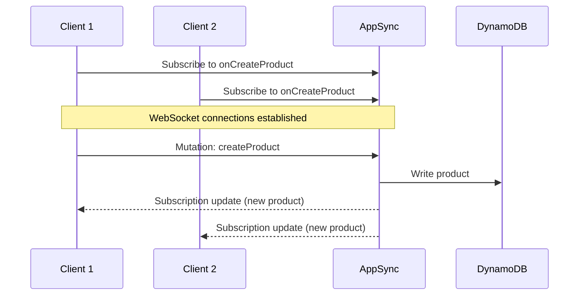

# Use AppSync Real-Time Subscriptions

Author: [nawazdhandala](https://github.com/nawazdhandala)

Tags: AWS, AppSync, GraphQL, Real-Time, WebSocket

Description: Learn how to implement real-time data updates in your applications using AWS AppSync GraphQL subscriptions with WebSocket connections.

---

Polling is wasteful. Your client asks "anything new?" every few seconds, and the answer is usually "no." GraphQL subscriptions solve this by keeping a WebSocket connection open and pushing updates to the client the moment something changes. AppSync handles the WebSocket infrastructure entirely - connection management, fan-out, scaling - so you just define what events trigger updates.

## How Subscriptions Work

AppSync subscriptions are tied to mutations. When a mutation fires, any client subscribed to that mutation's result receives the updated data in real time. Under the hood, AppSync manages a pool of WebSocket connections and handles all the pub/sub routing.



## Defining Subscriptions in the Schema

Subscriptions are defined in your GraphQL schema with the `Subscription` type. Each subscription field specifies which mutations trigger it using the `@aws_subscribe` directive.

This schema adds real-time subscriptions to a product catalog:

```graphql
type Product {
  id: ID!
  name: String!
  price: Float!
  category: String!
  inStock: Boolean!
  updatedAt: String
}

type Mutation {
  createProduct(input: CreateProductInput!): Product
  updateProduct(id: ID!, input: UpdateProductInput!): Product
  deleteProduct(id: ID!): Product
}

type Subscription {
  # Triggered whenever a product is created
  onCreateProduct: Product
    @aws_subscribe(mutations: ["createProduct"])

  # Triggered whenever a product is updated
  onUpdateProduct(id: ID): Product
    @aws_subscribe(mutations: ["updateProduct"])

  # Triggered whenever a product is deleted
  onDeleteProduct: Product
    @aws_subscribe(mutations: ["deleteProduct"])

  # Triggered by both create and update
  onProductChange: Product
    @aws_subscribe(mutations: ["createProduct", "updateProduct"])
}

input CreateProductInput {
  name: String!
  price: Float!
  category: String!
}

input UpdateProductInput {
  name: String
  price: Float
  category: String
  inStock: Boolean
}
```

The `@aws_subscribe` directive links subscriptions to mutations. When the `createProduct` mutation runs, any client subscribed to `onCreateProduct` receives the mutation's return value.

## Subscription Filtering

You can filter subscriptions so clients only receive events they care about. Pass arguments to the subscription to filter on specific fields.

The `onUpdateProduct(id: ID)` subscription above accepts an optional `id` parameter. If a client subscribes with a specific product ID, they only receive updates for that product.

This is how a client would subscribe to updates for a specific product:

```graphql
subscription {
  onUpdateProduct(id: "product-123") {
    id
    name
    price
    inStock
  }
}
```

For more complex filtering, use enhanced subscription filters. These let you filter on any field in the subscription payload.

This resolver code adds enhanced filtering:

```javascript
// subscription resolver with enhanced filtering
import { util, extensions } from '@aws-appsync/utils';

export function request(ctx) {
  // Set up enhanced subscription filter
  extensions.setSubscriptionFilter(
    util.transform.toSubscriptionFilter({
      filterGroup: [
        {
          filters: [
            {
              fieldName: 'category',
              operator: 'eq',
              value: ctx.args.category
            },
            {
              fieldName: 'price',
              operator: 'le',
              value: ctx.args.maxPrice || 999999
            }
          ]
        }
      ]
    })
  );

  return { payload: null };
}

export function response(ctx) {
  return util.toJson(null);
}
```

Now clients can subscribe to products in a specific category under a certain price:

```graphql
subscription {
  onProductChange(category: "electronics", maxPrice: 500) {
    id
    name
    price
    category
  }
}
```

## Client-Side Implementation

### JavaScript/React Client

Here's how to set up subscriptions in a React application using AWS Amplify.

This React component subscribes to real-time product updates:

```javascript
// ProductList.jsx - Real-time product list with subscriptions
import { useEffect, useState } from 'react';
import { Amplify } from 'aws-amplify';
import { generateClient } from 'aws-amplify/api';

const client = generateClient();

// GraphQL operations
const listProductsQuery = `
  query ListProducts {
    listProducts {
      items {
        id
        name
        price
        category
        inStock
      }
    }
  }
`;

const onCreateProductSub = `
  subscription OnCreateProduct {
    onCreateProduct {
      id
      name
      price
      category
      inStock
    }
  }
`;

const onUpdateProductSub = `
  subscription OnUpdateProduct {
    onUpdateProduct {
      id
      name
      price
      category
      inStock
    }
  }
`;

function ProductList() {
  const [products, setProducts] = useState([]);

  useEffect(() => {
    // Initial fetch
    async function fetchProducts() {
      const result = await client.graphql({ query: listProductsQuery });
      setProducts(result.data.listProducts.items);
    }
    fetchProducts();

    // Subscribe to new products
    const createSub = client.graphql({ query: onCreateProductSub })
      .subscribe({
        next: ({ data }) => {
          const newProduct = data.onCreateProduct;
          setProducts(prev => [...prev, newProduct]);
        },
        error: (err) => console.error('Create subscription error:', err)
      });

    // Subscribe to updated products
    const updateSub = client.graphql({ query: onUpdateProductSub })
      .subscribe({
        next: ({ data }) => {
          const updated = data.onUpdateProduct;
          setProducts(prev =>
            prev.map(p => p.id === updated.id ? updated : p)
          );
        },
        error: (err) => console.error('Update subscription error:', err)
      });

    // Cleanup subscriptions on unmount
    return () => {
      createSub.unsubscribe();
      updateSub.unsubscribe();
    };
  }, []);

  return (
    <div>
      <h2>Products (Real-time)</h2>
      <ul>
        {products.map(product => (
          <li key={product.id}>
            {product.name} - ${product.price}
            {product.inStock ? ' (In Stock)' : ' (Out of Stock)'}
          </li>
        ))}
      </ul>
    </div>
  );
}

export default ProductList;
```

### Vanilla JavaScript Client

If you're not using Amplify, you can use the AppSync real-time client directly:

```javascript
// Lightweight subscription client without Amplify
const WebSocket = require('ws');

const API_URL = 'wss://YOUR_API_ID.appsync-realtime-api.us-east-1.amazonaws.com/graphql';
const API_KEY = 'YOUR_API_KEY';

function createSubscription(query) {
  const header = Buffer.from(JSON.stringify({
    host: 'YOUR_API_ID.appsync-api.us-east-1.amazonaws.com',
    'x-api-key': API_KEY
  })).toString('base64');

  const ws = new WebSocket(
    `${API_URL}?header=${header}&payload=e30=`,
    ['graphql-ws']
  );

  ws.on('open', () => {
    // Initialize connection
    ws.send(JSON.stringify({ type: 'connection_init' }));
  });

  ws.on('message', (data) => {
    const message = JSON.parse(data);

    if (message.type === 'connection_ack') {
      // Connection established, start subscription
      ws.send(JSON.stringify({
        id: '1',
        type: 'start',
        payload: {
          data: JSON.stringify({ query }),
          extensions: {
            authorization: {
              'x-api-key': API_KEY,
              host: 'YOUR_API_ID.appsync-api.us-east-1.amazonaws.com'
            }
          }
        }
      }));
    }

    if (message.type === 'data') {
      console.log('Subscription data:', message.payload.data);
    }
  });

  return ws;
}

// Usage
const sub = createSubscription(`
  subscription { onCreateProduct { id name price } }
`);
```

## Connection Management

AppSync handles WebSocket connections automatically, but there are a few things to know. Connections have a 24-hour maximum lifetime. After that, the client needs to reconnect. Amplify handles this automatically. If you're building your own client, implement reconnection logic with exponential backoff.

Idle connections receive keep-alive messages every few minutes. If a client misses keep-alives, the connection is closed.

## Authorization for Subscriptions

Subscriptions use the same authorization as your API. If you're using Cognito, only authenticated users can subscribe. With API keys, any client with the key can subscribe.

For fine-grained control, you can use AppSync's per-field authorization:

```graphql
type Subscription {
  # Only admin users can subscribe to all product changes
  onProductChange: Product
    @aws_subscribe(mutations: ["createProduct", "updateProduct"])
    @aws_auth(cognito_groups: ["admin"])

  # Any authenticated user can subscribe to updates for a specific product
  onUpdateProduct(id: ID!): Product
    @aws_subscribe(mutations: ["updateProduct"])
    @aws_cognito_user_pools
}
```

## Monitoring Subscriptions

AppSync publishes CloudWatch metrics for subscriptions including `ConnectSuccess`, `ConnectClientError`, `SubscribeSuccess`, and `ActiveConnections`. Monitor `ActiveConnections` to understand your real-time usage and `ConnectClientError` to catch authentication issues.

For overall GraphQL API monitoring, check out our post on [authenticating AppSync APIs with Cognito](https://oneuptime.com/blog/post/2026-02-12-authenticate-appsync-apis-cognito/view).

## Performance Considerations

Each AppSync API supports up to 10,000 concurrent WebSocket connections by default (you can request an increase). Subscription broadcasts scale linearly - if 1,000 clients are subscribed to `onCreateProduct` and you create a product, AppSync delivers 1,000 messages. Keep your subscription payloads small by selecting only the fields clients need.

## Wrapping Up

AppSync subscriptions give you real-time data delivery without managing WebSocket servers, connection pools, or pub/sub infrastructure. Define your subscriptions in the schema, link them to mutations, and let AppSync handle the rest. The client libraries make it straightforward to integrate into React, React Native, or any JavaScript application. For most real-time use cases - live dashboards, collaborative editing, notifications - this is the fastest path to production.
