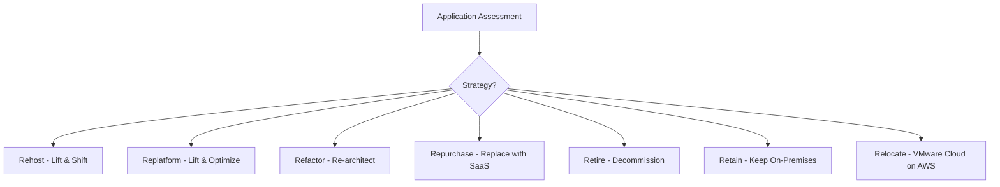

# How to Assess Your Applications with AWS Migration Hub Strategy Recommendations

Author: [nawazdhandala](https://github.com/nawazdhandala)

Tags: AWS, Migration Hub, Strategy Recommendations, Cloud Migration, Assessment, Modernization

Description: Learn how to use AWS Migration Hub Strategy Recommendations to assess your applications and get data-driven migration strategy suggestions.

---

Deciding how to migrate each application to AWS is one of the hardest parts of a cloud migration. Should you lift and shift? Replatform to containers? Refactor to serverless? Making the wrong choice costs time and money. AWS Migration Hub Strategy Recommendations takes the guesswork out of this decision by analyzing your applications and providing data-driven migration strategy suggestions.

This guide covers how to set up, run, and interpret strategy assessments for your application portfolio.

## Understanding the 7 R's of Migration

Before diving into the tool, it helps to understand the migration strategies it evaluates:



- **Rehost**: Move as-is to EC2. Fastest, lowest effort.
- **Replatform**: Minor optimizations during migration (e.g., move to RDS instead of self-managed database).
- **Refactor**: Re-architect for cloud-native services. Highest effort, highest long-term benefit.
- **Repurchase**: Replace with a SaaS equivalent.
- **Retire**: Turn it off. You would be surprised how many applications fall into this category.
- **Retain**: Keep on-premises for now (regulatory, technical, or business reasons).
- **Relocate**: Move VMware workloads to VMware Cloud on AWS.

## Prerequisites

Strategy Recommendations requires discovery data. You can feed it from:
- AWS Application Discovery Service (agent or agentless)
- Manual import via CSV
- Third-party tools integrated with Migration Hub

If you have not set up discovery yet, check out our guide on [using the AWS Application Discovery Service](https://oneuptime.com/blog/post/2026-02-12-use-the-aws-application-discovery-service/view).

## Setting Up the Strategy Recommendations Collector

The Strategy Recommendations collector is a virtual appliance you deploy in your on-premises environment. It performs deeper analysis than the basic discovery agent.

```python
# Configure and start the strategy assessment
import boto3

strategy = boto3.client('migrationhubstrategy')

# Start the portfolio assessment
response = strategy.start_assessment(
    s3bucketForAnalysisData={
        's3Bucket': 'my-migration-assessment-data',
        's3key': 'assessments/'
    }
)

assessment_id = response['assessmentId']
print(f"Assessment started: {assessment_id}")
```

The collector analyzes:
- Source code (if accessible) for .NET and Java applications
- Running processes and their dependencies
- Database schemas and usage patterns
- Network communication patterns
- Operating system and middleware versions

## Running the Assessment

The assessment process takes time depending on the number of servers and applications. You can monitor progress:

```python
# Check assessment status
import boto3
import time

strategy = boto3.client('migrationhubstrategy')

while True:
    response = strategy.get_assessment(assessmentId=assessment_id)
    status = response['dataCollectionDetails']['status']

    if status == 'COMPLETE':
        print("Assessment complete!")
        break
    elif status == 'FAILED':
        print(f"Assessment failed: {response['dataCollectionDetails'].get('statusMessage')}")
        break

    print(f"Status: {status}, Completion: {response['dataCollectionDetails'].get('completionPercentage', 0)}%")
    time.sleep(300)  # Check every 5 minutes
```

## Reviewing Server Recommendations

Once the assessment completes, query recommendations for each server:

```python
# Get recommendations for all servers
import boto3

strategy = boto3.client('migrationhubstrategy')

# List all servers with their recommendations
paginator = strategy.get_paginator('list_servers')

for page in paginator.paginate():
    for server in page['serverInfos']:
        server_id = server['serverId']

        # Get detailed recommendations
        details = strategy.get_server_details(serverId=server_id)
        server_detail = details['serverDetail']

        print(f"\nServer: {server_detail.get('name', server_id)}")
        print(f"  OS: {server_detail.get('systemInfo', {}).get('osInfo', {}).get('type', 'Unknown')}")

        for component in server_detail.get('applicationComponentStrategySummary', []):
            print(f"  Recommended Strategy: {component.get('strategy', 'N/A')}")

        rec = server_detail.get('recommendationSet', {})
        print(f"  Target Destination: {rec.get('targetDestination', 'N/A')}")
        print(f"  Transformation Tool: {rec.get('transformationTool', {}).get('name', 'N/A')}")
```

## Understanding Application Component Analysis

For .NET and Java applications, Strategy Recommendations performs source code analysis to understand framework usage, dependencies, and compatibility with AWS services.

```python
# Get detailed application component analysis
import boto3

strategy = boto3.client('migrationhubstrategy')

# List application components
response = strategy.list_application_components()

for component in response['applicationComponentInfos']:
    comp_id = component['appId']
    print(f"\nComponent: {component.get('name', comp_id)}")
    print(f"  Type: {component.get('appType', 'Unknown')}")
    print(f"  Status: {component.get('inclusionStatus', 'Unknown')}")

    # Get detailed analysis
    details = strategy.get_application_component_details(
        applicationComponentId=comp_id
    )

    detail = details['applicationComponentDetail']

    # Check for anti-patterns
    anti_patterns = detail.get('antiPatternReport', {}).get('antiPatternReportStatusList', [])
    for ap in anti_patterns:
        print(f"  Anti-pattern: {ap.get('analyzerName', {}).get('name', 'Unknown')}")
        print(f"    Severity: {ap.get('severity', 'Unknown')}")
```

Anti-patterns are code practices that make migration harder. Common ones include:
- Hardcoded IP addresses or file paths
- Windows-specific API calls
- Tight coupling between components
- Non-portable database queries

## Generating the Migration Portfolio Report

Strategy Recommendations can export a comprehensive portfolio report:

```python
# Export portfolio assessment report
import boto3

strategy = boto3.client('migrationhubstrategy')

# Get portfolio summary
summary = strategy.get_portfolio_summary()

print("Portfolio Summary:")
print(f"  Total servers: {summary.get('assessmentSummary', {}).get('totalServerCount', 0)}")

server_summary = summary.get('assessmentSummary', {}).get('serverStrategySummary', [])
for s in server_summary:
    print(f"  {s['strategy']}: {s['count']} servers")

# Strategy breakdown
print("\nRecommended Strategies:")
for strategy_item in server_summary:
    name = strategy_item['strategy']
    count = strategy_item['count']
    print(f"  {name}: {count}")
```

## Interpreting the Results

The assessment gives you a recommendation for each application, but context matters. Here is how to think about the recommendations:

**When Rehost makes sense:**
- Application works well as-is and does not need changes
- You need to move quickly (data center lease expiring)
- The application will be retired within 1-2 years anyway

**When Replatform makes sense:**
- Running self-managed databases that could move to RDS or Aurora
- Using older application servers that could move to containers
- Minor changes yield significant operational benefits

**When Refactor makes sense:**
- Application needs significant feature work anyway
- Current architecture has scaling limitations
- Long-term cost savings justify the upfront investment

**When Retire makes sense:**
- Application has few or no active users
- Functionality has been replaced by another system
- Maintenance cost exceeds the value it provides

## Creating a Prioritized Migration Plan

Use the assessment results to build a prioritized migration plan:

```python
# Prioritize applications for migration
import boto3

strategy = boto3.client('migrationhubstrategy')

# Get all servers and group by recommended strategy
rehost_candidates = []
replatform_candidates = []
refactor_candidates = []
retire_candidates = []

response = strategy.list_servers()
for server in response['serverInfos']:
    details = strategy.get_server_details(serverId=server['serverId'])
    rec = details['serverDetail'].get('recommendationSet', {})

    target = rec.get('targetDestination', '')

    if 'EC2' in target:
        rehost_candidates.append(server)
    elif 'Container' in target or 'RDS' in target:
        replatform_candidates.append(server)
    elif 'Lambda' in target or 'Serverless' in target:
        refactor_candidates.append(server)

# Migration order: Retire first, then Rehost, Replatform, Refactor
print(f"Wave 1 - Retire: {len(retire_candidates)} applications")
print(f"Wave 2 - Rehost: {len(rehost_candidates)} servers")
print(f"Wave 3 - Replatform: {len(replatform_candidates)} servers")
print(f"Wave 4 - Refactor: {len(refactor_candidates)} servers")
```

## Feeding Results into Migration Hub

Once you have your strategy decisions, feed them back into Migration Hub for tracking:

```python
# Update Migration Hub with strategy decisions
import boto3

mgh = boto3.client('mgh')

# Create a migration task for each application group
mgh.create_progress_update_stream(
    ProgressUpdateStreamName='wave-2-rehost'
)

# Import the strategy decision
mgh.notify_migration_task_state(
    ProgressUpdateStream='wave-2-rehost',
    MigrationTaskName='migrate-web-app',
    Task={
        'Status': 'NOT_STARTED',
        'StatusDetail': 'Rehost to EC2 - Strategy confirmed'
    },
    UpdateDateTime=datetime.now(),
    NextUpdateSeconds=86400
)
```

This ties directly into the broader migration tracking workflow in Migration Hub. See our guide on [planning an AWS migration with Migration Hub](https://oneuptime.com/blog/post/2026-02-12-plan-an-aws-migration-with-the-aws-migration-hub/view) for the full picture.

## Monitoring During and After Migration

As you execute each strategy, monitoring is essential. You need to know that migrated workloads are performing at least as well as they did on-premises. Set up CloudWatch dashboards for each migrated application and compare metrics against your baseline. For a unified view across your migration portfolio, [OneUptime](https://oneuptime.com/blog/post/2026-02-12-migrate-from-on-premises-to-aws-step-by-step/view) can track application health across both environments during the transition.

## Wrapping Up

AWS Migration Hub Strategy Recommendations transforms the subjective "how should we migrate this?" question into a data-driven decision. By analyzing your actual application code, dependencies, and infrastructure, it provides concrete recommendations that you can act on. Use it early in your migration planning to avoid costly strategy mistakes, and revisit it periodically as your portfolio evolves. The tool is not perfect and human judgment still matters, but it gives you a solid starting point backed by actual analysis rather than guesswork.
