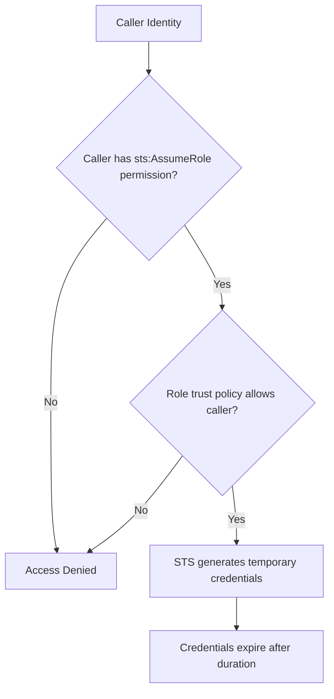

# How to Assume an IAM Role Using AWS STS

Author: [nawazdhandala](https://github.com/nawazdhandala)

Tags: AWS, IAM, STS, Security

Description: A complete guide to assuming IAM roles using AWS Security Token Service, covering CLI usage, SDK integration, session policies, and practical examples.

---

Assuming an IAM role is how you switch identities in AWS. Whether you're accessing a different account, elevating your privileges temporarily, or running an application that needs specific permissions, the process goes through AWS Security Token Service (STS). STS gives you temporary credentials - an access key, secret key, and session token - that expire automatically.

Let's go through every way to assume a role and the options you have when doing it.

## What Happens When You Assume a Role

When you call `sts:AssumeRole`, several things happen:

1. STS checks whether your current identity has permission to assume the target role
2. STS checks the target role's trust policy to see if it allows your identity
3. If both checks pass, STS generates temporary credentials
4. These credentials have the permissions of the assumed role, not your original identity



The temporary credentials are completely separate from your original identity. Actions performed with them show up in CloudTrail under the assumed role, with the session name identifying who assumed it.

## Assuming a Role via CLI

The basic command is straightforward:

```bash
# Assume a role and get temporary credentials
aws sts assume-role \
  --role-arn arn:aws:iam::123456789012:role/MyTargetRole \
  --role-session-name my-session
```

The response looks like this:

```json
{
    "Credentials": {
        "AccessKeyId": "ASIAEXAMPLE123",
        "SecretAccessKey": "wJalrXUtnFEMI/K7MDENG/bPxRfiCYEXAMPLEKEY",
        "SessionToken": "FwoGZXIvYXdzEBYaDH...",
        "Expiration": "2026-02-12T14:00:00Z"
    },
    "AssumedRoleUser": {
        "AssumedRoleId": "AROA3XFRBF23:my-session",
        "Arn": "arn:aws:sts::123456789012:assumed-role/MyTargetRole/my-session"
    }
}
```

To actually use these credentials, you need to export them as environment variables:

```bash
# Export the temporary credentials as environment variables
export AWS_ACCESS_KEY_ID="ASIAEXAMPLE123"
export AWS_SECRET_ACCESS_KEY="wJalrXUtnFEMI/K7MDENG/bPxRfiCYEXAMPLEKEY"
export AWS_SESSION_TOKEN="FwoGZXIvYXdzEBYaDH..."

# Now CLI commands use the assumed role
aws s3 ls
```

That's tedious. Here's a one-liner that does it all:

```bash
# Assume role and export credentials in one command
eval $(aws sts assume-role \
  --role-arn arn:aws:iam::123456789012:role/MyTargetRole \
  --role-session-name my-session \
  --query 'Credentials.[AccessKeyId,SecretAccessKey,SessionToken]' \
  --output text | \
  awk '{print "export AWS_ACCESS_KEY_ID=" $1 "\nexport AWS_SECRET_ACCESS_KEY=" $2 "\nexport AWS_SESSION_TOKEN=" $3}')
```

## Using CLI Profiles (Better Approach)

The cleanest way is to configure a profile in `~/.aws/config`:

```ini
# ~/.aws/config
[profile target-account]
role_arn = arn:aws:iam::123456789012:role/MyTargetRole
source_profile = default
role_session_name = alice-session
region = us-east-1
duration_seconds = 3600
```

Then use it with any AWS command:

```bash
# Use the profile - CLI handles role assumption automatically
aws s3 ls --profile target-account
aws ec2 describe-instances --profile target-account
```

The CLI assumes the role automatically, caches the credentials, and refreshes them when they're about to expire. Much better than manually exporting environment variables.

## Assuming with MFA

For roles that require MFA, add the MFA serial to your profile:

```ini
# ~/.aws/config - profile with MFA requirement
[profile secure-admin]
role_arn = arn:aws:iam::123456789012:role/AdminRole
source_profile = default
mfa_serial = arn:aws:iam::111111111111:mfa/alice
role_session_name = alice-admin
```

When you use this profile, the CLI prompts for your MFA code:

```bash
# CLI prompts for MFA code automatically
$ aws s3 ls --profile secure-admin
Enter MFA code for arn:aws:iam::111111111111:mfa/alice: 123456
```

Or provide it directly:

```bash
# Assume role with MFA token via direct API call
aws sts assume-role \
  --role-arn arn:aws:iam::123456789012:role/AdminRole \
  --role-session-name alice-admin \
  --serial-number arn:aws:iam::111111111111:mfa/alice \
  --token-code 123456
```

## Session Duration

By default, temporary credentials last one hour. You can request up to the role's maximum session duration (default 1 hour, configurable up to 12 hours):

```bash
# Request credentials valid for 4 hours
aws sts assume-role \
  --role-arn arn:aws:iam::123456789012:role/MyTargetRole \
  --role-session-name my-session \
  --duration-seconds 14400
```

To allow longer sessions, update the role's max session duration:

```bash
# Set the role's max session duration to 12 hours
aws iam update-role \
  --role-name MyTargetRole \
  --max-session-duration 43200
```

## Session Policies

Session policies let you further restrict the permissions of the assumed role. The effective permissions are the intersection of the role's policies and the session policy:

```bash
# Assume a role with a session policy that restricts to read-only S3
aws sts assume-role \
  --role-arn arn:aws:iam::123456789012:role/DeveloperRole \
  --role-session-name limited-session \
  --policy '{
    "Version": "2012-10-17",
    "Statement": [
        {
            "Effect": "Allow",
            "Action": [
                "s3:GetObject",
                "s3:ListBucket"
            ],
            "Resource": "*"
        }
    ]
  }'
```

Even if the DeveloperRole has full S3 access, this session can only read. Session policies can only restrict, never expand, the role's permissions.

## Assuming Roles in Code

Here's how to assume a role in different SDKs:

Python (boto3):

```python
# Assume a role using boto3
import boto3

sts_client = boto3.client('sts')

response = sts_client.assume_role(
    RoleArn='arn:aws:iam::123456789012:role/MyTargetRole',
    RoleSessionName='app-session',
    DurationSeconds=3600
)

credentials = response['Credentials']

# Create a new session with the assumed role's credentials
s3_client = boto3.client(
    's3',
    aws_access_key_id=credentials['AccessKeyId'],
    aws_secret_access_key=credentials['SecretAccessKey'],
    aws_session_token=credentials['SessionToken']
)

# Use the S3 client with assumed role permissions
objects = s3_client.list_objects_v2(Bucket='my-bucket')
```

JavaScript/Node.js:

```javascript
// Assume a role using the AWS SDK v3
import { STSClient, AssumeRoleCommand } from "@aws-sdk/client-sts";
import { S3Client, ListObjectsV2Command } from "@aws-sdk/client-s3";

const stsClient = new STSClient({ region: "us-east-1" });

const response = await stsClient.send(new AssumeRoleCommand({
  RoleArn: "arn:aws:iam::123456789012:role/MyTargetRole",
  RoleSessionName: "app-session",
  DurationSeconds: 3600,
}));

// Use the temporary credentials
const s3Client = new S3Client({
  region: "us-east-1",
  credentials: {
    accessKeyId: response.Credentials.AccessKeyId,
    secretAccessKey: response.Credentials.SecretAccessKey,
    sessionToken: response.Credentials.SessionToken,
  },
});

const objects = await s3Client.send(
  new ListObjectsV2Command({ Bucket: "my-bucket" })
);
```

## Tagging Sessions

You can pass session tags when assuming a role. These tags are available as condition keys in the role's policies:

```bash
# Assume a role with session tags
aws sts assume-role \
  --role-arn arn:aws:iam::123456789012:role/MyTargetRole \
  --role-session-name tagged-session \
  --tags Key=Project,Value=migration Key=Department,Value=engineering
```

Session tags enable dynamic policies without changing the role itself. The role's policy can reference `${aws:PrincipalTag/Project}` to make access decisions based on the session tags.

## Verifying Your Identity

To check which identity you're currently using:

```bash
# Check your current identity
aws sts get-caller-identity
```

This returns your account, user ARN, and user ID. When you've assumed a role, it shows the assumed role ARN and session name.

## Wrapping Up

STS role assumption is the mechanism behind cross-account access, privilege escalation control, and service identity management in AWS. Use CLI profiles for day-to-day work, session policies for least-privilege delegation, and MFA for sensitive roles. For more advanced patterns, check out our guide on [chaining IAM role assumptions](https://oneuptime.com/blog/post/chain-iam-role-assumptions-role-chaining/view) and [creating IAM roles for cross-account access](https://oneuptime.com/blog/post/create-iam-roles-for-cross-account-access/view).
