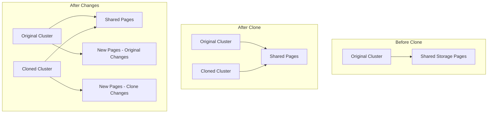

# How to Use Aurora Cloning for Fast Database Copies

Author: [nawazdhandala](https://github.com/nawazdhandala)

Tags: AWS, Aurora, Database Cloning, RDS

Description: Learn how to use Aurora cloning to create fast, space-efficient copies of your database for testing, development, and analytics without impacting production.

---

Need a copy of your production database for testing? The traditional approach of taking a snapshot and restoring it can take hours for large databases. Aurora cloning takes a fundamentally different approach - it uses a copy-on-write protocol to create a fully functional copy of your database in minutes, regardless of size. And the best part? The clone initially uses almost no extra storage.

Let's dive into how Aurora cloning works and how to use it effectively.

## How Aurora Cloning Works Under the Hood

Aurora stores data in a shared, distributed storage layer. When you create a clone, Aurora doesn't actually copy the data. Instead, it creates a new cluster that points to the same underlying storage pages as the original. It's only when data changes - in either the original or the clone - that new storage pages get allocated.

Think of it like a Git branch. When you create a branch, Git doesn't copy all the files. It just creates a new pointer. Files only diverge when you make changes on one branch or the other. Aurora cloning works the same way at the storage page level.



This means a 5 TB database can be cloned in about the same time as a 5 GB database. The initial clone is nearly instant.

## Creating a Clone via the Console

1. Go to the RDS console and select your Aurora cluster
2. Click **Actions** then **Create clone**
3. Configure the clone settings (instance class, VPC, etc.)
4. Click **Create clone**

That's it. The clone cluster will be available within minutes.

## Creating a Clone via the CLI

The CLI gives you full control over clone settings. Here's the basic command:

```bash
# Create a clone of an existing Aurora cluster
aws rds restore-db-cluster-to-point-in-time \
  --source-db-cluster-identifier my-production-cluster \
  --db-cluster-identifier my-clone-cluster \
  --restore-type copy-on-write \
  --use-latest-restorable-time \
  --db-subnet-group-name my-subnet-group \
  --vpc-security-group-ids sg-0abc1234def56789
```

The `--restore-type copy-on-write` flag is what makes this a clone rather than a full restore. The `--use-latest-restorable-time` flag tells Aurora to clone from the most recent consistent point.

After creating the cluster, you need to add at least one instance:

```bash
# Add an instance to the cloned cluster
aws rds create-db-instance \
  --db-instance-identifier my-clone-instance-1 \
  --db-cluster-identifier my-clone-cluster \
  --db-instance-class db.r5.large \
  --engine aurora-mysql
```

## Cloning with Terraform

If you manage infrastructure as code, here's the Terraform configuration:

```hcl
# Create an Aurora clone using copy-on-write
resource "aws_rds_cluster" "clone" {
  cluster_identifier   = "my-clone-cluster"
  engine               = "aurora-mysql"
  engine_version       = "5.7.mysql_aurora.2.11.2"
  db_subnet_group_name = aws_db_subnet_group.main.name

  # These parameters make it a clone
  restore_to_point_in_time {
    source_cluster_identifier  = aws_rds_cluster.production.cluster_identifier
    restore_type               = "copy-on-write"
    use_latest_restorable_time = true
  }

  vpc_security_group_ids = [aws_security_group.clone_db.id]

  # Clones don't need master credentials - they're inherited
  skip_final_snapshot = true

  tags = {
    Environment = "staging"
    ClonedFrom  = "production"
  }
}

resource "aws_rds_cluster_instance" "clone_instance" {
  identifier           = "my-clone-instance-1"
  cluster_identifier   = aws_rds_cluster.clone.id
  instance_class       = "db.r5.large"
  engine               = aws_rds_cluster.clone.engine
  engine_version       = aws_rds_cluster.clone.engine_version
}
```

## Practical Use Cases

### Development and Testing

The most common use case. Developers need realistic data to test against, but you can't let them touch production. Cloning gives them a full copy in minutes.

Here's a script that creates a daily development clone and tears down the old one:

```bash
#!/bin/bash
# Script to refresh the development database clone daily

DATE=$(date +%Y%m%d)
CLONE_ID="dev-clone-${DATE}"
YESTERDAY=$(date -d "yesterday" +%Y%m%d 2>/dev/null || date -v-1d +%Y%m%d)
OLD_CLONE="dev-clone-${YESTERDAY}"

echo "Creating new development clone: ${CLONE_ID}"

# Create the new clone
aws rds restore-db-cluster-to-point-in-time \
  --source-db-cluster-identifier production-cluster \
  --db-cluster-identifier "${CLONE_ID}" \
  --restore-type copy-on-write \
  --use-latest-restorable-time \
  --db-subnet-group-name dev-subnet-group \
  --vpc-security-group-ids sg-dev123

# Add an instance to the clone
aws rds create-db-instance \
  --db-instance-identifier "${CLONE_ID}-instance-1" \
  --db-cluster-identifier "${CLONE_ID}" \
  --db-instance-class db.r5.large \
  --engine aurora-mysql

# Wait for the new clone to be available
aws rds wait db-cluster-available \
  --db-cluster-identifier "${CLONE_ID}"

echo "New clone is ready: ${CLONE_ID}"

# Delete yesterday's clone
echo "Cleaning up old clone: ${OLD_CLONE}"
aws rds delete-db-instance \
  --db-instance-identifier "${OLD_CLONE}-instance-1" \
  --skip-final-snapshot

aws rds wait db-instance-deleted \
  --db-instance-identifier "${OLD_CLONE}-instance-1"

aws rds delete-db-cluster \
  --db-cluster-identifier "${OLD_CLONE}" \
  --skip-final-snapshot

echo "Old clone deleted."
```

### Analytics Without Production Impact

Running heavy analytical queries directly on production is a bad idea. They'll compete with your application for resources. Instead, clone the database and run analytics on the clone.

### Load Testing

Before a big launch or marketing event, clone production and run load tests against the clone. You get realistic data volumes without any risk to the real thing.

### Database Schema Migration Testing

Want to test a migration before running it on production? Clone the database, run the migration on the clone, check the results, and throw the clone away if something goes wrong.

## Limitations to Know About

Aurora cloning has a few constraints you should be aware of:

- **Cross-region cloning isn't supported.** The clone must be in the same region as the source. If you need a cross-region copy, use [Aurora Global Databases](https://oneuptime.com/blog/post/2026-02-12-set-up-aurora-global-databases-for-multi-region/view) or snapshot-and-restore.
- **Clone depth limit.** You can create clones of clones, but only up to 15 levels deep.
- **Maximum 15 clones per source.** You can't have more than 15 active clones from a single source cluster.
- **Same engine version.** The clone uses the same engine version as the source.
- **Storage grows independently.** Once you start writing to the clone, it uses its own storage pages. A clone that diverges significantly from the original will use nearly as much storage as a full copy.

## Cost Implications

Clones are extremely cost-effective for short-lived use cases. Here's why:

- The clone itself is free to create
- You pay for the compute instances you add to the clone
- Storage costs are only for changed pages (copy-on-write)
- A fresh clone that hasn't had any writes uses essentially no additional storage

For a 2 TB production database, a clone used for a few hours of testing might use only a few GB of additional storage. Compare that to restoring a full snapshot, which would immediately allocate 2 TB.

The key cost consideration: **don't forget to delete your clones.** I've seen teams create clones for testing and forget about them, leaving instances running for weeks. Set up a tagging strategy and a cleanup script.

## Data Sanitization

One important thing to remember: the clone has an exact copy of your production data, including any sensitive information. If your clone is for development or testing, you'll probably need to sanitize it.

Here's a quick approach using SQL after the clone is ready:

```sql
-- Sanitize sensitive data in the cloned database
-- Run this immediately after the clone is available

-- Anonymize user emails
UPDATE users SET email = CONCAT('user_', id, '@example.com');

-- Mask phone numbers
UPDATE users SET phone = '555-0000';

-- Clear payment information
UPDATE payment_methods SET card_number = 'XXXX-XXXX-XXXX-0000';

-- Remove API keys
UPDATE api_keys SET key_value = 'sanitized_key';
```

## Wrapping Up

Aurora cloning is one of those features that seems too good to be true until you actually use it. Instant copies of multi-terabyte databases with minimal storage overhead is genuinely impressive engineering. Use it for dev/test environments, analytics, migration testing, and load testing.

Just remember the three rules: always sanitize sensitive data in clones, always delete clones when you're done, and always tag clones so you know what they're for and when they were created. If you're working with Aurora snapshots for longer-lived backups, check out the guide on [exporting Aurora snapshots to S3](https://oneuptime.com/blog/post/2026-02-12-export-aurora-snapshots-to-s3/view).
