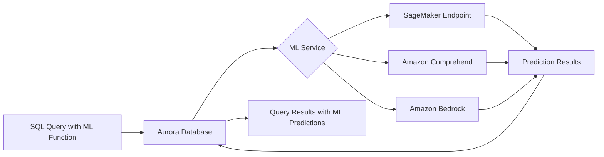

# How to Use Aurora Machine Learning (ML) Integration

Author: [nawazdhandala](https://github.com/nawazdhandala)

Tags: AWS, Aurora, Machine Learning, SageMaker, Comprehend

Description: Learn how to call AWS machine learning services like SageMaker and Comprehend directly from Aurora SQL queries to add predictions, sentiment analysis, and more to your database workflows.

---

What if you could run machine learning predictions right from a SQL query? No application code changes, no data export pipelines, no separate ML infrastructure to manage. Aurora ML integration makes this possible by letting you call AWS machine learning services - specifically SageMaker and Amazon Comprehend - directly from SQL functions.

It sounds almost too simple, and honestly, it kind of is. Let's walk through how to set it up and what you can actually do with it.

## How Aurora ML Works

Aurora ML doesn't run ML models inside the database. What it does is create SQL functions that call out to AWS ML services and return the results as part of your query. When you run a query that includes an ML function, Aurora batches the data, sends it to the ML service, gets the predictions back, and includes them in your result set.

The supported integrations are:

- **Amazon SageMaker** - Call any SageMaker endpoint for custom model predictions
- **Amazon Comprehend** - Built-in sentiment analysis and language detection
- **Amazon Bedrock** - Access foundation models (available in newer Aurora versions)



## Prerequisites

Before you start, you need:

- An Aurora MySQL (version 2.07.0+) or Aurora PostgreSQL (version 10.14+) cluster
- The appropriate IAM roles configured
- For SageMaker: a deployed SageMaker endpoint
- For Comprehend: no additional setup needed (it's a managed service)

## Setting Up IAM Roles

The first step is creating an IAM role that allows Aurora to call ML services. Aurora needs permission to invoke the ML services on your behalf.

Create the IAM role with the necessary permissions:

```bash
# Create the trust policy for Aurora
cat > aurora-ml-trust-policy.json << 'JSONEOF'
{
  "Version": "2012-10-17",
  "Statement": [
    {
      "Effect": "Allow",
      "Principal": {
        "Service": "rds.amazonaws.com"
      },
      "Action": "sts:AssumeRole"
    }
  ]
}
JSONEOF

# Create the IAM role
aws iam create-role \
  --role-name AuroraMLRole \
  --assume-role-policy-document file://aurora-ml-trust-policy.json

# Attach the Comprehend read-only policy
aws iam attach-role-policy \
  --role-name AuroraMLRole \
  --policy-arn arn:aws:iam::aws:policy/ComprehendReadOnly

# Attach SageMaker runtime policy for calling endpoints
aws iam attach-role-policy \
  --role-name AuroraMLRole \
  --policy-arn arn:aws:iam::aws:policy/AmazonSageMakerReadOnly
```

For SageMaker, you'll also need a more specific policy that allows invoking your endpoint:

```json
{
  "Version": "2012-10-17",
  "Statement": [
    {
      "Effect": "Allow",
      "Action": "sagemaker:InvokeEndpoint",
      "Resource": "arn:aws:sagemaker:us-east-1:123456789012:endpoint/my-ml-endpoint"
    }
  ]
}
```

## Associating the IAM Role with Aurora

Once the role exists, attach it to your Aurora cluster:

```bash
# Associate the ML role with your Aurora cluster
aws rds add-role-to-db-cluster \
  --db-cluster-identifier my-aurora-cluster \
  --role-arn arn:aws:iam::123456789012:role/AuroraMLRole \
  --feature-name SageMaker

# If using Comprehend, add it with the Comprehend feature name
aws rds add-role-to-db-cluster \
  --db-cluster-identifier my-aurora-cluster \
  --role-arn arn:aws:iam::123456789012:role/AuroraMLRole \
  --feature-name Comprehend
```

You'll also need to set the cluster parameter for the role ARN. For Aurora MySQL:

```bash
# Update the cluster parameter group to reference the ML role
aws rds modify-db-cluster-parameter-group \
  --db-cluster-parameter-group-name my-aurora-params \
  --parameters "ParameterName=aws_default_comprehend_role,ParameterValue=arn:aws:iam::123456789012:role/AuroraMLRole,ApplyMethod=pending-reboot" \
               "ParameterName=aws_default_sagemaker_role,ParameterValue=arn:aws:iam::123456789012:role/AuroraMLRole,ApplyMethod=pending-reboot"
```

## Using Amazon Comprehend for Sentiment Analysis

This is the quickest way to get started with Aurora ML because Comprehend doesn't require any model training or endpoint management.

### Aurora MySQL Example

In Aurora MySQL, you use the built-in `aws_comprehend_detect_sentiment` function:

```sql
-- Analyze sentiment of customer reviews stored in the database
SELECT
    review_id,
    customer_name,
    review_text,
    aws_comprehend_detect_sentiment(review_text, 'en') AS sentiment
FROM customer_reviews
WHERE created_at > DATE_SUB(NOW(), INTERVAL 7 DAY);
```

The function returns one of four values: POSITIVE, NEGATIVE, NEUTRAL, or MIXED.

You can get more detailed sentiment scores too:

```sql
-- Get detailed sentiment scores for product feedback
SELECT
    product_id,
    feedback_text,
    aws_comprehend_detect_sentiment(feedback_text, 'en') AS sentiment,
    aws_comprehend_detect_sentiment_confidence(feedback_text, 'en') AS confidence
FROM product_feedback
ORDER BY confidence DESC
LIMIT 100;
```

### Aurora PostgreSQL Example

In Aurora PostgreSQL, the function syntax is slightly different:

```sql
-- Sentiment analysis in Aurora PostgreSQL
SELECT
    review_id,
    review_text,
    aws_comprehend.detect_sentiment(review_text, 'en') AS sentiment,
    aws_comprehend.detect_sentiment_confidence(review_text, 'en') AS confidence
FROM customer_reviews
WHERE LENGTH(review_text) > 20
ORDER BY confidence DESC;
```

## Calling SageMaker Endpoints

For custom ML models, you create a SQL function that maps to a SageMaker endpoint.

### Aurora MySQL - Creating a SageMaker Function

First, create the function that calls your SageMaker endpoint:

```sql
-- Create a function that calls a SageMaker fraud detection model
CREATE FUNCTION detect_fraud(
    transaction_amount DOUBLE,
    merchant_category VARCHAR(50),
    time_of_day INT,
    distance_from_home DOUBLE
)
RETURNS DOUBLE
ALIAS AWS_SAGEMAKER_INVOKE_ENDPOINT
ENDPOINT NAME 'fraud-detection-endpoint';
```

Now you can use it in regular queries:

```sql
-- Score transactions for fraud probability
SELECT
    transaction_id,
    amount,
    merchant_category,
    detect_fraud(amount, merchant_category, HOUR(transaction_time), distance_km) AS fraud_score
FROM transactions
WHERE transaction_date = CURDATE()
HAVING fraud_score > 0.8
ORDER BY fraud_score DESC;
```

### Aurora PostgreSQL - Creating a SageMaker Function

```sql
-- Create a function for churn prediction in PostgreSQL
CREATE FUNCTION predict_churn(
    days_since_last_login INT,
    total_purchases INT,
    support_tickets INT,
    account_age_days INT
)
RETURNS FLOAT
AS $$
    SELECT aws_sagemaker.invoke_endpoint(
        'churn-prediction-endpoint',
        NULL,
        days_since_last_login,
        total_purchases,
        support_tickets,
        account_age_days
    )::FLOAT
$$ LANGUAGE sql PARALLEL SAFE;

-- Use the function in a query
SELECT
    customer_id,
    email,
    predict_churn(
        days_since_last_login,
        total_purchases,
        support_tickets,
        account_age_days
    ) AS churn_probability
FROM customers
WHERE predict_churn(
    days_since_last_login,
    total_purchases,
    support_tickets,
    account_age_days
) > 0.75;
```

## Performance Considerations

Aurora ML calls go over the network to external services, so they're not as fast as regular SQL functions. Here's what to keep in mind:

**Batch processing helps.** Aurora automatically batches rows when calling ML services, which is much more efficient than calling the service once per row. But large result sets will still be slower than regular queries.

**Use WHERE clauses to reduce ML calls.** Don't run sentiment analysis on your entire table. Filter first, then analyze:

```sql
-- Good: filter first, then call ML
SELECT review_text, aws_comprehend_detect_sentiment(review_text, 'en')
FROM reviews
WHERE created_at > '2026-02-01'
AND LENGTH(review_text) > 50;

-- Bad: calling ML on every row
SELECT review_text, aws_comprehend_detect_sentiment(review_text, 'en')
FROM reviews;
```

**Cache results.** If you're running the same ML predictions repeatedly, store the results:

```sql
-- Cache sentiment results in a dedicated column
ALTER TABLE customer_reviews ADD COLUMN sentiment VARCHAR(20);

UPDATE customer_reviews
SET sentiment = aws_comprehend_detect_sentiment(review_text, 'en')
WHERE sentiment IS NULL
AND review_text IS NOT NULL;
```

## Cost Implications

You're paying for two things: the Aurora compute time and the ML service usage. Comprehend charges per unit of text analyzed, and SageMaker charges for the endpoint uptime plus inference calls. If you're analyzing millions of records, the Comprehend costs can add up quickly. Budget accordingly.

## Wrapping Up

Aurora ML integration is surprisingly powerful for a feature that's essentially "call an API from SQL." Sentiment analysis on customer reviews, fraud scoring on transactions, churn prediction on user behavior - all without building data pipelines or writing application code. Start with Comprehend for quick wins, then move to SageMaker for custom models.

Just remember to filter your queries aggressively and cache results where possible. ML calls add latency, and the costs scale with usage. For more Aurora optimization techniques, check out the guide on [Aurora Parallel Query for analytics](https://oneuptime.com/blog/post/2026-02-12-aurora-parallel-query-for-analytics/view).
