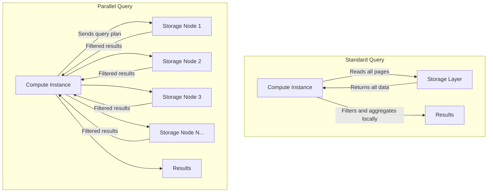

# How to Use Aurora Parallel Query for Analytics

Author: [nawazdhandala](https://github.com/nawazdhandala)

Tags: AWS, Aurora, Parallel Query, Analytics, Database

Description: Learn how to enable and use Aurora Parallel Query to dramatically speed up analytical queries by pushing processing down to the Aurora storage layer.

---

Running analytical queries on an OLTP database is usually a recipe for trouble. Full table scans, aggregations across millions of rows, and complex joins can hammer your CPU and slow down your transactional workload. Aurora Parallel Query takes a different approach - instead of processing all the data on the compute instance, it pushes the heavy lifting down to the storage layer, where hundreds of nodes can work on the query in parallel.

The result? Analytical queries that used to take minutes can finish in seconds, with minimal impact on your transactional workload.

## How Parallel Query Works

In a standard Aurora query, the compute instance reads data from the storage layer, page by page, and processes it locally. This means the compute instance has to read every page, filter rows, and perform aggregations all by itself.

With Parallel Query, Aurora pushes filtering and aggregation operations down to the storage nodes. Since Aurora's storage layer is distributed across hundreds of storage nodes, the work gets parallelized automatically. Each storage node processes its portion of the data and sends only the relevant results back to the compute instance.



## Prerequisites and Compatibility

Before getting started:

- Aurora MySQL version 2.09.0 or higher (MySQL 5.7 compatible)
- Aurora MySQL version 3.01.0 or higher (MySQL 8.0 compatible)
- Aurora PostgreSQL does NOT support Parallel Query
- Must use `db.r*` instance classes (not `db.t*`)
- Table must use InnoDB storage engine
- Parallel Query is not available in all regions - check AWS documentation

## Enabling Parallel Query

Parallel Query is controlled by a cluster parameter. You can enable it at the cluster level and control it per session.

### Enable at the Cluster Level

Modify the cluster parameter group to enable Parallel Query:

```bash
# Enable Aurora Parallel Query in the cluster parameter group
aws rds modify-db-cluster-parameter-group \
  --db-cluster-parameter-group-name my-aurora-params \
  --parameters "ParameterName=aurora_parallel_query,ParameterValue=ON,ApplyMethod=pending-reboot"
```

After modifying the parameter, reboot your instances for the change to take effect:

```bash
# Reboot the cluster instances to apply the parameter change
aws rds reboot-db-instance \
  --db-instance-identifier my-aurora-reader-1
```

### Enable/Disable Per Session

Even with Parallel Query enabled at the cluster level, you can control it per session:

```sql
-- Enable Parallel Query for this session
SET SESSION aurora_pq = ON;

-- Disable Parallel Query for this session
SET SESSION aurora_pq = OFF;

-- Check current setting
SHOW VARIABLES LIKE 'aurora_pq%';
```

This is useful when you want most queries to run normally but enable Parallel Query for specific analytical queries.

## Checking If a Query Uses Parallel Query

Use EXPLAIN to see if Aurora will use Parallel Query for a specific query:

```sql
-- Check if a query will use Parallel Query
EXPLAIN SELECT
    customer_segment,
    COUNT(*) as order_count,
    SUM(total_amount) as revenue,
    AVG(total_amount) as avg_order_value
FROM orders
WHERE order_date BETWEEN '2025-01-01' AND '2025-12-31'
GROUP BY customer_segment;
```

Look for `Using parallel query` in the Extra column of the EXPLAIN output. If you see it, the query will be parallelized. If not, the optimizer decided it wasn't beneficial.

You can also check the status variables to see Parallel Query activity:

```sql
-- Check Parallel Query usage statistics
SHOW STATUS LIKE 'Aurora_pq%';
```

Key status variables to watch:
- `Aurora_pq_request_attempted` - Number of queries that attempted Parallel Query
- `Aurora_pq_request_executed` - Number of queries that actually used Parallel Query
- `Aurora_pq_request_not_chosen` - Number of queries where the optimizer chose not to use it
- `Aurora_pq_pages_pushed_down` - Number of data pages processed at the storage layer

## Queries That Benefit Most

Parallel Query shines for specific query patterns:

### Full Table Scans with Filters

```sql
-- Finding high-value customers - scans the full table but filters heavily
SELECT customer_id, name, email, total_spend
FROM customers
WHERE total_spend > 10000
AND last_purchase_date > '2025-06-01'
AND region = 'us-east'
ORDER BY total_spend DESC
LIMIT 100;
```

### Aggregation Queries

```sql
-- Monthly revenue report across millions of transactions
SELECT
    DATE_FORMAT(transaction_date, '%Y-%m') as month,
    product_category,
    COUNT(*) as transactions,
    SUM(amount) as total_revenue,
    AVG(amount) as avg_transaction,
    MIN(amount) as min_transaction,
    MAX(amount) as max_transaction
FROM transactions
WHERE transaction_date >= '2025-01-01'
GROUP BY DATE_FORMAT(transaction_date, '%Y-%m'), product_category
ORDER BY month, total_revenue DESC;
```

### Large Table Joins

```sql
-- Join orders with products for a sales analysis
SELECT
    p.category,
    p.subcategory,
    COUNT(DISTINCT o.customer_id) as unique_customers,
    SUM(oi.quantity) as units_sold,
    SUM(oi.quantity * oi.unit_price) as revenue
FROM orders o
JOIN order_items oi ON o.order_id = oi.order_id
JOIN products p ON oi.product_id = p.product_id
WHERE o.order_date BETWEEN '2025-01-01' AND '2025-12-31'
GROUP BY p.category, p.subcategory
ORDER BY revenue DESC;
```

## Queries That Won't Use Parallel Query

The optimizer won't choose Parallel Query for:

- Very small tables (the overhead isn't worth it)
- Queries that use the buffer pool cache effectively (data is already in memory)
- Queries on temporary tables
- Queries with certain unsupported functions or operations
- Tables with TEXT or BLOB columns in the select list (though filtering on them works)

## Performance Comparison Example

Here's a practical test you can run to see the difference. Create a decent-sized test table first:

```sql
-- Create a test table and populate with sample data
CREATE TABLE sales_data (
    id BIGINT AUTO_INCREMENT PRIMARY KEY,
    sale_date DATE,
    store_id INT,
    product_id INT,
    quantity INT,
    amount DECIMAL(10,2),
    region VARCHAR(50),
    INDEX idx_sale_date (sale_date),
    INDEX idx_region (region)
) ENGINE=InnoDB;

-- Insert test data (simplified - use a real data generator for production testing)
INSERT INTO sales_data (sale_date, store_id, product_id, quantity, amount, region)
SELECT
    DATE_ADD('2024-01-01', INTERVAL FLOOR(RAND() * 730) DAY),
    FLOOR(RAND() * 500),
    FLOOR(RAND() * 10000),
    FLOOR(RAND() * 20) + 1,
    ROUND(RAND() * 500, 2),
    ELT(FLOOR(RAND() * 4) + 1, 'us-east', 'us-west', 'eu-west', 'ap-southeast')
FROM information_schema.tables t1
CROSS JOIN information_schema.tables t2
LIMIT 10000000;
```

Run the same query with and without Parallel Query:

```sql
-- Without Parallel Query
SET SESSION aurora_pq = OFF;
SELECT region, COUNT(*), SUM(amount), AVG(amount)
FROM sales_data
WHERE sale_date BETWEEN '2025-01-01' AND '2025-06-30'
GROUP BY region;
-- Typical time: 15-30 seconds on 10M rows

-- With Parallel Query
SET SESSION aurora_pq = ON;
SELECT region, COUNT(*), SUM(amount), AVG(amount)
FROM sales_data
WHERE sale_date BETWEEN '2025-01-01' AND '2025-06-30'
GROUP BY region;
-- Typical time: 2-5 seconds on 10M rows
```

## Monitoring Parallel Query with CloudWatch

Keep an eye on these CloudWatch metrics:

```bash
# Check Parallel Query volume metrics
aws cloudwatch get-metric-statistics \
  --namespace AWS/RDS \
  --metric-name ParallelQueryAttempted \
  --dimensions Name=DBClusterIdentifier,Value=my-aurora-cluster \
  --start-time $(date -u -d '24 hours ago' +%Y-%m-%dT%H:%M:%S) \
  --end-time $(date -u +%Y-%m-%dT%H:%M:%S) \
  --period 3600 \
  --statistics Sum
```

## Cost Considerations

Parallel Query doesn't have a separate charge. You pay the normal Aurora pricing for compute and storage. However, Parallel Query can increase I/O costs because it reads data from storage rather than the buffer pool. For frequently-run analytical queries, this trade-off is usually worth it because the speed improvement is significant.

If you need heavy analytics regularly, consider creating a [custom endpoint](https://oneuptime.com/blog/post/2026-02-12-configure-aurora-endpoints-writer-reader-custom/view) that routes analytical queries to specific reader instances with Parallel Query enabled, keeping your OLTP readers unaffected.

## Wrapping Up

Aurora Parallel Query is one of those features that can turn Aurora from "okay for light analytics" into "genuinely useful for analytical workloads." Enable it, test your heaviest queries, and watch the execution times drop. Just remember that it works best for large scans and aggregations - it won't help with simple primary key lookups. For more Aurora optimization strategies, check out the guide on [comparing Aurora vs Standard RDS](https://oneuptime.com/blog/post/2026-02-12-compare-aurora-vs-standard-rds/view) to understand when these features matter most.
