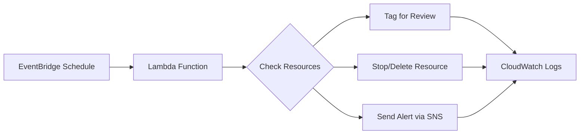

# How to Automate Cost Optimization with Lambda and CloudWatch

Author: [nawazdhandala](https://github.com/nawazdhandala)

Tags: AWS, Lambda, CloudWatch, Cost Optimization, Automation

Description: Build automated cost optimization workflows using AWS Lambda and CloudWatch to find and clean up waste, schedule resources, and enforce cost policies.

---

Manual cost optimization doesn't scale. You might clean up unused resources this month, but next month there's a new batch. Engineers forget to tag things, test environments don't get shut down, and snapshots accumulate quietly.

The solution is automation. Lambda functions triggered by CloudWatch Events (now EventBridge) can continuously enforce cost policies, clean up waste, and alert you to problems. You build it once, and it runs forever.

## Architecture Overview

The pattern is simple: CloudWatch/EventBridge triggers a Lambda function on a schedule. The Lambda function checks for cost optimization opportunities, takes action (or sends alerts), and logs the results.



## Automated Idle Instance Detection and Shutdown

This Lambda function identifies EC2 instances with low CPU utilization and stops them:

```python
import boto3
from datetime import datetime, timedelta

ec2 = boto3.client('ec2')
cw = boto3.client('cloudwatch')
sns = boto3.client('sns')

ALERT_TOPIC = 'arn:aws:sns:us-east-1:123456789012:cost-automation'
CPU_THRESHOLD = 5  # percent
LOOKBACK_DAYS = 7

def lambda_handler(event, context):
    """Find and stop idle EC2 instances"""

    instances = ec2.describe_instances(
        Filters=[
            {'Name': 'instance-state-name', 'Values': ['running']},
            # Only target instances tagged as auto-manageable
            {'Name': 'tag:CostManaged', 'Values': ['true']}
        ]
    )

    idle_instances = []
    end_time = datetime.utcnow()
    start_time = end_time - timedelta(days=LOOKBACK_DAYS)

    for reservation in instances['Reservations']:
        for instance in reservation['Instances']:
            instance_id = instance['InstanceId']
            tags = {t['Key']: t['Value'] for t in instance.get('Tags', [])}

            # Check CPU utilization
            metrics = cw.get_metric_statistics(
                Namespace='AWS/EC2',
                MetricName='CPUUtilization',
                Dimensions=[{'Name': 'InstanceId', 'Value': instance_id}],
                StartTime=start_time,
                EndTime=end_time,
                Period=LOOKBACK_DAYS * 86400,
                Statistics=['Average']
            )

            if metrics['Datapoints']:
                avg_cpu = metrics['Datapoints'][0]['Average']
                if avg_cpu < CPU_THRESHOLD:
                    idle_instances.append({
                        'id': instance_id,
                        'name': tags.get('Name', 'unnamed'),
                        'type': instance['InstanceType'],
                        'cpu': round(avg_cpu, 2)
                    })

    # Stop idle instances
    if idle_instances:
        instance_ids = [i['id'] for i in idle_instances]
        ec2.stop_instances(InstanceIds=instance_ids)

        # Tag them so we know why they were stopped
        for iid in instance_ids:
            ec2.create_tags(
                Resources=[iid],
                Tags=[
                    {'Key': 'StoppedBy', 'Value': 'cost-automation'},
                    {'Key': 'StoppedDate', 'Value': datetime.utcnow().strftime('%Y-%m-%d')}
                ]
            )

        # Send notification
        message = f"Stopped {len(idle_instances)} idle instances:\n\n"
        for i in idle_instances:
            message += f"  {i['id']} ({i['name']}) - {i['type']} - avg CPU: {i['cpu']}%\n"

        sns.publish(
            TopicArn=ALERT_TOPIC,
            Subject=f'Cost Automation: Stopped {len(idle_instances)} idle instances',
            Message=message
        )

    return {
        'idle_instances_stopped': len(idle_instances),
        'details': idle_instances
    }
```

## Automated EBS Volume Cleanup

Clean up unattached EBS volumes that have been orphaned for more than 14 days:

```python
import boto3
from datetime import datetime, timedelta, timezone

ec2 = boto3.client('ec2')
sns = boto3.client('sns')

ALERT_TOPIC = 'arn:aws:sns:us-east-1:123456789012:cost-automation'
GRACE_PERIOD_DAYS = 14

def lambda_handler(event, context):
    """Tag new orphaned volumes and delete ones past grace period"""

    volumes = ec2.describe_volumes(
        Filters=[{'Name': 'status', 'Values': ['available']}]
    )

    tagged = 0
    deleted = 0
    deleted_details = []

    for volume in volumes['Volumes']:
        vol_id = volume['VolumeId']
        tags = {t['Key']: t['Value'] for t in volume.get('Tags', [])}

        if 'OrphanedDate' not in tags:
            # First time we've seen this orphan - tag it
            ec2.create_tags(
                Resources=[vol_id],
                Tags=[{
                    'Key': 'OrphanedDate',
                    'Value': datetime.utcnow().strftime('%Y-%m-%d')
                }]
            )
            tagged += 1
        else:
            # Check if grace period has passed
            orphaned_date = datetime.strptime(tags['OrphanedDate'], '%Y-%m-%d')
            days_orphaned = (datetime.utcnow() - orphaned_date).days

            if days_orphaned >= GRACE_PERIOD_DAYS:
                # Snapshot before deleting (safety net)
                ec2.create_snapshot(
                    VolumeId=vol_id,
                    Description=f'Pre-deletion backup by cost-automation on {datetime.utcnow().strftime("%Y-%m-%d")}',
                    TagSpecifications=[{
                        'ResourceType': 'snapshot',
                        'Tags': [
                            {'Key': 'Source', 'Value': 'cost-automation'},
                            {'Key': 'OriginalVolumeId', 'Value': vol_id}
                        ]
                    }]
                )

                # Delete the volume
                ec2.delete_volume(VolumeId=vol_id)
                deleted += 1
                deleted_details.append(f"{vol_id} ({volume['Size']}GB {volume['VolumeType']})")

    if tagged or deleted:
        message = f"EBS Cleanup Report:\n"
        message += f"  New orphans tagged: {tagged}\n"
        message += f"  Volumes deleted: {deleted}\n"
        if deleted_details:
            message += f"\nDeleted volumes:\n"
            for d in deleted_details:
                message += f"  - {d}\n"

        sns.publish(
            TopicArn=ALERT_TOPIC,
            Subject=f'EBS Cleanup: {deleted} volumes deleted, {tagged} new orphans',
            Message=message
        )

    return {'tagged': tagged, 'deleted': deleted}
```

## Snapshot Retention Enforcement

Automatically delete snapshots older than your retention policy:

```python
import boto3
from datetime import datetime, timedelta, timezone

ec2 = boto3.client('ec2')

MAX_SNAPSHOT_AGE_DAYS = 90

def lambda_handler(event, context):
    """Delete snapshots older than retention period"""

    # Get all AMIs to avoid deleting snapshots used by AMIs
    images = ec2.describe_images(Owners=['self'])
    ami_snapshots = set()
    for image in images['Images']:
        for bdm in image.get('BlockDeviceMappings', []):
            if 'Ebs' in bdm:
                ami_snapshots.add(bdm['Ebs']['SnapshotId'])

    cutoff = datetime.now(timezone.utc) - timedelta(days=MAX_SNAPSHOT_AGE_DAYS)
    snapshots = ec2.describe_snapshots(OwnerIds=['self'])['Snapshots']

    deleted = 0
    saved_gb = 0

    for snap in snapshots:
        snap_id = snap['SnapshotId']
        tags = {t['Key']: t['Value'] for t in snap.get('Tags', [])}

        # Skip if used by an AMI
        if snap_id in ami_snapshots:
            continue

        # Skip if tagged to keep
        if tags.get('RetainForever') == 'true':
            continue

        # Skip if created by cost-automation (pre-deletion backups)
        if tags.get('Source') == 'cost-automation':
            # These have their own shorter retention
            snap_cutoff = datetime.now(timezone.utc) - timedelta(days=30)
            if snap['StartTime'] >= snap_cutoff:
                continue

        if snap['StartTime'] < cutoff:
            ec2.delete_snapshot(SnapshotId=snap_id)
            deleted += 1
            saved_gb += snap['VolumeSize']

    return {
        'deleted_snapshots': deleted,
        'freed_gb': saved_gb,
        'estimated_monthly_savings': round(saved_gb * 0.05, 2)
    }
```

## Cost Alert Automation

Create a Lambda function that checks daily spending and alerts when it's trending high:

```python
import boto3
from datetime import datetime, timedelta

ce = boto3.client('ce')
sns = boto3.client('sns')

DAILY_BUDGET = 500  # dollars
ALERT_TOPIC = 'arn:aws:sns:us-east-1:123456789012:cost-automation'

def lambda_handler(event, context):
    """Check yesterday's spend and alert if above daily budget"""

    yesterday = (datetime.now() - timedelta(days=1)).strftime('%Y-%m-%d')
    today = datetime.now().strftime('%Y-%m-%d')

    # Get yesterday's cost
    response = ce.get_cost_and_usage(
        TimePeriod={'Start': yesterday, 'End': today},
        Granularity='DAILY',
        Metrics=['UnblendedCost'],
        GroupBy=[{'Type': 'DIMENSION', 'Key': 'SERVICE'}]
    )

    total_cost = 0
    service_costs = []

    for group in response['ResultsByTime'][0]['Groups']:
        service = group['Keys'][0]
        cost = float(group['Metrics']['UnblendedCost']['Amount'])
        if cost > 0:
            service_costs.append((service, cost))
            total_cost += cost

    service_costs.sort(key=lambda x: x[1], reverse=True)

    if total_cost > DAILY_BUDGET:
        message = f"ALERT: Yesterday's spend (${total_cost:.2f}) exceeded daily budget (${DAILY_BUDGET})\n\n"
        message += "Top services:\n"
        for service, cost in service_costs[:10]:
            message += f"  ${cost:.2f} - {service}\n"

        sns.publish(
            TopicArn=ALERT_TOPIC,
            Subject=f'Daily Cost Alert: ${total_cost:.2f} (budget: ${DAILY_BUDGET})',
            Message=message
        )

    return {
        'date': yesterday,
        'total_cost': round(total_cost, 2),
        'over_budget': total_cost > DAILY_BUDGET
    }
```

## Setting Up the Schedules

Deploy all these functions with EventBridge schedules:

```bash
# Daily: cost alert check (runs at 8am UTC)
aws events put-rule \
  --name "daily-cost-check" \
  --schedule-expression "cron(0 8 * * ? *)" \
  --description "Daily cost check and alert"

aws events put-targets \
  --rule daily-cost-check \
  --targets "Id"="1","Arn"="arn:aws:lambda:us-east-1:123456789012:function:cost-alert"

# Weekly: idle instance detection (Mondays at 6am UTC)
aws events put-rule \
  --name "weekly-idle-check" \
  --schedule-expression "cron(0 6 ? * MON *)" \
  --description "Weekly idle instance detection"

aws events put-targets \
  --rule weekly-idle-check \
  --targets "Id"="1","Arn"="arn:aws:lambda:us-east-1:123456789012:function:idle-instance-checker"

# Weekly: EBS volume cleanup (Wednesdays at 6am UTC)
aws events put-rule \
  --name "weekly-ebs-cleanup" \
  --schedule-expression "cron(0 6 ? * WED *)" \
  --description "Weekly EBS volume cleanup"

aws events put-targets \
  --rule weekly-ebs-cleanup \
  --targets "Id"="1","Arn"="arn:aws:lambda:us-east-1:123456789012:function:ebs-cleanup"

# Monthly: snapshot retention (1st of each month)
aws events put-rule \
  --name "monthly-snapshot-cleanup" \
  --schedule-expression "cron(0 6 1 * ? *)" \
  --description "Monthly snapshot retention enforcement"

aws events put-targets \
  --rule monthly-snapshot-cleanup \
  --targets "Id"="1","Arn"="arn:aws:lambda:us-east-1:123456789012:function:snapshot-cleanup"
```

## IAM Permissions

Each Lambda function needs appropriate permissions. Here's a sample policy:

```json
{
  "Version": "2012-10-17",
  "Statement": [
    {
      "Effect": "Allow",
      "Action": [
        "ec2:DescribeInstances",
        "ec2:StopInstances",
        "ec2:CreateTags",
        "ec2:DescribeVolumes",
        "ec2:DeleteVolume",
        "ec2:CreateSnapshot",
        "ec2:DescribeSnapshots",
        "ec2:DeleteSnapshot",
        "ec2:DescribeImages",
        "cloudwatch:GetMetricStatistics",
        "ce:GetCostAndUsage",
        "sns:Publish"
      ],
      "Resource": "*"
    },
    {
      "Effect": "Allow",
      "Action": [
        "logs:CreateLogGroup",
        "logs:CreateLogStream",
        "logs:PutLogEvents"
      ],
      "Resource": "arn:aws:logs:*:*:*"
    }
  ]
}
```

## Key Takeaways

Automated cost optimization is about building a system that continuously enforces your cost policies without human intervention. Start with the highest-impact automations (idle instance shutdown, EBS cleanup), add alerting, and expand over time. The Lambda functions themselves cost nearly nothing to run - typically pennies per month - and the savings they generate are orders of magnitude higher.

For the broader strategy, see our guide on [creating a cost optimization strategy for AWS](https://oneuptime.com/blog/post/2026-02-12-create-a-cost-optimization-strategy-for-aws/view). And for finding resources to automate against, check out [identifying idle and unused AWS resources](https://oneuptime.com/blog/post/2026-02-12-identify-idle-and-unused-aws-resources/view).
