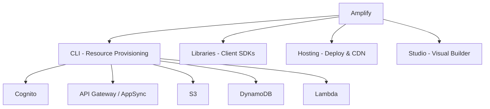

# How to Get Started with AWS Amplify

Author: [nawazdhandala](https://github.com/nawazdhandala)

Tags: AWS, Amplify, Serverless, Cloud

Description: A beginner-friendly guide to getting started with AWS Amplify, covering project setup, authentication, APIs, storage, hosting, and how Amplify fits into the broader AWS ecosystem.

---

AWS Amplify is a set of tools and services for building full-stack applications on AWS. Instead of wiring up individual AWS services yourself - setting up Cognito for auth, API Gateway for APIs, S3 for storage, DynamoDB for databases - Amplify gives you a higher-level abstraction that handles all the plumbing.

It's particularly good for frontend and mobile developers who want to build on AWS without becoming infrastructure experts. You describe what you need (auth, API, storage) and Amplify provisions everything behind the scenes.

## What Amplify Actually Is

Amplify isn't a single thing. It's a collection of components:

- **Amplify CLI** - command-line tool that creates and manages AWS resources
- **Amplify Libraries** - client-side SDKs for JavaScript, iOS, Android, Flutter
- **Amplify Hosting** - managed CI/CD and hosting for web apps
- **Amplify Studio** - visual development environment (optional)



You don't have to use all of them. Some teams just use Amplify Hosting for deployments and manage their backend with Terraform or CDK.

## Setting Up Amplify

First, install the Amplify CLI and configure it with your AWS account.

Install and configure:

```bash
# Install the Amplify CLI globally
npm install -g @aws-amplify/cli

# Configure with your AWS credentials
amplify configure
```

The configure command will walk you through creating an IAM user for Amplify. It needs permissions to create and manage AWS resources on your behalf.

## Initializing an Amplify Project

Let's add Amplify to an existing React project.

Initialize Amplify in your project:

```bash
# Create a React app (or use an existing one)
npx create-react-app my-amplify-app
cd my-amplify-app

# Initialize Amplify
amplify init
```

When you run `amplify init`, you'll answer a few questions:

```
? Enter a name for the project: myamplifyapp
? Initialize the project with the above configuration? Yes
? Select the authentication method: AWS profile
? Please choose the profile: default
```

This creates an `amplify` directory in your project with configuration files and a CloudFormation template.

## Adding Authentication

Authentication is usually the first thing you add. Amplify uses Cognito under the hood.

Add auth to your project:

```bash
amplify add auth

# Answer the prompts:
# ? Do you want to use the default authentication and security configuration? Default configuration
# ? How do you want users to be able to sign in? Email
# ? Do you want to configure advanced settings? No

# Push to create the resources in AWS
amplify push
```

That's it - Amplify just created a Cognito User Pool for you. Now use it in your app.

Install the Amplify libraries:

```bash
npm install aws-amplify @aws-amplify/ui-react
```

Configure and use authentication in your React app:

```javascript
// src/index.js
import { Amplify } from 'aws-amplify';
import config from './amplifyconfiguration.json';

Amplify.configure(config);
```

Add the pre-built authentication UI:

```jsx
// src/App.js
import { withAuthenticator } from '@aws-amplify/ui-react';
import '@aws-amplify/ui-react/styles.css';

function App({ signOut, user }) {
    return (
        <div>
            <h1>Hello, {user.username}</h1>
            <p>Email: {user.attributes.email}</p>
            <button onClick={signOut}>Sign Out</button>
        </div>
    );
}

// withAuthenticator wraps your app with a complete auth flow
// Sign up, sign in, forgot password - all built in
export default withAuthenticator(App);
```

That gives you a complete authentication flow with zero custom UI code. If you want to customize it, you can use the lower-level `Auth` API instead.

For more control over the authentication flow, see [using Amplify Authentication with Cognito](https://oneuptime.com/blog/post/amplify-authentication-cognito/view).

## Adding an API

Amplify supports both REST APIs (API Gateway + Lambda) and GraphQL APIs (AppSync).

Add a REST API:

```bash
amplify add api

# Choose REST
# ? Please select from one of the below mentioned services: REST
# ? Provide a friendly name for your resource: myapi
# ? Provide a path: /items
# ? Choose a Lambda source: Create a new Lambda function
# ? Provide an AWS Lambda function name: itemsHandler
# ? Choose the runtime: NodeJS
# ? Choose the function template: CRUD function for DynamoDB

amplify push
```

Use the API from your app:

```javascript
import { get, post } from 'aws-amplify/api';

// GET request
async function fetchItems() {
    try {
        const response = await get({
            apiName: 'myapi',
            path: '/items'
        }).response;
        const data = await response.body.json();
        console.log('Items:', data);
        return data;
    } catch (error) {
        console.error('Error fetching items:', error);
    }
}

// POST request
async function createItem(item) {
    try {
        const response = await post({
            apiName: 'myapi',
            path: '/items',
            options: {
                body: item
            }
        }).response;
        return await response.body.json();
    } catch (error) {
        console.error('Error creating item:', error);
    }
}
```

For more on REST APIs with Amplify, see [using Amplify API (REST) with API Gateway](https://oneuptime.com/blog/post/amplify-api-rest-api-gateway/view).

## Adding Storage

Amplify Storage uses S3 for file storage.

Add storage:

```bash
amplify add storage

# ? Please select from one of the below mentioned services: Content
# ? Please provide a friendly name: myfiles
# ? Please provide bucket name: my-app-files
# ? Who should have access: Auth users only
# ? What kind of access: create/update, read, delete

amplify push
```

Use storage in your app:

```javascript
import { uploadData, getUrl, list } from 'aws-amplify/storage';

// Upload a file
async function uploadFile(file) {
    try {
        const result = await uploadData({
            key: `uploads/${file.name}`,
            data: file,
            options: {
                contentType: file.type,
                onProgress: ({ transferredBytes, totalBytes }) => {
                    const progress = Math.round((transferredBytes / totalBytes) * 100);
                    console.log(`Upload progress: ${progress}%`);
                }
            }
        }).result;
        console.log('Upload complete:', result.key);
    } catch (error) {
        console.error('Upload failed:', error);
    }
}

// Get a file URL
async function getFileUrl(key) {
    const url = await getUrl({ key });
    return url.url.toString();
}

// List files
async function listFiles(prefix) {
    const result = await list({ prefix });
    return result.items;
}
```

For an in-depth look at S3 storage with Amplify, see [using Amplify Storage with S3](https://oneuptime.com/blog/post/amplify-storage-s3/view).

## Adding Hosting

Amplify Hosting gives you CI/CD, a CDN, custom domains, and HTTPS.

Add hosting:

```bash
amplify add hosting

# ? Select the plugin module to execute: Hosting with Amplify Console
# ? Choose a type: Manual deployment

amplify publish
```

Or connect a Git repository for automatic deployments. For framework-specific hosting guides, check out [Amplify Hosting for React](https://oneuptime.com/blog/post/amplify-hosting-react-app/view) or [Amplify Hosting for Next.js](https://oneuptime.com/blog/post/amplify-hosting-nextjs-app/view).

## Amplify Project Structure

After adding a few categories, your project structure looks like this:

```
my-amplify-app/
  amplify/
    backend/
      auth/          # Cognito configuration
      api/           # API Gateway / AppSync
      storage/       # S3 configuration
      function/      # Lambda functions
    team-provider-info.json  # Environment-specific settings
  src/
    amplifyconfiguration.json  # Auto-generated client config
  amplify.yml        # Build settings (for Amplify Hosting)
```

## Useful CLI Commands

Here's a reference of commands you'll use frequently:

```bash
# Check the status of your Amplify resources
amplify status

# Push changes to AWS
amplify push

# Pull latest config from AWS
amplify pull

# Open the Amplify console in your browser
amplify console

# Remove a category
amplify remove auth

# Delete all Amplify resources
amplify delete

# Add a new environment (staging, production)
amplify env add

# Switch between environments
amplify env checkout staging
```

## When to Use Amplify vs. Raw AWS Services

Amplify is great when:
- You're building a new app and want to move fast
- You're a frontend developer who doesn't want to manage infrastructure
- You want pre-built UI components for auth

Consider using raw AWS services (or CDK/Terraform) when:
- You need fine-grained control over IAM policies
- You have an existing infrastructure setup
- Your backend architecture is complex
- You need multi-account deployments

Many teams use a hybrid approach - Amplify Hosting for deployments and the Amplify libraries for client-side AWS integration, while managing backend infrastructure with CDK.

## Wrapping Up

Amplify removes the friction of connecting frontend applications to AWS services. What used to require setting up Cognito, API Gateway, S3, and DynamoDB individually now takes a few CLI commands. Start with `amplify init`, add the categories you need, and `amplify push` to deploy. The tradeoff is flexibility for speed - Amplify makes common patterns easy but can be constraining for unusual architectures. For most web and mobile apps, it's a solid starting point.
