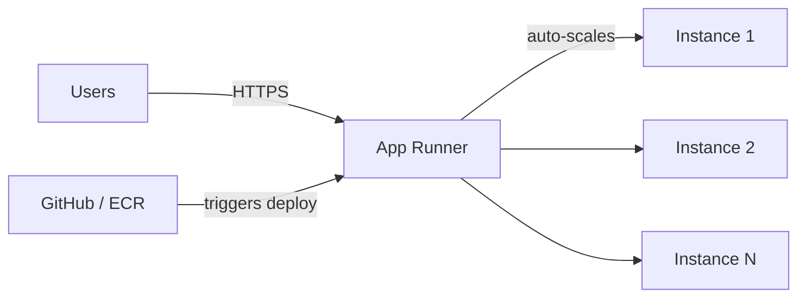

# How to Use AWS App Runner for Simple Container Deployments

Author: [nawazdhandala](https://github.com/nawazdhandala)

Tags: AWS, App Runner, Containers, Serverless, DevOps

Description: Learn how to use AWS App Runner to deploy containerized web applications and APIs with minimal configuration, automatic scaling, and built-in HTTPS.

---

Not every container deployment needs a full ECS setup with clusters, task definitions, services, load balancers, and target groups. Sometimes you just want to deploy a container and have it work. That's exactly what AWS App Runner does.

App Runner takes a container image (or source code) and gives you a running, auto-scaling, HTTPS-enabled web service with a public URL. No cluster management, no load balancer configuration, no VPC networking to worry about. Let's see how it works and when it makes sense.

## What App Runner Does for You

When you create an App Runner service, AWS automatically handles:

- Provisioning compute capacity
- Load balancing across instances
- TLS termination with a managed certificate
- Auto-scaling from zero to your configured maximum
- Health checking and automatic replacement of failed instances
- Rolling deployments when you update the image

You don't see or manage any of these components. They just work.



## Creating Your First App Runner Service

The fastest way to deploy a container:

```bash
# Create an App Runner service from an ECR image
aws apprunner create-service \
  --service-name my-api \
  --source-configuration '{
    "imageRepository": {
      "imageIdentifier": "123456789012.dkr.ecr.us-east-1.amazonaws.com/my-api:latest",
      "imageConfiguration": {
        "port": "8080",
        "runtimeEnvironmentVariables": {
          "NODE_ENV": "production",
          "LOG_LEVEL": "info"
        }
      },
      "imageRepositoryType": "ECR"
    },
    "autoDeploymentsEnabled": true,
    "authenticationConfiguration": {
      "accessRoleArn": "arn:aws:iam::123456789012:role/AppRunnerECRAccessRole"
    }
  }' \
  --instance-configuration '{
    "cpu": "1024",
    "memory": "2048"
  }' \
  --auto-scaling-configuration-arn "arn:aws:apprunner:us-east-1:123456789012:autoscalingconfiguration/default/1/abc123"
```

Within a few minutes, you'll get a URL like `https://abc123.us-east-1.awsapprunner.com` that's serving your application.

Let's break down the key configuration options.

## Instance Configuration

App Runner offers fixed instance sizes, similar to Fargate:

| CPU (vCPU) | Memory (MB) | Good For |
|------------|-------------|----------|
| 256 | 512 | Simple APIs, lightweight services |
| 512 | 1024 | Most web applications |
| 1024 | 2048 | CPU-intensive workloads |
| 1024 | 3072 | Memory-heavy applications |
| 2048 | 4096 | Large applications |
| 4096 | 8192 | High-performance services |
| 4096 | 12288 | Memory-intensive processing |

Choose based on your application's actual resource needs. You can change instance sizes later without downtime - App Runner handles the rollout automatically.

## Auto-Scaling Configuration

App Runner scales automatically based on concurrent requests per instance:

```bash
# Create a custom auto-scaling configuration
aws apprunner create-auto-scaling-configuration \
  --auto-scaling-configuration-name production-scaling \
  --max-concurrency 100 \
  --min-size 2 \
  --max-size 25
```

- **max-concurrency** - How many concurrent requests each instance handles before scaling out. Default is 100.
- **min-size** - Minimum number of instances. Set to at least 1 for always-on, or 0 for scale-to-zero (but be aware of cold start times).
- **max-size** - Maximum number of instances. This is your spending cap.

A good starting point is `max-concurrency: 50` for most web applications. If your requests are quick (under 100ms), you can push this higher. If they're slow (database queries, external API calls), lower it.

## Environment Variables and Secrets

For non-sensitive configuration, use runtime environment variables:

```bash
# Update environment variables
aws apprunner update-service \
  --service-arn arn:aws:apprunner:us-east-1:123456789012:service/my-api/abc123 \
  --source-configuration '{
    "imageRepository": {
      "imageIdentifier": "123456789012.dkr.ecr.us-east-1.amazonaws.com/my-api:latest",
      "imageConfiguration": {
        "port": "8080",
        "runtimeEnvironmentVariables": {
          "NODE_ENV": "production",
          "API_TIMEOUT": "30000",
          "FEATURE_FLAG_NEW_UI": "true"
        },
        "runtimeEnvironmentSecrets": {
          "DATABASE_URL": "arn:aws:secretsmanager:us-east-1:123456789012:secret:prod/db-url",
          "API_KEY": "arn:aws:ssm:us-east-1:123456789012:parameter/prod/api-key"
        }
      },
      "imageRepositoryType": "ECR"
    }
  }'
```

The `runtimeEnvironmentSecrets` field lets you reference Secrets Manager secrets and SSM Parameter Store parameters. App Runner injects these as environment variables at runtime.

## Health Checks

App Runner runs health checks to ensure your application is responding correctly:

```bash
# Configure health check settings
aws apprunner create-service \
  --service-name my-api \
  --health-check-configuration '{
    "protocol": "HTTP",
    "path": "/health",
    "interval": 10,
    "timeout": 5,
    "healthyThreshold": 1,
    "unhealthyThreshold": 5
  }' \
  --source-configuration '...'
```

If an instance fails health checks, App Runner replaces it automatically. There's no manual intervention needed.

Your health endpoint should be lightweight:

```javascript
// A simple health check endpoint
app.get('/health', (req, res) => {
  res.status(200).json({ status: 'ok' });
});
```

## Automatic Deployments

One of App Runner's best features is automatic deployments. When you push a new image to ECR, App Runner detects it and starts a rolling deployment:

```bash
# Enable auto-deployments (set during service creation)
"autoDeploymentsEnabled": true
```

This means your CI/CD pipeline just needs to build and push the image. App Runner handles the rest. The deployment is a rolling update, so there's no downtime.

If you prefer manual deployments:

```bash
# Trigger a deployment manually
aws apprunner start-deployment \
  --service-arn arn:aws:apprunner:us-east-1:123456789012:service/my-api/abc123
```

## VPC Connectivity

By default, App Runner services can reach the public internet but not your private VPC resources (like RDS databases in private subnets). To connect to VPC resources:

```bash
# Create a VPC connector
aws apprunner create-vpc-connector \
  --vpc-connector-name production-connector \
  --subnets subnet-abc123 subnet-def456 \
  --security-groups sg-abc123

# Associate it with your service
aws apprunner update-service \
  --service-arn arn:aws:apprunner:us-east-1:123456789012:service/my-api/abc123 \
  --network-configuration '{
    "egressConfiguration": {
      "egressType": "VPC",
      "vpcConnectorArn": "arn:aws:apprunner:us-east-1:123456789012:vpcconnector/production-connector/1/abc123"
    }
  }'
```

## Custom Domains

App Runner gives you an `awsapprunner.com` URL by default, but you'll want a custom domain for production:

```bash
# Associate a custom domain
aws apprunner associate-custom-domain \
  --service-arn arn:aws:apprunner:us-east-1:123456789012:service/my-api/abc123 \
  --domain-name api.mycompany.com \
  --enable-www-subdomain false
```

App Runner will give you CNAME records to add to your DNS. Once validated, it provisions and manages the TLS certificate automatically.

## When to Use App Runner vs ECS

App Runner is the right choice when:
- You want the simplest possible deployment
- Your app is a web service or API
- You don't need fine-grained networking control
- You want automatic scaling without configuring autoscaling policies
- Your team is small and doesn't want to manage infrastructure

ECS (Fargate) is better when:
- You need sidecar containers
- You need task placement strategies
- You need complex networking (service mesh, multiple VPCs)
- You need blue/green deployments with CodeDeploy
- You need to run non-web workloads (batch jobs, daemons)

For a deeper look at App Runner with ECR specifically, check out our guide on [setting up App Runner with ECR](https://oneuptime.com/blog/post/app-runner-with-ecr/view).

## Wrapping Up

App Runner removes the operational overhead of running containers. You don't think about clusters, load balancers, or scaling policies. You push an image, and you get a running service with HTTPS and auto-scaling. For web applications and APIs where simplicity matters more than fine-grained control, it's hard to beat.
