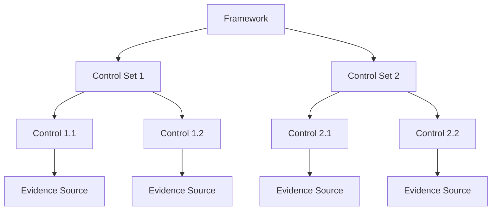

# How to Set Up AWS Audit Manager Custom Frameworks

Author: [nawazdhandala](https://github.com/nawazdhandala)

Tags: AWS, Audit Manager, Compliance, Security

Description: A practical guide to creating custom audit frameworks in AWS Audit Manager to meet your organization's unique compliance requirements.

---

AWS Audit Manager ships with a solid set of prebuilt frameworks - SOC 2, PCI DSS, HIPAA, and more. But most organizations have compliance requirements that don't fit neatly into a single standard framework. Maybe you need a hybrid of multiple frameworks, or you've got internal security policies that are specific to your company. That's where custom frameworks come in.

Custom frameworks let you define exactly what controls you want to assess, how you want to collect evidence, and which AWS resources should be in scope. Let's walk through how to build one from scratch.

## Understanding the Audit Manager Hierarchy

Before diving in, it's worth understanding how Audit Manager organizes things. The hierarchy goes like this:



A **framework** contains one or more **control sets** (think of these as categories). Each control set contains **controls**, and each control has one or more **evidence sources** that define how evidence is collected.

## Creating Custom Controls

You'll need controls before you can create a framework. Let's start by creating a custom control that checks whether CloudTrail is enabled with log file validation.

```bash
# Create a custom control for CloudTrail log validation
aws auditmanager create-control \
  --name "CloudTrail-LogValidation" \
  --description "Ensures CloudTrail has log file validation enabled" \
  --testing-information "Verify CloudTrail trails have LogFileValidationEnabled set to true" \
  --action-plan-title "Enable CloudTrail Log Validation" \
  --action-plan-instructions "Run aws cloudtrail update-trail --name <trail-name> --enable-log-file-validation" \
  --control-mapping-sources '[
    {
      "sourceName": "CloudTrail_Config_Check",
      "sourceDescription": "AWS Config rule checking CloudTrail log validation",
      "sourceSetUpOption": "System_Controls_Mapping",
      "sourceType": "AWS_Config",
      "sourceKeyword": {
        "keywordInputType": "SELECT_FROM_LIST",
        "keywordValue": "CLOUD_TRAIL_LOG_FILE_VALIDATION_ENABLED"
      }
    }
  ]'
```

The `control-mapping-sources` parameter is where the magic happens. It tells Audit Manager where to pull evidence from. You've got several options:

- **AWS_Config** - Uses Config rule evaluations as evidence
- **AWS_CloudTrail** - Collects CloudTrail events as evidence
- **AWS_Security_Hub** - Uses Security Hub findings
- **AWS_API_Call** - Calls AWS APIs on a schedule to collect snapshots
- **MANUAL** - Requires manual evidence upload

Here's another control that uses CloudTrail as its evidence source:

```bash
# Create a control that monitors IAM policy changes via CloudTrail
aws auditmanager create-control \
  --name "IAM-PolicyChangeMonitoring" \
  --description "Monitors for unauthorized IAM policy modifications" \
  --testing-information "Review CloudTrail logs for IAM policy change events" \
  --control-mapping-sources '[
    {
      "sourceName": "IAM_Policy_CloudTrail",
      "sourceDescription": "CloudTrail events for IAM policy changes",
      "sourceSetUpOption": "System_Controls_Mapping",
      "sourceType": "AWS_CloudTrail",
      "sourceKeyword": {
        "keywordInputType": "SELECT_FROM_LIST",
        "keywordValue": "PutGroupPolicy"
      }
    },
    {
      "sourceName": "IAM_Role_CloudTrail",
      "sourceDescription": "CloudTrail events for IAM role policy changes",
      "sourceSetUpOption": "System_Controls_Mapping",
      "sourceType": "AWS_CloudTrail",
      "sourceKeyword": {
        "keywordInputType": "SELECT_FROM_LIST",
        "keywordValue": "PutRolePolicy"
      }
    }
  ]'
```

Notice how a single control can have multiple evidence sources. This control watches for both group and role policy changes, giving you comprehensive coverage.

## Creating the Custom Framework

Now that you have controls, let's put them together into a framework. Here's a Python script that creates a comprehensive security framework:

```python
# create_custom_framework.py - Build a custom security framework
import boto3
import json

client = boto3.client('auditmanager')

def create_framework():
    # First, get the IDs of controls we created earlier
    # You'd replace these with actual control IDs from your account
    controls = client.list_controls(controlType='Custom')

    control_map = {}
    for control in controls['controlMetadataList']:
        control_map[control['name']] = control['id']

    # Define the framework structure
    framework_response = client.create_assessment_framework(
        name='Custom-Security-Framework-v1',
        description='Internal security compliance framework combining CIS, SOC 2, and custom controls',
        complianceType='CUSTOM',
        controlSets=[
            {
                'name': 'Identity and Access Management',
                'controls': [
                    {'id': control_map.get('IAM-PolicyChangeMonitoring', '')},
                    {'id': control_map.get('IAM-MFAEnforcement', '')},
                    {'id': control_map.get('IAM-RootAccountUsage', '')},
                ]
            },
            {
                'name': 'Logging and Monitoring',
                'controls': [
                    {'id': control_map.get('CloudTrail-LogValidation', '')},
                    {'id': control_map.get('CloudWatch-AlarmCoverage', '')},
                    {'id': control_map.get('VPCFlowLogs-Enabled', '')},
                ]
            },
            {
                'name': 'Data Protection',
                'controls': [
                    {'id': control_map.get('S3-Encryption', '')},
                    {'id': control_map.get('EBS-Encryption', '')},
                    {'id': control_map.get('RDS-Encryption', '')},
                ]
            },
            {
                'name': 'Network Security',
                'controls': [
                    {'id': control_map.get('SecurityGroup-NoPublicSSH', '')},
                    {'id': control_map.get('VPC-DefaultSG-Restricted', '')},
                ]
            }
        ],
        tags={
            'Environment': 'Production',
            'Version': '1.0',
            'Owner': 'SecurityTeam'
        }
    )

    framework_id = framework_response['framework']['id']
    print(f"Framework created with ID: {framework_id}")
    return framework_id

if __name__ == '__main__':
    create_framework()
```

## Creating an Assessment from the Framework

A framework by itself doesn't do anything - you need to create an assessment that uses it. The assessment defines the scope (which AWS accounts and services) and the time period.

```python
# create_assessment.py - Launch an assessment from your custom framework
import boto3

client = boto3.client('auditmanager')

def create_assessment(framework_id):
    response = client.create_assessment(
        name='Q1-2026-Security-Assessment',
        description='Quarterly security compliance assessment',
        assessmentReportsDestination={
            'destinationType': 'S3',
            'destination': 's3://my-audit-reports-bucket/assessments/'
        },
        scope={
            'awsAccounts': [
                {'id': '123456789012'},
                {'id': '987654321098'}
            ],
            'awsServices': [
                {'serviceName': 'iam'},
                {'serviceName': 's3'},
                {'serviceName': 'ec2'},
                {'serviceName': 'rds'},
                {'serviceName': 'cloudtrail'},
                {'serviceName': 'cloudwatch'}
            ]
        },
        roles=[
            {
                'roleType': 'PROCESS_OWNER',
                'roleArn': 'arn:aws:iam::123456789012:role/AuditManagerProcessOwner'
            }
        ],
        frameworkId=framework_id,
        tags={
            'Quarter': 'Q1-2026',
            'AssessmentType': 'Quarterly'
        }
    )

    print(f"Assessment created: {response['assessment']['metadata']['name']}")
    return response

create_assessment('your-framework-id-here')
```

## Adding Manual Evidence

Not everything can be automated. Sometimes you need to attach manual evidence - penetration test reports, vendor questionnaires, or policy documents.

```bash
# Upload manual evidence to a specific control in your assessment
aws auditmanager batch-import-evidence-to-assessment-control \
  --assessment-id "a1b2c3d4-5678-90ab-cdef-example" \
  --control-set-id "Identity-and-Access-Management" \
  --control-id "IAM-MFAEnforcement" \
  --manual-evidence '[
    {
      "s3ResourcePath": "s3://my-audit-evidence/pentest-report-2026-q1.pdf"
    },
    {
      "s3ResourcePath": "s3://my-audit-evidence/mfa-policy-v3.pdf"
    }
  ]'
```

## Sharing Frameworks Across Accounts

If you're running a multi-account setup with AWS Organizations, you'll want to share your custom framework across accounts. Audit Manager supports this natively.

```bash
# Share the framework with another account
aws auditmanager create-assessment-framework-share \
  --framework-id "your-framework-id" \
  --destination-account "987654321098" \
  --destination-region "us-east-1" \
  --comment "Sharing our security framework for Q1 assessment"
```

The destination account then needs to accept the share request before they can use the framework.

## Automating Framework Updates

Compliance requirements change over time. Here's a pattern for versioning your frameworks using CloudFormation custom resources and a Lambda function that programmatically updates your framework when controls change:

```python
# lambda_handler.py - Update framework controls on a schedule
import boto3
import os

def handler(event, context):
    client = boto3.client('auditmanager')
    framework_id = os.environ['FRAMEWORK_ID']

    # Get current framework
    framework = client.get_assessment_framework(frameworkId=framework_id)
    current_sets = framework['framework']['controlSets']

    # Check for new Config rules that should be mapped
    config_client = boto3.client('config')
    rules = config_client.describe_config_rules()

    # Find rules not yet mapped to controls
    existing_controls = set()
    for cs in current_sets:
        for ctrl in cs.get('controls', []):
            existing_controls.add(ctrl.get('name', ''))

    new_rules = []
    for rule in rules['ConfigRules']:
        if rule['ConfigRuleName'] not in existing_controls:
            new_rules.append(rule['ConfigRuleName'])

    if new_rules:
        print(f"Found {len(new_rules)} unmapped Config rules: {new_rules}")
        # Create controls and update framework here

    return {'statusCode': 200, 'unmappedRules': new_rules}
```

## Best Practices for Custom Frameworks

**Keep control sets focused**. Each control set should represent a logical domain - identity management, data protection, network security, etc. This makes it easier to assign different teams as owners.

**Version your frameworks**. Include a version number in the framework name and use tags to track changes. When you need to update, create a new version rather than modifying the existing one.

**Map to multiple evidence sources**. A single control can pull from Config, CloudTrail, and Security Hub simultaneously. More evidence sources mean better coverage and fewer gaps.

**Start with AWS managed controls**. Before building custom controls from scratch, check if AWS has a managed control that does what you need. You can mix managed and custom controls in the same framework.

For ongoing monitoring of your compliance posture beyond Audit Manager, you might want to set up [auto remediation with AWS Config](https://oneuptime.com/blog/post/aws-config-auto-remediation/view) so non-compliant resources get fixed automatically.

## Wrapping Up

Custom frameworks in AWS Audit Manager give you the flexibility to define compliance on your own terms. By combining automated evidence collection from Config, CloudTrail, and Security Hub with manual evidence uploads, you can build a comprehensive audit program that maps to your actual compliance requirements rather than forcing your processes into a prebuilt framework's structure.

Start by identifying your most critical compliance requirements, create controls with appropriate evidence sources, group them into logical control sets, and build your framework. From there, it's just a matter of running regular assessments and acting on the results.
