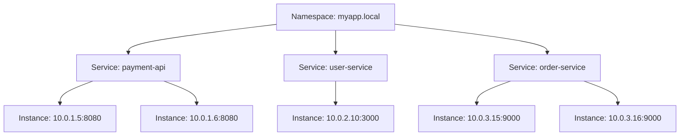

# How to Use AWS Cloud Map for Service Discovery

Author: [nawazdhandala](https://github.com/nawazdhandala)

Tags: AWS, Cloud Map, Networking, Microservices

Description: A practical guide to using AWS Cloud Map for service discovery, including namespace creation, service registration, DNS and API-based discovery, and integration with ECS and Kubernetes.

---

In a microservices architecture, services need to find each other. Hardcoding IP addresses or hostnames doesn't scale when containers spin up and down constantly, and load balancers add latency and cost for service-to-service communication. AWS Cloud Map solves this by providing a managed service registry where services register themselves and other services discover them through DNS or API calls.

Think of Cloud Map as a phone book for your services. Service A needs to talk to Service B? It asks Cloud Map for Service B's current address and gets back a healthy endpoint.

## Core Concepts

Cloud Map has three main concepts:

**Namespace** - A logical grouping of services. A namespace maps to either a Route 53 public hosted zone, a private hosted zone, or an HTTP-only namespace (API discovery only, no DNS).

**Service** - A named service within a namespace, like "payment-api" or "user-service."

**Service Instance** - A specific running instance of a service, with its IP address, port, and custom attributes.



## Creating a Namespace

For services running in a VPC, you'll typically want a private DNS namespace.

```bash
# Create a private DNS namespace
aws servicediscovery create-private-dns-namespace \
  --name myapp.local \
  --vpc vpc-0abc123def456789 \
  --description "Service discovery for my application"
```

This creates a Route 53 private hosted zone for `myapp.local` and a Cloud Map namespace linked to it. Services registered here will be discoverable via DNS queries within the VPC.

For public-facing services, you can use a public DNS namespace.

```bash
# Create a public DNS namespace
aws servicediscovery create-public-dns-namespace \
  --name services.example.com \
  --description "Public service discovery"
```

For services that don't need DNS discovery (maybe they use an API gateway or a service mesh), HTTP namespaces are lighter weight.

```bash
# Create an HTTP-only namespace (API discovery only)
aws servicediscovery create-http-namespace \
  --name myapp-api \
  --description "API-based service discovery"
```

## Registering a Service

Once you have a namespace, create services within it.

```bash
# Create a service with DNS-based discovery
aws servicediscovery create-service \
  --name payment-api \
  --namespace-id ns-0123456789abcdef0 \
  --dns-config '{
    "NamespaceId": "ns-0123456789abcdef0",
    "DnsRecords": [
      {
        "Type": "A",
        "TTL": 10
      },
      {
        "Type": "SRV",
        "TTL": 10
      }
    ]
  }' \
  --health-check-custom-config '{
    "FailureThreshold": 1
  }'
```

The DNS configuration creates A records (for IP addresses) and SRV records (for IP + port). The low TTL of 10 seconds means DNS caches won't hold onto stale records for long when instances change.

The custom health check configuration means you'll manage health status yourself (or let ECS do it). You can also use Route 53 health checks for automatic health monitoring.

## Registering Service Instances

Now register actual instances with the service.

```bash
# Register a service instance
aws servicediscovery register-instance \
  --service-id srv-0123456789abcdef0 \
  --instance-id payment-api-001 \
  --attributes '{
    "AWS_INSTANCE_IPV4": "10.0.1.5",
    "AWS_INSTANCE_PORT": "8080",
    "version": "2.1.0",
    "region": "us-east-1"
  }'

# Register another instance
aws servicediscovery register-instance \
  --service-id srv-0123456789abcdef0 \
  --instance-id payment-api-002 \
  --attributes '{
    "AWS_INSTANCE_IPV4": "10.0.1.6",
    "AWS_INSTANCE_PORT": "8080",
    "version": "2.1.0",
    "region": "us-east-1"
  }'
```

Notice the custom attributes like `version` and `region`. These don't affect DNS, but they're available when you discover instances through the API, which enables more sophisticated routing decisions.

## Discovering Services

There are two ways to discover services: DNS and API.

**DNS Discovery** - Simply resolve the service name.

```bash
# From any instance in the VPC, resolve the service
dig payment-api.myapp.local

# Returns A records for all healthy instances:
# payment-api.myapp.local. 10 IN A 10.0.1.5
# payment-api.myapp.local. 10 IN A 10.0.1.6

# SRV records include port information
dig SRV payment-api.myapp.local

# Returns:
# payment-api.myapp.local. 10 IN SRV 1 1 8080 payment-api-001.myapp.local.
# payment-api.myapp.local. 10 IN SRV 1 1 8080 payment-api-002.myapp.local.
```

**API Discovery** - Use the Cloud Map API for more control.

```bash
# Discover instances using the API
aws servicediscovery discover-instances \
  --namespace-name myapp.local \
  --service-name payment-api \
  --query-parameters version=2.1.0
```

API discovery lets you filter by custom attributes, which DNS can't do. This is useful for canary deployments where you want to route some traffic to a new version.

## Integration with ECS

The most common use of Cloud Map is with Amazon ECS. When you configure a service in ECS with service discovery, ECS automatically registers and deregisters task instances as they start and stop.

```bash
# Create an ECS service with Cloud Map service discovery
aws ecs create-service \
  --cluster my-cluster \
  --service-name payment-api \
  --task-definition payment-api:5 \
  --desired-count 3 \
  --service-registries '[
    {
      "registryArn": "arn:aws:servicediscovery:us-east-1:123456789012:service/srv-0123456789abcdef0",
      "containerName": "payment-api",
      "containerPort": 8080
    }
  ]' \
  --network-configuration '{
    "awsvpcConfiguration": {
      "subnets": ["subnet-abc123", "subnet-def456"],
      "securityGroups": ["sg-app"],
      "assignPublicIp": "DISABLED"
    }
  }'
```

When ECS launches a task, it registers the task's IP and port with Cloud Map. When a task stops or fails health checks, ECS deregisters it. Other services discover the payment API simply by resolving `payment-api.myapp.local`.

## Terraform Configuration

```hcl
resource "aws_service_discovery_private_dns_namespace" "main" {
  name        = "myapp.local"
  description = "Service discovery namespace"
  vpc         = aws_vpc.main.id
}

resource "aws_service_discovery_service" "payment" {
  name = "payment-api"

  dns_config {
    namespace_id = aws_service_discovery_private_dns_namespace.main.id

    dns_records {
      ttl  = 10
      type = "A"
    }

    dns_records {
      ttl  = 10
      type = "SRV"
    }

    routing_policy = "MULTIVALUE"
  }

  health_check_custom_config {
    failure_threshold = 1
  }
}

# ECS service with service discovery
resource "aws_ecs_service" "payment" {
  name            = "payment-api"
  cluster         = aws_ecs_cluster.main.id
  task_definition = aws_ecs_task_definition.payment.arn
  desired_count   = 3

  service_registries {
    registry_arn   = aws_service_discovery_service.payment.arn
    container_name = "payment-api"
    container_port = 8080
  }

  network_configuration {
    subnets         = aws_subnet.private[*].id
    security_groups = [aws_security_group.app.id]
  }
}
```

## Health Check Management

For custom health checks, you update the instance health status yourself.

```bash
# Mark an instance as unhealthy
aws servicediscovery update-instance-custom-health-status \
  --service-id srv-0123456789abcdef0 \
  --instance-id payment-api-001 \
  --status UNHEALTHY

# Mark it healthy again
aws servicediscovery update-instance-custom-health-status \
  --service-id srv-0123456789abcdef0 \
  --instance-id payment-api-001 \
  --status HEALTHY
```

Unhealthy instances are removed from DNS responses, so clients automatically stop routing traffic to them.

## Cloud Map vs Other Discovery Methods

Cloud Map isn't the only option for service discovery in AWS. Here's when you'd choose it:

- **Cloud Map** - Best for ECS-native service discovery, simple DNS-based discovery
- **App Mesh** - Best when you need a full service mesh with traffic policies and observability
- **Load Balancers** - Best when you need advanced routing, SSL termination, or path-based routing
- **Kubernetes service discovery** - If you're on EKS, Kubernetes has built-in service discovery

Cloud Map is lightweight and integrates natively with ECS, making it the path of least resistance for container-based microservices on AWS. For DNS routing beyond service discovery, check out Route 53's routing policies at https://oneuptime.com/blog/post/route-53-simple-routing-policy/view.
