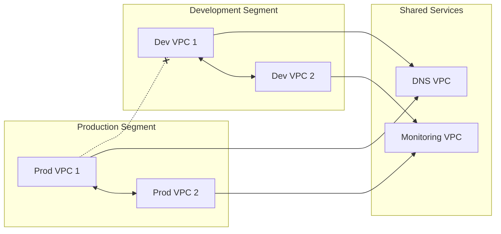

# How to Use AWS Cloud WAN for Global Networking

Author: [nawazdhandala](https://github.com/nawazdhandala)

Tags: AWS, Cloud WAN, Networking, Global Infrastructure

Description: A practical guide to using AWS Cloud WAN to build and manage your global network with centralized policies, segmentation, and automated connectivity.

---

Managing a global network on AWS used to mean stitching together transit gateways across regions, manually peering them, and hoping your routing tables stayed consistent. AWS Cloud WAN changes that equation completely. It lets you build a unified global network with centralized policies, automatic cross-region connectivity, and built-in segmentation - all managed through a single JSON or YAML policy document.

Let's dig into how to set it up and what makes it worth considering for your multi-region architecture.

## What Cloud WAN Actually Does

Cloud WAN sits on top of the transit gateway infrastructure but abstracts away most of the manual work. Instead of creating individual transit gateways, peering connections, and route tables in each region, you define a network policy that describes what you want. Cloud WAN takes care of deploying the underlying resources.

The core concepts are:

- **Core Network**: Your global network backbone. It spans all the regions you specify.
- **Segments**: Logical isolation groups (think "production," "development," "shared services"). Traffic stays within its segment unless you create explicit sharing rules.
- **Attachment**: How VPCs, VPNs, and Direct Connect gateways connect to the core network.
- **Network Policy**: The JSON document that defines segments, regions, sharing rules, and attachment policies.

## Creating a Core Network

Everything starts with a global network and a core network. The core network is where you define your policy.

Create the global network and core network:

```bash
# Create the global network first
aws networkmanager create-global-network \
  --description "Cloud WAN Global Network"

# Create the core network with an initial policy
aws networkmanager create-core-network \
  --global-network-id global-network-abc123 \
  --description "Production Core Network" \
  --policy-document file://core-network-policy.json
```

## Writing Your Network Policy

The network policy is the heart of Cloud WAN. It defines which regions participate, what segments exist, and how attachments are handled.

Here's a complete policy document covering two regions with three segments:

```json
{
  "version": "2021.12",
  "core-network-configuration": {
    "vpn-ecmp-support": true,
    "asn-ranges": ["64512-65534"],
    "edge-locations": [
      {
        "location": "us-east-1",
        "asn": 64512
      },
      {
        "location": "eu-west-1",
        "asn": 64513
      }
    ]
  },
  "segments": [
    {
      "name": "production",
      "description": "Production workloads",
      "require-attachment-acceptance": true,
      "isolate-attachments": false
    },
    {
      "name": "development",
      "description": "Development and testing",
      "require-attachment-acceptance": false,
      "isolate-attachments": true
    },
    {
      "name": "shared-services",
      "description": "DNS, monitoring, logging",
      "require-attachment-acceptance": true,
      "isolate-attachments": false
    }
  ],
  "segment-actions": [
    {
      "action": "share",
      "mode": "attachment-route",
      "segment": "shared-services",
      "share-with": ["production", "development"]
    }
  ],
  "attachment-policies": [
    {
      "rule-number": 100,
      "condition-logic": "or",
      "conditions": [
        {
          "type": "tag-value",
          "operator": "equals",
          "key": "Segment",
          "value": "production"
        }
      ],
      "action": {
        "association-method": "constant",
        "segment": "production"
      }
    },
    {
      "rule-number": 200,
      "condition-logic": "or",
      "conditions": [
        {
          "type": "tag-value",
          "operator": "equals",
          "key": "Segment",
          "value": "development"
        }
      ],
      "action": {
        "association-method": "constant",
        "segment": "development"
      }
    },
    {
      "rule-number": 300,
      "condition-logic": "or",
      "conditions": [
        {
          "type": "tag-value",
          "operator": "equals",
          "key": "Segment",
          "value": "shared-services"
        }
      ],
      "action": {
        "association-method": "constant",
        "segment": "shared-services"
      }
    }
  ]
}
```

Notice the `segment-actions` section. The `share` action makes shared-services routes available to both production and development segments. This is how you implement a hub-and-spoke pattern where central services are reachable from everywhere, but production and development can't talk to each other directly.

## Attaching VPCs

Once your core network is deployed, you attach VPCs to it. Each VPC gets tagged with the segment it belongs to, and the attachment policy automatically routes it to the right segment.

Attach a VPC to the core network:

```bash
# Create a VPC attachment
aws networkmanager create-vpc-attachment \
  --core-network-id core-network-xyz789 \
  --vpc-arn arn:aws:ec2:us-east-1:123456789012:vpc/vpc-prod001 \
  --subnet-arns \
    arn:aws:ec2:us-east-1:123456789012:subnet/subnet-a1b2c3 \
    arn:aws:ec2:us-east-1:123456789012:subnet/subnet-d4e5f6 \
  --tags Key=Segment,Value=production
```

If you set `require-attachment-acceptance` to true for the segment, you'll need to accept the attachment before it becomes active.

Accept a pending attachment:

```bash
# Accept the attachment
aws networkmanager accept-attachment \
  --attachment-id attachment-0123456789abcdef0
```

## CloudFormation Approach

For repeatable deployments, CloudFormation is the way to go.

CloudFormation template for VPC attachment:

```yaml
AWSTemplateFormatVersion: '2010-09-09'
Description: Cloud WAN VPC Attachment

Parameters:
  CoreNetworkId:
    Type: String
  VpcId:
    Type: String
  SubnetIds:
    Type: List<AWS::EC2::Subnet::Id>
  SegmentName:
    Type: String
    AllowedValues:
      - production
      - development
      - shared-services

Resources:
  VpcAttachment:
    Type: AWS::NetworkManager::VpcAttachment
    Properties:
      CoreNetworkId: !Ref CoreNetworkId
      VpcArn: !Sub "arn:aws:ec2:${AWS::Region}:${AWS::AccountId}:vpc/${VpcId}"
      SubnetArns: !Ref SubnetIds
      Tags:
        - Key: Segment
          Value: !Ref SegmentName

  # Update VPC route table to point to Cloud WAN
  CloudWanRoute:
    Type: AWS::EC2::Route
    DependsOn: VpcAttachment
    Properties:
      RouteTableId: !Ref PrivateRouteTable
      DestinationCidrBlock: "10.0.0.0/8"
      CoreNetworkArn: !Sub "arn:aws:networkmanager::${AWS::AccountId}:core-network/${CoreNetworkId}"
```

## Network Segmentation in Practice

The segmentation model is one of Cloud WAN's best features. Here's how traffic flows across segments:



Production VPCs can reach each other and shared services. Development VPCs can reach each other and shared services. But production and development can't communicate - that's the isolation boundary you defined in the policy.

## Connecting On-Premises Networks

Cloud WAN also supports Site-to-Site VPN and Direct Connect attachments. You can connect your on-premises data centers directly to a segment.

Create a VPN attachment to Cloud WAN:

```bash
# Create a Site-to-Site VPN attachment
aws networkmanager create-site-to-site-vpn-attachment \
  --core-network-id core-network-xyz789 \
  --vpn-connection-arn arn:aws:ec2:us-east-1:123456789012:vpn-connection/vpn-0123456789abcdef0 \
  --tags Key=Segment,Value=production
```

## Updating Policies

When your network evolves, you update the policy document. Cloud WAN handles the incremental changes.

Update the core network policy:

```bash
# Submit a policy change
aws networkmanager put-core-network-policy \
  --core-network-id core-network-xyz789 \
  --policy-document file://updated-policy.json

# Review the change
aws networkmanager get-core-network-change-set \
  --core-network-id core-network-xyz789 \
  --policy-version-id 2

# Execute the change
aws networkmanager execute-core-network-change-set \
  --core-network-id core-network-xyz789 \
  --policy-version-id 2
```

This two-step process (submit then execute) gives you a chance to review changes before they take effect. In production, that review step can save you from accidental outages.

## Cost Considerations

Cloud WAN isn't free. You pay for core network edge locations (per hour, per region), VPC attachments, peering connections between regions, and data transfer. For a two-region setup with a handful of VPCs, expect costs in the hundreds per month range. For large global deployments, it can run into thousands - but you'd be spending similar amounts managing the equivalent transit gateway infrastructure manually.

The real value is operational. Less time spent debugging routing issues, less risk of configuration drift between regions, and a clear policy-driven model that you can version control and audit.

## When to Use Cloud WAN vs. Transit Gateway

If you're in a single region, stick with transit gateways. Cloud WAN's value shows up when you're spanning multiple regions and need consistent segmentation across all of them. The policy-driven approach also makes it a better fit for organizations with strict compliance requirements around network isolation.

For related monitoring approaches, take a look at [setting up network monitoring with AWS](https://oneuptime.com/blog/post/aws-network-manager-global-monitoring/view).
