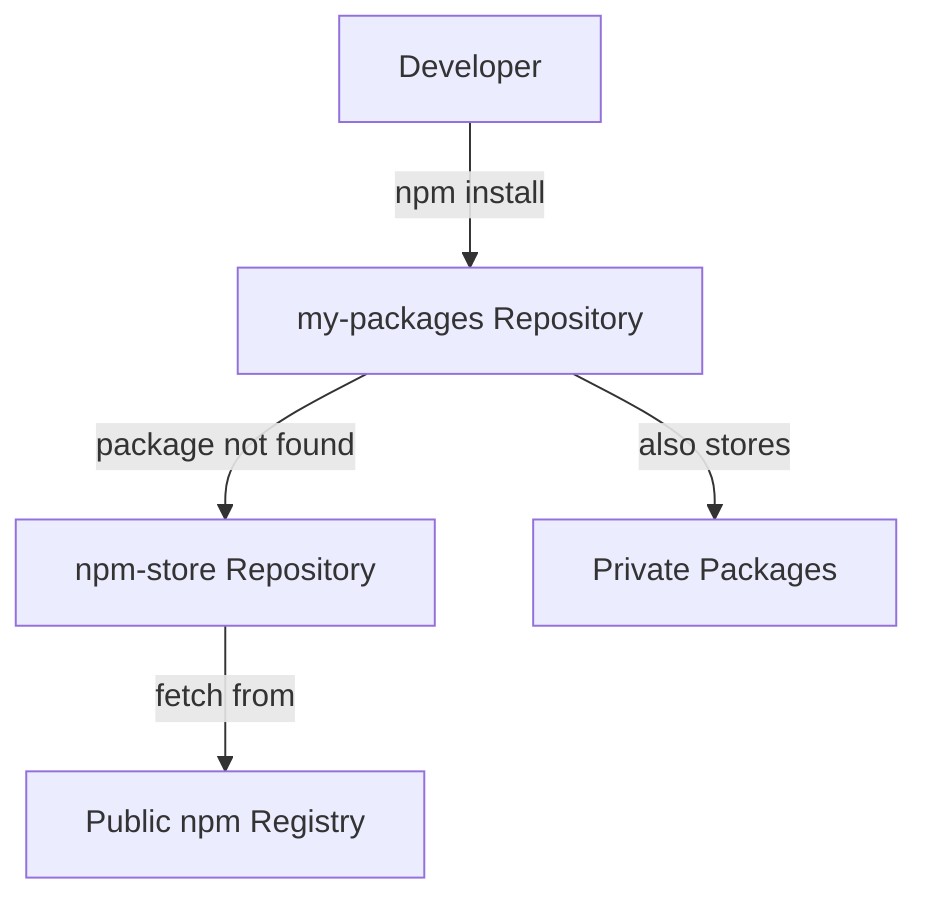

# How to Set Up AWS CodeArtifact for Package Management

Author: [nawazdhandala](https://github.com/nawazdhandala)

Tags: AWS, CodeArtifact, Package Management, DevOps

Description: Learn how to set up AWS CodeArtifact as a private package repository, including domains, repositories, upstream connections, and access policies.

---

Every growing team eventually runs into the same problem: you've got internal packages that need to be shared between projects, but you don't want to publish them to the public npm registry or PyPI. You also want to cache public packages so builds don't break when some maintainer unpublishes a package from npm.

AWS CodeArtifact solves both problems. It's a managed artifact repository that works with npm, pip, Maven, NuGet, and other package managers. You can host private packages, proxy public registries, and control who can access what through IAM.

Let me walk you through setting it up from scratch.

## Core Concepts

Before we dive in, there are three things to understand:

- **Domain** - A top-level container that owns repositories and provides encryption. One domain per organization is typical.
- **Repository** - Stores packages. You can have multiple repositories in a domain (e.g., one for npm, one for Python, or one per team).
- **Upstream repository** - A repository can pull packages from another repository, which in turn can proxy public registries.



## Step 1: Create a Domain

A domain is your top-level organizational unit. All repositories live inside a domain.

```bash
# Create a CodeArtifact domain
aws codeartifact create-domain \
  --domain my-org

# Verify it was created
aws codeartifact describe-domain \
  --domain my-org \
  --query 'domain.{Name:name,Status:status,RepositoryCount:repositoryCount}'
```

Domains provide:
- A namespace for your repositories
- An AWS KMS key for encryption (you can bring your own)
- A central place to manage cross-account access

To use a custom KMS key:

```bash
# Create domain with custom KMS key
aws codeartifact create-domain \
  --domain my-org \
  --encryption-key arn:aws:kms:us-east-1:123456789:key/abc-123
```

## Step 2: Create an Upstream Repository

Create a repository that connects to the public registry. This acts as a caching proxy - when a developer requests a public package, it gets fetched once and cached.

```bash
# Create a repository connected to the public npm registry
aws codeartifact create-repository \
  --domain my-org \
  --repository npm-store \
  --description "Upstream connection to public npm registry"

# Connect it to the public npm registry
aws codeartifact associate-external-connection \
  --domain my-org \
  --repository npm-store \
  --external-connection public:npmjs
```

For Python packages:

```bash
# Create upstream for PyPI
aws codeartifact create-repository \
  --domain my-org \
  --repository pypi-store \
  --description "Upstream connection to public PyPI"

aws codeartifact associate-external-connection \
  --domain my-org \
  --repository pypi-store \
  --external-connection public:pypi
```

For Maven:

```bash
# Create upstream for Maven Central
aws codeartifact create-repository \
  --domain my-org \
  --repository maven-store \
  --description "Upstream connection to Maven Central"

aws codeartifact associate-external-connection \
  --domain my-org \
  --repository maven-store \
  --external-connection public:maven-central
```

## Step 3: Create Your Main Repository

Now create the repository that developers will actually use. It has the upstream repository as a source, so it can serve both your private packages and proxied public ones.

```bash
# Create the main repository with upstream
aws codeartifact create-repository \
  --domain my-org \
  --repository my-packages \
  --description "Team packages and cached public packages" \
  --upstreams repositoryName=npm-store repositoryName=pypi-store repositoryName=maven-store
```

With this setup, when a developer requests a package:

1. CodeArtifact checks `my-packages` first
2. If not found, it checks each upstream repository
3. The upstream fetches from the external registry if needed
4. The package gets cached so subsequent requests are fast

## Step 4: Set Up Repository Policies

Control who can read from and publish to your repository:

```bash
# Allow all IAM principals in the account to read packages
aws codeartifact put-repository-permissions-policy \
  --domain my-org \
  --repository my-packages \
  --policy-document '{
    "Version": "2012-10-17",
    "Statement": [
      {
        "Effect": "Allow",
        "Principal": {
          "AWS": "arn:aws:iam::123456789012:root"
        },
        "Action": [
          "codeartifact:DescribePackageVersion",
          "codeartifact:DescribeRepository",
          "codeartifact:GetPackageVersionReadme",
          "codeartifact:GetRepositoryEndpoint",
          "codeartifact:ListPackages",
          "codeartifact:ListPackageVersions",
          "codeartifact:ListPackageVersionAssets",
          "codeartifact:ReadFromRepository"
        ],
        "Resource": "*"
      },
      {
        "Effect": "Allow",
        "Principal": {
          "AWS": "arn:aws:iam::123456789012:role/CI-PublishRole"
        },
        "Action": [
          "codeartifact:PublishPackageVersion",
          "codeartifact:PutPackageMetadata"
        ],
        "Resource": "*"
      }
    ]
  }'
```

This gives read access to everyone in the account but restricts publishing to a specific CI role.

## Step 5: Set Up Domain Policies for Cross-Account Access

If you have multiple AWS accounts that need to share packages:

```bash
# Allow another account to read from your domain
aws codeartifact put-domain-permissions-policy \
  --domain my-org \
  --policy-document '{
    "Version": "2012-10-17",
    "Statement": [
      {
        "Effect": "Allow",
        "Principal": {
          "AWS": "arn:aws:iam::222222222222:root"
        },
        "Action": [
          "codeartifact:GetAuthorizationToken",
          "codeartifact:GetRepositoryEndpoint",
          "codeartifact:ReadFromRepository"
        ],
        "Resource": "*"
      }
    ]
  }'
```

## Authenticating with CodeArtifact

CodeArtifact uses temporary auth tokens that last up to 12 hours:

```bash
# Get an auth token
export CODEARTIFACT_AUTH_TOKEN=$(aws codeartifact get-authorization-token \
  --domain my-org \
  --domain-owner 123456789012 \
  --duration-seconds 43200 \
  --query authorizationToken \
  --output text)

echo "Token valid for 12 hours"
```

Each package manager has its own way of using this token. For details, see our dedicated guides:

- [Using CodeArtifact with npm](https://oneuptime.com/blog/post/2026-02-12-codeartifact-npm/view)
- [Using CodeArtifact with pip](https://oneuptime.com/blog/post/2026-02-12-codeartifact-pip-python/view)
- [Using CodeArtifact with Maven](https://oneuptime.com/blog/post/2026-02-12-codeartifact-maven-java/view)

## Using CodeArtifact in CI/CD

In CodeBuild, configure the auth token in your buildspec:

```yaml
# buildspec.yml with CodeArtifact authentication
version: 0.2

phases:
  pre_build:
    commands:
      # Authenticate with CodeArtifact
      - export CODEARTIFACT_AUTH_TOKEN=$(aws codeartifact get-authorization-token --domain my-org --domain-owner 123456789012 --query authorizationToken --output text)
      # Configure npm to use CodeArtifact
      - aws codeartifact login --tool npm --repository my-packages --domain my-org --domain-owner 123456789012
  build:
    commands:
      - npm ci
      - npm test
      - npm run build
```

## Managing Packages

List packages in your repository:

```bash
# List all packages
aws codeartifact list-packages \
  --domain my-org \
  --repository my-packages \
  --query 'packages[*].{Name:package,Format:format,Namespace:namespace}'

# List versions of a specific package
aws codeartifact list-package-versions \
  --domain my-org \
  --repository my-packages \
  --package my-internal-lib \
  --format npm

# Delete a specific version
aws codeartifact delete-package-versions \
  --domain my-org \
  --repository my-packages \
  --package my-internal-lib \
  --format npm \
  --versions 1.0.0
```

## Cost Considerations

CodeArtifact pricing is based on:
- Storage: $0.05 per GB per month
- Requests: $0.05 per 10,000 requests

For most teams, the cost is minimal - usually under $10/month. The caching alone can save you from outages caused by public registry downtime.

## Monitoring

Keep an eye on your CodeArtifact usage with CloudWatch. Key metrics include request count, storage used, and any throttled requests. For broader infrastructure monitoring including your CI/CD pipeline and artifact repositories, [OneUptime](https://oneuptime.com) provides a unified view of your entire development toolchain.
