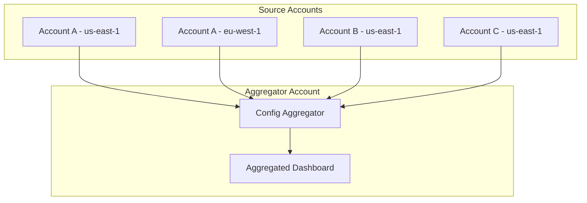

# How to Use AWS Config Multi-Account Multi-Region Data Aggregation

Author: [nawazdhandala](https://github.com/nawazdhandala)

Tags: AWS, Config, Compliance, Multi-Account, Governance

Description: Configure AWS Config aggregators to collect compliance and configuration data from multiple accounts and regions into a single dashboard.

---

You've got AWS Config running in each account, tracking resource configurations and evaluating compliance rules. That's great for individual account visibility, but when your security team asks "are all S3 buckets across every account encrypted?" you don't want to log into 30 accounts one by one to find out.

AWS Config aggregators solve this by pulling configuration and compliance data from multiple accounts and regions into a single aggregator account. You get one unified view of your entire organization's compliance posture. Here's how to set it up.

## How Aggregation Works

An aggregator is a resource in AWS Config that collects data from source accounts. It doesn't duplicate the actual configuration items - it creates a read-only aggregated view. The source accounts keep running their own Config recorders and rules independently.



There are two types of aggregators: organization-based (uses AWS Organizations) and account-based (individual account authorization). The organization approach is far easier to manage.

## Prerequisites

Before setting up aggregation, every source account needs AWS Config enabled with a recorder running. If you haven't done that yet, here's a quick setup.

This enables the Config recorder in a source account to track all supported resource types:

```bash
# Enable Config recorder in each source account
aws configservice put-configuration-recorder \
  --configuration-recorder name=default,roleARN=arn:aws:iam::222222222222:role/aws-service-role/config.amazonaws.com/AWSServiceRoleForConfig \
  --recording-group allSupported=true,includeGlobalResourceTypes=true

# Create delivery channel
aws configservice put-delivery-channel \
  --delivery-channel '{
    "name": "default",
    "s3BucketName": "config-bucket-222222222222",
    "configSnapshotDeliveryProperties": {
      "deliveryFrequency": "TwentyFour_Hours"
    }
  }'

# Start the recorder
aws configservice start-configuration-recorder --configuration-recorder-name default
```

## Setting Up an Organization Aggregator

This is the recommended approach if you're using AWS Organizations. The aggregator automatically picks up all current and future member accounts.

### Step 1: Create the Service-Linked Role

The aggregator account needs a service-linked role for Config.

```bash
# This is usually auto-created, but just in case
aws iam create-service-linked-role \
  --aws-service-name config.amazonaws.com
```

### Step 2: Enable Trusted Access

From the management account, enable trusted access for Config:

```bash
# Run from the management account
aws organizations enable-aws-service-access \
  --service-principal config-multiaccountsetup.amazonaws.com
```

### Step 3: Create the Aggregator

Run this in the account where you want the aggregated view.

This creates an organization-level aggregator that collects data from all accounts across all regions:

```bash
# Create organization aggregator
aws configservice put-configuration-aggregator \
  --configuration-aggregator-name OrgAggregator \
  --organization-aggregation-source '{
    "RoleArn": "arn:aws:iam::111111111111:role/aws-service-role/config.amazonaws.com/AWSServiceRoleForConfig",
    "AllAwsRegions": true
  }'
```

If you only want specific regions, replace `AllAwsRegions` with a list:

```bash
aws configservice put-configuration-aggregator \
  --configuration-aggregator-name OrgAggregator \
  --organization-aggregation-source '{
    "RoleArn": "arn:aws:iam::111111111111:role/aws-service-role/config.amazonaws.com/AWSServiceRoleForConfig",
    "AllAwsRegions": false,
    "AwsRegions": ["us-east-1", "us-west-2", "eu-west-1"]
  }'
```

## Setting Up an Account-Based Aggregator

If you're not using Organizations, you need to authorize each source account individually.

### Step 1: Authorize in Source Accounts

Each source account must explicitly grant permission to the aggregator account.

Run this in every source account that should send data to the aggregator:

```bash
# Run in each source account
aws configservice put-aggregation-authorization \
  --authorized-account-id 111111111111 \
  --authorized-aws-region us-east-1
```

### Step 2: Create the Aggregator

Then create the aggregator with explicit account IDs:

```bash
aws configservice put-configuration-aggregator \
  --configuration-aggregator-name MultiAccountAggregator \
  --account-aggregation-sources '[
    {
      "AccountIds": ["222222222222", "333333333333", "444444444444"],
      "AllAwsRegions": true
    }
  ]'
```

## Terraform Setup

For IaC fans, here's the Terraform configuration.

This creates an organization-level Config aggregator with the required IAM role:

```hcl
resource "aws_config_configuration_aggregator" "org" {
  name = "org-aggregator"

  organization_aggregation_source {
    all_regions = true
    role_arn    = aws_iam_role.config_aggregator.arn
  }
}

resource "aws_iam_role" "config_aggregator" {
  name = "config-aggregator-role"

  assume_role_policy = jsonencode({
    Version = "2012-10-17"
    Statement = [
      {
        Action = "sts:AssumeRole"
        Effect = "Allow"
        Principal = {
          Service = "config.amazonaws.com"
        }
      }
    ]
  })
}

resource "aws_iam_role_policy_attachment" "config_aggregator" {
  role       = aws_iam_role.config_aggregator.name
  policy_arn = "arn:aws:iam::aws:policy/service-role/AWSConfigRoleForOrganizations"
}
```

## Querying Aggregated Data

Once the aggregator is running, you can query across all accounts.

This returns the compliance status of all Config rules across all aggregated accounts:

```bash
# Get compliance summary by account
aws configservice get-aggregate-compliance-details-by-config-rule \
  --configuration-aggregator-name OrgAggregator \
  --config-rule-name s3-bucket-server-side-encryption-enabled \
  --compliance-type NON_COMPLIANT \
  --limit 50
```

Find all non-compliant resources across the organization:

```bash
# List non-compliant resources
aws configservice get-aggregate-discovered-resource-counts \
  --configuration-aggregator-name OrgAggregator \
  --group-by-key RESOURCE_TYPE
```

Get a compliance summary grouped by account:

```bash
# Compliance summary per account
aws configservice get-aggregate-compliance-details-by-config-rule \
  --configuration-aggregator-name OrgAggregator \
  --config-rule-name required-tags \
  --compliance-type NON_COMPLIANT
```

## Deploying Organization Config Rules

To make aggregation truly useful, deploy the same Config rules across all accounts using organization rules.

This deploys a Config rule to every account in the organization that checks for S3 bucket encryption:

```bash
# Deploy an organization Config rule
aws configservice put-organization-config-rule \
  --organization-config-rule-name org-s3-encryption \
  --organization-managed-rule-metadata '{
    "RuleIdentifier": "S3_BUCKET_SERVER_SIDE_ENCRYPTION_ENABLED",
    "Description": "Checks that S3 buckets have encryption enabled"
  }'
```

You can exclude specific accounts if needed:

```bash
aws configservice put-organization-config-rule \
  --organization-config-rule-name org-s3-encryption \
  --organization-managed-rule-metadata '{
    "RuleIdentifier": "S3_BUCKET_SERVER_SIDE_ENCRYPTION_ENABLED"
  }' \
  --excluded-accounts '["999999999999"]'
```

## Building a Compliance Dashboard

Use the aggregator APIs to build compliance reports. Here's a Python script that generates a summary.

This script queries the aggregator and prints a table of compliance status per account:

```python
import boto3

config = boto3.client('config')
aggregator_name = 'OrgAggregator'

# Get compliance summary by account
response = config.get_aggregate_config_rule_compliance_summary(
    ConfigurationAggregatorName=aggregator_name,
    GroupByKey='ACCOUNT_ID'
)

print(f"{'Account ID':<20} {'Compliant':<12} {'Non-Compliant':<15}")
print("-" * 47)

for group in response['GroupByKeyCompliantSummary']:
    account = group['GroupName']
    compliant = group['ComplianceSummary']['CompliantResourceCount']['CappedCount']
    non_compliant = group['ComplianceSummary']['NonCompliantResourceCount']['CappedCount']
    print(f"{account:<20} {compliant:<12} {non_compliant:<15}")
```

## Monitoring Aggregator Health

Aggregators can fail silently if source accounts have issues. Check the aggregator status regularly.

```bash
# Check aggregator source status
aws configservice describe-configuration-aggregator-sources-status \
  --configuration-aggregator-name OrgAggregator \
  --update-status FAILED
```

Set up a CloudWatch alarm if you detect failures. You can also integrate with [OneUptime](https://oneuptime.com) for centralized monitoring of your compliance pipeline.

## Best Practices

**Start with organization aggregators.** They're self-maintaining and automatically include new accounts. The account-based approach requires manual updates every time you add an account.

**Deploy conformance packs.** Instead of individual rules, use conformance packs to deploy sets of related rules. AWS provides pre-built packs for frameworks like CIS, PCI DSS, and HIPAA.

**Combine with CloudTrail aggregation.** Config tells you what changed, CloudTrail tells you who changed it. Together they give you complete audit visibility. See our [CloudTrail aggregation guide](https://oneuptime.com/blog/post/2026-02-12-cross-account-cloudtrail-aggregation/view) for the other half of this setup.

**Use advanced queries.** Config supports SQL-like queries across aggregated data. This is much more flexible than the basic API calls.

Multi-account Config aggregation is one of those things that takes an hour to set up but saves countless hours during audits and incident investigations. If you're running more than a couple of AWS accounts, there's really no reason not to have it.
