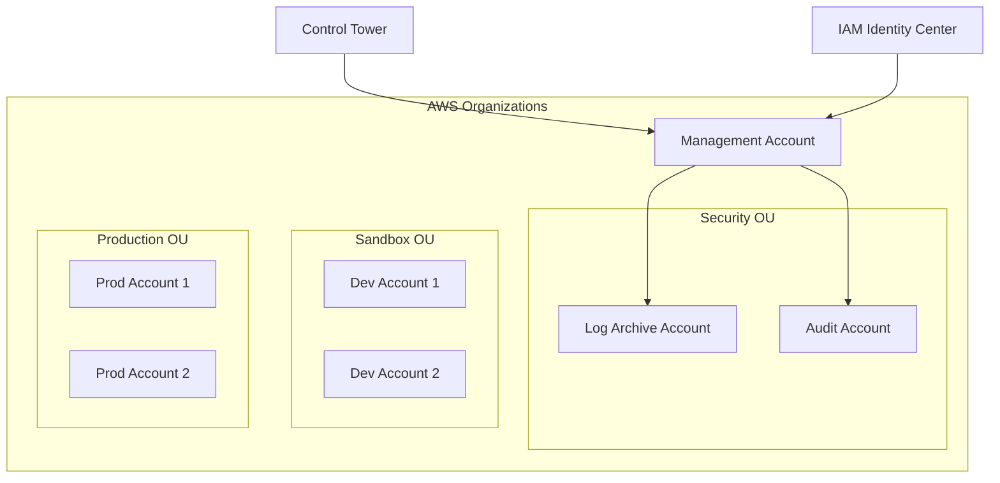

# How to Set Up AWS Control Tower Landing Zones

Author: [nawazdhandala](https://github.com/nawazdhandala)

Tags: AWS, Control Tower, Landing Zone, Multi-Account, Governance

Description: A practical guide to setting up AWS Control Tower landing zones for managing multi-account AWS environments with guardrails, automated account provisioning, and centralized governance.

---

When your organization grows beyond a handful of AWS accounts, things get chaotic fast. Different teams set up accounts with inconsistent configurations, security policies vary wildly, and nobody has a clear picture of what's running where. AWS Control Tower provides a structured way to set up and govern a multi-account environment. It automates the creation of a "landing zone" - a well-architected, multi-account baseline that follows AWS best practices.

Let's walk through setting it up, understanding what it creates, and customizing it for your organization's needs.

## What Control Tower Creates

When you set up a landing zone, Control Tower automatically creates:

- **A management account** (your existing account becomes this)
- **A log archive account** - centralized logging for all accounts
- **An audit account** - for security and compliance teams
- **An organizational unit (OU) structure** - starting with Security and Sandbox OUs
- **Guardrails** - preventive and detective controls applied across accounts
- **AWS SSO** (IAM Identity Center) - centralized access management
- **Service Control Policies (SCPs)** - organization-wide permission boundaries
- **CloudTrail** - organization-wide audit trail
- **AWS Config** - configuration compliance monitoring



## Prerequisites

Before setting up Control Tower, you need:

- An AWS account that will become the management account
- No existing AWS Organizations setup (or you can integrate with an existing one, but it's trickier)
- A valid email address for each account Control Tower will create
- The account must be in a supported home region

One important note: the management account should be used only for billing and organization management. Don't run workloads in it.

## Step 1: Launch Control Tower

The initial setup is done through the AWS Console. Navigate to AWS Control Tower and click "Set up landing zone."

You'll configure:

1. **Home region** - where Control Tower operates from
2. **Additional governed regions** - regions you want guardrails applied to
3. **Log archive account email** - for the centralized logging account
4. **Audit account email** - for the security audit account

The setup takes about 30-60 minutes. Behind the scenes, Control Tower is creating accounts, setting up CloudTrail, deploying Config rules, and configuring SCPs.

After setup, verify everything is running.

```bash
# Check the landing zone status
aws controltower list-landing-zones \
  --query "landingZones[].{Id:identifier, Status:status}" \
  --output table

# List organizational units
aws organizations list-organizational-units-for-parent \
  --parent-id "r-abc1" \
  --query "OrganizationalUnits[].{Name:Name, Id:Id}" \
  --output table
```

## Step 2: Create Organizational Units

Control Tower creates Security and Sandbox OUs by default. Add more based on your organization's needs.

```bash
# Get the root ID
ROOT_ID=$(aws organizations list-roots \
  --query "Roots[0].Id" --output text)

# Create additional OUs
aws organizations create-organizational-unit \
  --parent-id "$ROOT_ID" \
  --name "Production"

aws organizations create-organizational-unit \
  --parent-id "$ROOT_ID" \
  --name "Staging"

aws organizations create-organizational-unit \
  --parent-id "$ROOT_ID" \
  --name "Development"

aws organizations create-organizational-unit \
  --parent-id "$ROOT_ID" \
  --name "Infrastructure"
```

Then register these OUs with Control Tower so guardrails get applied.

```bash
# Register an OU with Control Tower
aws controltower register-organizational-unit \
  --organizational-unit-identifier "ou-abc1-12345678"
```

## Step 3: Enable Guardrails

Guardrails are pre-packaged governance rules. They come in two types:

- **Preventive** - SCPs that prevent actions (e.g., "disallow changes to CloudTrail")
- **Detective** - AWS Config rules that detect violations (e.g., "detect public S3 buckets")

Some guardrails are mandatory (always on), some are strongly recommended, and others are elective.

```bash
# List available guardrails (controls)
aws controltower list-enabled-controls \
  --target-identifier "arn:aws:organizations::123456789:ou/o-abc/ou-abc1-12345678" \
  --query "enabledControls[].{Control:controlIdentifier, Status:statusSummary.status}" \
  --output table

# Enable a specific guardrail
aws controltower enable-control \
  --control-identifier "arn:aws:controltower:us-east-1::control/AWS-GR_RESTRICT_ROOT_USER_ACCESS_KEYS" \
  --target-identifier "arn:aws:organizations::123456789:ou/o-abc/ou-abc1-12345678"
```

Here are some guardrails you should definitely enable:

```bash
# Disallow public read access to S3 buckets
aws controltower enable-control \
  --control-identifier "arn:aws:controltower:us-east-1::control/AWS-GR_S3_ACCOUNT_LEVEL_PUBLIC_ACCESS_BLOCKS_PERIODIC" \
  --target-identifier "arn:aws:organizations::123456789:ou/o-abc/ou-prod-123"

# Detect unencrypted EBS volumes
aws controltower enable-control \
  --control-identifier "arn:aws:controltower:us-east-1::control/AWS-GR_ENCRYPTED_VOLUMES" \
  --target-identifier "arn:aws:organizations::123456789:ou/o-abc/ou-prod-123"

# Disallow internet connection through RDP
aws controltower enable-control \
  --control-identifier "arn:aws:controltower:us-east-1::control/AWS-GR_RESTRICTED_COMMON_PORTS" \
  --target-identifier "arn:aws:organizations::123456789:ou/o-abc/ou-prod-123"
```

## Step 4: Provision New Accounts

Control Tower's Account Factory lets you create new AWS accounts with consistent baselines. Each new account automatically gets the OU's guardrails, SSO access, and network configuration.

```bash
# Create a new account using Account Factory (Service Catalog)
aws servicecatalog provision-product \
  --product-name "AWS Control Tower Account Factory" \
  --provisioning-artifact-name "AWS Control Tower Account Factory" \
  --provisioned-product-name "team-alpha-dev" \
  --provisioning-parameters '[
    {"Key": "AccountName", "Value": "team-alpha-dev"},
    {"Key": "AccountEmail", "Value": "team-alpha-dev@example.com"},
    {"Key": "SSOUserEmail", "Value": "admin@example.com"},
    {"Key": "SSOUserFirstName", "Value": "Admin"},
    {"Key": "SSOUserLastName", "Value": "User"},
    {"Key": "ManagedOrganizationalUnit", "Value": "Development"}
  ]'
```

## Step 5: Configure IAM Identity Center (SSO)

Control Tower sets up IAM Identity Center for you. Configure permission sets to control what users can do in each account.

```bash
# Get the Identity Center instance ARN
INSTANCE_ARN=$(aws sso-admin list-instances \
  --query "Instances[0].InstanceArn" --output text)

# Create a permission set for developers
aws sso-admin create-permission-set \
  --instance-arn "$INSTANCE_ARN" \
  --name "DeveloperAccess" \
  --description "Standard developer permissions" \
  --session-duration "PT8H"

# Attach an AWS managed policy
aws sso-admin attach-managed-policy-to-permission-set \
  --instance-arn "$INSTANCE_ARN" \
  --permission-set-arn "arn:aws:sso:::permissionSet/ssoins-abc/ps-dev123" \
  --managed-policy-arn "arn:aws:iam::aws:policy/PowerUserAccess"

# Create a read-only permission set for auditors
aws sso-admin create-permission-set \
  --instance-arn "$INSTANCE_ARN" \
  --name "AuditorReadOnly" \
  --description "Read-only access for audit team" \
  --session-duration "PT4H"

aws sso-admin attach-managed-policy-to-permission-set \
  --instance-arn "$INSTANCE_ARN" \
  --permission-set-arn "arn:aws:sso:::permissionSet/ssoins-abc/ps-audit123" \
  --managed-policy-arn "arn:aws:iam::aws:policy/ReadOnlyAccess"
```

## Step 6: Customize with Customizations for Control Tower (CfCT)

For organization-specific configurations that go beyond built-in guardrails, use Customizations for Control Tower. This lets you deploy CloudFormation stacks and SCPs to new accounts automatically.

```yaml
# manifest.yaml for CfCT
region: us-east-1
version: 2021-03-15

resources:
  - name: baseline-security
    description: "Security baseline for all accounts"
    deployment_targets:
      organizational_units:
        - Production
        - Development
    resource_file: templates/security-baseline.yaml

  - name: vpc-baseline
    description: "Standard VPC configuration"
    deployment_targets:
      organizational_units:
        - Production
    resource_file: templates/vpc-baseline.yaml
    parameters:
      - parameter_key: VPCCidr
        parameter_value: "10.0.0.0/16"
      - parameter_key: Environment
        parameter_value: production
```

The security baseline template might look like this.

```yaml
# templates/security-baseline.yaml
AWSTemplateFormatVersion: '2010-09-09'
Description: Security baseline for all accounts

Resources:
  # Enable GuardDuty
  GuardDutyDetector:
    Type: AWS::GuardDuty::Detector
    Properties:
      Enable: true
      FindingPublishingFrequency: FIFTEEN_MINUTES

  # Enable Security Hub
  SecurityHub:
    Type: AWS::SecurityHub::Hub
    Properties: {}

  # Require encryption on new S3 buckets
  S3BucketEncryptionRule:
    Type: AWS::Config::ConfigRule
    Properties:
      ConfigRuleName: s3-bucket-server-side-encryption-enabled
      Source:
        Owner: AWS
        SourceIdentifier: S3_BUCKET_SERVER_SIDE_ENCRYPTION_ENABLED
```

## Monitoring Your Landing Zone

Control Tower provides a dashboard, but you should also monitor the health of your multi-account environment programmatically.

```bash
# Check for non-compliant resources across all accounts
aws configservice get-compliance-summary-by-resource-type \
  --query "ComplianceSummariesByResourceType[?ComplianceSummary.NonCompliantResourceCount.CappedCount > \`0\`]"

# List drift in your landing zone
aws controltower list-landing-zone-operations \
  --query "landingZoneOperations[?status!='SUCCEEDED']" \
  --output table
```

For centralized monitoring across all your AWS accounts and services, [OneUptime](https://oneuptime.com/blog/post/aws-cloudwatch-logs-setup/view) can aggregate metrics, logs, and alerts from your entire multi-account environment.

## Common Mistakes to Avoid

1. **Running workloads in the management account** - Keep it clean. Only use it for organization management.
2. **Not planning your OU structure** - Changing it later is painful. Think through your organizational hierarchy before you start.
3. **Ignoring drift** - Control Tower detects when accounts drift from the baseline. Fix drift promptly.
4. **Too many or too few accounts** - One account per environment per team is a good starting point.
5. **Skipping guardrails** - Enable the strongly recommended ones at minimum. They exist for good reasons.

## Wrapping Up

Control Tower takes the guesswork out of setting up a multi-account AWS environment. The initial setup handles what would take weeks to configure manually - logging, auditing, guardrails, access management, and account provisioning. The real value shows up over time as your organization grows. New teams get properly configured accounts in minutes instead of days, security policies are consistently applied, and you have centralized visibility into everything. Start with the basics, and customize as your governance needs evolve.
