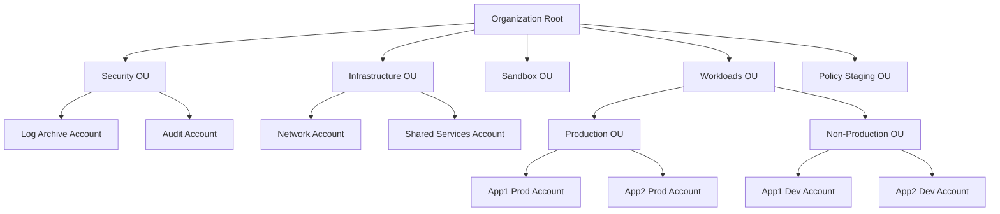

# How to Set Up AWS Control Tower for Multi-Account Governance

Author: [nawazdhandala](https://github.com/nawazdhandala)

Tags: AWS, Control Tower, Governance, AWS Organizations

Description: Learn how to set up AWS Control Tower to establish a secure, well-architected multi-account AWS environment with automated governance and guardrails.

---

When your company starts with one AWS account, everything is manageable. But accounts multiply fast - dev, staging, production, sandbox, data analytics, security - and before you know it, you're managing a dozen accounts with inconsistent configurations. AWS Control Tower gives you a way to set up and govern a multi-account environment with best practices baked in from day one.

Let's walk through what Control Tower does and how to set it up properly.

## What Control Tower Provides

Control Tower is an orchestration layer that sits on top of several AWS services. When you set it up, it automatically configures:

- **AWS Organizations** - For account structure and management
- **AWS IAM Identity Center** (formerly SSO) - For centralized access management
- **AWS Config** - For resource configuration tracking
- **AWS CloudTrail** - For API logging across all accounts
- **Service Control Policies** - For account-level permission boundaries
- **Guardrails** - Preventive and detective controls

Think of it as a landing zone factory. It creates a well-structured foundation that new accounts inherit automatically.

## Prerequisites

Before enabling Control Tower, make sure you:

- Have access to the AWS Organizations management account
- Haven't already set up AWS Organizations with some features (Control Tower wants to configure this itself, though it can work with existing orgs in some cases)
- Are working in a supported region (us-east-1, us-east-2, us-west-2, eu-west-1, and others)
- Have no existing Config recorders in the management account

## Setting Up Control Tower

Control Tower setup is primarily done through the console, as the initial landing zone creation involves a multi-step wizard. Here's what happens during setup:

### Step 1: Launch the Landing Zone

Navigate to the Control Tower console and click "Set up landing zone." You'll configure:

**Home Region** - This is the primary region for your Control Tower. Pick the region where most of your workloads run. You can govern additional regions later, but the home region can't be changed.

**Foundational OUs** - Control Tower creates two OUs by default:

- **Security** - Houses your Log Archive and Audit accounts
- **Sandbox** - For developer experimentation

You can (and should) add more OUs later.

**Core Accounts** - Control Tower creates two shared accounts:

The Log Archive account receives all CloudTrail logs and Config logs from every account in the organization. The Audit account gets read-only access to all accounts for security reviews.

### Step 2: Configure IAM Identity Center

Control Tower sets up IAM Identity Center with a default directory. You'll get a pre-configured admin user. After setup, you can connect your existing identity provider (Okta, Azure AD, etc.) for federation.

### Step 3: Review and Launch

The setup process takes about 60 minutes. During this time, Control Tower:

1. Creates the organizational structure
2. Sets up the shared accounts
3. Enables CloudTrail organization-wide
4. Deploys baseline guardrails
5. Configures AWS Config in all governed regions

## Account Factory

Once your landing zone is running, Account Factory is how you create new accounts. Every account created through Account Factory automatically gets:

- Enrollment in your organization
- Placement in the correct OU
- CloudTrail logging to the central Log Archive
- AWS Config enabled and reporting
- IAM Identity Center access configured
- All guardrails from the parent OU applied

You can create accounts through the console or programmatically with Service Catalog.

This is how to create a new account using the AWS CLI through Service Catalog:

```bash
# List the Account Factory product
PRODUCT_ID=$(aws servicecatalog search-products \
  --query "ProductViewSummaries[?Name=='AWS Control Tower Account Factory'].ProductId" \
  --output text)

# Get the latest provisioning artifact
ARTIFACT_ID=$(aws servicecatalog list-provisioning-artifacts \
  --product-id $PRODUCT_ID \
  --query "ProvisioningArtifactDetails[-1].Id" \
  --output text)

# Provision a new account
aws servicecatalog provision-product \
  --product-id $PRODUCT_ID \
  --provisioning-artifact-id $ARTIFACT_ID \
  --provisioned-product-name "team-alpha-dev" \
  --provisioning-parameters \
    Key=AccountName,Value="Team Alpha Dev" \
    Key=AccountEmail,Value="team-alpha-dev@company.com" \
    Key=SSOUserFirstName,Value="Admin" \
    Key=SSOUserLastName,Value="User" \
    Key=SSOUserEmail,Value="admin@company.com" \
    Key=ManagedOrganizationalUnit,Value="Sandbox"
```

## Organizing Your OUs

The default two OUs are just a starting point. A mature multi-account strategy typically looks something like this:



To create a new OU:

```bash
# Create a new OU under the organization root
ROOT_ID=$(aws organizations list-roots --query "Roots[0].Id" --output text)

aws organizations create-organizational-unit \
  --parent-id $ROOT_ID \
  --name "Workloads"

# Register the new OU with Control Tower
# This is done through the Control Tower console or API
aws controltower register-organizational-unit \
  --organizational-unit-id "ou-abc1-23456789"
```

## Customizing Account Factory

Account Factory supports customization through what AWS calls "Account Factory Customization" (AFC). You can define CloudFormation templates that run when new accounts are created.

This lets you automatically:

- Set up VPC networking with your standard CIDR ranges
- Deploy baseline security tools
- Create standard IAM roles
- Configure DNS settings
- Install monitoring agents

The customization blueprint is a CloudFormation template stored in a Service Catalog portfolio:

```yaml
# account-baseline.yaml
AWSTemplateFormatVersion: '2010-09-09'
Description: Baseline configuration for new accounts

Resources:
  StandardVPC:
    Type: AWS::EC2::VPC
    Properties:
      CidrBlock: 10.0.0.0/16
      EnableDnsHostnames: true
      EnableDnsSupport: true
      Tags:
        - Key: Name
          Value: standard-vpc

  SecurityAlertsTopic:
    Type: AWS::SNS::Topic
    Properties:
      TopicName: security-alerts

  CloudWatchAlarmRole:
    Type: AWS::IAM::Role
    Properties:
      RoleName: CloudWatchAlarmRole
      AssumeRolePolicyDocument:
        Version: '2012-10-17'
        Statement:
          - Effect: Allow
            Principal:
              Service: cloudwatch.amazonaws.com
            Action: sts:AssumeRole
```

## Managing Drift

Over time, accounts might drift from their expected configuration. Someone might disable Config, modify a guardrail-protected resource, or change an OU membership.

Control Tower detects drift automatically. You can check drift status:

```bash
# Check landing zone drift status
aws controltower list-landing-zones \
  --query "landingZones[0].driftStatus"
```

When drift is detected, you'll see it in the Control Tower dashboard. Most drift can be resolved by re-registering the affected OU or updating the landing zone.

## Lifecycle Events

Control Tower publishes lifecycle events to EventBridge whenever significant things happen - account creation, OU registration, guardrail enablement, etc. You can hook into these events for automation.

This EventBridge rule catches new account creation events:

```json
{
  "source": ["aws.controltower"],
  "detail-type": ["AWS Service Event via CloudTrail"],
  "detail": {
    "eventName": ["CreateManagedAccount"]
  }
}
```

Wire this to a Lambda function that performs additional setup - things like adding the account to your CMDB, sending a Slack notification, or triggering a CI/CD pipeline.

## Cost Considerations

Control Tower itself is free. But the services it enables are not:

- CloudTrail charges per event (first trail in each region is free for management events)
- AWS Config charges per configuration item recorded
- IAM Identity Center is free
- The Log Archive and Audit accounts will have S3 storage costs

For a small organization with 10-20 accounts, expect roughly $50-100/month in supporting service costs. That's a bargain for the governance it provides.

## Wrapping Up

Control Tower is the fastest path to a well-governed multi-account environment. It takes about an hour to set up and saves you weeks of manual configuration. Once it's running, every new account starts life with the right security controls, logging, and access management already in place.

For managing security policies across your accounts, combine Control Tower with [AWS Firewall Manager](https://oneuptime.com/blog/post/aws-firewall-manager-organization-wide-security/view). And for fine-grained governance controls, check out our guide on [Control Tower guardrails](https://oneuptime.com/blog/post/control-tower-guardrails-account-governance/view).
