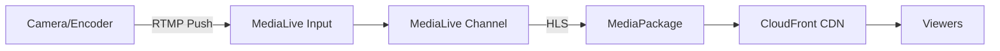

# How to Set Up AWS Elemental MediaLive for Live Streaming

Author: [nawazdhandala](https://github.com/nawazdhandala)

Tags: AWS, MediaLive, Live Streaming, Video, Cloud

Description: Step-by-step guide to setting up AWS Elemental MediaLive for encoding and delivering live video streams to your audience at scale.

---

Live streaming is one of those things that sounds simple until you actually try to build it. You've got an incoming video feed, and you need to encode it into multiple bitrates, package it for different devices, and deliver it to potentially millions of viewers simultaneously. AWS Elemental MediaLive handles the encoding piece of this pipeline, and it does it well.

In this guide, we'll set up a complete live streaming workflow using MediaLive as the encoder, MediaPackage as the origin, and CloudFront for delivery. By the end, you'll have a working pipeline that takes an RTMP input and outputs HLS streams viewable in any browser.

## The Live Streaming Architecture

Before diving in, let's understand how the pieces fit together.



- **MediaLive Input** receives your raw video feed
- **MediaLive Channel** encodes it into multiple quality levels
- **MediaPackage** packages the output for different protocols (HLS, DASH, etc.)
- **CloudFront** distributes it globally with low latency

## Step 1: Create a MediaPackage Channel

We start with MediaPackage because MediaLive needs to know where to send its output. Think of MediaPackage as the middleman that takes the encoded stream and serves it to viewers.

```bash
# Create a MediaPackage channel
aws mediapackage create-channel \
  --id "my-live-channel" \
  --description "Primary live streaming channel"
```

This gives you an ingest endpoint. Now create an HLS endpoint for viewer playback.

```bash
# Create an HLS origin endpoint
aws mediapackage create-origin-endpoint \
  --channel-id "my-live-channel" \
  --id "my-live-hls" \
  --description "HLS playback endpoint" \
  --manifest-name "index" \
  --startover-window-seconds 86400 \
  --time-delay-seconds 0 \
  --hls-package '{
    "SegmentDurationSeconds": 6,
    "PlaylistWindowSeconds": 60,
    "PlaylistType": "EVENT",
    "AdMarkers": "NONE",
    "StreamSelection": {
      "MaxVideoBitsPerSecond": 8000000,
      "MinVideoBitsPerSecond": 200000,
      "StreamOrder": "ORIGINAL"
    }
  }'
```

Note down the HLS endpoint URL that comes back - you'll need it later for CloudFront.

## Step 2: Create a MediaLive Input

The input is where your video feed arrives. For this example, we'll use RTMP push, which is the most common setup. OBS, Wirecast, and most hardware encoders support RTMP.

First, create an input security group to control who can push video.

```bash
# Create an input security group allowing your IP
aws medialive create-input-security-group \
  --whitelist-rules '[{"Cidr": "203.0.113.0/24"}]'
```

Replace the CIDR with your actual IP range. Now create the input.

```bash
# Create an RTMP push input
aws medialive create-input \
  --name "my-rtmp-input" \
  --type "RTMP_PUSH" \
  --input-security-groups '["your-security-group-id"]' \
  --destinations '[
    {"StreamName": "live/stream-primary"},
    {"StreamName": "live/stream-backup"}
  ]'
```

MediaLive creates two endpoints for redundancy. Your encoder should push to both if possible, but one is enough to get started.

## Step 3: Create the MediaLive Channel

This is the core configuration. The channel defines how your incoming video gets encoded - what resolutions, bitrates, and codecs to use.

I'll create a channel with an adaptive bitrate ladder: 1080p, 720p, and 480p outputs. This lets viewers automatically switch quality based on their connection speed.

The channel configuration is pretty verbose, so here it is as a JSON file.

```json
{
  "Name": "my-live-channel",
  "RoleArn": "arn:aws:iam::123456789:role/MediaLiveAccessRole",
  "InputAttachments": [
    {
      "InputId": "your-input-id",
      "InputAttachmentName": "primary-input",
      "InputSettings": {
        "SourceEndBehavior": "CONTINUE",
        "DeblockFilter": "DISABLED",
        "DenoiseFilter": "DISABLED",
        "FilterStrength": 1,
        "InputFilter": "AUTO"
      }
    }
  ],
  "Destinations": [
    {
      "Id": "mediapackage-dest",
      "MediaPackageSettings": [
        {
          "ChannelId": "my-live-channel"
        }
      ]
    }
  ],
  "EncoderSettings": {
    "AudioDescriptions": [
      {
        "AudioSelectorName": "default",
        "Name": "audio_1",
        "CodecSettings": {
          "AacSettings": {
            "Bitrate": 192000,
            "CodingMode": "CODING_MODE_2_0",
            "InputType": "NORMAL",
            "Profile": "LC",
            "RateControlMode": "CBR",
            "SampleRate": 48000
          }
        }
      }
    ],
    "VideoDescriptions": [
      {
        "Name": "video_1080p",
        "Width": 1920,
        "Height": 1080,
        "CodecSettings": {
          "H264Settings": {
            "Bitrate": 5000000,
            "FramerateControl": "SPECIFIED",
            "FramerateNumerator": 30,
            "FramerateDenominator": 1,
            "GopSize": 2,
            "GopSizeUnits": "SECONDS",
            "Profile": "HIGH",
            "Level": "H264_LEVEL_4_1",
            "RateControlMode": "CBR"
          }
        }
      },
      {
        "Name": "video_720p",
        "Width": 1280,
        "Height": 720,
        "CodecSettings": {
          "H264Settings": {
            "Bitrate": 3000000,
            "FramerateControl": "SPECIFIED",
            "FramerateNumerator": 30,
            "FramerateDenominator": 1,
            "GopSize": 2,
            "GopSizeUnits": "SECONDS",
            "Profile": "HIGH",
            "Level": "H264_LEVEL_4",
            "RateControlMode": "CBR"
          }
        }
      },
      {
        "Name": "video_480p",
        "Width": 854,
        "Height": 480,
        "CodecSettings": {
          "H264Settings": {
            "Bitrate": 1500000,
            "FramerateControl": "SPECIFIED",
            "FramerateNumerator": 30,
            "FramerateDenominator": 1,
            "GopSize": 2,
            "GopSizeUnits": "SECONDS",
            "Profile": "MAIN",
            "Level": "H264_LEVEL_3_1",
            "RateControlMode": "CBR"
          }
        }
      }
    ],
    "OutputGroups": [
      {
        "Name": "MediaPackage",
        "OutputGroupSettings": {
          "MediaPackageGroupSettings": {
            "Destination": {
              "DestinationRefId": "mediapackage-dest"
            }
          }
        },
        "Outputs": [
          {
            "OutputName": "1080p",
            "VideoDescriptionName": "video_1080p",
            "AudioDescriptionNames": ["audio_1"],
            "OutputSettings": {
              "MediaPackageOutputSettings": {}
            }
          },
          {
            "OutputName": "720p",
            "VideoDescriptionName": "video_720p",
            "AudioDescriptionNames": ["audio_1"],
            "OutputSettings": {
              "MediaPackageOutputSettings": {}
            }
          },
          {
            "OutputName": "480p",
            "VideoDescriptionName": "video_480p",
            "AudioDescriptionNames": ["audio_1"],
            "OutputSettings": {
              "MediaPackageOutputSettings": {}
            }
          }
        ]
      }
    ],
    "TimecodeConfig": {
      "Source": "EMBEDDED"
    }
  }
}
```

Save that to a file and create the channel.

```bash
# Create the channel from the JSON config
aws medialive create-channel \
  --cli-input-json file://channel-config.json
```

## Step 4: Create the IAM Role

MediaLive needs an IAM role to access MediaPackage, CloudWatch, and other services. Here's what that looks like.

```json
{
  "Version": "2012-10-17",
  "Statement": [
    {
      "Effect": "Allow",
      "Action": [
        "mediapackage:DescribeChannel",
        "mediapackage:CreateChannel",
        "logs:CreateLogGroup",
        "logs:CreateLogStream",
        "logs:PutLogEvents",
        "mediaconnect:*",
        "ec2:DescribeSubnets",
        "ec2:DescribeNetworkInterfaces",
        "ec2:DescribeSecurityGroups"
      ],
      "Resource": "*"
    }
  ]
}
```

## Step 5: Start the Channel and Stream

Once everything is configured, start the channel.

```bash
# Start the MediaLive channel
aws medialive start-channel --channel-id "your-channel-id"

# Check the channel state
aws medialive describe-channel --channel-id "your-channel-id" \
  --query "State"
```

The channel takes a couple of minutes to start. Once it's in the `RUNNING` state, configure your encoder (OBS, for example) with the RTMP URL from your input and start streaming.

In OBS, go to Settings > Stream and set:
- Service: Custom
- Server: `rtmp://your-medialive-input-url:1935/live`
- Stream Key: `stream-primary`

## Step 6: Add CloudFront Distribution

For production, put a CloudFront distribution in front of MediaPackage to handle global delivery.

```bash
# Create a CloudFront distribution for the live stream
aws cloudfront create-distribution \
  --distribution-config '{
    "CallerReference": "live-stream-2026",
    "Comment": "Live streaming CDN",
    "Enabled": true,
    "Origins": {
      "Quantity": 1,
      "Items": [{
        "Id": "MediaPackageOrigin",
        "DomainName": "your-mediapackage-endpoint.mediapackage.us-east-1.amazonaws.com",
        "CustomOriginConfig": {
          "HTTPPort": 80,
          "HTTPSPort": 443,
          "OriginProtocolPolicy": "https-only"
        }
      }]
    },
    "DefaultCacheBehavior": {
      "TargetOriginId": "MediaPackageOrigin",
      "ViewerProtocolPolicy": "redirect-to-https",
      "AllowedMethods": {"Quantity": 2, "Items": ["HEAD", "GET"]},
      "CachedMethods": {"Quantity": 2, "Items": ["HEAD", "GET"]},
      "ForwardedValues": {
        "QueryString": true,
        "Cookies": {"Forward": "none"}
      },
      "MinTTL": 2
    }
  }'
```

## Monitoring Your Stream

Live streams need real-time monitoring. MediaLive pushes metrics to CloudWatch, including:

- Input video frame rate
- Output bitrate for each rendition
- Active alerts (signal loss, encoder errors)
- Network in/out throughput

Set up CloudWatch alarms for critical conditions like signal loss. For a broader monitoring setup across your infrastructure, check out how [OneUptime handles multi-service monitoring](https://oneuptime.com/blog/post/aws-cloudwatch-logs-setup/view).

```bash
# Create an alarm for when input goes black
aws cloudwatch put-metric-alarm \
  --alarm-name "medialive-input-loss" \
  --metric-name "InputVideoFrameRate" \
  --namespace "MediaLive" \
  --statistic "Average" \
  --period 60 \
  --threshold 1 \
  --comparison-operator "LessThanThreshold" \
  --evaluation-periods 2 \
  --alarm-actions "arn:aws:sns:us-east-1:123456789:alerts"
```

## Cost Expectations

MediaLive pricing depends on the input resolution, output codec, and whether you're using standard or reserved channels. A single 1080p channel with three outputs typically runs around $1.50-3.00 per hour. That adds up for 24/7 streams, so look into reserved pricing if you're running continuously.

MediaPackage and CloudFront costs are on top of that, based on data transferred and requests served.

## Summary

Setting up live streaming on AWS isn't a five-minute task, but once the pipeline is configured, it's remarkably reliable. The combination of MediaLive, MediaPackage, and CloudFront gives you broadcast-quality streaming infrastructure that scales automatically. Start with a simple RTMP input and single output, verify it works end-to-end, then add the ABR ladder and CloudFront for production use.
