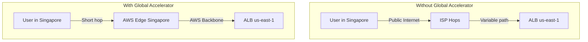

# How to Set Up AWS Global Accelerator for Performance

Author: [nawazdhandala](https://github.com/nawazdhandala)

Tags: AWS, Global Accelerator, Networking, Performance

Description: Complete guide to setting up AWS Global Accelerator for improved application performance with static IP addresses and global traffic routing.

---

AWS Global Accelerator gives your application two static anycast IP addresses that route traffic through AWS's global backbone network to your nearest healthy endpoint. Instead of traffic bouncing across the public internet through dozens of hops, it enters the AWS network at the closest edge location and travels on AWS's private fiber. The result is lower latency, less jitter, and more consistent performance for users worldwide.

## How Global Accelerator Differs from Regular Routing

Without Global Accelerator, a user in Singapore accessing your ALB in us-east-1 goes through the public internet - potentially dozens of ISP hops, varying routes, and congestion points. With Global Accelerator, that same user hits an AWS edge location in Singapore, and the rest of the journey travels on AWS's backbone.



The static IP addresses are a bonus - they never change, so you can allowlist them in firewalls, use them in DNS configurations that don't support CNAME, and avoid DNS propagation issues during failover.

## Step 1: Create the Accelerator

```bash
# Create a Global Accelerator
aws globalaccelerator create-accelerator \
  --name "my-app-accelerator" \
  --ip-address-type DUAL_STACK \
  --enabled \
  --region us-west-2
```

Global Accelerator is a global service, but the API endpoint is in us-west-2. You always specify `--region us-west-2` for Global Accelerator API calls.

The output gives you two static IP addresses:

```json
{
  "Accelerator": {
    "AcceleratorArn": "arn:aws:globalaccelerator::123456789012:accelerator/abc-123",
    "IpSets": [
      {
        "IpAddresses": ["75.2.60.1", "99.83.190.1"],
        "IpFamily": "IPv4"
      }
    ],
    "Status": "IN_PROGRESS",
    "Enabled": true
  }
}
```

These two IPs are your accelerator's fixed entry points. They're anycast addresses - the same IPs are advertised from all AWS edge locations, and users automatically connect to the nearest one.

## Step 2: Create a Listener

Listeners define the ports and protocols your accelerator accepts:

```bash
# Create a listener for HTTPS traffic
aws globalaccelerator create-listener \
  --accelerator-arn arn:aws:globalaccelerator::123456789012:accelerator/abc-123 \
  --port-ranges '[{"FromPort": 443, "ToPort": 443}]' \
  --protocol TCP \
  --region us-west-2
```

You can create multiple listeners for different ports:

```bash
# Create a listener for HTTP (to redirect to HTTPS)
aws globalaccelerator create-listener \
  --accelerator-arn arn:aws:globalaccelerator::123456789012:accelerator/abc-123 \
  --port-ranges '[{"FromPort": 80, "ToPort": 80}]' \
  --protocol TCP \
  --region us-west-2

# Create a listener for a custom port range
aws globalaccelerator create-listener \
  --accelerator-arn arn:aws:globalaccelerator::123456789012:accelerator/abc-123 \
  --port-ranges '[{"FromPort": 8000, "ToPort": 9000}]' \
  --protocol TCP \
  --region us-west-2
```

## Step 3: Create Endpoint Groups

Endpoint groups define your application endpoints in specific AWS regions. Each listener can have multiple endpoint groups (one per region), and Global Accelerator routes traffic to the nearest healthy group.

```bash
# Create an endpoint group for us-east-1
aws globalaccelerator create-endpoint-group \
  --listener-arn arn:aws:globalaccelerator::123456789012:accelerator/abc-123/listener/def-456 \
  --endpoint-group-region us-east-1 \
  --endpoint-configurations '[{
    "EndpointId": "arn:aws:elasticloadbalancing:us-east-1:123456789012:loadbalancer/app/my-alb/abc123",
    "Weight": 100,
    "ClientIPPreservationEnabled": true
  }]' \
  --health-check-port 443 \
  --health-check-protocol HTTPS \
  --health-check-path "/health" \
  --health-check-interval-seconds 30 \
  --threshold-count 3 \
  --traffic-dial-percentage 100 \
  --region us-west-2
```

Add a second endpoint group in another region for geographic coverage and failover:

```bash
# Create an endpoint group for eu-west-1
aws globalaccelerator create-endpoint-group \
  --listener-arn arn:aws:globalaccelerator::123456789012:accelerator/abc-123/listener/def-456 \
  --endpoint-group-region eu-west-1 \
  --endpoint-configurations '[{
    "EndpointId": "arn:aws:elasticloadbalancing:eu-west-1:123456789012:loadbalancer/app/my-alb-eu/xyz789",
    "Weight": 100,
    "ClientIPPreservationEnabled": true
  }]' \
  --health-check-port 443 \
  --health-check-protocol HTTPS \
  --health-check-path "/health" \
  --health-check-interval-seconds 30 \
  --threshold-count 3 \
  --traffic-dial-percentage 100 \
  --region us-west-2
```

## Step 4: Configure Health Checks

Global Accelerator's built-in health checks determine whether an endpoint group receives traffic. If all endpoints in a group are unhealthy, traffic automatically routes to the next nearest healthy group.

Health check settings to tune:

- **health-check-path**: Use a meaningful health endpoint, not just `/`
- **health-check-interval-seconds**: 10 or 30 seconds
- **threshold-count**: How many consecutive failures before marking unhealthy (1-10)

```bash
# Update health check settings for faster failover
aws globalaccelerator update-endpoint-group \
  --endpoint-group-arn arn:aws:globalaccelerator::123456789012:accelerator/abc-123/listener/def-456/endpoint-group/ghi-789 \
  --health-check-interval-seconds 10 \
  --threshold-count 2 \
  --region us-west-2
```

With 10-second intervals and a threshold of 2, failover happens in about 20 seconds.

## Step 5: Point Your Domain to the Accelerator

Update your DNS to point to the accelerator's static IPs or DNS name:

```bash
# Create Route 53 alias record pointing to the accelerator
aws route53 change-resource-record-sets \
  --hosted-zone-id Z1234567890 \
  --change-batch '{
    "Changes": [{
      "Action": "UPSERT",
      "ResourceRecordSet": {
        "Name": "app.example.com",
        "Type": "A",
        "AliasTarget": {
          "HostedZoneId": "Z2BJ6XQ5FK7U4H",
          "DNSName": "abc123.awsglobalaccelerator.com",
          "EvaluateTargetHealth": true
        }
      }
    }]
  }'
```

The hosted zone ID `Z2BJ6XQ5FK7U4H` is the fixed value for all Global Accelerators. Or use the static IPs directly as A records if your DNS provider doesn't support alias records.

## Traffic Dial for Gradual Migration

The traffic dial percentage lets you gradually shift traffic to a new region. This is great for blue-green deployments:

```bash
# Send only 10% of traffic to the new region initially
aws globalaccelerator update-endpoint-group \
  --endpoint-group-arn arn:aws:globalaccelerator::123456789012:accelerator/abc-123/listener/def-456/endpoint-group/new-region \
  --traffic-dial-percentage 10 \
  --region us-west-2

# If everything looks good, increase to 50%
aws globalaccelerator update-endpoint-group \
  --endpoint-group-arn arn:aws:globalaccelerator::123456789012:accelerator/abc-123/listener/def-456/endpoint-group/new-region \
  --traffic-dial-percentage 50 \
  --region us-west-2

# Full rollout
aws globalaccelerator update-endpoint-group \
  --endpoint-group-arn arn:aws:globalaccelerator::123456789012:accelerator/abc-123/listener/def-456/endpoint-group/new-region \
  --traffic-dial-percentage 100 \
  --region us-west-2
```

## Endpoint Weights

Within an endpoint group, weights control traffic distribution across multiple endpoints:

```bash
# Configure weighted routing between two ALBs in the same region
aws globalaccelerator update-endpoint-group \
  --endpoint-group-arn arn:aws:globalaccelerator::123456789012:accelerator/abc-123/listener/def-456/endpoint-group/ghi-789 \
  --endpoint-configurations '[
    {"EndpointId": "arn:aws:elasticloadbalancing:us-east-1:123456789012:loadbalancer/app/alb-blue/abc", "Weight": 70},
    {"EndpointId": "arn:aws:elasticloadbalancing:us-east-1:123456789012:loadbalancer/app/alb-green/xyz", "Weight": 30}
  ]' \
  --region us-west-2
```

## Supported Endpoint Types

Global Accelerator supports several endpoint types:

- Application Load Balancers
- Network Load Balancers
- EC2 instances
- Elastic IP addresses

```bash
# Add an EC2 instance as an endpoint
aws globalaccelerator update-endpoint-group \
  --endpoint-group-arn arn:aws:globalaccelerator::123456789012:accelerator/abc-123/listener/def-456/endpoint-group/ghi-789 \
  --endpoint-configurations '[{
    "EndpointId": "i-0abc123def456",
    "Weight": 100
  }]' \
  --region us-west-2
```

## Monitoring and Metrics

Global Accelerator publishes metrics to CloudWatch:

```bash
# Check traffic flow metrics
aws cloudwatch get-metric-statistics \
  --namespace AWS/GlobalAccelerator \
  --metric-name NewFlowCount \
  --dimensions Name=Accelerator,Value=abc-123 \
  --start-time $(date -u -d '1 hour ago' +%Y-%m-%dT%H:%M:%S) \
  --end-time $(date -u +%Y-%m-%dT%H:%M:%S) \
  --period 300 \
  --statistics Sum \
  --region us-west-2
```

Key metrics: `NewFlowCount`, `ProcessedBytesIn`, `ProcessedBytesOut`, and `HealthyEndpointCount`.

## Cost Considerations

Global Accelerator charges a fixed hourly fee per accelerator (around $0.025/hour, roughly $18/month) plus a data transfer premium per GB. The data transfer charge is based on the dominant AWS Region where your traffic is served. For high-traffic applications, calculate whether the performance improvement justifies the cost compared to alternatives like CloudFront.

## Summary

AWS Global Accelerator provides static anycast IPs that route traffic through AWS's backbone network for better performance and automatic failover. Set up listeners for your ports, create endpoint groups in each region with your ALBs or other endpoints, configure health checks for fast failover, and point your DNS to the accelerator. Use traffic dials for gradual rollouts and endpoint weights for fine-grained traffic distribution. It's particularly valuable for non-HTTP workloads like gaming, IoT, and VoIP where CloudFront isn't an option.
