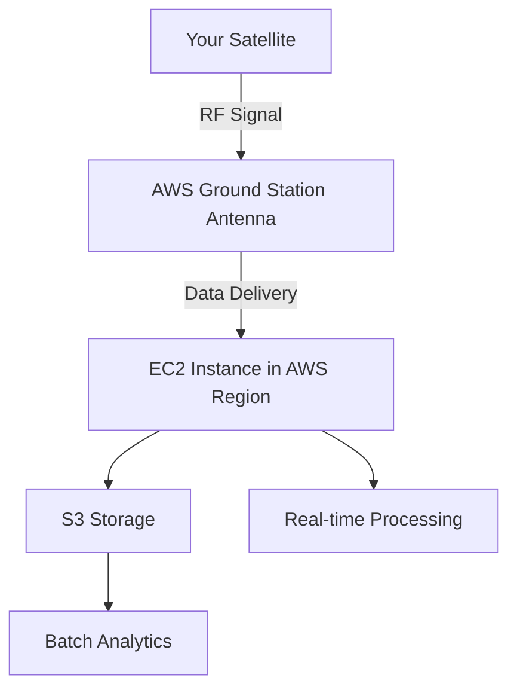

# How to Use AWS Ground Station for Satellite Data

Author: [nawazdhandala](https://github.com/nawazdhandala)

Tags: AWS, Ground Station, Satellite, Space Tech, Cloud

Description: Learn how to use AWS Ground Station to communicate with satellites, downlink data, and process satellite telemetry without building your own antenna infrastructure.

---

Most developers will never need to talk to a satellite. But if you're in the Earth observation, weather forecasting, maritime tracking, or communications business, satellite ground stations are a critical piece of infrastructure that's traditionally been absurdly expensive to build and operate. AWS Ground Station changes the equation by letting you rent antenna time at AWS-managed ground stations around the world, and pipe the data directly into your AWS account for processing.

Let's walk through how it works, how to schedule satellite contacts, and how to process the data that comes down.

## What AWS Ground Station Actually Does

Here's the quick version: satellites orbit the Earth and are only visible from a given ground station for a few minutes at a time. During that window, you need an antenna pointed at the satellite to send commands up (uplink) and receive data down (downlink). Traditionally, you'd need to build or lease physical antenna sites, which costs millions.

AWS Ground Station gives you access to a global network of antennas. You schedule a "contact" - a time window when a satellite passes over one of AWS's ground stations - and the service handles pointing the antenna, capturing the signal, and delivering the raw data to your EC2 instances or S3 buckets.



## Prerequisites

Before you start, you'll need:

- An AWS account with Ground Station access (you may need to request access)
- A satellite - yes, you need an actual satellite registered with AWS Ground Station, or you can use publicly accessible satellites for testing
- An EC2 instance in a supported region for data delivery
- Mission profiles configured for your satellite's frequency and data format

The supported regions for Ground Station data delivery currently include US East (Ohio), US West (Oregon), EU (Stockholm), Asia Pacific (Sydney), and several others near ground station locations.

## Step 1: Register Your Satellite

If you operate your own satellite, you register it with AWS Ground Station by providing its NORAD ID (the catalog number assigned by the US Space Command).

```bash
# List satellites already available in your account
aws groundstation list-satellites \
  --query "satellites[].{Name:satelliteId, NORAD:noradSatelliteID}" \
  --output table
```

For testing purposes, AWS has pre-configured public broadcast satellites that you can practice with. These are great for validating your setup before your own satellite is in orbit.

## Step 2: Create a Mission Profile

A mission profile defines how data flows between the satellite and your AWS account. It ties together the antenna configuration, data delivery method, and processing parameters.

First, you need a dataflow endpoint group. This tells Ground Station where to send the received data.

```bash
# Create a dataflow endpoint group
# This defines the EC2 instance that will receive satellite data
aws groundstation create-dataflow-endpoint-group \
  --endpoint-details '[
    {
      "endpoint": {
        "name": "my-data-endpoint",
        "address": {
          "name": "10.0.1.50",
          "port": 55000
        }
      },
      "securityDetails": {
        "subnetIds": ["subnet-abc123"],
        "securityGroupIds": ["sg-def456"],
        "roleArn": "arn:aws:iam::123456789:role/GroundStationDataDelivery"
      }
    }
  ]'
```

Then create the mission profile.

```bash
# Create a mission profile
aws groundstation create-mission-profile \
  --name "earth-observation-mission" \
  --minimum-viable-contact-duration-seconds 180 \
  --tracking-config-arn "arn:aws:groundstation:us-east-2:123456789:config/tracking/auto-track" \
  --dataflow-edges '[
    {
      "source": "arn:aws:groundstation:us-east-2:123456789:config/antenna-downlink/my-config",
      "destination": "arn:aws:groundstation:us-east-2:123456789:dataflow-endpoint-group/my-endpoint-group"
    }
  ]'
```

The `minimum-viable-contact-duration-seconds` is important. Satellite passes can be brief, and you don't want to pay for a contact that's too short to get meaningful data. Three minutes is a common minimum.

## Step 3: Schedule a Contact

Now you can see when your satellite will be visible from available ground stations and schedule contacts.

```bash
# List available contacts for the next 24 hours
aws groundstation list-contacts \
  --status "AVAILABLE" \
  --satellite-arn "arn:aws:groundstation:us-east-2:123456789:satellite/my-sat" \
  --start-time "2026-02-12T00:00:00Z" \
  --end-time "2026-02-13T00:00:00Z" \
  --query "contactList[].{Start:startTime, End:endTime, MaxElevation:maximumElevation, GroundStation:groundStationId}" \
  --output table
```

Higher elevation passes are better - the satellite is more directly overhead, giving you a stronger signal and more data throughput. Look for passes above 20 degrees elevation.

Reserve a contact.

```bash
# Reserve a specific contact window
aws groundstation reserve-contact \
  --satellite-arn "arn:aws:groundstation:us-east-2:123456789:satellite/my-sat" \
  --start-time "2026-02-12T14:30:00Z" \
  --end-time "2026-02-12T14:38:00Z" \
  --ground-station "us-east-2-1" \
  --mission-profile-arn "arn:aws:groundstation:us-east-2:123456789:mission-profile/earth-observation-mission"
```

## Step 4: Receive and Process Data

When the contact happens, data streams to your EC2 instance (or S3, depending on your config). You need your instance running and ready to receive before the contact starts.

Here's a basic Python script that receives data on the EC2 instance.

```python
import socket
import struct
import datetime
import boto3

# Set up a UDP listener to receive satellite data
LISTEN_PORT = 55000
BUFFER_SIZE = 65536

# S3 client for storing received data
s3 = boto3.client('s3')
BUCKET = 'satellite-data-raw'

def receive_satellite_data():
    sock = socket.socket(socket.AF_INET, socket.SOCK_DGRAM)
    sock.bind(('0.0.0.0', LISTEN_PORT))
    print(f"Listening for satellite data on port {LISTEN_PORT}")

    contact_data = bytearray()
    packet_count = 0

    try:
        while True:
            data, addr = sock.recvfrom(BUFFER_SIZE)
            contact_data.extend(data)
            packet_count += 1

            if packet_count % 1000 == 0:
                print(f"Received {packet_count} packets, {len(contact_data)} bytes total")

    except KeyboardInterrupt:
        print(f"\nContact ended. Total: {packet_count} packets, {len(contact_data)} bytes")

        # Upload to S3 for processing
        timestamp = datetime.datetime.utcnow().strftime('%Y%m%d_%H%M%S')
        key = f"raw/{timestamp}/contact_data.bin"
        s3.put_object(
            Bucket=BUCKET,
            Key=key,
            Body=bytes(contact_data)
        )
        print(f"Uploaded to s3://{BUCKET}/{key}")

    finally:
        sock.close()

if __name__ == '__main__':
    receive_satellite_data()
```

## Step 5: Post-Processing Pipeline

Raw satellite data usually needs significant processing. For Earth observation, you're dealing with imagery that needs decompression, georeferencing, and atmospheric correction. A common pipeline looks like this:

```python
import boto3

# Set up a processing pipeline using Step Functions or Lambda
# This example shows triggering processing when raw data lands in S3

lambda_client = boto3.client('lambda')

def process_satellite_imagery(bucket, key):
    """
    Trigger processing pipeline for downloaded satellite data.
    Steps:
    1. Decompress raw data
    2. Extract individual image frames
    3. Apply georeferencing (map pixels to lat/lng)
    4. Store processed imagery in output bucket
    """
    response = lambda_client.invoke(
        FunctionName='satellite-image-processor',
        InvocationType='Event',  # async invocation
        Payload=json.dumps({
            'source_bucket': bucket,
            'source_key': key,
            'output_bucket': 'satellite-data-processed',
            'processing_level': 'L1B'
        }).encode()
    )
    return response

# S3 event notification handles this automatically
# Configure the raw data bucket to trigger Lambda on new objects
```

## Monitoring Contacts

Ground Station integrates with CloudWatch for monitoring contact status, signal quality, and data throughput. You'll want alerts for failed contacts, since you can't simply retry - the satellite has moved on.

```bash
# Describe a completed contact
aws groundstation describe-contact \
  --contact-id "contact-abc123" \
  --query "{Status:contactStatus, Start:startTime, End:endTime, MaxElevation:maximumElevation}"
```

For broader infrastructure monitoring that ties together your Ground Station contacts with the rest of your processing pipeline, consider tools like [OneUptime](https://oneuptime.com/blog/post/aws-cloudwatch-logs-setup/view) to get visibility across services.

## Cost Structure

AWS Ground Station charges per minute of antenna time. The exact rate depends on the antenna band (S-band, X-band, etc.) and ranges from roughly $3 to $10 per minute. A typical 8-minute LEO satellite pass might cost $24-80.

That might sound steep, but compare it to building and maintaining your own ground station infrastructure. A single antenna site runs $1-5 million to build, plus ongoing staffing and maintenance. If you're doing fewer than a few hundred contacts per month, AWS Ground Station is almost certainly cheaper.

Add in EC2 costs for your data processing instances and S3 for storage, and you've got a fully variable cost model for space operations. That's pretty remarkable when you think about it.

## When to Use AWS Ground Station

This service makes sense when you:

- Operate one or a few satellites and don't want to build ground infrastructure
- Need global coverage (AWS has stations on multiple continents)
- Want to process data in the cloud immediately after downlink
- Need to scale contact capacity up or down

It's less ideal if you need continuous, real-time contact with geostationary satellites (those require dedicated antennas) or if you already have ground infrastructure that's underutilized.

## Wrapping Up

AWS Ground Station is one of those services that makes you realize how far cloud computing has come. Ten years ago, the idea of renting satellite antenna time by the minute from a cloud provider would've sounded like science fiction. Today, it's just another API call. If you're doing anything with satellite data, it's worth evaluating whether the economics work better than traditional ground station approaches.
