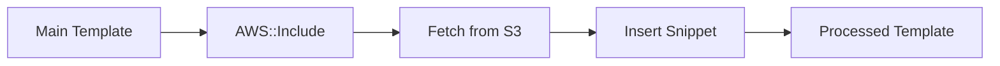

# How to Use AWS::Include Transform in CloudFormation

Author: [nawazdhandala](https://github.com/nawazdhandala)

Tags: AWS, CloudFormation, Infrastructure as Code, DevOps

Description: Learn how to use the AWS::Include transform to include reusable template snippets from S3 in your CloudFormation templates for better modularity.

---

Large CloudFormation templates are hard to manage. You end up copying the same IAM policies, security group rules, and resource configurations across templates. The `AWS::Include` transform lets you store reusable snippets in S3 and include them in any template, keeping things DRY without the overhead of nested stacks.

## What is AWS::Include?

`AWS::Include` is a built-in CloudFormation transform that fetches a template snippet from S3 and inserts it into your template at processing time. Think of it like a `#include` directive in C or an import in other languages.



## Basic Usage

Reference `AWS::Include` using `Fn::Transform`:

```yaml
# Main template that includes a snippet from S3
AWSTemplateFormatVersion: '2010-09-09'
Transform: AWS::Include
Description: Template with included snippets

Resources:
  MyBucket:
    Type: AWS::S3::Bucket
    Properties:
      BucketName: my-app-bucket
      # Include a standard bucket policy from S3
      Fn::Transform:
        Name: AWS::Include
        Parameters:
          Location: s3://my-templates-bucket/snippets/bucket-encryption.yaml
```

The snippet file in S3:

```yaml
# s3://my-templates-bucket/snippets/bucket-encryption.yaml
BucketEncryption:
  ServerSideEncryptionConfiguration:
    - ServerSideEncryptionByDefault:
        SSEAlgorithm: aws:kms
VersioningConfiguration:
  Status: Enabled
PublicAccessBlockConfiguration:
  BlockPublicAcls: true
  BlockPublicPolicy: true
  IgnorePublicAcls: true
  RestrictPublicBuckets: true
```

After processing, the template becomes:

```yaml
Resources:
  MyBucket:
    Type: AWS::S3::Bucket
    Properties:
      BucketName: my-app-bucket
      BucketEncryption:
        ServerSideEncryptionConfiguration:
          - ServerSideEncryptionByDefault:
              SSEAlgorithm: aws:kms
      VersioningConfiguration:
        Status: Enabled
      PublicAccessBlockConfiguration:
        BlockPublicAcls: true
        BlockPublicPolicy: true
        IgnorePublicAcls: true
        RestrictPublicBuckets: true
```

## Including Entire Resource Definitions

You can include complete resource blocks:

```yaml
# Main template
AWSTemplateFormatVersion: '2010-09-09'

Resources:
  AppBucket:
    Type: AWS::S3::Bucket

  # Include a standard monitoring setup
  Fn::Transform:
    Name: AWS::Include
    Parameters:
      Location: s3://my-templates/snippets/standard-monitoring.yaml
```

The snippet:

```yaml
# s3://my-templates/snippets/standard-monitoring.yaml
CPUAlarm:
  Type: AWS::CloudWatch::Alarm
  Properties:
    AlarmName: high-cpu
    MetricName: CPUUtilization
    Namespace: AWS/EC2
    Statistic: Average
    Period: 300
    EvaluationPeriods: 2
    Threshold: 80
    ComparisonOperator: GreaterThanThreshold

MemoryAlarm:
  Type: AWS::CloudWatch::Alarm
  Properties:
    AlarmName: high-memory
    MetricName: MemoryUtilization
    Namespace: CWAgent
    Statistic: Average
    Period: 300
    EvaluationPeriods: 2
    Threshold: 85
    ComparisonOperator: GreaterThanThreshold
```

## Including IAM Policies

One of the most practical uses - shared IAM policy documents:

```yaml
# Main template
Resources:
  AppRole:
    Type: AWS::IAM::Role
    Properties:
      RoleName: my-app-role
      AssumeRolePolicyDocument:
        Version: '2012-10-17'
        Statement:
          - Effect: Allow
            Principal:
              Service: lambda.amazonaws.com
            Action: sts:AssumeRole
      Policies:
        - PolicyName: AppPolicy
          PolicyDocument:
            Fn::Transform:
              Name: AWS::Include
              Parameters:
                Location: s3://my-templates/policies/lambda-base-policy.yaml
```

The policy snippet:

```yaml
# s3://my-templates/policies/lambda-base-policy.yaml
Version: '2012-10-17'
Statement:
  - Effect: Allow
    Action:
      - logs:CreateLogGroup
      - logs:CreateLogStream
      - logs:PutLogEvents
    Resource: 'arn:aws:logs:*:*:*'
  - Effect: Allow
    Action:
      - xray:PutTraceSegments
      - xray:PutTelemetryRecords
    Resource: '*'
  - Effect: Allow
    Action:
      - ssm:GetParameter
      - ssm:GetParameters
    Resource: !Sub 'arn:aws:ssm:${AWS::Region}:${AWS::AccountId}:parameter/myapp/*'
```

Notice that the snippet can use CloudFormation intrinsic functions like `!Sub`. They're resolved after the include is processed.

## Including in Mappings and Outputs

`AWS::Include` works in most template sections:

```yaml
# Include mappings from a shared file
AWSTemplateFormatVersion: '2010-09-09'

Mappings:
  Fn::Transform:
    Name: AWS::Include
    Parameters:
      Location: s3://my-templates/mappings/region-config.yaml

Resources:
  Instance:
    Type: AWS::EC2::Instance
    Properties:
      ImageId: !FindInMap [RegionAMI, !Ref 'AWS::Region', HVM64]
```

The mappings snippet:

```yaml
# s3://my-templates/mappings/region-config.yaml
RegionAMI:
  us-east-1:
    HVM64: ami-0c02fb55956c7d316
  us-west-2:
    HVM64: ami-00ee4df451840fa9d
  eu-west-1:
    HVM64: ami-0d71ea30463e0ff8d
```

## Setting Up the Snippets Bucket

Create a versioned S3 bucket for your snippets:

```yaml
# snippets-bucket.yaml - S3 bucket for template snippets
AWSTemplateFormatVersion: '2010-09-09'
Description: S3 bucket for CloudFormation template snippets

Resources:
  SnippetsBucket:
    Type: AWS::S3::Bucket
    Properties:
      BucketName: !Sub '${AWS::AccountId}-cfn-snippets'
      VersioningConfiguration:
        Status: Enabled
      BucketEncryption:
        ServerSideEncryptionConfiguration:
          - ServerSideEncryptionByDefault:
              SSEAlgorithm: AES256
      PublicAccessBlockConfiguration:
        BlockPublicAcls: true
        BlockPublicPolicy: true
        IgnorePublicAcls: true
        RestrictPublicBuckets: true

Outputs:
  BucketName:
    Value: !Ref SnippetsBucket
    Export:
      Name: CFNSnippetsBucket
```

Upload snippets:

```bash
# Upload snippet files to S3
aws s3 sync ./snippets/ s3://123456789012-cfn-snippets/snippets/

# Verify the upload
aws s3 ls s3://123456789012-cfn-snippets/snippets/ --recursive
```

## Organizing Snippets

A good directory structure helps:

```
snippets/
  policies/
    lambda-base-policy.yaml
    ec2-base-policy.yaml
    s3-read-only-policy.yaml
  security/
    bucket-encryption.yaml
    rds-encryption.yaml
    security-group-base.yaml
  monitoring/
    standard-alarms.yaml
    dashboard-widgets.yaml
  mappings/
    region-config.yaml
    instance-types.yaml
  tags/
    standard-tags.yaml
```

## Combining Include with Other Transforms

You can use `AWS::Include` alongside other transforms:

```yaml
# Using Include with SAM transform
AWSTemplateFormatVersion: '2010-09-09'
Transform:
  - AWS::Serverless-2016-10-31
  - AWS::Include

Resources:
  MyFunction:
    Type: AWS::Serverless::Function
    Properties:
      Handler: index.handler
      Runtime: python3.12
      Policies:
        - Fn::Transform:
            Name: AWS::Include
            Parameters:
              Location: s3://my-templates/policies/function-policy.yaml
```

## Limitations

**No parameterization.** You can't pass variables to included snippets. The snippet is included as-is. For parameterized reusable components, use [nested stacks](https://oneuptime.com/blog/post/2026-02-12-cloudformation-nested-stacks/view) or [custom macros](https://oneuptime.com/blog/post/2026-02-12-cloudformation-macros-transforms/view).

**S3 only.** Snippets must be stored in S3. You can't include from local files or HTTP URLs.

**No conditional includes.** You can't conditionally include a snippet based on a parameter. The include always happens.

**Snippet size.** The processed template (after all includes) must still fit within CloudFormation's template size limits.

**Debugging is harder.** When a snippet has an error, the error message references the processed template, which you might not have seen. Use change sets to preview the processed result:

```bash
# Preview the processed template
aws cloudformation create-change-set \
  --stack-name test-include \
  --template-body file://template.yaml \
  --change-set-name preview

aws cloudformation get-template \
  --stack-name test-include \
  --change-set-name preview \
  --template-stage Processed
```

## AWS::Include vs Nested Stacks vs Macros

| Feature | AWS::Include | Nested Stacks | Custom Macros |
|---|---|---|---|
| Reusability | Simple snippets | Full stack templates | Any logic |
| Parameters | No | Yes | Yes |
| Conditions | No | Yes | Yes |
| Complexity | Low | Medium | High |
| Best for | Shared configs/policies | Complete modules | Dynamic generation |

Use `AWS::Include` for static, reusable configuration blocks. Use nested stacks when you need parameterized, independent components. Use macros when you need custom logic.

## Best Practices

**Version your snippets.** Enable S3 versioning and consider using specific object versions in your S3 URLs for production templates.

**Test snippets in isolation.** Create a test template that includes the snippet and deploy it to verify correctness.

**Keep snippets focused.** One snippet per concern - a security policy, a monitoring config, a set of tags. Don't stuff unrelated configuration into one file.

**Use consistent naming.** Name snippets descriptively so people know what they contain without opening them.

**Document the contract.** Each snippet should have a comment at the top explaining where it should be included and what context it expects.

**Update carefully.** Changing a snippet affects every template that includes it. Test changes thoroughly before updating the S3 file.

`AWS::Include` is the simplest way to share configuration across CloudFormation templates. It's not as powerful as macros or nested stacks, but for common patterns like security policies, encryption configs, and standard tags, it's the cleanest solution.
