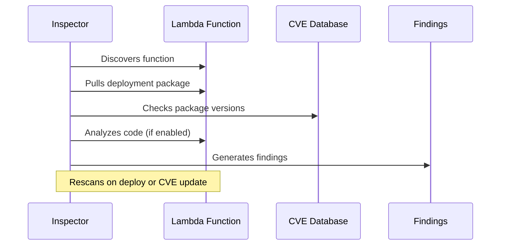

# How to Use AWS Inspector for Lambda Function Scanning

Author: [nawazdhandala](https://github.com/nawazdhandala)

Tags: AWS, Inspector, Lambda, Security, Vulnerability Scanning

Description: Configure Amazon Inspector to automatically scan your Lambda functions for code vulnerabilities and outdated dependencies.

---

Lambda functions often fly under the security radar. Teams focus on securing their EC2 instances and containers while Lambda functions accumulate outdated dependencies with known CVEs. It's easy to see why - there's no OS to patch, no server to harden. But your Lambda functions still run code, and that code has dependencies that can have serious vulnerabilities.

Amazon Inspector's Lambda scanning changes this. It automatically scans your Lambda functions and their layers for software vulnerabilities, covering both package dependencies and (optionally) the function code itself. No agents to deploy, no configuration on the Lambda side. Let's set it up.

## Two Types of Lambda Scanning

Inspector offers two levels of Lambda scanning:

1. **Standard scanning** - Scans the software packages in your function's deployment package and layers. It checks package versions against CVE databases. Think of it like running `npm audit` or `pip check` against your function's dependencies.

2. **Code scanning** - Goes deeper and analyzes the actual Lambda function code for vulnerabilities like injection flaws, insecure deserialization, hardcoded credentials, and other security anti-patterns. This currently supports Python, Java, and Node.js.

You can enable one or both.

## Enabling Lambda Standard Scanning

### Via CLI

This enables Inspector to automatically scan all Lambda functions for vulnerable packages:

```bash
# Enable Inspector with Lambda scanning
aws inspector2 enable \
  --resource-types LAMBDA

# Verify it's enabled
aws inspector2 batch-get-account-status \
  --query 'Accounts[0].ResourceState.Lambda'
```

If Inspector is already enabled for other resource types, use the update command:

```bash
aws inspector2 update-configuration \
  --ecr-configuration '{}' \
  --ec2-configuration '{
    "ScanMode": "EC2_SSM_AGENT_BASED"
  }'
```

### Via Terraform

This Terraform configuration enables Inspector with Lambda function scanning:

```hcl
resource "aws_inspector2_enabler" "lambda" {
  account_ids    = [data.aws_caller_identity.current.account_id]
  resource_types = ["LAMBDA"]
}
```

To enable both standard and code scanning:

```hcl
resource "aws_inspector2_enabler" "lambda_all" {
  account_ids    = [data.aws_caller_identity.current.account_id]
  resource_types = ["LAMBDA", "LAMBDA_CODE"]
}
```

## Enabling Lambda Code Scanning

Code scanning is a separate resource type you need to explicitly enable.

This enables code-level vulnerability scanning for Lambda functions:

```bash
# Enable Lambda code scanning
aws inspector2 enable \
  --resource-types LAMBDA_CODE
```

Code scanning uses Amazon CodeGuru under the hood. It's more thorough than package scanning but also more expensive. For most teams, the combination of both types provides the best coverage.

## How Scanning Works

Once enabled, Inspector automatically discovers all Lambda functions in your account and scans them. Here's the flow:



Scans trigger automatically when:
- A new function is created
- An existing function is updated (new deployment)
- A new CVE is published that affects an installed package
- Initial scan when Inspector is first enabled

You don't need to trigger scans manually. Inspector handles the lifecycle.

## Viewing Lambda Findings

List all findings related to Lambda functions:

```bash
# Get Lambda vulnerability findings
aws inspector2 list-findings \
  --filter-criteria '{
    "resourceType": [{
      "comparison": "EQUALS",
      "value": "AWS_LAMBDA_FUNCTION"
    }]
  }' \
  --sort-criteria '{
    "field": "SEVERITY",
    "sortOrder": "DESC"
  }'
```

Filter for critical and high severity findings only:

```bash
# Critical and high severity Lambda findings
aws inspector2 list-findings \
  --filter-criteria '{
    "resourceType": [{
      "comparison": "EQUALS",
      "value": "AWS_LAMBDA_FUNCTION"
    }],
    "severity": [
      {"comparison": "EQUALS", "value": "CRITICAL"},
      {"comparison": "EQUALS", "value": "HIGH"}
    ]
  }'
```

Get findings for a specific function:

```bash
# Findings for a specific Lambda function
aws inspector2 list-findings \
  --filter-criteria '{
    "lambdaFunctionName": [{
      "comparison": "EQUALS",
      "value": "my-api-handler"
    }]
  }'
```

## Understanding Finding Details

Each finding contains specific information about the vulnerability. Here's what a typical finding looks like and the key fields to focus on.

This retrieves full details of a finding including the CVE, affected package, and fix version:

```bash
aws inspector2 list-findings \
  --filter-criteria '{
    "findingArn": [{
      "comparison": "EQUALS",
      "value": "arn:aws:inspector2:us-east-1:111111111111:finding/abc123"
    }]
  }' \
  --query 'Findings[0].{
    Title:Title,
    Severity:Severity,
    Status:Status,
    Function:Resources[0].Details.AwsLambdaFunction.FunctionName,
    Runtime:Resources[0].Details.AwsLambdaFunction.Runtime,
    Package:PackageVulnerabilityDetails.VulnerablePackages,
    CVE:PackageVulnerabilityDetails.VulnerabilityId,
    FixAvailable:FixAvailable,
    Remediation:Remediation
  }'
```

## Excluding Functions from Scanning

Sometimes you have functions you don't want scanned - maybe test functions or deprecated ones awaiting deletion. Use tags to exclude them.

Tag functions to exclude from Inspector scanning:

```bash
# Tag a function to exclude it
aws lambda tag-resource \
  --resource arn:aws:lambda:us-east-1:111111111111:function:test-function \
  --tags InspectorExclusion=LambdaStandardScanning
```

For code scanning exclusion, use a different tag value:

```bash
aws lambda tag-resource \
  --resource arn:aws:lambda:us-east-1:111111111111:function:test-function \
  --tags InspectorCodeExclusion=LambdaCodeScanning
```

## Automating Remediation

The most common remediation is updating vulnerable packages. Here's how to automate that in a CI/CD pipeline.

This script checks Inspector findings for a function and fails the CI build if critical vulnerabilities exist:

```python
import boto3
import sys

inspector = boto3.client('inspector2')

def check_function_vulnerabilities(function_name):
    response = inspector.list_findings(
        filterCriteria={
            'lambdaFunctionName': [{
                'comparison': 'EQUALS',
                'value': function_name
            }],
            'severity': [
                {'comparison': 'EQUALS', 'value': 'CRITICAL'},
                {'comparison': 'EQUALS', 'value': 'HIGH'}
            ],
            'findingStatus': [{
                'comparison': 'EQUALS',
                'value': 'ACTIVE'
            }]
        }
    )

    findings = response['Findings']

    if findings:
        print(f"Found {len(findings)} critical/high vulnerabilities in {function_name}:")
        for f in findings:
            vuln = f.get('packageVulnerabilityDetails', {})
            vuln_id = vuln.get('vulnerabilityId', 'Unknown')
            packages = vuln.get('vulnerablePackages', [])
            for pkg in packages:
                pkg_name = pkg.get('name', 'Unknown')
                pkg_version = pkg.get('version', 'Unknown')
                fix_version = pkg.get('fixedInVersion', 'No fix available')
                print(f"  - {vuln_id}: {pkg_name} {pkg_version} (fix: {fix_version})")

        return False  # Fail the check
    else:
        print(f"No critical/high vulnerabilities found in {function_name}")
        return True

if __name__ == '__main__':
    function_name = sys.argv[1]
    if not check_function_vulnerabilities(function_name):
        sys.exit(1)
```

Integrate it into your deployment script:

```bash
# Check for vulnerabilities before deploying to production
python check_vulns.py my-api-handler
if [ $? -ne 0 ]; then
  echo "Deployment blocked: fix vulnerabilities first"
  exit 1
fi

# If clean, deploy
aws lambda update-function-code \
  --function-name my-api-handler \
  --zip-file fileb://function.zip
```

## Generating Reports

Create a vulnerability report for all Lambda functions.

This exports a CSV report of all Lambda findings to S3:

```bash
# Create findings report
aws inspector2 create-findings-report \
  --report-format CSV \
  --s3-destination '{
    "bucketName": "my-security-reports",
    "keyPrefix": "inspector/lambda/",
    "kmsKeyArn": "arn:aws:kms:us-east-1:111111111111:key/key-id"
  }' \
  --filter-criteria '{
    "resourceType": [{
      "comparison": "EQUALS",
      "value": "AWS_LAMBDA_FUNCTION"
    }]
  }'
```

## Multi-Account Setup

Enable Lambda scanning across all organization accounts:

```bash
# From the delegated administrator account
aws inspector2 enable \
  --resource-types LAMBDA LAMBDA_CODE \
  --account-ids "222222222222" "333333333333" "444444444444"

# Or enable for all org members
aws inspector2 update-organization-configuration \
  --auto-enable '{
    "lambda": true,
    "lambdaCode": true
  }'
```

## Cost Considerations

Lambda standard scanning is priced per function scanned per month. Lambda code scanning has additional per-scan charges. In large environments with hundreds of functions, the costs can add up. Use exclusion tags to skip non-critical functions.

## Wrapping Up

Inspector Lambda scanning is one of the easiest security wins you can get. Enable it once and every function in your account gets continuous vulnerability monitoring. No agents, no code changes, no disruption. The findings integrate directly with Security Hub for centralized visibility - check out our guide on [Security Hub automated remediation](https://oneuptime.com/blog/post/security-hub-automated-response-remediation/view) to close the loop on those findings. And use [OneUptime](https://oneuptime.com) to track your overall vulnerability posture across environments.
