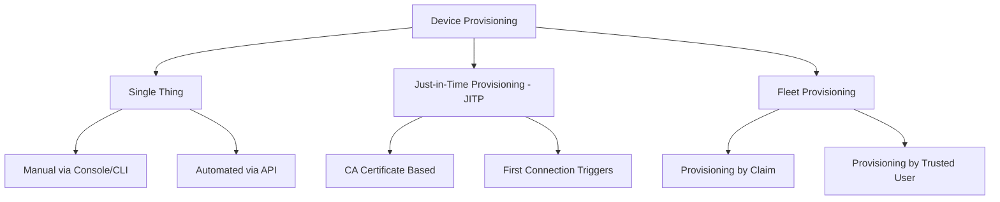

# How to Set Up AWS IoT Core Device Provisioning

Author: [nawazdhandala](https://github.com/nawazdhandala)

Tags: AWS, IoT Core, Device Provisioning, IoT, Certificates

Description: Set up AWS IoT Core device provisioning to automatically register and configure IoT devices at scale with certificates and policies

---

Manually registering each IoT device with AWS IoT Core works fine when you have a handful of devices. But when you are deploying hundreds or thousands of devices, you need an automated provisioning process. AWS IoT Core offers several provisioning methods - from simple single-thing registration to fleet provisioning that can onboard devices automatically when they first connect.

This guide covers the different provisioning approaches, when to use each one, and how to set them up.

## Provisioning Methods Overview

AWS IoT Core supports three main provisioning approaches:



| Method | Best For | Scale |
|--------|----------|-------|
| Single Thing | Prototyping, small deployments | 1-100 devices |
| Just-in-Time (JITP) | Devices with pre-installed certificates | 100-10,000 devices |
| Fleet Provisioning | Mass production, field deployment | 10,000+ devices |

## Method 1: Single Thing Provisioning

This is the simplest approach - register one device at a time with a unique certificate.

### Create a Thing

```bash
# Create a thing (device) in IoT Core
aws iot create-thing \
  --thing-name "sensor-001" \
  --thing-type-name "TemperatureSensor" \
  --attribute-payload '{
    "attributes": {
      "location": "warehouse-a",
      "firmware_version": "1.2.0"
    }
  }'
```

### Create and Attach a Certificate

```bash
# Create a device certificate and keys
aws iot create-keys-and-certificate \
  --set-as-active \
  --certificate-pem-outfile cert.pem \
  --public-key-outfile public.key \
  --private-key-outfile private.key

# Note the certificate ARN from the output
CERT_ARN="arn:aws:iot:us-east-1:123456789:cert/abc123..."

# Attach the certificate to the thing
aws iot attach-thing-principal \
  --thing-name "sensor-001" \
  --principal "$CERT_ARN"
```

### Create and Attach a Policy

```bash
# Create an IoT policy
aws iot create-policy \
  --policy-name "SensorPolicy" \
  --policy-document '{
    "Version": "2012-10-17",
    "Statement": [
      {
        "Effect": "Allow",
        "Action": "iot:Connect",
        "Resource": "arn:aws:iot:us-east-1:123456789:client/${iot:Connection.Thing.ThingName}"
      },
      {
        "Effect": "Allow",
        "Action": "iot:Publish",
        "Resource": "arn:aws:iot:us-east-1:123456789:topic/sensors/${iot:Connection.Thing.ThingName}/*"
      },
      {
        "Effect": "Allow",
        "Action": "iot:Subscribe",
        "Resource": "arn:aws:iot:us-east-1:123456789:topicfilter/commands/${iot:Connection.Thing.ThingName}/*"
      },
      {
        "Effect": "Allow",
        "Action": "iot:Receive",
        "Resource": "arn:aws:iot:us-east-1:123456789:topic/commands/${iot:Connection.Thing.ThingName}/*"
      }
    ]
  }'

# Attach the policy to the certificate
aws iot attach-policy \
  --policy-name "SensorPolicy" \
  --target "$CERT_ARN"
```

### Automate Single-Thing Provisioning with a Script

For moderate scale, automate the above steps.

```bash
#!/bin/bash
# Provision a single device
# Usage: ./provision-device.sh <thing-name> <location>

THING_NAME=$1
LOCATION=$2
OUTPUT_DIR="./devices/$THING_NAME"

mkdir -p "$OUTPUT_DIR"

# Create the thing
aws iot create-thing \
  --thing-name "$THING_NAME" \
  --attribute-payload "{\"attributes\":{\"location\":\"$LOCATION\"}}"

# Create certificate
CERT_OUTPUT=$(aws iot create-keys-and-certificate \
  --set-as-active \
  --certificate-pem-outfile "$OUTPUT_DIR/cert.pem" \
  --public-key-outfile "$OUTPUT_DIR/public.key" \
  --private-key-outfile "$OUTPUT_DIR/private.key")

CERT_ARN=$(echo "$CERT_OUTPUT" | jq -r '.certificateArn')

# Attach certificate to thing
aws iot attach-thing-principal \
  --thing-name "$THING_NAME" \
  --principal "$CERT_ARN"

# Attach policy to certificate
aws iot attach-policy \
  --policy-name "SensorPolicy" \
  --target "$CERT_ARN"

echo "Device $THING_NAME provisioned. Certificates in $OUTPUT_DIR"
```

## Method 2: Just-in-Time Provisioning (JITP)

JITP automatically provisions devices the first time they connect to IoT Core, based on their certificate authority (CA).

### Register Your CA Certificate

First, create your own CA certificate.

```bash
# Generate a CA private key
openssl genrsa -out ca.key 2048

# Create a CA certificate
openssl req -x509 -new -nodes -key ca.key \
  -sha256 -days 3650 \
  -out ca.pem \
  -subj "/CN=My IoT CA"

# Get the registration code from IoT Core
REG_CODE=$(aws iot get-registration-code --query 'registrationCode' --output text)

# Create a verification certificate using the registration code
openssl genrsa -out verification.key 2048
openssl req -new -key verification.key \
  -out verification.csr \
  -subj "/CN=$REG_CODE"
openssl x509 -req -in verification.csr \
  -CA ca.pem -CAkey ca.key \
  -CAcreateserial \
  -out verification.pem \
  -days 365 -sha256
```

### Create a Provisioning Template

The provisioning template tells IoT Core what to create when a new device connects.

```json
{
  "templateBody": {
    "Parameters": {
      "AWS::IoT::Certificate::CommonName": {
        "Type": "String"
      },
      "AWS::IoT::Certificate::Id": {
        "Type": "String"
      }
    },
    "Resources": {
      "thing": {
        "Type": "AWS::IoT::Thing",
        "Properties": {
          "ThingName": {
            "Ref": "AWS::IoT::Certificate::CommonName"
          },
          "ThingGroups": ["auto-provisioned"],
          "AttributePayload": {
            "provisioned_by": "JITP"
          }
        }
      },
      "certificate": {
        "Type": "AWS::IoT::Certificate",
        "Properties": {
          "CertificateId": {
            "Ref": "AWS::IoT::Certificate::Id"
          },
          "Status": "ACTIVE"
        }
      },
      "policy": {
        "Type": "AWS::IoT::Policy",
        "Properties": {
          "PolicyName": "SensorPolicy"
        }
      }
    }
  }
}
```

### Register the CA with the Template

```bash
# Register the CA certificate with JITP template
aws iot register-ca-certificate \
  --ca-certificate file://ca.pem \
  --verification-certificate file://verification.pem \
  --set-as-active \
  --allow-auto-registration \
  --registration-config file://provisioning-template.json
```

Now any device that connects with a certificate signed by this CA will be automatically provisioned.

## Method 3: Fleet Provisioning

Fleet provisioning is the most scalable approach. Devices use a temporary "claim certificate" to request their own unique certificates on first boot.

### Create a Fleet Provisioning Template

```bash
# Create the provisioning template
aws iot create-provisioning-template \
  --template-name "FleetSensorTemplate" \
  --description "Template for mass sensor deployment" \
  --provisioning-role-arn "arn:aws:iam::123456789:role/IoTFleetProvisioningRole" \
  --template-body '{
    "Parameters": {
      "SerialNumber": {"Type": "String"},
      "Location": {"Type": "String", "Default": "unknown"}
    },
    "Resources": {
      "thing": {
        "Type": "AWS::IoT::Thing",
        "Properties": {
          "ThingName": {"Fn::Join": ["_", ["sensor", {"Ref": "SerialNumber"}]]},
          "ThingGroups": ["fleet-sensors"],
          "AttributePayload": {
            "serial": {"Ref": "SerialNumber"},
            "location": {"Ref": "Location"}
          }
        }
      },
      "certificate": {
        "Type": "AWS::IoT::Certificate",
        "Properties": {
          "CertificateId": {"Ref": "AWS::IoT::Certificate::Id"},
          "Status": "ACTIVE"
        }
      },
      "policy": {
        "Type": "AWS::IoT::Policy",
        "Properties": {
          "PolicyName": "FleetSensorPolicy"
        }
      }
    }
  }' \
  --enabled
```

### Create a Claim Certificate

The claim certificate is baked into the device firmware and grants limited permissions to request provisioning.

```bash
# Create a claim certificate
aws iot create-keys-and-certificate \
  --set-as-active \
  --certificate-pem-outfile claim-cert.pem \
  --public-key-outfile claim-public.key \
  --private-key-outfile claim-private.key

# Create a claim policy (limited to provisioning actions only)
aws iot create-policy \
  --policy-name "FleetClaimPolicy" \
  --policy-document '{
    "Version": "2012-10-17",
    "Statement": [
      {
        "Effect": "Allow",
        "Action": ["iot:Connect"],
        "Resource": "*"
      },
      {
        "Effect": "Allow",
        "Action": ["iot:Publish", "iot:Receive"],
        "Resource": [
          "arn:aws:iot:us-east-1:123456789:topic/$aws/certificates/create/*",
          "arn:aws:iot:us-east-1:123456789:topic/$aws/provisioning-templates/FleetSensorTemplate/provision/*"
        ]
      },
      {
        "Effect": "Allow",
        "Action": "iot:Subscribe",
        "Resource": [
          "arn:aws:iot:us-east-1:123456789:topicfilter/$aws/certificates/create/*",
          "arn:aws:iot:us-east-1:123456789:topicfilter/$aws/provisioning-templates/FleetSensorTemplate/provision/*"
        ]
      }
    ]
  }'

# Attach policy to claim certificate
CLAIM_CERT_ARN="arn:aws:iot:us-east-1:123456789:cert/xyz..."
aws iot attach-policy \
  --policy-name "FleetClaimPolicy" \
  --target "$CLAIM_CERT_ARN"
```

The device firmware uses this claim certificate to connect, request a new unique certificate, and register itself.

## Verifying Provisioned Devices

After devices are provisioned, verify them.

```bash
# List all things
aws iot list-things --query 'things[].thingName'

# Check a specific device
aws iot describe-thing --thing-name sensor-001

# List certificates for a device
aws iot list-thing-principals --thing-name sensor-001
```

## Wrapping Up

Choose your provisioning method based on scale: single-thing for prototypes, JITP for moderate deployments with your own CA, and fleet provisioning for mass production. Each method builds on the same core concepts - things, certificates, and policies - but automates different parts of the registration process.

For next steps, see our guides on [IoT Core certificate-based authentication](https://oneuptime.com/blog/post/iot-core-certificate-based-authentication/view) and [creating IoT Core policies for device permissions](https://oneuptime.com/blog/post/iot-core-policies-device-permissions/view).
