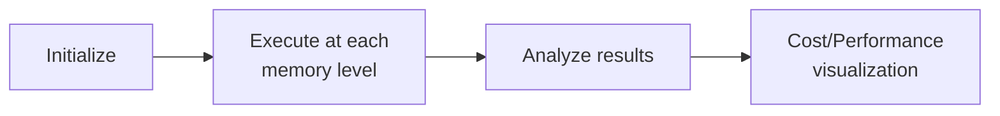

# How to Use AWS Lambda Power Tuning to Optimize Cost and Performance

Author: [nawazdhandala](https://github.com/nawazdhandala)

Tags: AWS, Lambda, Performance, Optimization, Cost

Description: Learn how to deploy and use the AWS Lambda Power Tuning tool to find the optimal memory configuration for your Lambda functions and minimize costs.

---

Finding the right memory setting for a Lambda function usually involves manually running tests at different configurations and recording the results. AWS Lambda Power Tuning automates this entire process. It's an open-source Step Functions state machine that invokes your function at multiple memory levels, collects performance data, and generates a visualization showing exactly where the sweet spot is.

Let's deploy it and put it to work.

## What Lambda Power Tuning Does

The tool works in three phases:

1. **Initialize** - Sets up the test configuration
2. **Execute** - Invokes your function multiple times at each memory level you specify
3. **Analyze** - Collects the duration and cost data and produces results

The output includes a URL to a visualization that plots cost vs. performance across memory configurations. It makes the optimal choice obvious at a glance.



## Deploying Lambda Power Tuning

The easiest way to deploy is through the AWS Serverless Application Repository.

### Option 1: AWS Console

1. Open the AWS Serverless Application Repository
2. Search for "aws-lambda-power-tuning"
3. Click "Deploy"
4. Accept the default settings and deploy

### Option 2: AWS CLI / SAM

```bash
# Deploy using the SAR application
aws serverlessrepo create-cloud-formation-change-set \
  --application-id arn:aws:serverlessrepo:us-east-1:451282441545:applications/aws-lambda-power-tuning \
  --stack-name lambda-power-tuning \
  --capabilities CAPABILITY_IAM

# After the changeset is created, execute it
aws cloudformation execute-change-set \
  --change-set-name <changeset-arn-from-previous-step>
```

### Option 3: CloudFormation Directly

```bash
# Deploy from the SAR template
aws cloudformation create-stack \
  --stack-name lambda-power-tuning \
  --template-url https://serverlessrepo-public.s3.amazonaws.com/aws-lambda-power-tuning/template.yml \
  --capabilities CAPABILITY_IAM
```

After deployment, find the state machine ARN:

```bash
# Get the state machine ARN
STATE_MACHINE_ARN=$(aws cloudformation describe-stacks \
  --stack-name lambda-power-tuning \
  --query "Stacks[0].Outputs[?OutputKey=='StateMachineARN'].OutputValue" \
  --output text)

echo "State Machine ARN: $STATE_MACHINE_ARN"
```

## Running Your First Optimization

Start the state machine with your function's ARN and test parameters:

```bash
# Run the power tuning
aws stepfunctions start-execution \
  --state-machine-arn $STATE_MACHINE_ARN \
  --input '{
    "lambdaARN": "arn:aws:lambda:us-east-1:123456789012:function:my-function",
    "powerValues": [128, 256, 512, 1024, 1769, 2048, 3008],
    "num": 20,
    "payload": {"test": true, "data": "sample input"},
    "parallelInvocation": true,
    "strategy": "cost"
  }'
```

Let's break down the parameters:

- **lambdaARN** - The function you want to optimize
- **powerValues** - Memory configurations to test (in MB)
- **num** - Number of invocations per memory level (more = better statistical significance)
- **payload** - The event to send to your function during testing
- **parallelInvocation** - Run invocations in parallel (faster but may affect results if your function has shared resources)
- **strategy** - Optimization goal: "cost", "speed", or "balanced"

## Checking the Results

Wait for the execution to complete, then get the results:

```bash
# Get the execution ARN from the start-execution output
EXECUTION_ARN="arn:aws:states:us-east-1:123456789012:execution:powerTuningStateMachine:abc123"

# Check status
aws stepfunctions describe-execution \
  --execution-arn $EXECUTION_ARN \
  --query "status" --output text

# Get the output when status is SUCCEEDED
aws stepfunctions describe-execution \
  --execution-arn $EXECUTION_ARN \
  --query "output" --output text
```

The output looks like:

```json
{
  "power": 512,
  "cost": 0.0000068,
  "duration": 245.3,
  "stateMachine": {
    "executionCost": 0.00035,
    "lambdaCost": 0.00068,
    "visualization": "https://lambda-power-tuning.show/#ABcDEf..."
  }
}
```

The `visualization` URL opens an interactive chart showing duration and cost at each memory level. The `power` field is the recommended memory size based on your chosen strategy.

## Understanding the Visualization

The visualization shows two curves:

- **Blue line** - Execution duration (left Y axis)
- **Red line** - Cost per invocation (right Y axis)

For a CPU-bound function, you'll typically see:
- Duration dropping steeply as memory increases
- Cost staying flat or slightly decreasing, then rising once duration plateaus

For an I/O-bound function:
- Duration staying mostly flat regardless of memory
- Cost increasing linearly with memory (more memory = higher cost with no speed benefit)

## Optimization Strategies

### Strategy: Cost

Finds the memory level with the lowest cost per invocation:

```json
{
  "strategy": "cost"
}
```

This might pick a lower memory level where the function is slower but cheaper overall.

### Strategy: Speed

Finds the memory level with the lowest duration:

```json
{
  "strategy": "speed"
}
```

This picks the highest useful memory level - where additional memory stops reducing duration.

### Strategy: Balanced

Finds a middle ground between cost and speed:

```json
{
  "strategy": "balanced",
  "balancedWeight": 0.5
}
```

The `balancedWeight` parameter ranges from 0 (pure cost optimization) to 1 (pure speed optimization). A value of 0.5 gives equal weight to both.

## Advanced Configuration

### Testing with Different Payloads

If your function behaves differently with different inputs, test with a representative payload:

```json
{
  "lambdaARN": "arn:aws:lambda:us-east-1:123456789012:function:image-processor",
  "powerValues": [512, 1024, 1769, 2048, 3008, 4096, 5120],
  "num": 10,
  "payload": {
    "bucket": "test-images",
    "key": "large-photo.jpg",
    "operations": ["resize", "watermark", "compress"]
  },
  "strategy": "balanced"
}
```

### Weighted Payloads

Test with multiple payloads to simulate a realistic workload mix:

```json
{
  "lambdaARN": "arn:aws:lambda:us-east-1:123456789012:function:api-handler",
  "powerValues": [256, 512, 1024, 1769],
  "num": 50,
  "payloadS3": "s3://my-bucket/test-payloads/",
  "strategy": "balanced"
}
```

Place multiple JSON files in the S3 bucket, and the tool will randomly sample from them.

### Including Cold Starts

By default, Power Tuning measures warm invocations. To include cold starts (which gives a more realistic picture for infrequently called functions):

```json
{
  "lambdaARN": "arn:aws:lambda:us-east-1:123456789012:function:my-function",
  "powerValues": [256, 512, 1024, 1769],
  "num": 10,
  "payload": {"test": true},
  "autoOptimize": false,
  "preProcessorARN": "",
  "postProcessorARN": ""
}
```

Run with a low `num` (like 5-10) and without parallel invocations. This forces Lambda to cold start more frequently, giving you data that includes initialization time.

## Automating Regular Optimization

Set up a scheduled optimization run to catch performance changes over time:

```python
# lambda_power_tuning_scheduler.py
import boto3
import json

sfn_client = boto3.client('stepfunctions')

STATE_MACHINE_ARN = 'arn:aws:states:us-east-1:123456789012:stateMachine:powerTuningStateMachine'

# Functions to optimize
FUNCTIONS = [
    {
        'arn': 'arn:aws:lambda:us-east-1:123456789012:function:api-handler',
        'payload': {'httpMethod': 'GET', 'path': '/health'},
        'memory_values': [256, 512, 1024, 1769]
    },
    {
        'arn': 'arn:aws:lambda:us-east-1:123456789012:function:data-processor',
        'payload': {'records': [{'data': 'sample'}]},
        'memory_values': [512, 1024, 1769, 2048, 3008]
    }
]


def lambda_handler(event, context):
    results = []

    for func in FUNCTIONS:
        input_data = {
            'lambdaARN': func['arn'],
            'powerValues': func['memory_values'],
            'num': 20,
            'payload': func['payload'],
            'strategy': 'balanced',
            'parallelInvocation': True
        }

        response = sfn_client.start_execution(
            stateMachineArn=STATE_MACHINE_ARN,
            input=json.dumps(input_data)
        )

        results.append({
            'function': func['arn'],
            'execution': response['executionArn']
        })

    return results
```

Schedule this with EventBridge to run monthly.

## Applying the Results

Once you have the recommended memory size, apply it:

```bash
# Apply the recommended memory size
aws lambda update-function-configuration \
  --function-name my-function \
  --memory-size 512
```

For teams managing many functions, build automation that reads Power Tuning results and applies changes (with approval):

```bash
# Get the recommended power value from the execution output
RECOMMENDED=$(aws stepfunctions describe-execution \
  --execution-arn $EXECUTION_ARN \
  --query "output" --output text | python3 -c "import sys,json; print(json.load(sys.stdin)['power'])")

echo "Recommended memory: ${RECOMMENDED} MB"

# Apply it
aws lambda update-function-configuration \
  --function-name my-function \
  --memory-size $RECOMMENDED
```

## Cost of Running Power Tuning

The tool itself has minimal cost:

- Step Functions charges per state transition (a few cents per run)
- Lambda invocations during testing (covered by free tier for most cases)
- Total cost per optimization run is typically under $0.50

Compare that to the monthly savings from right-sizing even one function, and it pays for itself immediately.

## Wrapping Up

Lambda Power Tuning takes the guesswork out of memory optimization. Deploy it once, run it against your functions periodically, and apply the recommendations. It's one of those tools that takes 10 minutes to set up and saves you money every month.

For understanding the fundamentals of memory configuration, see our guide on [configuring Lambda memory and timeout settings](https://oneuptime.com/blog/post/2026-02-12-configure-lambda-memory-timeout-settings/view). And for other performance optimizations, check out [reducing Lambda cold start times](https://oneuptime.com/blog/post/2026-02-12-reduce-lambda-cold-start-times/view).
