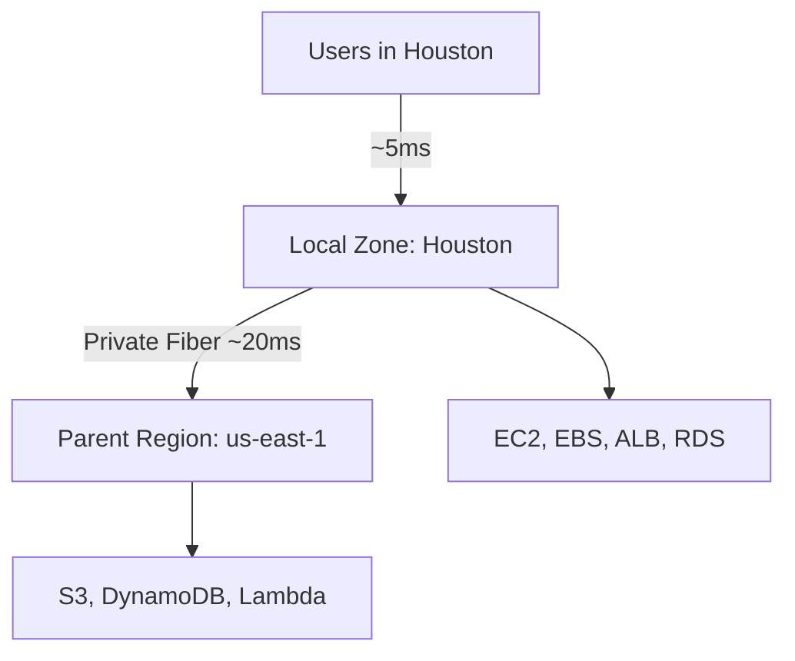
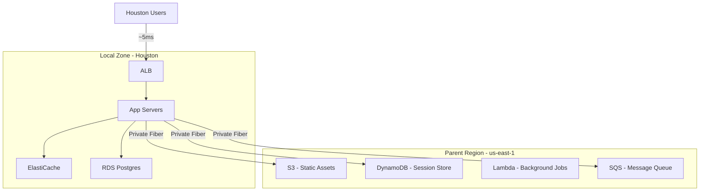

# How to Use AWS Local Zones for Low-Latency Applications

Author: [nawazdhandala](https://github.com/nawazdhandala)

Tags: AWS, Local Zones, Low Latency, Edge Computing, Cloud

Description: A practical guide to deploying applications in AWS Local Zones to reduce latency for users in specific metropolitan areas.

---

When your users are concentrated in a city that's hundreds of miles from the nearest AWS region, latency becomes noticeable. A user in Houston hitting servers in us-east-1 (Virginia) is dealing with 30-50ms round-trip times just from the distance. For most web apps, that's fine. For real-time collaboration tools, video editing platforms, or financial trading applications, it's not.

AWS Local Zones extend AWS regions into metropolitan areas, putting compute, storage, and select services closer to end users. Think of them as mini data centers in cities where AWS doesn't have a full region. You get the same EC2, EBS, and other services, just closer to your users.

## How Local Zones Differ from Regular AZs

A regular Availability Zone is in a full AWS region with access to every AWS service. A Local Zone is a smaller deployment in a metro area with a subset of services. The Local Zone connects back to a parent region over AWS's private fiber network.

Here's what's typically available in Local Zones:

- EC2 (select instance types)
- EBS (gp2, gp3, io1 volumes)
- ECS and EKS
- Application Load Balancer
- Amazon FSx
- ElastiCache
- Relational Database Service (select engines)

What's not available: Lambda, DynamoDB, S3 (though S3 is accessible from the parent region). You'll need to architect around these gaps.



## Step 1: Enable Local Zones

Like Wavelength Zones, Local Zones are opt-in.

```bash
# List all available Local Zones
aws ec2 describe-availability-zones \
  --all-availability-zones \
  --filters "Name=zone-type,Values=local-zone" \
  --query "AvailabilityZones[].{Zone:ZoneName, Group:GroupName, State:OptInStatus}" \
  --output table

# Enable a Local Zone (Houston example)
aws ec2 modify-availability-zone-group \
  --group-name "us-east-1-iah-1" \
  --opt-in-status "opted-in"
```

AWS has Local Zones in dozens of cities including Houston, Miami, Atlanta, Chicago, Dallas, Denver, Los Angeles, and many more. The list keeps growing.

## Step 2: Create a Subnet in the Local Zone

Extend your existing VPC into the Local Zone by creating a subnet there.

```bash
# Create a subnet in the Houston Local Zone
aws ec2 create-subnet \
  --vpc-id "vpc-abc123" \
  --cidr-block "10.0.50.0/24" \
  --availability-zone "us-east-1-iah-1a" \
  --tag-specifications 'ResourceType=subnet,Tags=[{Key=Name,Value=local-zone-houston}]'

# Create an internet gateway if you don't have one
aws ec2 create-internet-gateway \
  --tag-specifications 'ResourceType=internet-gateway,Tags=[{Key=Name,Value=lz-igw}]'

# Create a route table for the Local Zone subnet
aws ec2 create-route-table \
  --vpc-id "vpc-abc123" \
  --tag-specifications 'ResourceType=route-table,Tags=[{Key=Name,Value=lz-houston-rt}]'

# Add internet route
aws ec2 create-route \
  --route-table-id "rtb-lz123" \
  --destination-cidr-block "0.0.0.0/0" \
  --gateway-id "igw-abc123"

# Associate with the Local Zone subnet
aws ec2 associate-route-table \
  --route-table-id "rtb-lz123" \
  --subnet-id "subnet-lz-houston"
```

## Step 3: Launch Instances

Check what instance types are available in your target Local Zone, then launch.

```bash
# See available instance types in the Houston Local Zone
aws ec2 describe-instance-type-offerings \
  --location-type "availability-zone" \
  --filters "Name=location,Values=us-east-1-iah-1a" \
  --query "InstanceTypeOfferings[].InstanceType" \
  --output table

# Launch an instance
aws ec2 run-instances \
  --image-id "ami-0abcdef1234567890" \
  --instance-type "c5.2xlarge" \
  --subnet-id "subnet-lz-houston" \
  --key-name "my-key" \
  --security-group-ids "sg-abc123" \
  --tag-specifications 'ResourceType=instance,Tags=[{Key=Name,Value=houston-app-server}]'
```

## Step 4: Set Up an Application Load Balancer

You can run ALBs in Local Zones to load balance traffic locally.

```bash
# Create an ALB in the Local Zone
aws elbv2 create-load-balancer \
  --name "houston-alb" \
  --subnets "subnet-lz-houston" \
  --security-groups "sg-abc123" \
  --scheme "internet-facing" \
  --type "application"

# Create a target group
aws elbv2 create-target-group \
  --name "houston-targets" \
  --protocol "HTTP" \
  --port 80 \
  --vpc-id "vpc-abc123" \
  --health-check-path "/health" \
  --target-type "instance"

# Register your Local Zone instances
aws elbv2 register-targets \
  --target-group-arn "arn:aws:elasticloadbalancing:us-east-1:123456789:targetgroup/houston-targets/abc123" \
  --targets "Id=i-houston001" "Id=i-houston002"
```

## Step 5: Deploy a Database Locally

For the lowest latency, run your database in the Local Zone too. RDS supports Local Zone deployments for MySQL and PostgreSQL.

```bash
# Create a DB subnet group that includes the Local Zone
aws rds create-db-subnet-group \
  --db-subnet-group-name "local-zone-db-group" \
  --db-subnet-group-description "DB subnet group for Local Zone" \
  --subnet-ids "subnet-lz-houston" "subnet-lz-houston-2"

# Create an RDS instance in the Local Zone
aws rds create-db-instance \
  --db-instance-identifier "houston-db" \
  --db-instance-class "db.r5.large" \
  --engine "postgres" \
  --master-username "admin" \
  --master-user-password "your-secure-password" \
  --db-subnet-group-name "local-zone-db-group" \
  --availability-zone "us-east-1-iah-1a" \
  --allocated-storage 100 \
  --no-multi-az
```

Note that Multi-AZ isn't available in Local Zones. You'll want to set up replication back to the parent region for disaster recovery.

## Architecture Pattern: Hybrid Local Zone + Region

The most practical pattern is to keep latency-sensitive components in the Local Zone and everything else in the parent region.



Here's how the application code might handle this split.

```python
import boto3
from functools import lru_cache

# Local Zone resources - fast access
# ElastiCache runs in the Local Zone for sub-millisecond reads
import redis
cache = redis.Redis(host='houston-cache.abc123.use1.cache.amazonaws.com', port=6379)

# Parent region resources - slightly higher latency but full service access
s3 = boto3.client('s3', region_name='us-east-1')
dynamodb = boto3.resource('dynamodb', region_name='us-east-1')

def get_user_profile(user_id):
    # Try local cache first (sub-ms in Local Zone)
    cached = cache.get(f"user:{user_id}")
    if cached:
        return json.loads(cached)

    # Fall back to DynamoDB in parent region (~20ms)
    table = dynamodb.Table('users')
    response = table.get_item(Key={'user_id': user_id})
    profile = response.get('Item')

    if profile:
        # Cache locally for future requests
        cache.setex(f"user:{user_id}", 300, json.dumps(profile))

    return profile

def upload_file(file_data, filename):
    # S3 is in the parent region, but uploads are async
    # so the latency is acceptable
    s3.put_object(
        Bucket='user-uploads',
        Key=f"uploads/{filename}",
        Body=file_data
    )
```

## Step 6: Multi-City Deployment

For coverage across multiple cities, deploy to several Local Zones and use Route 53 latency-based routing to send users to the nearest one.

```bash
# Create Route 53 latency records for each Local Zone deployment
aws route53 change-resource-record-sets \
  --hosted-zone-id "Z123456" \
  --change-batch '{
    "Changes": [
      {
        "Action": "CREATE",
        "ResourceRecordSet": {
          "Name": "app.example.com",
          "Type": "A",
          "SetIdentifier": "houston",
          "Region": "us-east-1",
          "AliasTarget": {
            "HostedZoneId": "Z35SXDOTRQ7X7K",
            "DNSName": "houston-alb-123.us-east-1.elb.amazonaws.com",
            "EvaluateTargetHealth": true
          }
        }
      },
      {
        "Action": "CREATE",
        "ResourceRecordSet": {
          "Name": "app.example.com",
          "Type": "A",
          "SetIdentifier": "miami",
          "Region": "us-east-1",
          "AliasTarget": {
            "HostedZoneId": "Z35SXDOTRQ7X7K",
            "DNSName": "miami-alb-456.us-east-1.elb.amazonaws.com",
            "EvaluateTargetHealth": true
          }
        }
      }
    ]
  }'
```

## Cost Considerations

Local Zone pricing is higher than the parent region - typically 10-20% more for EC2 instances. Data transfer between the Local Zone and parent region has its own pricing too. The trade-off is straightforward: you're paying a premium for lower latency.

Make sure you actually need the latency improvement before deploying everywhere. Profile your application, measure the latency your users experience today, and calculate whether the improvement justifies the cost.

## Monitoring

Monitor both the Local Zone resources and the latency between the Local Zone and parent region. CloudWatch works the same way, but set up custom metrics for the cross-zone communication.

For unified monitoring across Local Zones and regions, [OneUptime](https://oneuptime.com/blog/post/2026-02-06-aws-cloudwatch-logs-exporter-opentelemetry-collector/view) can help you see everything in one place.

## Wrapping Up

Local Zones are a practical solution for the "AWS doesn't have a region near my users" problem. They won't give you every AWS service, but they give you enough to run a full application stack close to your users. The key architectural decision is figuring out what needs to be local (compute, caching, database reads) versus what can stay in the parent region (object storage, background processing, analytics). Get that split right, and your users get a noticeably snappier experience.
