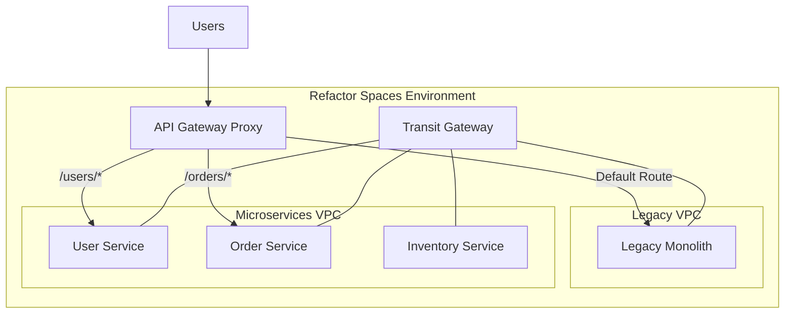

# How to Use AWS Migration Hub Refactor Spaces

Author: [nawazdhandala](https://github.com/nawazdhandala)

Tags: AWS, Migration Hub, Refactor Spaces, Microservices, Migration

Description: Learn how to use AWS Migration Hub Refactor Spaces to manage incremental application refactoring and route traffic between legacy and modernized services.

---

Breaking apart a monolith is messy. You've got the old system, the new microservices you're building, and somehow you need to route traffic between them while keeping everything working. AWS Migration Hub Refactor Spaces was built specifically for this problem. It gives you a managed environment for incrementally refactoring applications, handling the routing, networking, and service discovery that makes the [strangler fig pattern](https://oneuptime.com/blog/post/2026-02-12-strangler-fig-pattern-aws-migration/view) work in practice.

Think of it as a purpose-built tool for what people used to cobble together with API Gateway, ALB routing rules, and a lot of manual configuration.

## What Refactor Spaces Provides

Refactor Spaces has three main concepts:

1. **Environment** - A networking construct that connects your AWS accounts and VPCs involved in the refactoring
2. **Application** - Represents the application being refactored, with an API Gateway proxy that routes traffic
3. **Services and Routes** - Define the legacy service, new microservices, and rules for sending traffic to each

The service automatically creates a Transit Gateway to connect VPCs, sets up API Gateway for traffic routing, and manages the network plumbing so you can focus on actually migrating code.



## Step 1: Create an Environment

The environment sets up networking between your VPCs. If your legacy app and new services are in different VPCs (or even different AWS accounts), the environment handles the connectivity.

```bash
# Create a Refactor Spaces environment
aws migration-hub-refactor-spaces create-environment \
  --name "app-modernization" \
  --description "Refactoring the legacy order management system" \
  --network-fabric-type "TRANSIT_GATEWAY"
```

The `TRANSIT_GATEWAY` network fabric type creates a Transit Gateway that connects all the VPCs in the environment. If your VPCs are already connected through other means, you can use `NONE` instead.

Wait for the environment to be active.

```bash
# Check environment status
aws migration-hub-refactor-spaces get-environment \
  --environment-identifier "env-abc123" \
  --query "{Name:Name, State:State}"
```

## Step 2: Create an Application

The application represents what you're refactoring. It creates an API Gateway proxy that becomes the entry point for all traffic.

```bash
# Create the application with an API Gateway proxy
aws migration-hub-refactor-spaces create-application \
  --environment-identifier "env-abc123" \
  --name "order-management" \
  --proxy-type "API_GATEWAY" \
  --vpc-id "vpc-legacy-123" \
  --api-gateway-proxy '{
    "EndpointType": "REGIONAL",
    "StageName": "prod"
  }'
```

This creates an API Gateway endpoint. All traffic to your application should go through this endpoint, and Refactor Spaces will route it to the appropriate backend.

## Step 3: Register the Legacy Service

Register your existing monolith as a service. This tells Refactor Spaces where the legacy system lives.

```bash
# Register the legacy monolith as a service
aws migration-hub-refactor-spaces create-service \
  --environment-identifier "env-abc123" \
  --application-identifier "app-xyz789" \
  --name "legacy-monolith" \
  --endpoint-type "URL" \
  --url-endpoint '{
    "Url": "http://legacy-internal.example.com",
    "HealthUrl": "http://legacy-internal.example.com/health"
  }' \
  --vpc-id "vpc-legacy-123"
```

## Step 4: Create the Default Route

Set up a default route that sends all traffic to the legacy service. This is your starting point - everything goes to the old system.

```bash
# Create default route to legacy
aws migration-hub-refactor-spaces create-route \
  --environment-identifier "env-abc123" \
  --application-identifier "app-xyz789" \
  --route-type "DEFAULT" \
  --service-identifier "svc-legacy-001"
```

At this point, all traffic flows through the API Gateway proxy to your legacy monolith. Nothing has changed from the user's perspective.

## Step 5: Build and Register a New Microservice

Now build your first microservice. Let's say you're extracting the user management functionality.

Deploy the new service (Lambda, ECS, EC2, whatever you prefer), then register it with Refactor Spaces.

```bash
# Register the new user service
aws migration-hub-refactor-spaces create-service \
  --environment-identifier "env-abc123" \
  --application-identifier "app-xyz789" \
  --name "user-service" \
  --endpoint-type "LAMBDA" \
  --lambda-endpoint '{
    "Arn": "arn:aws:lambda:us-east-1:123456789:function:user-service"
  }'
```

Or if you're using a container-based service:

```bash
# Register a container-based service
aws migration-hub-refactor-spaces create-service \
  --environment-identifier "env-abc123" \
  --application-identifier "app-xyz789" \
  --name "user-service" \
  --endpoint-type "URL" \
  --url-endpoint '{
    "Url": "http://user-service.internal:8080",
    "HealthUrl": "http://user-service.internal:8080/health"
  }' \
  --vpc-id "vpc-microservices-456"
```

## Step 6: Route Traffic to the New Service

Create a route that directs specific paths to the new service instead of the legacy system.

```bash
# Route /users/* to the new user service
aws migration-hub-refactor-spaces create-route \
  --environment-identifier "env-abc123" \
  --application-identifier "app-xyz789" \
  --route-type "URI_PATH" \
  --uri-path-route '{
    "SourcePath": "/users",
    "Methods": ["GET", "POST", "PUT", "DELETE"],
    "IncludeChildPaths": true,
    "ActivationState": "ACTIVE"
  }' \
  --service-identifier "svc-user-001"
```

The `IncludeChildPaths` flag means `/users/123`, `/users/123/settings`, and any other sub-path under `/users` will also route to the new service. The legacy system's default route still catches everything else.

## Step 7: Iterate - Migrate More Services

Repeat the process for each module you want to extract. Here's a Python script that automates registering and routing a new service.

```python
import boto3
import time

client = boto3.client('migration-hub-refactor-spaces')

ENV_ID = 'env-abc123'
APP_ID = 'app-xyz789'

def migrate_module(name, endpoint_url, vpc_id, path):
    """Register a new service and route traffic to it."""

    # Step 1: Create the service
    print(f"Registering service: {name}")
    svc_response = client.create_service(
        EnvironmentIdentifier=ENV_ID,
        ApplicationIdentifier=APP_ID,
        Name=name,
        EndpointType='URL',
        UrlEndpoint={
            'Url': endpoint_url,
            'HealthUrl': f"{endpoint_url}/health"
        },
        VpcId=vpc_id
    )
    service_id = svc_response['ServiceId']

    # Wait for service to be active
    while True:
        svc = client.get_service(
            EnvironmentIdentifier=ENV_ID,
            ApplicationIdentifier=APP_ID,
            ServiceIdentifier=service_id
        )
        if svc['State'] == 'ACTIVE':
            break
        print(f"  Service state: {svc['State']}, waiting...")
        time.sleep(10)

    # Step 2: Create the route
    print(f"Creating route: {path} -> {name}")
    route_response = client.create_route(
        EnvironmentIdentifier=ENV_ID,
        ApplicationIdentifier=APP_ID,
        RouteType='URI_PATH',
        UriPathRoute={
            'SourcePath': path,
            'Methods': ['GET', 'POST', 'PUT', 'DELETE', 'PATCH'],
            'IncludeChildPaths': True,
            'ActivationState': 'ACTIVE'
        },
        ServiceIdentifier=service_id
    )

    print(f"Route created: {route_response['RouteId']}")
    return service_id

# Migrate modules one by one
migrate_module(
    name='order-service',
    endpoint_url='http://order-service.internal:8080',
    vpc_id='vpc-microservices-456',
    path='/orders'
)

migrate_module(
    name='inventory-service',
    endpoint_url='http://inventory-service.internal:8080',
    vpc_id='vpc-microservices-456',
    path='/inventory'
)

migrate_module(
    name='notification-service',
    endpoint_url='http://notification-service.internal:8080',
    vpc_id='vpc-microservices-456',
    path='/notifications'
)
```

## Viewing Migration Progress

Track which routes are handled by new services versus the legacy system.

```bash
# List all routes for the application
aws migration-hub-refactor-spaces list-routes \
  --environment-identifier "env-abc123" \
  --application-identifier "app-xyz789" \
  --query "RouteSummaryList[].{Path:SourcePath, Type:RouteType, Service:ServiceId, State:State}" \
  --output table
```

## Handling Cross-Service Communication

One tricky aspect of refactoring is that new microservices often need to call each other or the legacy system. Refactor Spaces sets up a Transit Gateway, so all VPCs can communicate.

```python
import requests

class ServiceRegistry:
    """Simple service registry for cross-service calls."""

    SERVICES = {
        'user-service': 'http://user-service.internal:8080',
        'order-service': 'http://order-service.internal:8080',
        'legacy': 'http://legacy-internal.example.com',
    }

    @classmethod
    def call(cls, service_name, path, method='GET', data=None):
        base_url = cls.SERVICES.get(service_name)
        if not base_url:
            raise ValueError(f"Unknown service: {service_name}")

        url = f"{base_url}{path}"
        response = requests.request(method, url, json=data, timeout=5)
        response.raise_for_status()
        return response.json()

# In the order service, call the user service
def get_order_with_user(order_id):
    order = get_order_from_db(order_id)
    # Cross-service call through Transit Gateway
    user = ServiceRegistry.call('user-service', f'/users/{order["user_id"]}')
    order['user'] = user
    return order
```

## Monitoring the Migration

Keep close tabs on both systems during the migration. Watch for:

- Error rate differences between legacy and new routes
- Latency changes
- Failed health checks
- Cross-service call failures

```bash
# Check API Gateway metrics for the Refactor Spaces proxy
aws cloudwatch get-metric-statistics \
  --namespace "AWS/ApiGateway" \
  --metric-name "5XXError" \
  --dimensions "Name=ApiName,Value=refactor-spaces-app-xyz789" \
  --start-time "2026-02-12T00:00:00Z" \
  --end-time "2026-02-12T23:59:59Z" \
  --period 3600 \
  --statistics "Sum"
```

For comprehensive monitoring during your migration, [OneUptime](https://oneuptime.com/blog/post/aws-cloudwatch-logs-setup/view) can give you a unified dashboard across legacy and new services.

## Cleaning Up After Migration

Once all routes point to new services and the legacy system handles no traffic:

```bash
# Deactivate the default route (legacy)
aws migration-hub-refactor-spaces update-route \
  --environment-identifier "env-abc123" \
  --application-identifier "app-xyz789" \
  --route-identifier "route-default-001" \
  --activation-state "INACTIVE"

# After verification period, delete the legacy service
aws migration-hub-refactor-spaces delete-service \
  --environment-identifier "env-abc123" \
  --application-identifier "app-xyz789" \
  --service-identifier "svc-legacy-001"
```

## Wrapping Up

Refactor Spaces doesn't do the hard work of rewriting your code, but it takes care of the infrastructure headaches that make incremental migration painful. The networking, routing, and traffic management are handled for you. You focus on building better services, and Refactor Spaces makes sure traffic gets to the right place. It's particularly valuable when your migration spans multiple AWS accounts or VPCs, where manually managing Transit Gateways and API Gateway configurations would be a project in itself.
